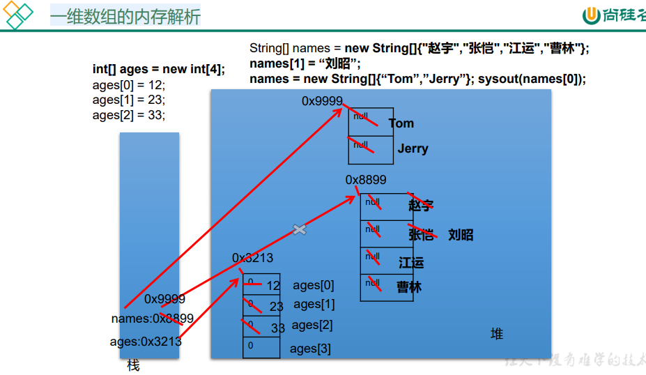
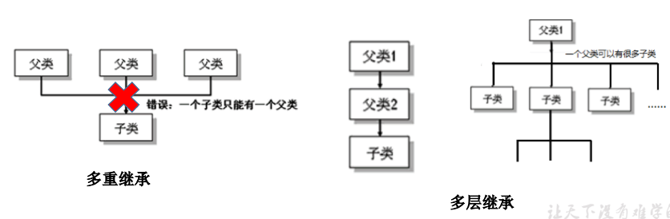

# 一、Java语言概述

### 1.常用DOS命令

dir：列出当前目录下的文件和文件夹

md：创建目录

rd：删除目录

cd：进入指定目录

cd..：退回上一级目录

cd\：退回到根目录

del：删除文件

exit：退出dos命令行

⬆  ⬇：调阅历史操作指令

### 2.开发体验HelloWorld

编写.java文件

用javac命令编译

用java命令运行生成的.class文件

```java
public class Test{
	public static void main(String[] args){
        System.out.println("Hello World!");
    }
}
```

### 3.注释

单行注释	格式：//注释文字

多行注释	格式：/*注释文字*/

文档注释	格式：/**@author@version*/

### 4.JavaAPI文档


# 二、JAVA基础

## (一)关键字、保留字与标识符

### 1.关键字

被Java语言赋予特殊含义，用作专门用途的字符串，所有字母都为小写


### 2.保留字

现有Java版本尚未使用，但以后版本可能会作为关键字使用，如goto、const

### 3.标识符

Java对各种变量、类、方法等要素命名使用的字符序列称为标识符（凡是可以自己起名字的地方都叫标识符）

#### 定义合法标识符规则

- 由26个英文字母大小写、0-9、_、$组成
- 数字不可以开头
- 不可以使用关键字和保留字，但可以包含关键字和保留字
- Java中严格区分大小写，长度无限制
- 标识符不能包含空格

#### Java中的名称命名规范

- 包名：多单词组成时所有字母小写（xxxyyyzzz）
- 类名、接口名：多单词组成时，所有单词的首字母大写（XxxYyyZzz）
- 变量名、方法名：多单词组成时，第一个单词的首字母小写，第二个开始单词首字母大写（xxxYyyZzz）
- 常量名：所有字母大写，多单词组成时每个单词之间用下划线链接（XXX_YYY_ZZZ）

## (二)变量

### 1.变量的基本概念

#### 变量的概念、结构及作用

- 概念：内存中的一个存储区域，该区域中的数据可以在同一类型范围内不断变化，变量是程序中最基本的存储单元
- 结构：包括变量类型、变量名和存储的值
- 作用：用于在内存中存储数据

#### 使用变量注意

- Java中的每个变量必须先声明后使用
- 使用变量名来访问这个区域内的数据
- 变量的作用域只在其定义所在的一对{}内
- 变量只有在其作用域内才有效
- 同一个作用域内不能定义同名的变量

### 2.变量的分类

#### 按数据类型


#### 按声明的位置的不同

- 在方法体外，类体内声明的变量称为成员变量；
- 在方法体内部声明的变量称为局部变量；


（局部变量除形参外，需显式初始化）

### 3.变量类型

#### (1)整数类型

​	byte,short,int,long


```java
// 1.整型：byte（1字节=8bit，-128~127）\short（2字节）\int（4字节）\long（8字节）
	
	byte b1=12;
	byte b2=-128;
	//b2 = 128;//编译失败	
	System.out.println(b1);
	System.out.println(b2);

	//声明long类型变量，必须以“l”或“L”结尾
	//定义整型变量通常用int型

	short s1=128;
	int i1=1234;
	long l1=34111233;
	System.out.println("l1");
```

#### (2)浮点类型

​	float，double


```java
//2.浮点型：float（4字节），double（8字节）
	double d1=123.3;
	System.out.println(d1+1);

	float f1=12.3f;
	//定义float类型变量时，变量要以“f”或“F”结尾
	System.out.println(f1);

	//通常定义浮点型变量时使用double
```

#### (3)字符类型

​	char

- char型表示通常意义上的“字符”（2字节）
- char型还可表示转义字符
- char类型是可以进行运算的。因为它都对应有Unicode码


常见的编码类型：ASCLL\Unicode\UTF-8

```java
//3.字符型：char(1字符=2字节)
	//声明字符型变量通常使用一对‘’,内部只能写一个字符
	char c1='a';
	String hhh1="abc";
	System.out.println(c1);
	System.out.println(hhh1);
	
	char c2='1';
	char c3='中';
	char c4='*';
	System.out.println(c2);
	System.out.println(c3);
	System.out.println(c4);


	//char表示方式：1）声明一个字符，2）转义字符(\n,\t等)，3）直接使用Unicode值来表示字符型常量
	char c5='\t';
	System.out.print("hello"+c5);
	System.out.println("world");

	char c6='\u0043';//Unicode编码集
	System.out.println(c6);
```


#### (4)布尔类型

boolean：只允许取true、false

```java
//4.布尔型：boolean
	//只能取两个值中的一个，true，false
	//通常在条件判断或循环结构中使用
	boolean bb1=true;
	System.out.println(bb1);

	boolean isMarried = true;
	if(isMarried){
		System.out.println("你就不能参加单身派对了\\n123");//转义字符用一个反斜线\
	}else{
		System.out.println("你可以参加单身派对");
	}
```


### 4.基本数据类型转换

这里讨论除布尔外的其中基本数据类型的运算

#### (1)自动类型转换

- byte-->short-->int-->long-->float-->double
  特别的：byte,short,char三者做运算时全部提升为int
  	short与char做运算提升为int
  	byte与char做运算提升为int

- 当容量小的数据类型的变量与容量大的数据类型的变量做运算时，结果自动提升为容量大的数据类型
  此时的容量大小指的是表示数的范围的大小，比如float的容量要大于long的容量

  ```java
  class VariableTest2{
  	public static void main(String[] args){
  
  		byte b1 = 2;
  		int i1 = 129;
  
  		//byte b2 = b1 + i1;//编译不通过，从int转换到byte可能有损失
  		int i2 = b1 + i1;
  		long l1 = b1 + i1;
  		System.out.println(i2);
  		System.out.println(l1);
  
  		float f1 = b1 + i1;
  		System.out.println(f1);
  
  		double d1 = b1 + i1;
  		System.out.println(d1);
  
  		short s1 = 123;
  		double d2 = s1;
  
  		System.out.println(d2);
  
  
  		//************特别的******************
  
  		char c1 = 'a';//97
  		int i3 = 10;
  		int i4 = c1 + i3;
  
  		System.out.println(i4);
  
  		short s2 = 10;
  		int s3 = c1 + s2;
  
  		System.out.println(s3);
  
  		byte b2 =1;
  		int s4 = c1 +b2;
  
  		System.out.println(s4);
  		//********************************
  	}
  }
  ```

  

#### (2)强制类型转换

- 自动类型提升的逆运算

- 需要使用强转符（）

- 强制类型转换可能导致精度损失

- 字符串不能直接转换为基本类型，但通过基本类型对应的包装类则可 以实现把字符串转换成基本类型。 如： String a = “43”; int i = Integer.parseInt(a);

  ```java
  class VariableTest3{
  	public static void main(String[] args){
  
  	double d1 = 12.9;
  	int i1 = (int)d1;//double强制转为int，不同于四舍五入，截断操作损失精度
  	System.out.println(i1);
  
  
  	long l1 = 123;
  	short s2 = (short)l1;//没有精度损失
  
  	//精度损失举例2
  	int i2 = 128;
  	byte b = (byte)i2;
  	System.out.println(b);//-128
  	}
  }
  ```

#### (3)默认情况

- 整型默认为int
- 浮点型默认为double

```java
class VariableTest4{
	public static void main(String[] args){
	//1.编码情况1
	long l = 123213;//整型默认为int
	
	System.out.println(l);

	long l1 = 213333333333333333l;//不加l被认定为int
	System.out.println(l1);

	float f1 = 12.3f;//浮点型默认为double
	System.out.println(f1);


	//2.编码情况2
	byte b = 12;
	//byte b1 = b + 1;//整型常量默认为int，浮点型常量默认为double
	//float f1 = b + 12.3;//编译失败
	}
}
```

### 5.字符串类型String

- String属于引用数据类型，翻译为 字符串

- 声明String类型变量时，使用一对“”

- String可以和8种基本数据类型变量做运算，且运算只能是连接运算  “+”

- 运算结果仍然是String类型

  

```java
class StringTest{
	public static void main(String[] args){
		String s1 = "Hello World";
		System.out.println(s1);

		String s2 = "a";
		String s3 = "";//String类型可以为空

		//char c = '';//编译错误：char类型不能为空,有且只有一个

		System.out.println(s3);
		//*********************
		int num = 1001;
		String numStr = "学号：";
		String info = numStr + num;//连接运算
		System.out.println(info);
		boolean b1 = true;
		String info1 = info + b1;
		System.out.println(info1);


		//练习一
		char c = 'a';//a:97  A:65
		int num1 = 10;
		String str = "hello";
		System.out.println(c + num1 + str);//107hello
		System.out.println(c + str + num1);//ahello10
		System.out.println(c + (num1 + str));//a10hello
		System.out.println((c + num1) + str);//107hello
		System.out.println(str + num1 + c);//hello10a

		//练习二
		//*	*
		char c1 = '*';
		System.out.println(c1+'\t'+c1);
		System.out.println('*' + '\t' + '*');//char对应ascll自动转换为int
		System.out.println('*' + "\t" + '*');//“\t”表示String
		System.out.println("*" + '\t' + '*');
		System.out.println('*' + ('\t' + '*'));
		

	}
}
```

### 6.进制

- 对于整数，有四种表示方式：

- 二进制（binary）：0，1  满二进一，以0b或0B开头

- 十进制（decimal）：0-9 满十进一

- 八进制（octal）：0-7 满八进一，以数字0开头

- 十六进制（hex）：0-9及A-F 满十六进一，以0x或0X开头表示，A-F不区分大小写

  ```java
  class Binary{
  	public static void main(String[] args){
  
  
  		int num1 = 0b110;
  		int num2 = 110;
  		int num3 = 0127;
  		int num4 = 0x110A;
  		System.out.println("num1 = "+num1);//6
  		System.out.println("num2 = "+num2);//110
  		System.out.println("num3 = "+num3);//87
  		System.out.println("num4 = "+num4);//4362
  	}
  }
  ```

  

#### (1)二进制转十进制


2^0+2^1+2^2+2^3+2^4+2^5+2^6=127

#### (2)十进制转二进制

除二取余的逆


除2取余的逆

(3)负数的二进制表示

- 原码：直接将一个数值换成二进制数。最高位是符号位 
- 负数的反码：是对原码按位取反，只是最高位（符号位）确定为1。
- 负数的补码：其反码加1。
- 正数：原码、反码、补码相同的。


(3)进制间转化

以二进制为媒介


## (三)运算符

### 1.算数运算符


```java
/*
算术运算符：+ - * / % ++ ++ -- --
*/

class AriTest{
	public static void main(String[] args){

		//除号 /
		int num1 = 12;
		int num2 = 5;
		int result1 = num1/num2;
		System.out.println(result1);//2
		int result2 = num1/num2*num2;
		System.out.println(result2);//10

		double result3 = num1/num2;
		System.out.println(result3);//2.0

		double result4 = (double)num1/num2;//2.4
		System.out.println(result4);

		double result5 = num1 / num2 + 0.0;//2.0
		double result6 = num1 / (num2 + 0.0);//2.4
		double result7 = 1.0 * num1 / num2;//2.4

		//%取余运算
		//结果的符号与被模数的符号相同
		//开发中常用来判断能否除尽
		int m1 = 12;
		int n1 = 5;
		System.out.println(m1%n1);

		int m2 = -12;
		int n2 = 5;
		System.out.println(m2%n2);

		int m3 = 12;
		int n3 = -5;
		System.out.println(m3%n3);

		int m4 = -12;
		int n4 = -5;
		System.out.println(m4%n4);


		//(前)++,先自增，再运算
		//(后)++,先运算，再自增

		int a1 = 10;
		int b1 = ++a1;
		System.out.println("a1 = " + a1 + ",b1 = " + b1);

		int a2 = 10;
		int b2 = a2++;
		System.out.println("a2 = " + a2 + ",b2 = " + b2);

		//注意点：
		short s1 = 10;
		//s1 = s1 + 1;//编译失败
		s1 = (short)(s1 + 1);//方法一
		s1++;//方法二

		//自增自减不会改变变量本身的数据类型

		byte b3 = 127;
		b3++;
		System.out.println("b3 = " + b3);//二进制


		//(前)--，先自减，再运算
		//(后)--，先运算，再自减

		int a4 = 10;
		//int b4 = --a4;
		int b4 = a4--;
		System.out.println("a4 = " + a4 + ",b4 = " + b4);

		
	}
	
}
```

### 2.赋值运算符

```java
/*
运算符二：赋值运算符
=	+=	-=	*=	/=	%=
*/

class SetValue{
	public static void main(String[] args){
		//赋值符号
		int i1=10;
		int j1=10;

		//连续赋值
		int i2,j2;
		i2=j2=10;

		int i3=10,j3=20;

		//*********************
		int num1 = 10;
		num1 += 2;//num = num + 2;
		System.out.println(num1);//12

		int num2 = 12;
		num2 %= 5;//num2 = num2 % 5;
		System.out.println(num2);

		//区别
		short s1 = 10;
		//s1 = s1 + 2;//编译失败
		s1 += 1;
		System.out.println(s1);//不会改变变量本身的数据类型


		//开发中希望实现+2的操作有几种方法（前提：int num = 10）
		//1.num = num + 2;
		//2.num += 2;//(推荐)

		//开发中希望实现+1的操作有几种方法（前提：int num = 10）
		//1.num = num + 1;
		//2.num += 1;
		//3.num++；//(推荐)

	}

}
```

### 3.比较运算符


```java
/*
运算符三：比较运算符
==	！=	>	<	>=	<=	instanceof

结论：
1.比较运算符的结果是boolean类型
2.区分==与=
*/

class CompareTest{
	public static void main(String[] args){
		int i=10;
		int j=20;

		System.out.println(i==j);//false
		System.out.println(i=j);//20

		boolean b1=true;
		boolean b2=false;
		System.out.println(b2==b1);//false
		System.out.println(b2=b1);//true
	}
	
}
```

### 4.逻辑运算符


```java
/*
运算符四：逻辑运算符

&	&&	|	||	！	^

说明：
1.逻辑运算符操作的都是boolean类型变量


*/

class LogicTest{
	public static void main(String[] args){
		//区分&和&&
		//相同点1：&与&&运算结果相同
		//相同点2：当符号左边是true时，二者都会执行符号右边的运算
		//不同点：当符号左边是false时，&继续执行符号右边操作，&&不执行符号右边操作
		boolean b1=true;
		b1 = false;
		int num1=10;
		if(b1 & (num1++ > 0)){
			System.out.println("我现在在北京");
		}else{
			System.out.println("我现在在南京");

		}
		System.out.println("num1 = " + num1);

		
		boolean b2=true;
		b2 = false;
		int num2=10;
		if(b2 && (num2++ > 0)){
			System.out.println("我现在在北京");
		}else{
			System.out.println("我现在在南京");
		}
		System.out.println("num2 = " + num2);

		//区分|与||
		//相同点1：|与||运算结果相同
		//相同点2：当符号左边是false时，二者都会执行符号右边的运算
		//不同点：当符号左边是true时，|继续执行符号右边操作，||不执行符号右边操作

		boolean b3=true;
		
		int num3=10;
		if(b3 | (num3++ > 0)){
			System.out.println("我现在在北京");
		}else{
			System.out.println("我现在在南京");

		}
		System.out.println("num3 = " + num3);

		boolean b4=true;
		
		int num4=10;
		if(b4 || (num4++ > 0)){
			System.out.println("我现在在北京");
		}else{
			System.out.println("我现在在南京");

		}
		System.out.println("num4 = " + num4);

		//短路与和或当第一个运算就可以判断出结果时，第二个不执行
		//推荐使用短路逻辑运算符
	}
}
```

### 5.位运算符

位运算是直接对整数二进制的运算


```java
/*
运算符五：位运算符（二进制）

结论：
位运算操作的都是整型变量
<<在一定范围内每向左移以为，相当于*2
>>在一定范围内每向右移一位，相当于/2
>>若最高位为1用1补，最高位为0用0补
>>>无符号右移，无论最高位为0或1都用0补


面试题：
最高效的2*8？
2 << 3或8 << 1
*/

class BitTest{
	public static void main(String[] args){
		int i=21;
		System.out.println("i << 2:" + (i<<2));//i*2*2
		System.out.println("i << 2:" + (i<<3));//i*2*2*2
		System.out.println("i << 2:" + (i<<26));//i*2^26
		System.out.println("i << 2:" + (i<<27));//超过限度


		int m=12;
		int n=5;
		System.out.println("m & n:"+(m&n));//只要一个是0就是0，两个都是1才为1
		System.out.println("m | n:"+(m|n));//只要有一个是1就为1，两个都是0才为2
		System.out.println("m ^ n:"+(m^n));//两个相同为1，不同为0
		//~取反就是0变1，1变0

		//练习：交换两个变量的值
		int num1 = 10;
		int num2 = 20;
		System.out.println("num1 = "+num1+";num2 = "+num2);

		//方式一：定义临时变量（推荐）
		int temp = 0;
		temp = num1;
		num1 = num2;
		num2 = temp;
		System.out.println("num1 = "+num1+";num2 = "+num2);

		//方式二：不用开辟临时变量，但是相加后可能超出存储范围而且有局限性只能数值型
		num1 = num1 + num2;
		num2 = num1 - num2;
		num1 = num1 - num2;
		System.out.println("num1 = "+num1+";num2 = "+num2);

		//方式三：使用位运算符m = k ^ n = (m ^ n) ^ n,有局限性只能数值型
		num1 = num1 ^ num2;
		num2 = num1 ^ num2;
		num1 = num1 ^ num2;
		System.out.println("num1 = "+num1+";num2 = "+num2);


	}
}
```

### 6.三元运算符


```java
/*
运算符六
三元运算符

（条件表达式？表达式1：表达式2）

1.条件表达式的变量是一个boolean类型
2.根据条件表达式的真或假，执行表达式，若为true执行表达式1，若为false则为表达式2
3.表达式1和表达式2要求是一致的
4.三运运算符可以嵌套使用


三元运算符与if-else转换
凡是可以使用三元运算符的地方都可以改写为if-else,反之不成立


如果既可以使用三元运算符又可使用if-else推荐使用三元运算符
*/

class SanYuan{
	
	public static void main(String[] args){

		//获取两个整数中的较大值

		int m = 12;
		int n =5;

		int max = (m > n ? m : n);
		System.out.println(max);

		double num = (m > n)?2:1.0;
		System.out.println(num);


		//****************************
		String maxStr = (m > n) ? "m大" : "n大"	;
		System.out.println(maxStr);

		String maxStr1 = (m > n) ? "m大" :((m == n) ? "m,n" : "n大") ;
		System.out.println(maxStr1);

		//获取三个数的最大值
		int n1 = 12;
		int n2 = 30;
		int n3 = -43;

		int max1 = (n1 > n2)?n1:n2;
		int max2 = (max1 > n3)?max1:n3;
		System.out.println(max2);

		//不推荐
		int max3 = (((n1 > n2)?n1:n2)>n3)?((n1>n2)?n1:n2):n3;
		System.out.println(max3);


		//if-else
		if(m>n){
			System.out.println(m);
		}else{
			System.out.println(n);
		}

	}
}
```

### 7.运算符的优先级


只有单目运算符、三元运算符、 赋值运算符是从右向左运算的()

## (四)顺序结构

程序从上到下逐行地执行，中间没有任何判断和跳转。


## (五)分支结构

### 1.if-else

#### (1)if语句格式


```java
/*
分支结构中的if-else（条件判断结构）


一、三种结构

第一种：
if(条件表达式){
	执行表达式
}

第二种：二选一
if(条件表达式){
	执行表达式1
}else{
	执行表达式2
}

第三种：n选一
if(条件表达式){
	执行表达式1
}else if(条件表达式){
	执行表达式2
}else if(条件表达式){
	执行表达式3
}
...
else{
	执行表达式n
}


*/
class IfTest {
	public static void main(String[] args) {
		
		//举例1
		int heartBeats = 79;
		if(heartBeats < 60 || heartBeats > 100){
			System.out.println("需要做进一步检查");
		}

		System.out.println("检查结束");
		
		//举例2
		int age = 23;
		if(age < 18){
			System.out.println("你还可以看动画片");
		}else{
			System.out.println("你可以看成人电影了");
		}

		//举例3
		if(age < 0){
			System.out.println("您输入的数据非法");
		}else if(age < 18){
			System.out.println("青少年时期");
		}else if(age < 35){
			System.out.println("青壮年时期");
		}else if(age < 60){
			System.out.println("中年时期");
		}else if(age < 120){
			System.out.println("老年时期");
		}else{
			System.out.println("你是要成仙啊~~");
		}
	}
}

```

#### (2.)使用说明

 条件表达式必须是布尔表达式（关系表达式或逻辑表达式）、布尔变量 

 语句块只有一条执行语句时，一对{}可以省略，但建议保留

 if-else语句结构，根据需要可以嵌套使用 

 当if-else结构是“多选一”时，最后的else是可选的，根据需要可以省略

 当多个条件是“互斥”关系时，条件判断语句及执行语句间顺序无所谓 当多个条件是“包含”关系时，“小上大下 / 子上父下”

### 2.switch

#### (1)格式


```java
/*
分支结构二：switch-case

1.格式
switch(表达式){
	case 常量1：执行语句1；//break;
	case 常量2：执行语句2；//break;
	...
	default:执行语句n;//break;
}

*/

class SwitchCaseTest{
	public static void main(String[] args){
		int number = 2;
		switch(number){
			case 0:System.out.println("zero");break;
			case 1:System.out.println("one");break;
			case 2:System.out.println("two");break;
			default:System.out.println("other");
		}

		String season = "summer";
		switch (season) {
		case "spring":
		System.out.println("春暖花开");
		break;
		case "summer":
		System.out.println("夏日炎炎");
		break;
		case "autumn":
		System.out.println("秋高气爽");
		break;
		case "winter":
		System.out.println("冬雪皑皑");
		break;
		default:
		System.out.println("季节输入有误");
		break;
}
	}
}
```

#### (2)说明

- 根据switch表达式中的值，依次匹配各case值，一旦匹配成功则进入case的执行语句。
- 当执行完当前语句后会继续执行，知道遇到break或程序结束。break可以表示在switch-case结构中，表示跳出当前结构。
- switch结构中的表达式，只能是byte\short\char\int\枚举类型(JDK5.0)、String类型(JDK7.0)
- case之后只能声明一个常量，不能声明一个范围。
- break关键字是可选的。
- default相当于if-else中的else。default是可选的，位置是灵活的。

### 3.switch和if-else对比

- 如果判断的具体数值不多，而且符合byte、short 、char、int、String、枚举等几 种类型。虽然两个语句都可以使用，建议使用swtich语句。因为效率稍高。
- 其他情况：对区间判断，对结果为boolean类型判断，使用if，if的使用范围更广。 也就是说，使用switch-case的，都可以改写为if-else。反之不成立。

### 4.Scanner和随机数

```java
/*
如何从键盘获取不同类型的变量：需要使用Scanner类

具体实现步骤：
1.导包：import java.util.Scanner;
2.Scanner的实例化:Scanner scan = new Scanner(System.in);
3.调用Scanner类的相关方法（next() / nextXxx()），来获取指定类型的变量

注意：
需要根据相应的方法，来输入指定类型的值。如果输入的数据类型与要求的类型不匹配时，会报异常：InputMisMatchException
导致程序终止。
*/
//1.导包：import java.util.Scanner;
import java.util.Scanner;

class ScannerTest{
	
	public static void main(String[] args){
		//2.Scanner的实例化
		Scanner scan = new Scanner(System.in);
		
		//3.调用Scanner类的相关方法
		System.out.println("请输入你的姓名：");
		String name = scan.next();
		System.out.println(name);

		System.out.println("请输入你的芳龄：");
		int age = scan.nextInt();
		System.out.println(age);

		System.out.println("请输入你的体重：");
		double weight = scan.nextDouble();
		System.out.println(weight);

		System.out.println("你是否相中我了呢？(true/false)");
		boolean isLove = scan.nextBoolean();
		System.out.println(isLove);

		//对于char型的获取，Scanner没有提供相关的方法。只能获取一个字符串
		System.out.println("请输入你的性别：(男/女)");
		String gender = scan.next();//"男"
		char genderChar = gender.charAt(0);//获取索引为0位置上的字符
		System.out.println(genderChar);
		

	}

}
```

如何获取一个随机数

Math.random()//0-1

```java
class RandomTest{
	//如何获取一个随机数10-99
	public static void main(String[] args){
	int value = (int)(Math.random() * 90 + 10);//[0.0,1.0]--> [10.0,100.0）-->[10,99]
	//公式：[a,b]:(int)(Math.random()*(b-a+1)+a)

	System.out.println(value);
	}
}
```

## (六)循环结构

循环结构在某些条件满足的情况下，反复执行特定代码的功能

 循环语句分类 

- for 循环 
- while 循环 
- do-while 循环

### 1.for循环


```java
/*
For循环的使用
一、循环结构的四个要素
1.初始化条件
2.循环条件  (boolean)
3.循环体
4.迭代条件
二、for循环的条件

for(1;2;4){
	3;
}

执行过程：1-->2-->3-->4-->2-->3-->4-->2......-->2
*/

class ForTest{
	public static void main(String[] args){

		for (int i = 1;i <= 5;i++) {
			System.out.println("HelloWorld");
		}

		//练习：
		int num = 1;
		for(System.out.println('1');num <= 10;System.out.println('3'),num++){
			System.out.println('2');
		}

		//遍历100内的偶数,输出所有偶数的和
		int sum = 0;
		int count = 0;//记录偶数的个数
		for (int i = 1;i <= 100;i++) {
			if(i%2==0){
				System.out.println(i);
				sum += i;
				count++;
			}
		}
		System.out.println(sum);
		System.out.println(count);

		
	}
}
```

### 2.while循环

```java
/*
从键盘读入个数不确定的整数，并判断读入的正数和负数的个数，输入
为0时结束程序。

说明：
1 for(;;)
2 while(true)
3 结束循环： 
	循环条件返回false
	循环体中执行break
*/

import java.util.Scanner;
class ForWhileTest{
	public static void main(String[] args){
		Scanner scan = new Scanner(System.in);
		int z = 0,f = 0;

		//for循环
		/*for(int i = 1;i != 0;){
			System.out.println("please input a int number:");
			
			int input = scan.nextInt();
			if(input > 0){
				z++;
			}else if(input < 0){
				f++;
			}else{
				i = 0;
			}
		}
		*/
		

		//while循环
		while(true){
			System.out.println("please input a int number:");
			
			int input = scan.nextInt();
			if(input > 0){
				z++;
			}else if(input < 0){
				f++;
			}else{
				break;
			}
		}

		System.out.println("正数："+z);
		System.out.println("负数："+f);
	}	
}
```

### 3.do-while循环

```java
/*
do-while循环的使用
一、循环结构的四个要素
1.初始化条件
2.循环条件  (boolean)
3.循环体
4.迭代条件

二、do-while循环的结构
1;
do{
	3;
	4;
}
while（2）;

执行过程：1--》3--》4--》2--》3--》4.。。

说明：至少执行一次循环体
*/

class DoWhileTest{
	public static void main(String[] args){


		//遍历100内的偶数

		int num =1;
		do{
			if(num%2 == 0){
						System.out.println(num);

			}

			num++;
		}while(num <= 100);
		
	}
}
```

### 4.循环的嵌套

```java
/*
嵌套循环的使用
1.嵌套循环：将一个循环结构A声明在另一个循环结构B的循环体中，构成嵌套循环
2.外层循环，内层循环
3.
	1>内层循环结构遍历一遍，只相当于外层循环体执行一次
	2>假设外层循环需要执行m次，内层循环需要执行n次，此时内层循环体执行m*n次

4.外层循环控制行数，内层循环控制列数
*/

class ForForTest{
	public static void main(String[] args){
		//*****
		for(int i=1;i<=6;i++)
		{
			System.out.print("*");
		}
		System.out.println();


		/*
		******
		******
		******
		******
		*/
		for(int j = 0;j<=4;j++){
			for(int i=1;i<=6;i++){
				System.out.print("*");

			}
			System.out.println();
		}


		/*				j（行号）   i（*的个数）
		*					1			1	
		**					2			2
		***					3			3
		****				4			4
		*****				5			5
		*/

		for(int j = 0;j<=5;j++){
			for(int i=1;i<=j;i++){
				System.out.print("*");
			}
			System.out.println();
		}


		/*
		****
		***
		**
		*
		*/
		for(int j = 1;j<=4;j++){
			for(int i=1;i<=5-j;i++){
				System.out.print("*");
			}
			System.out.println();
		}


		/*
				* 
			   * * 
			  * * * 
			 * * * * 
			* * * * * 
			 * * * * 
			  * * * 
			   * * 
			    * 
		*/
		//上半部分
		for(int j = 1;j<=5;j++){
			for(int i=1;i<=5-j;i++){
				System.out.print(" ");
			}
			for(int i=1;i<=j;i++){
				System.out.print("* ");
			}
			System.out.println();
		}
		//下半部分
		for(int j = 1;j<=4;j++){
			for(int i=1;i<=j;i++){
				System.out.print(" ");
			}
			for(int i=1;i<=5-j;i++){
				System.out.print("* ");
			}
			System.out.println();
		}
	}
}
```

5.break与continue的使用

```java
/*
break和continue关键字的使用
				使用范围					
break       switch-casse或循环结构		结束当前循环

continue    循环结构中					结束当次循环

return 结束方法
*/
class BreakContinueTest{
	public static void main(String[] args){
		for(int i = 1;i <= 10;i++){
			if(i % 4 == 0){
				break;
			}
			System.out.print(i);
		}
		System.out.println();

		for(int i = 1;i <= 10;i++){
			if(i % 4 == 0){
				continue;
			}
			System.out.print(i);
		}
		System.out.println();

		//******************************
		
		label:for(int i = 1;i <= 4;i++){
		
			for(int j = 1;j <= 10;j++){
				
				if(j % 4 == 0){
					//break;//默认跳出包裹此关键字最近的一层循环。
					//continue;

					//break label;//结束指定标识的一层循环结构
					continue label;//结束指定标识的一层循环结构当次循环
				}
				
				System.out.print(j);
			}
			
			System.out.println();
		}
	}
}
```

# 三、数组

## （一）数组概述

### 1.数组的理解

数组(Array)，是多个相同类型数据按一定顺序排列 的集合，并使用一个名字命名，并通过编号的方式 对这些数据进行统一管理。

### 2.数组的常见概念 

- 数组名
- 下标(或索引) 
- 元素
- 数组的长度 

### 3.数组的特点：

- 数组是有序排列的
- 数组属于引用数据类型的变量，数组中的元素可以是任何数据类型，包括基本数据类型和引用数据类型
- 创建数组对象会在内存中开辟一整块连续的空间，而数组名中引用的是这块连续空间的首地址。
- 数组的长度一旦确定，就不能修改。
- 直接通过下标(或索引)的方式调用指定位置的元素，速度很快。

### 4.数组的分类：

- 按照维度：一维数组、二维数组、三维数组、…
- 按照元素的数据类型分：基本数据类型元素的数组、引用数据类型元素的数组(即对象数组)

## （二）一维数组的使用

### 1.一维数组的声明和初始化

#### （1）声明

type var[] 或 type[] var；

例如： int a[]; int[] a1; double b[]; String[] c; //引用类型变量数组

Java语言中声明数组时不能指定其长度(数组中元素的数)， 例如： int a[5]; //非法

#### （2）初始化

**动态初始化：数组声明且为数组元素分配空间与赋值的操作分开进行**


**静态初始化：在定义数组的同时就为数组元素分配空间并赋值。**


### 2.一维数组的引用

- 定义并用运算符new为之分配空间后，才可以引用数组中的每个元素；
- 数组元素的引用方式：数组名[数组元素下标]

1. *数组元素下标可以是整型常量或整型表达式。如a[3] , b[i] , c[6*i];* 
2. *数组元素下标从0开始；长度为n的数组合法下标取值范围: 0 —>n-1；如int a[]=new int[3]; 可引用的数组元素为a[0]、a[1]、a[2]*

- 每个数组都有一个属性length指明它的长度，例如：a.length 指明数组a的长 度(元素个数)

  *数组一旦初始化，其长度是不可变的*

  ```java
  public class ArrayTest {
  	public static void main(String[] args) {
  		//1.一维数组的声明和初始化
  		int num;//声明
  		num = 10;//初始化
  		int id = 1001;//声明和初始化
  		
  		//1.1静态初始化:数组的初始化和数组元素的赋值同时进行
  		int [] ids;//声明
  		ids = new int [] {1001,1002,1003,1004};//数组是引用数据类型，所以赋值时要用new
  		
  		//1.2动态初始化：数组的初始化和数组元素的赋值分开进行
  		String[] names = new String[5];
  		
  		//总结：数组一旦初始化完成，数组长度就确定了
  		
  		//2.如何调用数组的指定位置的元素：通过脚标的方式
  		//数组的脚标从零开始到数组的长度减一结束
  		names[0] = "王三";
  		names[1] = "王四";
  		names[2] = "王五";
  		names[3] = "王六";
  		names[4] = "王七";//charAt(0)获取字符串中元素
  		
  		
  		//3.如何获取数组的长度。属性length
  		
  		System.out.println(names.length);//5
  		System.out.println(ids.length);
  		
  		
  		//4.如何遍历数组
  		for(int i = 0;i < names.length;i++) {
  			System.out.println(names[i]);
  		}
  		
  		for(int j = 0;j < ids.length;j++) {
  			System.out.println(ids[j]);
  		}
  ```

  

### 3.数组元素的默认初始化值

数组是引用类型，它的元素相当于类的成员变量，因此数组一经 分配空间，其中的每个元素也被按照成员变量同样的方式被隐式 初始化。

- 对于基本数据类型而言，默认初始化值各有不同 
- 对于引用数据类型而言，默认初始化值为null(注意与0不同！)


```

```


```java
public class ArrayTest1 {
	public static void main(String[] args) {
		//5.数组元素的默认初始化值
		int [] arr = new int[4];
		
		for(int i = 0;i < arr.length;i++) {
			System.out.println(arr[i]);
		}
		System.out.println("******************");
		short [] arr1 = new short[4];
		
		for(int i = 0;i < arr.length;i++) {
			System.out.println(arr1[i]);
		}
		
		System.out.println("******************");
		double [] arr2 = new double[4];
		
		for(int i = 0;i < arr2.length;i++) {
			System.out.println(arr2[i]);
		}
		
		System.out.println("******************");
		char [] arr3 = new char[4];
		
		for(int i = 0;i < arr3.length;i++) {
			System.out.println("----" + arr3[i] + "----");
		}
		
		if(arr3[0] == 0) {
			System.out.println("hello");
		}
		
		System.out.println("******************");
		boolean [] arr4 = new boolean[4];
		System.out.println(arr4[2]);
		
		
		System.out.println("******************");
		String[] arr5 = new String[4];
		System.out.println(arr5[0]);
	}
}
```

### 4.一维数组的内存分析





## （三）多维数组的使用

- Java 语言里提供了支持多维数组的语法。
- 如果说可以把一维数组当成几何中的线性图形， 那么二维数组就相当于是一个表格。
- 对于二维数组的理解，我们可以看成是一维数组 array1又作为另一个一维数组array2的元素而存 在。其实，从数组底层的运行机制来看，其实没 有多维数组。

### 1.二维数组的声明和初始化


```java
public class ArrayTest2 {
	public static void main(String[] args) {
		//1.二维数组的声明和初始化
		int[] arr = new int[] {1,2,3};//一维数组
		//静态初始化
		int[][] arr1 = new int[][] {{1,2,3},{4,5},{6,7,8}};//二维数组
		//动态初始化1
		String[][] arr2 = new String[3][2];
		//动态初始化2
		String[][] arr3 = new String[3][];//只初始化了二维数组的行
		
		//其他正确初始化
		int[] arr4[] = new int[][]{{1,2,3},{4,5,9,10},{6,7,8}};
		int[] arr5[] = {{1,2,3},{4,5},{6,7,8}};//类型推断一维数组同理
		int arr6[] = {1,2,3,4};//定义与赋值分开写的话不可类型推断
		
		
		//2.如何调用数组的指定位置的元素
		
		System.out.println(arr1[0][1]);//2
		System.out.println(arr2[1][1]);//null
//		System.out.println(arr3[1][0]);//arr3定义不完全不知道具体有几列，报错指针异常
		arr3[1] = new String[4];//初始化二维数组的列
		System.out.println(arr3[1][0]);//null
		
		
		//3.如何获取数组的长度
		System.out.println(arr4.length);//3
		System.out.println(arr4[1].length);//4
		
		//4.如何遍历数组
		for(int i = 0;i < arr4.length;i++) {
			for(int j = 0;j < arr4[i].length;j++) {
				System.out.print(arr4[i][j] + "\t");
			}
			System.out.println();
		}
	}
	
	
	
}
```

### 2.二维数组元素的初始化默认值

规定：二维数组分为外层数组的元素和内层数组的元素

- int[][] arr = new int[4][3];
- 外层元素：arr[0],arr[1]等
- 内层元素：arr[0][0],arr[1][2]等

**数组元素的初始化默认值**

针对于初始化方式一，比如：int[][] [][] [][]arr = new int[4][3];

​	外层元素的初始值为地址值

​	内层元素的初始值与一维数组的初始值一致

针对于初始化方式二，比如：int[][] arr = new int[4][];

​	外层元素的初始值为null

​	内层元素报错空指针异常

```java
/*
 * 二维数组
 * 	
 * 规定：二维数组分为外层数组的元素和内层数组的元素
 * 		int[][] arr = new int[4][3];
 * 		外层元素：arr[0],arr[1]等
 * 		内层元素：arr[0][0],arr[1][2]等
 * 
 * 	数组元素的初始化默认值
 * 		针对于初始化方式一，比如：int[][] arr = new int[4][3];
 * 			外层元素的初始值为地址值
 * 			内层元素的初始值与一维数组的初始值一致
 * 		针对于初始化方式二，比如：int[][] arr = new int[4][];
 * 			外层元素的初始值为null
 * 			内层元素报错空指针异常
 * 
 * 	数组的内存解析
 * 
 * 
 * */
public class ArrayTest3 {
	public static void main(String[] args) {
		// 5.数组元素的初始化默认值
		int[][] arr = new int[4][3];// 动态声明
		System.out.println(arr[0]);// 地址值
		System.out.println(arr[0][0]);// 0
//		System.out.println(arr);//地址

		System.out.println("**********************");

		float[][] arr1 = new float[4][3];// 动态声明
		System.out.println(arr1[0]);// 地址值
		System.out.println(arr1[0][0]);// 0.0

		System.out.println("**********************");

		String[][] arr2 = new String[4][3];// 动态声明
		System.out.println(arr2[1]);// 地址值
		System.out.println(arr2[1][1]);// null

		System.out.println("**********************");

		String[][] arr3 = new String[4][];// 动态声明
		System.out.println(arr3[1]);// 内层数组未定义，外层数组为默认值null
//		System.out.println(arr3[1][1]);// 内层数组未定义，报错空指针
		// 6.数组的内存解析

	}
}
```

### 3.二维数组的内存分析


## （四）数组中涉及到的常见算法

###  1.数组元素的赋值(杨辉三角、回形数等)

### 2.求数值型数组中元素的最大值、最小值、平均数、总和等 

### 3.数组的复制、反转、查找(线性查找、二分法查找) 

### 4.数组元素的排序算法


## （五）Arrays工具类的使用

java.util.Arrays类即为操作数组的工具类，包含了用来操作数组（比 如排序和搜索）的各种方法。


```java
package com.taiacloud.java;

import java.util.Arrays;

/*
 * 数组工具类Arrays的使用,java.util.Arrays
 * 
 *	1 boolean equals(int[] a,int[] b) 	判断两个数组是否相等。
 *	2 String toString(int[] a) 	输出数组信息。
 *	3 void fill(int[] a,int val) 	将指定值填充到数组之中。
 *	4 void sort(int[] a) 	对数组进行排序。
 *	5 int binarySearch(int[] a,int key) 	对排序后的数组进行二分法检索指定的值。
 * 
 * */
public class ArraysTest {
	public static void main(String[] args) {
		//1 boolean equals(int[] a,int[] b) 	判断两个数组是否相等。
		int [] arr1 = new int[] {1,2,3,4};
		int [] arr2 = new int[] {1,3,2,4};
		
		boolean isEquals = Arrays.equals(arr1, arr2);
		System.out.println(isEquals);//false
		
		//2 String toString(int[] a) 	输出数组信息。
		System.out.println(Arrays.toString(arr2));
		
		//3 void fill(int[] a,int val) 	将指定值填充到数组之中,把原数组中每一个元素都进行替换。
		Arrays.fill(arr1,10);
		System.out.println(Arrays.toString(arr1));
		
		//4 void sort(int[] a) 	对数组进行排序。
		Arrays.sort(arr2);
		System.out.println(Arrays.toString(arr2));
		
		//5 int binarySearch(int[] a,int key) 	对排序后的数组进行二分法检索指定的值。
		
		 int isFind = Arrays.binarySearch(arr2,4);
		 System.out.println(isFind);//找到之后返回指定值的索引，找不到则返回一个负数
		
	}
}

```

## （六）数组使用中的常见异常


```java
package com.taiacloud.java;

import java.util.Arrays;

/*
 *  数组中的常见异常
 *  1.数组脚标越界的异常 	ArrayIndexOutOfBoundsExcetion
 *  2.空指针异常	NullPointerExcetion
 * 
 * 
 * */
public class ArrayException {
	public static void main(String[] args) {
		
		// 1.数组脚标越界的异常 	ArrayIndexOutOfBoundsExcetion
//		int [] arr = new int[] {1,2,3,4};
//		for(int i = 0;i <= arr.length;i++) {
//			System.out.print(arr[i] + "\t");
//		}
		
		
		//2.空指针异常	NullPointerExcetion
		//情况一
//		int[] arr1 = new int[] {1,2,3};
//		arr1 = null;
//		System.out.println(arr1[0]);
		
		//情况二
//		int [][] arr2 = new int[4][];
//		System.out.println(arr2[0][0]);
		
		//情况三
		String[] arr3 = new String[] {"AA","BB","CC"};
		arr3[0] = null;
		System.out.println(arr3[0].toString());
			//数组名【脚标】.toString() 输出数组中指定脚标的元素
			//Arrays.toString(数组名) 遍历输出数组
	}
}

```

# 四、面向对象

## （一）面向对象上

### 1.面向过程与面向对象

#### 1.1面向对象的三条主线

1. Java类及类的成员 ：属性、方法、构造器、代码块、内部类

2. 面向对象的三大特征 ：封装性，继承性，多态性，（抽象性）

3. 其它关键字：this\super\static\final\abstract\interface\package\import等

   

#### 1.2面向过程(POP) 与 面向对象(OOP)

- 二者都是一种思想，面向对象是相对于面向过程而言的。
- 面向过程，强调的 是功能行为，以函数为最小单位，考虑怎么做。
- 面向对象，将功能封装进对 象，强调具备了功能的对象，以类/对象为最小单位，考虑谁来做。 面向对象更加强调运用人类在日常的思维逻辑中采用的思想方法与原则，如 抽象、分类、继承、聚合、多态等。

#### 1.3例子：人把大象装进冰箱

```
1.面向过程，强调的是功能行为，以函数为最小单位，考虑怎么做。
 * 		》把冰箱门打开
 * 		》抬起大象，塞进冰箱
 * 		》把冰箱门关闭
```

```
2.面向对象，强调具备了功能的对象，以类、对象为最小单位，考虑谁来做
 * 人{
 * 		打开（冰箱）{
 * 			冰箱.开门（）；
 * 		}	
 * 		抬起（大象）{
 * 			大象.进入（冰箱）；
 * 		}	
 * 		关闭（冰箱）{
 * 			冰箱.闭合（）；
 * 		}  
 * }
 * 
 * 冰箱{
 * 		打开（）{}
 * 		闭合（）{}
 * }
 * 
 * 大象{
 * 		进入（冰箱）{
 * 			进入的具体操作；
 * 		}
 * }
```

### 2.Java语言的基本元素：类和对象

##### 2.2.1类(Class)和对象(Object)

是面向对象的核心概念。面向对象程序设计的重点是类的设计，类的设计，其实就是类的成员的设计。

- 类是对一类事物的描述，是抽象的、概念上的定义 
- 对象是实际存在的该类事物的每个个体，因而也称为实例(instance)。


##### 2.1.2设计类，其实就是设计类的 成员 = 属性 + 方法

1. 属性 = field = 成员变量 = 域、字段
2. 方法 = 成员方法 = Method = 函数 = 行为


### 3.对象的创建和使用


#### 


**如果创建了一个类的 多个对象，对于类中 定义的属性，每个对 象都拥有各自的一套 副本，且互不干扰。**

**类的访问机制**

- **在一个类中的访问机制：类中的方法可以直接访问类中的成员变量。 （例外：static方法访问非static，编译不通过。）**

- **在不同类中的访问机制：先创建要访问类的对象，再用对象访问类中 定义的成员。**

  

#### 3.1对象的创建


```java
Person p1 = new Person();//执行完后的内存状态。其中类定义如下：
class Person{
	int age;
	void shout(){
		System.out.println(“oh,my god! I am ” + age);
	}
}

```

##### 3.1.1类的实例化，即创建类的对象，类和对象的使用（面向对象思想落地的实现）

创建类的对象 = 类的实例化 = 实例化类

1. 创建类，设计类的成员
2. 创建类的对象
3. 调用属性：“对象.属性”，调用方法：“对象.方法”

##### 3.1.2如果创建了一个类的多个对象，则每个对象都独立的拥有一套类的属性。（非static的）

- 意味着，我们修改一个对象的属性a，不影响另外其他对象的属性a的值

#### 3.2对象的使用


```java
class PersonTest{
	public static void main(String[] args) { //程序运行的内存布局如图
		Person p1 = new Person();
		Person p2 =new Person();
		p1.age = -30;
		p1.shout();
		p2.shout();
	}
}	
```


#### 3.3对象的生命周期


#### 3.4对象的内存解析


- 堆（Heap），此内存区域的唯一目的 就是存放对象实例，几乎所有的对象 实例都在这里分配内存。这一点在 Java虚拟机规范中的描述是：所有的 对象实例以及数组都要在堆上分配。
- 通常所说的栈（Stack），是指虚拟机 栈。虚拟机栈用于存储局部变量等。 局部变量表存放了编译期可知长度的 各种基本数据类型（boolean、byte、 char 、 short 、 int 、 float 、 long 、 double）、对象引用（reference类型， 它不等同于对象本身，是对象在堆内 存的首地址）。 方法执行完，自动释 放。
- 方法区（Method Area），用于存储已 被虚拟机加载的类信息、常量、静态 变量、即时编译器编译后的代码等数 据。


#### 3.5匿名对象

我们也可以不定义对象的句柄，而直接调用这个对象的方法。这 样的对象叫做匿名对象。

- 如：new Person().shout(); 

使用情况

- 如果对一个对象只需要进行一次方法调用，那么就可以使用匿名对象。 
- 我们经常将匿名对象作为实参传递给一个方法调用。

### 4.类的成员之一：属性(field) 

#### 4.1语法格式


#### 4.2属性（成员变量） VS 局部变量

- 在方法体外，类体内声明的变量称为成员变量。
- 在方法体内部声明的变量称为局部变量。


##### 4.2.1相同点

1. 定义变量的格式相同：数据类型 变量名 = 变量值
2. 先声明，后使用
3. 变量都有其对应的作用域

##### 4.2.2不同点


```
 *  2.1在类中声明的位置不同
 * 		属性：直接定义在类的一对{}内
 * 		局部变量：声明在方法内、方法形参、代码块内、构造器形参、构造器内部的变量
 * 	2.2关于权限修饰符的不同
 * 		属性：可以在声明属性时，指明其权限，使用权限修饰符。
 * 			常用的权限修饰符：private\public\缺省\protected -->封装性
 * 			目前只是用缺省就可以了
 * 		局部变量：不可以使用权限修饰符
 * 	2.3默认初始化值的情况
 * 		属性：类的属性，根据其类型，都有其默认初始化值。
 * 			整型（byte\short\int\long）：0
 * 			浮点型（float\double）:0.0
 * 			字符型（char）：’0‘或’\u0000‘
 * 			布尔型（boolean）：false
 * 			引用数据类型（类、数组、接口）：null比如String
 * 		局部变量：没有初始化值
 * 			意味着我们在调用局部变量之前必须要显式赋值
 * 			特别的，形参在调用时赋值即可，即函数的参数
 * 
 * 	2.4在内存中加载的位置
 * 		属性：加载到堆空间中（非static）
 * 		局部变量：加载到栈空间
```

```java
public class UserTest {
	public static void main(String[] args) {
		User u1 = new User();
		System.out.println(u1.name);
		System.out.println(u1.age);
		System.out.println(u1.isMale);
		
		u1.talk("日语");
	}
}

class User{
	//属性（成员变量）
	String name;
	int age;
	boolean isMale;
	
	public void talk(String language) {//language称为形参，也是局部变量
		System.out.println("我们使用" + language + "进行交流");
	}
	
	public void eat() {
		String food = "广东菜";//定义在方法内的变量称为局部变量
		System.out.println("广东人喜欢吃：" + food);
	}
	
}
```

##### 4.2.3内存位置


##### 4.2.4对象属性的默认初始化赋值

当一个对象被创建时，会对其中各种类型的***成员变量***自动进行初始化赋值。除了 基本数据类型之外的变量类型都是引用类型，如上面的Person及前面讲过的数组。


### 5.类的成员之二：方法(method) 

方法：描述类应该具有的功能，比如
 * 	Math类、sqrt（）、random（）。。。
 * 		Scanner类：nextXXX（）。。。
 * 		Arrays类：sort（）、binarySearch（）、toString（）、equals（）。。。

#### 5.1举例

- public void eat() {}
- public void sleep(int hour) {}
- public String getName(){}
- public String getNation(String nation) {}

#### 5.2方法的声明

权限修饰符 返回值类型 方法名（形参列表）{

​	方法体

}

 * 	注意：对于static\final\abstract来修饰的方法后面再讲

#### 5.3说明

```java
 * 	3.1关于权限修饰符，暂时默认方法的权限修饰符使用public
 * 		private、public、缺省、protected	---->封装性
 * 	3.2返回值类型：有返回值 VS 无返回值
 * 		3.2.1 如果方法有返回值，则必须在方法声明时，指定返回值的类型。
 * 				同时方法中需要使用return关键字来返回指定类型的变量或常量。
 * 			  如果方法没有返回值，则方法声明时，使用void来表示。
 * 				通常没有返回值的方法中不需要使用return。
 * 				如果要使用的话只能用return来表示结束此方法。
 * 		3.2.2 我们定义方法时该不该有返回值？
 * 			题目要求
 * 			经验，具体问题具体分析
 * 	3.3方法名：属于标识符，遵循标识符的规则和规范，见名知意
 * 	3.4形参列表：方法可以声明0个，1个，或多个形参
 * 		3.4.1格式：数据类型1 形参1，数据类型2 形参2，...
 * 		3.4.2定义方法时要不要形参？
 * 			题目要求
 * 			经验，具体问题具体分析
 * 	3.5方法体：方法功能的体现
```

#### 5.4return关键字说明

使用范围：使用在方法体中

作用：

- 结束一个方法
- 针对于有返回值类型的方法，使用“return 数据”返回所需数据

注意：return关键字之后不可有执行语句

#### 5.5方法调用说明

方法的使用中，可以调用当前类的属性或方法。特殊的，方法中调用自己，称为递归方法方法中不可以定义别的方法。

### 6.再谈方法

#### 6.1方法的重载

##### 6.1.1定义：

在同一个类中，允许存在一个以上的同名方法，只要它们的参数个数或者参数类型不同即可。

两同一不同：同一个类、相同方法名；

参数列表不同：参数个数不同，参数类型不同；

##### 6.1.2举例：

Arrays类中重载的sort()/binarySearch()

```java
public class OverLoadTest {
	public static void main(String[] args) {
		OverLoadTest test = new OverLoadTest();
		test.getSum(5,6);
		test.getSum(1.5, 5.9);
		test.getSum(8, "okkk");
		test.getSum("www", 9);
	}
	
	

	//如下四个方法构成了重载
	public void getSum(int i,int j) {
		System.out.println(i + j);
	}
	
	public void getSum(double d1,double d2) {
		System.out.println(d1 + d2);
	}
	
	public void getSum(String s,int i) {
		System.out.println(s + i);
	}
	
	public void getSum(int i,String s) {
		System.out.println(i + s);
	}
}
```


##### 6.1.3判断是否是重载：

跟方法的权限修饰符、返回值类型、形参变量名、方法体都无关

##### 6.1.4在通过对象调用方法时，如何确定某一个指定方法：

方法名   参数列表

#### 6.2可变形参的方法

##### 6.2.1定义

JavaSE 5.0 中提供了Varargs(variable number of arguments)机制，允许直接定 义能和多个实参相匹配的形参。从而，可以用一种更简单的方式，来传递个数可 变的实参。


##### 6.2.2可变个数形参的格式：

数据类型 ... 变量名

 *   当调用可变个数形参方法时，传入的参数个数可以是：0，1，2，3.。。

 *   可变个数形参的方法与本类中方法名相同，形参不同的方法构成重载。

 *   可变个数形参的方法与本类中方法名相同，形参类型也相同的数组之间不构成重载，不可共存。

 *   可变个数形参在方法的形参中，必须声明在末尾，且只能有一个。

     

```java
public class MethodArgsTest {
	
	public static void main(String[] args) {
		 MethodArgsTest test = new MethodArgsTest();
		 test.show(12);
		 test.show("Hello");
		 test.show("Hello","world");
		 test.show();
		 
		 test.show(new String[] {"aa","bb","cc"});
		 
	}

	public void show(int i) {

	}

	public void show(String s) {
		System.out.println("show(String)");
	}

	public void show(String ...  strs) {
		System.out.println("show(String ... strs)");
		
		for(int i = 0;i < strs.length;i++) {
			System.out.println(strs[i]);
		}
	}
	
	
	//此方法与上面的可变形参方法等价，不可共存
//	public void show(String [] strs) {
//		System.out.println("show(String [] strs)");
//	}

	//The variable argument type String of the method show must be the last parameter
//	public void show(String ...strs,int i) {
//		
//	}
}
```


#### 6.3 方法参数的值传递机制

##### 6.3.1关于变量的赋值

 * 	如果变量是基本数据类型，则此时赋值的是变量所保存的数据值。
 * 	如果变量是引用数据类型，此时赋值的是变量所保存的数据的地址值。

##### 6.3.2方法的形参的值传递机制：值传递

1. 形参：方法定义时，声明的小括号内的参数
2. 实参：方法调用时，实际传递给形参的数据


**值传递机制：**

- 如果参数是基本数据类型，此时实参赋给形参的是，实参真实存储的数据值。
- 如果参数是引用数据类型，此时实参赋给形参的是实参所保存的数据的地址值。

#### 6.4递归方法

递归方法的使用

1.递归方法：一个方法体内调用它自身。

2.注意：

 * 	方法递归包含了一种隐式的循环，它会重复执行某段代码，但这种重复执行无须循环控制。
 * 	递归一定要向已知方向递归，否则这种递归就变成了无穷递归，类似于死循环。

```java
public class RecursionTest {
	public static void main(String[] args) {
		//例1.计算1-100之间所有自然数的和
		//方式一
		int sum = 0;
		for(int i = 1;i <= 100;i++) {
			sum += i;
		}
		System.out.println(sum);
		
		//方式二 递归实现
		RecursionTest test = new RecursionTest();
		int sum1 = test.getSum(100);
		System.out.println(sum1);
		
		int sum2 = test.getSum1(100);
		System.out.println(sum2);
		
		//例3
		int sum3 = test.getSum2(10);
		System.out.println(sum3);
	}
	//例1.计算1-100之间所有自然数的和
	public int getSum(int n) {
		if(n == 1) {
			return 1;
		}else {
			return n + getSum(n - 1);
		}
	}
	
	//例2.计算1-100之间所有自然数的乘积
		public int getSum1(int n) {
			if(n == 1) {
				return 1;
			}else {
				return n * getSum(n - 1);
			}
		}
		
	//例3.已知一个数列：f(0) = 1,f(1) = 4,f(n+2) = 2*f(n+1)+f(n),其中n是大于0的整数，求f(10)的值。
		public int getSum2(int n) {
			if(n == 0) {
				return 1;
			}else if(n == 1) {
				return 4;
			}else {
				return (2 * getSum2(n - 1) + getSum2(n -2));
			}
			
		}
		
}
```

### 7.面向对象特征之一：封装与隐蔽

面向对象的特征一：封装性  3w：what? why ? how?

####   7.1问题的引入

  	当我们创建一个类的对象以后，我们可以使用“对象。属性”的方式，对对象的属性进行赋值。
  	这里，赋值操作要受到属性的数据类型和存储范围的制约。但是除此之外没有其他制约条件。
  	但是在实际问题中，我们往往需要给属性赋值加入额外的限制条件。这个条件就不能在属性声明时体现，
  	我们只能通过方法进行限制条件的添加。
  	同时，我们需要避免用户再使用“对象。属性”的方式进行赋值，则需要将属性声明为私有的（private）。
  	此时，针对于该属性就体现了封装性。 

####   7.2封装性的体现

  	我们将类的属性私有化（private），
  	同时，提供公共的（public）方法来获取（getxxx）和设置（setxxx）此属性的值
  	
  	拓展：封装性的体现
  		set，get方法
  		私有方法，不对外暴漏
  		单例模式，构造器的私有化

####   7.3封装性的体现，需要权限修饰符来配合


  	1.Java规定的四种权限（从小到大排列）：private、缺省（什么也不写）、protected、public
  	2.4中权限可以用来修饰类及类的内部结构，属性、方法、构造器、内部类
  	3.具体的，4中权限都可以用来修饰类的内部结构：属性、方法、构造器、内部类
  	4.修饰类的话只能使用缺省或public。

  总结封装性：Java提供了4种权限修饰符来修饰类及类的内部结构，体现类及类的内部结构在被调用时的可见性的大小。

```java
public class AnimalTest {
	public static void main(String[] args) {
		Animal a = new Animal();
		a.name = "taia";
//		a.age = 10;
//		a.legs = 2;//The field Animal.legs is not visible
		
		
		
		a.show();
		
		a.setLegs(-6);
		a.show();
		
	}
}

class Animal{
	String name;
	private int age;
	private int legs;//腿的个数
	//对于属性的设置
	public void setLegs(int l) {
		if(l >= 0 && l % 2 ==0) {
			legs = l;
		}else {
			legs = 0;
			//抛出异常
		}
		
	}
	//对于属性的获取
	public int getLegs() {
		return legs;
	}
	
	public void eat() {
		System.out.println("吃");
	}
	
	//提供关于属性age的get和set方法
	public void setAge(int a) {
		age = a;
	}
	
	public int getAge() {
		return age;
	}
	
	public void show() {
		System.out.println(name + age + legs);
	}
}
```

### 8.类的成员之三：构造器（或构造方法）

construct：建设、建造。construction：CCB。constructor：建设者。

####   8.1构造器的作用

  	1.创建对象
  	2.初始化对象的属性


####   8.2说明：

  	1.如果没有显式的定义类的构造器的话，则系统默认提供一个空参的构造器
  	2.定义构造器的格式：权限修饰符 类名（形参列表）{}；
  	3.一个类中构造的多个构造器，彼此之间构成重载
  	4.一旦我们显示的构造了类的构造器之后，系统就不再提供默认的空参构造器。
  	5.一个类中，至少会有一个构造器
  	6.默认构造器的权限和他的类的权限保持一致

```java
public class PersonTest {
	public static void main(String[] args) {
		//创建类的对象：new + 构造器
		Person p = new Person();
		p.eat();
		
		Person p1 = new Person("Tom");
		System.out.println(p1.name);
		
		
	}
}

class Person{
	//属性
	String name;
	int age;
	//构造器
	//一个类中构造的多个构造器，彼此之间构成重载
	public Person() {
		System.out.println("Person");
	}
	
	public Person(String n) {
		name = n;
	}
	
	public Person(String n,int a) {
		name = n;
		age = a;
	}
	
	//方法
	public void eat() {
		System.out.println("chifan");
	}
	
	public void study() {
		System.out.println("xuexi");
	}
}
```

#### 8.3属性赋值过程

总结：属性赋值的先后顺序


 * 1.默认初始化
 * 2.显式初始化
 * 3.构造器中赋值
 * 4.通过“对象.方法”或“对象.属性”赋值。此方式可以反复执行。

 * 以上操作的先后顺序：1-2-3-4

#### 8.4javaBean


#### 8.5UML类图


### 9.关键字：this的使用

####   9.1.this可以用来修饰：属性、方法、构造器

####   9.2.this修饰属性和方法：

  		this可以理解为当前对象或当前正在创建的对象。


  	 9.2.1在类的方法中我们可以使用“this.属性”或“this.方法”的方式，调用当前对象属性或方法。
  		那个对象调用属性或方法，this就代表哪个对象。
  		通常情况下，我们都选择省略this
  		特殊情况下，当方法的形参和类的属性同名时，我们必须使用this表明此变量是属性而非形参。
  	  
  	 9.2.2在类的构造器中我们可以使用“this.属性”或“this.方法”的方式，调用当前正在创建的对象属性或方法。
  		那个对象调用属性或方法，this就代表哪个对象。
  		通常情况下，我们都选择省略this
  		特殊情况下，当构造器的形参和类的属性同名时，我们必须使用this表明此变量是属性而非形参。

####   9.3.this调用构造器

  		9.3.1我们在类的构造器中，可以显式的使用“this(形参列表)”方式，调用本类中指定的其他构造器
  		9.3.2构造器中不能通过this的方式调用自己
  		9.3.3如果一个类中有n个构造器，则最多有n-1个构造器中能使用this
  		9.3.4构造器通过this调用别的构造器必须声明在当前构造器的首行
  		9.3.5构造器内部，最多只能使用一个this用来调用别的构造器

```java
public class PersonTest {
	public static void main(String[] args) {
		Person p1 = new Person();
		p1.setAge(1);

		System.out.println(p1.getAge());

	}
}

class Person {
	// 属性
	private String name;
	private int age;

	// 构造器

	public Person() {
		//40hang code
	}

	public Person(String name) {
		this();
		this.name = name;
	}

	public Person(int age) {
		this();
		this.age = age;
	}
	
	public Person(String name,int age) {
		this(age);
//		this.age = age;
		this.name = name;
	}

	// set,get方法
	public String getName() {
		return name;
	}

	public void setName(String name) {
		this.name = name;// this可以认为:当前对象
	}

	public int getAge() {
		return age;
	}

	public void setAge(int age) {
		this.age = age;
	}

	// 方法
	public void eat() {
		System.out.println("eat");
		study();
	}

	public void study() {
		System.out.println("study");
		eat();
	}

}
```

### 10.关键字：package、import的使用

#### 10.1关键字package

1. 为了更好的实现项目中类的管理，提供包的概念
2. 使用package声明类或接口所属的包，声明在源文件的首行
3. package属于标识符，遵循标识符的命名规则和规范，”见名知意“
4. 每”.“一次，就代表一层文件目录


补充： 

- 同一个包下不可以命名，不能命名同名的接口、类。
- 不同的包下可以命名同名的接口、类。

#### 10.2关键字import

- 1.在源文件中显式的使用import结构导入指定包下的类、接口

 * 	2.声明在包的声明和类的声明之间
 * 	3.如需导入多个结构，则并列写出即可
 * 	4.可以使用”xxx.*“的方式，表示可以导入xxx包下的所有结构
 * 	5.如果使用的类或接口是”java.lang“包下定义的，则可以省略import结构
 * 	6.如果使用的类或接口是当前包下定义的，则也可以省略import结构
 * 	7.如果在源文件中使用了不同包下的同名的类，则必须至少有一个类需要以全类名的方式使用
 * 	8.如果使用”xxx.*“方式表明可以调用xxx包下的所有结构，但是如果使用的是xxx子包下的结构，则仍需要显式导入
 * 	9.import static:导入指定类或接口中的静态结构（属性、方法）

```java
public class PackageImportTest {
	public static void main(String[] args) {
		
		String info = Arrays.toString(new int[]{1,2,3});
		
		Bank bank = new Bank();
		
		ArrayList list = new ArrayList();
		HashMap map = new HashMap();
		
		Scanner s = null;
		
		System.out.println("hello!");
		
		Person p = new Person();
		
		Account acct = new Account(1000);
		//全类名的方式显示
		com.taiacloud.exer3.Account acct1 = new com.taiacloud.exer3.Account(1000,2000,0.0123);
		
		Date date = new Date();
		java.sql.Date date1 = new java.sql.Date(5243523532535L);
		
//		Dog dog = new Dog();
		
		Field field = null;
		
		out.println("hello");
		
		long num = round(123.434);
	}
}
```

#### 10.3mvc设计模式


#### 10.4JDK中主要的包


### 11.Eclipse中的快捷键

* 1.补全代码的声明：alt + /
 * 2.快速修复: ctrl + 1  
 * 3.批量导包：ctrl + shift + o
 * 4.使用单行注释：ctrl + /
 * 5.使用多行注释： ctrl + shift + /   
 * 6.取消多行注释：ctrl + shift + \
 * 7.复制指定行的代码：ctrl + alt + down 或 ctrl + alt + up
 * 8.删除指定行的代码：ctrl + d
 * 9.上下移动代码：alt + up  或 alt + down
 * 10.切换到下一行代码空位：shift + enter
 * 11.切换到上一行代码空位：ctrl + shift + enter
 * 12.如何查看源码：ctrl + 选中指定的结构   或  ctrl + shift + t
 * 13.退回到前一个编辑的页面：alt + left 
 * 14.进入到下一个编辑的页面(针对于上面那条来说的)：alt + right
 * 15.光标选中指定的类，查看继承树结构：ctrl + t
 * 16.复制代码： ctrl + c
 * 17.撤销： ctrl + z
 * 18.反撤销： ctrl + y
 * 19.剪切：ctrl + x 
 * 20.粘贴：ctrl + v
 * 21.保存： ctrl + s
 * 22.全选：ctrl + a
 * 23.格式化代码： ctrl + shift + f
 * 24.选中数行，整体往后移动：tab
 * 25.选中数行，整体往前移动：shift + tab
 * 26.在当前类中，显示类结构，并支持搜索指定的方法、属性等：ctrl + o
 * 27.批量修改指定的变量名、方法名、类名等：alt + shift + r
 * 28.选中的结构的大小写的切换：变成大写： ctrl + shift + x
 * 29.选中的结构的大小写的切换：变成小写：ctrl + shift + y
 * 30.调出生成getter/setter/构造器等结构： alt + shift + s
 * 31.显示当前选择资源(工程 or 文件)的属性：alt + enter
 * 32.快速查找：参照选中的Word快速定位到下一个 ：ctrl + k
 * 33.关闭当前窗口：ctrl + w
 * 34.关闭所有的窗口：ctrl + shift + w
 * 35.查看指定的结构使用过的地方：ctrl + alt + g
 * 36.查找与替换：ctrl + f
 * 37.最大化当前的View：ctrl + m
 * 38.直接定位到当前行的首位：home
 * 39.直接定位到当前行的末位：end

## （二）面向对象中

### 1.面向对象特征之二：继承性

#### 1.1继承性的优点

 * 	减少代码的冗余，提高了代码的复用性
 * 	便于功能的扩展
 * 	为之后的多态性的使用，提供了前提

####  1.2继承性的格式：class A extends B{}

- A：子类、派生类、subclass
- B：父类、超类、基类、superclass

1.2.1体现：一旦子类A继承父类B以后，子类A中就获取了父类B中声明的所有的结构、属性、方法

特别的：父类中声明的private的属性和方法，子类继承父类之后，仍然认为获取了父类中私有的结构，只是因为有封装性的影响，使得子类不能直接调用父类的结构而已。

1.2.2子类继承父类之后，还可定义自己特有的属性和方法。实现功能的扩展。


#### 1.3Java中关于继承性的规定

- 1.一个类可以被多个子类继承。
- 2.一个类只能有一个父类。java中类的单继承性。
- 3.子父类是一个相对的概念。多重继承。
- 4.子类直接继承的父类，称为直接父类，间接继承的父类称为间接父类。
- 5.子类继承父类之后，就获取了直接父类以及所有间接父类中声明的属性和方法。



#### 1.4object类

- 1.如果没有显式的声明一个父类的话，则此类继承于java.lang.Object
- 2.所有的java类（除java.lang.Object）都直接或间接继承于java.lang.Object
- 3.意味着所有java类具有java.lang.Object类声明的功能


### 2.方法的重写

#### 2.1.重写：

子类继承父类之后，可以对父类中的同名参数的方法，进行覆盖操作。

#### 2.2.应用：

重写以后，当创建子类对象之后，通过子类对象调用子父类中同名同参数的方法时，实际执行的是子类重写父类的方法。

#### 2.3.规定：

  		方法的声明：权限修饰符 返回值类型 方法名（形参列表）throws 异常的类型{
  					//方法体
  				}		
  		约定俗称：子类中的叫重写的方法，父类中的叫被重写的方法。
  		3.1子类重写的方法名和形参列表与父类中被重写的方法的方法名和形参列表相同。
  		3.2子类重写的方法的权限修饰符不小于父类中被重写的方法的权限修饰符。。
  			特殊情况：子类中不能重写父类中声明为private权限的方法
  		3.3返回值类型：
  			父类被重写的方法的返回值类型是void，则子类重写的方法的返回值也只能是void
  			父类被重写的方法的返回值类型是A，则子类重写的方法的返回值类型可以是A也可以是A的子类
  			父类被重写的方法的返回值类型是基本数据类型，则子类重写的方法的返回值类型必须是相同的基本数据类型
  		3.4子类重写的方法抛出的异常类型不大于父类被重写的方法抛出的异常类型

#### 2.4.子类和父类

中的同名同参数的方法要么声明为非static的（考虑重写），要么声明为static的（不叫重写）。

 static 不能被覆盖，随着类的加载而加载。

####   面试题：区分方法的重载与重写

### 3.四种访问权限修饰符


### 4.关键字：super


  1.super理解为：父类的
  2.super可以用来调用：属性、方法、构造器
  3.super的使用：调用属性和方法
  	3.1我们可以在子类的方法或者构造器中。通过使用“super.属性”或“super.方法”的方式，显式的调用父类中声明的属性或方法。
  		但是通常情况下，我们习惯省略“super.”。
  	3.2特殊的（属性）：当子类和父类中定义了同名的属性时，我们要想在子类中调用父类中声明的属性，则必须显式的使用“super.属性”的方式表明调用的是父类中声明的属性。
  	3.3特殊的（方法）：当子类重写了父类的方法以后，我们想在子类的方法中调用父类被重写的方法时，必须显式的使用“super.方法”的方式表明调用的是父类中被重写的方法。

  4.super调用构造器
  	4.1我们可以在子类的构造器中显式的使用”super（形参列表）“的方式，调用父类中声明的指定的构造器
  	4.2”super（形参列表）“的使用，必须声明在子类构造器的首行。
  	4.3我们在类的构造器中，针对”this（形参列表）“或”super（形参列表）“的方式只能出现一个。
  	4.4在构造器的首行没有显式的声明”this（形参列表）“或”super（形参列表）“，则默认调用的是父类中空参的构造器：super（）；
  	4.5在类的多个构造器中，至少有一个类的构造器使用了”super（形参列表）“调用父类中的构造器。


```java
class
protected
Person {
String name = "张三"; 
protected int age;
public String getInfo() {
return "Name: " + name + "\nage: " + age;
}
}
class Student extends Person {
protected String name = "李四";
private String school = "New Oriental";
public String getSchool() {
return school;
}
public String getInfo() {
return super.getInfo() + "\nschool: " + school;
}}
public class StudentTest {
public static void main(String[] args) {
Student st = new Student();
System.out.println(st.getInfo());
}}

```

### 5.子类对象实例化过程

 * 1.从结果上来看：
 * 子类继承父类之后，就获取了父类中声明的属性和方法。
 * 创建子类的对象在堆空间中就会加载所有父类中声明的属性。
 * 2.从过程上来看：
 * 通过子类的构造器创建子类对象时，我们一定会直接或间接的调用其父类的构造器
 * 进而调用其间接父类的构造器，直到调用了java.lang.Object类中空参的构造器为止，
 * 正因为加载过所有父类的结构，所以才能看到内存中有父类中的结构，子类对象才可以考虑调用。
 * 明确：
 * 虽然创建子类对象时，调用了父类的构造器，但是自始至终就创建过一个对象，
 * 即为new的对象。


### 6.面向对象特征之三：多态性

* 1.理解多态性：可以理解为一个事物的多种形态。
 * 2.何为多态性：
 * 		对象的多态性：父类的引用指向子类的对象（或子类的对象赋给父类的引用）
 * 3.多态的使用，虚拟方法调用。
 * 		有了对象的多态性之后，我们在编译期，只能调用父类中声明的方法，但在运行期，我们
 * 	实际执行的是子类重写父类的方法。不可以调用父类中不存在，子类特有的方法。
 * 		总结：编译看左，运行看右。
 * 4.多态性的使用前提
 * 	4.1类的继承关系
 * 	4.2方法的重写
 * 5.对象的多态性只适用于方法，不适用于属性。编译和运行都是父类。

```java
public class PersonTest {
	public static void main(String[] args) {
		Person p1 = new Person();
		p1.eat();
		
		Man man = new Man();
		man.eat();
		man.age = 25;
		man.earnMoney();
		
		//**************************
		System.out.println("*******************");
		//多态性：子类对象的多态性。
		//父类的引用指向子类的对象
		Person p2 = new Man();
//		Person p3 = new Women();
		//多态的使用：当调用子父类同名同参数的方法时，实际执行的是子类重写父类的方法-----》虚拟方法调用
		p2.eat();
		p2.walk();
		//不可以调用父类中不存在，子类特有的方法。编译时p2是一个Person类型。
//		p2.earnMoney();
		
		System.out.println("****************************");
		p2.name = "Tom";
//		p2.isSmoking = true;
		//有了对象的多态性之后，内存中实际上是加载了子类特有的属性和方法的，但是由于变量声明为父类类型，
		//导致编译时，只能识别父类中声明的属性和方法，子类中特有的属性和方法不能调用
		
		//如何调用子类特有的属性和方法？
		Man m1 = (Man)p2;//强制类型转换，向下转型
		m1.earnMoney();
		m1.isSmoking = true;
		
		//类型转换异常
		//使用强转时可能出现ClassException的异常
//		Women w1 = (Women)p2;
//		w1.goShopping();
		
		
		/*
		 * instanceof关键字的使用
		 * 
		 * a instanceof A；判断对象a是否是类A的实例，如果是返回true，如果不是返回false
		 * 
		 * 使用情景：为了避免在向下转型时出现类型转换异常，我们在向下转型前先进行instanceof判断
		 * 		一旦返回true就进行向下转型，一旦出现false则不进行向下转型。
		 * 
		 * 如果a instanceof A返回true，则 a instanceof B也返回true
		 * 其中，类B是类A的父类。
		 * 
		 * */
		if(p2 instanceof Women) {
			Women w1 = (Women)p2;
			w1.goShopping();
			System.out.println("*******women*********");
		}
		
		if(p2 instanceof Man) {
			Man m2 = (Man)p2;
			m2.earnMoney();;
			System.out.println("*******man*********");
		}	
		
	}
}
```


### 7.Object类的使用

* java.lang.Object类

 * 1.Object类是所有Java类的根父类

 * 2.如果在类的声明中未使用extends关键字指明其父类，则默认父类为java.lang.Object类

 * 3.Object类中的功能（属性、方法）就具有通用性。

 * 4.Object类只声明了一个空参构造器

 * 5.Object类没有定义属性

 * 6.Object类方法

 *   equals(),toString(),getClass(),hashCode(),clone(),finalize()

 *   wait(),notify(),notifyAll().

 * 面试题：final\finally\finalize的区别

   

#### 面试题：== 和equals（）区别

 * 一、回顾 == 的使用
 * 	== 运算符
 * 	1.可以使用在基本数据类型变量和引用数据类型变量中
 * 	2.如果比较的是基本数据类型变量，比较两个变量保存的数据是否相等。
 * 		（不一定得类型相同）,基本数据类型不能和布尔比较.
 * 	3.如果比较的是引用数据类型变量，比较的是两个变量的地址值是否相等。
 * 		即两个引用是否指向同一个对象实体。
 * 4.==符号使用要求符号两端变量的类型一致。（不一定相同）
 * 二、equals（）方法的使用：
 * 	1.是一个方法而不是运算符
 * 	2.只能适用于引用数据类型
 * 	3.Object类中equals（）的定义
 * 		public boolean equals(Object obj) {
 *  		return (this == obj);
 *  	}
 *  	说明：Object类中的equals（）与 == 是相同的
 *  4.像String、Date、File、包装类等都重写了Object类中的equals（）方法，
 * 重写后比较的不是两个引用地址是否相同，而是比较两个对象的“实体内容”是否相同。
 *  5.自定义类如何重写equals（）方法 
 *  我们自定义的类如果使用equals（）的话，通常情况下也是想要比较两个对象的“实体内容”是否相同。
 *  那么就需要对Object类中的quals（）方法进行重写。
 *   重写的原则：比较两个对象的实体内容是否相同

#### Object类中toString（）方法的使用

 * 1.当我们输出一个对象的引用时，实际上就是调用当前对象的toString（）
 * 2.Object类中toString的定义：
 * public String toString() {
 *   return getClass().getName() + "@" + Integer.toHexString(hashCode());
 * }
 * 3.像String、Date、File、包装类等都重写过toString（）方法。
 * 		使得在调用对象的toString（）时，返回“实体内容”信息
 * 4.自定义类也可以重写toString（）方法，当调用此方法时，返回对象的“实体内容”。

### 8.包装类的使用


```java
package com.taiacloud.java2;

import org.junit.Test;

/*
 * 包装类的使用：
 * 	1.java提供了8种基本数据类型对应的包装类，使得基本数据类型的变量具有类的特征
 * 
 * 	2.基本数据类型、包装类、String三者之间的相互转化
 * 
 * 
 * 
 * */
public class WrapperTest {
	//String类型------>基本数据类型、包装类:调用包装类的prasexxx（）
	@Test
	public void test5() {
		String str1 = "123";
		//错误的情况
//		int num1 = (int)str1;
//		Integer in1 = (Integer)str1;
		int num2 = Integer.parseInt(str1);
		System.out.println(num2);
		
		String str2 = "true";
		boolean b2 = Boolean.parseBoolean(str2);
		System.out.println(b2);
		
	}
	
	
	
	
	//基本数据类型、包装类------>String类型
	
	@Test
	public void test4() {
		int num1 = 10;
		//方式一：连接运算
		String str1 = num1 + "";
		//方式二：调用String重载的valueOf（xxx）方法
		float f1 = 12.3f;
		String str2 = String.valueOf(f1);//"12.3"
		
		Double d1 = new Double(12.4);
		String str3 = String.valueOf(d1);
		
		System.out.println(str2);
		System.out.println(str3);
	}
	
	
	
	
	
	/*
	 * JDK5.0 新特性：自动装箱与自动拆箱 
	 * */
	
	
	@Test
	public void test3() {
		int num1 = 10;
		//基本数据类型转化为包装类
//		Integer num2 = new Integer(num1);
//		method(num2);
//		method(num1);
		
		//自动装箱:基本数据类型-->包装类
		int num2 = 10;
		Integer in1 = num2;
		
		boolean b1 = true;
		Boolean b2 = b1;
		
		//自动拆箱:包装类 -->基本数据类型
		int num3 = in1;
		
		
	}
	
	public void method(Object obj) {
		System.out.println("****999");
	}
	
	
	
	
	
	//包装类 -->基本数据类型:调用包装类的xxxValue（）方法
	@Test
	public void test2() {
		Integer in1 = new Integer(12);
		int i1 = in1.intValue();
		System.out.println(i1);
		
		Float f1 = new Float(13.5f);
		float f2 = f1.floatValue();
		System.out.println(f2);
	}
	
	

	//基本数据类型-->包装类:调用包装类的构造器
	@Test
	public void test1() {
		int num1 = 10;
//		System.out.println(num1.toString());
		Integer in1 = new Integer(num1);
		System.out.println(in1.toString());
		
		Integer in2 = new Integer("123");
		System.out.println(in2.toString());
		
		//报异常
//		Integer in3 = new Integer("123abc");
//		System.out.println(in3.toString());
		
		Float f1 = new Float(12.3f);
		System.out.println(f1.toString());
		Float f2 = new Float("12.3");
		System.out.println(f2.toString());
		
		Boolean b1 = new Boolean(true);
		Boolean b2 = new Boolean("true");
		Boolean b3 = new Boolean("true123");
		
		System.out.println(b3);//false,只要不是true就是false
		
		Order order = new Order();
		System.out.println(order.isMale);//false
		System.out.println(order.isFemale);//null
	}
	
}

class Order{
	boolean isMale;
	Boolean isFemale;
}

```

### 9.Java中的JUnit单元测试

 * 步骤：
 * 1.选中当前工程 - 右键选择：build path - add libraries - JUnit 4 - 下一步
 * 2.创建Java类，进行单元测试。
 *   此时的Java类要求：① 此类是public的  ②此类提供公共的无参的构造器
 * 3.此类中声明单元测试方法。
 * 此时的单元测试方法：方法的权限是public,没有返回值，没有形参
 * 4.此单元测试方法上需要声明注解：@Test,并在单元测试类中导入：import org.junit.Test;
 * 5.声明好单元测试方法以后，就可以在方法体内测试相关的代码。
 * 6.写完代码以后，左键双击单元测试方法名，右键：run as - JUnit Test
 * 说明：
 * 1.如果执行结果没有任何异常：绿条
 * 2.如果执行结果出现异常：红条

## （三）面向对象下

### 1.关键字：static

#### 1.1static使用

```java
package com.taiacloud.java;
/*
 * static关键字的使用
 * 
 * 1.static：静态的
 * 2.static可以用来修饰：属性、方法、代码块、内部类（不可以修饰构造器）
 * 3.static修饰属性：静态变量（或者类变量）
 * 	3.1属性：按是否使用static修饰分为：静态属性 VS 非静态属性（实例变量）
 * 		实例变量：我们创建了类的多个对象，每个对象都独立的拥有一套类中的非静态属性。当修改其中一个对象的非静态属性时，不会导致其他对象中同样的属性值的修改。
 * 		静态变量：我们创建了类的多个对象，多个对象共享同一个静态变量。当通过某一个对象修改静态变量时，会导致其他对象调用此对象时是修改过的状态。
 * 	3.2static修饰属性的其他说明：
 * 		静态变量随着类的加载而加载。可以通过“类.静态变量”的方式进行调用。
 * 		静态变量的加载要早于对象的创建。
 * 		由于类只会加载一次，则静态变量在内存中也只会存在一份。存在方法区的静态域中。
 * 					类变量		实例变量
 * 			类		yes			no
 * 			对象		yes			yes
 * 
 * 	3.3静态属性举例：System.out;Math.PI;
 * 
 * 4.static修饰方法：静态方法
 * 	4.1随着类的加载而加载，可以通过“类.静态方法”的方式进行调用
 * 	4.2			静态方法			非静态方法
 * 			类		yes				no
 * 			对象		yes				yes
 * 	4.3 静态方法中只能调用静态的方法或属性，不能调用非静态的方法或属性
 *      非静态方法中，既可以调用非静态的方法或属性，也能调用静态的方法或属性
 * 
 * 5.static注意点：
 * 	5.1在静态方法内，不能使用this关键字和super关键字
 * 	5.2关于静态属性和静态方法的使用，大家都从生命周期的角度去理解
 * 6.
 * 	6.1开发中如何确定一个属性是否要声明为static的
 * 		属性是可以被多个对象所共享的，不会随着对象的不同而不同的。	
 * 		final修饰的常量通常也定义为static的			
 *  6.2开发中如何确定一个方法是否要声明为static的
 * 		操作静态属性的方法通常设置为静态的
 * 		工具类中的方法，习惯上声明为static的。比如：Math、Arrays、Collections
 * */
public class StaticTest {
	public static void main(String[] args) {
		Chinese.nation = "China";
		
		Chinese c1 = new Chinese();
		c1.name = "姚明";
		c1.age = 40;
		Chinese c2 = new Chinese();
		c2.name = "马龙";
		c2.age = 30;
		
		c1.nation = "CHN";
		System.out.println(c2.nation);
		
		c1.eat();
		Chinese.show();
	}


}

//中国人
class Chinese{
	String name;
	int age;
	static String nation;
	
	
	public void eat() {
		System.out.println("eat");
	}
	
	public static void show() {
		System.out.println("Chinese");
	}
}
```

#### 1.2.单例设计模式

类的单例设计模式，就是采取一定的方法保证在整个的软件系统中，对某个类只能存在一个对象实例，并且该类只提供一个取得其对象实例的方法。

##### 1.2.1饿汉式：

- 坏处：对象加载时间过长。
- 好处：饿汉式是线程安全的。

##### 1.2.2懒汉式：

- 好处：延迟对象的创建。
- 目前写法的坏处：线程不安全。

```java
//饿汉式
class Bank{
	//1.私有化类的构造器
	private Bank() {
		
	}
	//2.内部创建类的对象
	//4.要求此对象也必须是静态的
	private static Bank instance = new Bank();
	
	//3.提供公共的静态方法返回类的对象
	public static Bank getInstance() {
		return instance;
	}
	
}

//单例设计模式的 懒汉式实现
class Order{
	
	//1.私有化类的构造器
	private Order() {
		
	}
	
	//2.声明当前类对象，没有初始化
	//4.要求此对象也必须是静态的
	private static Order instance = null;
	
	//3.声明public、static的返回当前类对象的方法
	
	public static Order getInstance() {
		if(instance == null) {
			instance = new Order();
		}		
		return instance;
	}
}
```

### 2.mian()方法的使用说明：

 * 	1.mian（）方法作为程序的入口出现
 * 	2.main（）方法也是一个普通的静态方法
 * 	3.main（）方法也可以作为我们与控制台交互的方式。（之前使用Scanner）

```java
public class MainTest {
	public static void main(String[] args) {//入口
		Main.main(new String[100]);
	}
	
	
}

class Main{
	public static void main(String[] args) {//普通的静态方法
//		args = new String[100];
		for(int i = 0;i < args.length;i++) {
			args[i] = "args_" + i;
			System.out.println(args[i]);
		}
		
	}
}
```


### 3.类的成员之四：代码块

* 1.代码块的作用：用来初始化类、对象。
 * 2.代码块的结构：{}一对大括号，如果要修饰的话只能用static来修饰。
 * 3.分类：静态代码块 VS 非静态代码块
 * 4.静态代码块
 * 	4.1内部可以有输出语句
 * 	4.2随着类的加载而执行
 * 	4.3只执行一次
 * 	4.4作用：初始化类的信息
 * 	4.5如果一个类中定义了多个静态代码块，则按照声明的先后顺序执行
 * 	4.6静态代码块的执行优先于非静态代码块
 * 	4.7静态代码块内只能调用静态的属性、静态的方法，不能调用非静态的结构
 * 5.非静态代码块
 * 	5.1内部可以有输出语句
 * 	5.2随着对象的创建而执行
 * 	5.3每创建一个对象就执行一次
 * 	5.4作用：可以在创建对象时对对象的属性等进行初始化
 * 	5.5如果一个类中定义了多个非静态代码块，则按照声明的先后顺序执行
 * 5.6非静态代码块内部可以调用静态的属性、静态的方法或非静态的属性和方法
 * 6.代码块的执行：由父及子，静态先行

```java
public class BlockTest {
	public static void main(String[] args) {
		String desc = Person.desc;
		Person.info();
		
		Person person1 = new Person();
		Person person2 = new Person();
		System.out.println(person1.age);
	}
}


class Person{
	//属性
	String name;
	int age;
	static String desc = "我是一个人";
	//构造器
	public Person() {
		
	}
	
	public Person(String name,int age) {
		this.name = name;
		this.age = age;
	}
	//代码块
	//非静态代码块
	{
		System.out.println("Hello,block");
		age = 10;
	}
	//静态代码块
	static {
		System.out.println("Hello,static，block");
	}
	
	
	
	//方法
	public void eat() {
		System.out.println("eat");
		
	}

	@Override
	public String toString() {
		return "Person [name=" + name + ", age=" + age + "]";
	}
	
	public  static void info() {
		System.out.println("good");
	}
	
	
}
```

### 4.属性的赋值

* 	1.默认初始化
 * 	2.显式初始化
 * 	3.在代码块中赋值
 * 	4.构造器中初始化
 * 	5.有了对象以后，可以通过”对象.属性“或”对象.方法“的方式进行赋值
 * 
 * 执行的先后顺序：1--2==3--4--5
 * 
 * 	2和3在类中谁先写先执行谁。

### 5.关键字：final

Java中声明类、变量和方法时，可使用关键字final来修饰,表示“最终的”。

- final标记的类不能被继承。提高安全性，提高程序的可读性。如：String类、System类、StringBuffer类
- final标记的方法不能被子类重写。 比如：Object类中的getClass()。

- final标记的变量(成员变量或局部变量)即称为常量。名称大写，且只 能被赋值一次。


### 6.抽象类与抽象方法

随着继承层次中一个个新子类的定义，类变得越来越具体，而父类则更一 般，更通用。类的设计应该保证父类和子类能够共享特征。有时将一个父 类设计得非常抽象，以至于它没有具体的实例，这样的类叫做抽象类。


#### 6.1抽象类基础

-  用abstract关键字来修饰一个类，这个类叫做抽象类。 
-  用abstract来修饰一个方法，该方法叫做抽象方法。 
- 抽象方法：只有方法的声明，没有方法的实现。以分号结束： 比如：public abstract void talk(); 
-  含有抽象方法的类必须被声明为抽象类。
-  抽象类不能被实例化。抽象类是用来被继承的，抽象类的子类必须重 写父类的抽象方法，并提供方法体。若没有重写全部的抽象方法，仍 为抽象类。 
-  不能用abstract修饰变量、代码块、构造器； 
-  不能用abstract修饰私有方法、静态方法、final的方法、final的类。

```java
package com.taiacloud.java;
/*
 * 抽象类与抽象方法：abstract
 * 	随着继承层次中一个个新子类的定义，类变得越来越具体，而父类则更一般，更通用。
 * 类的设计应该保证父类和子类能够共享特征。有时将一个父类设计得非常抽象，
 * 以至于它没有具体的实例，这样的类叫做抽象类。
 * 	1.abstract：抽象的
 * 	2.abstract可以用来修饰：类、方法。
 * 	
 * 	3.abstract修饰类：抽象类
 * 		此类不能实例化
 * 		抽象类中一定有构造器，便于子类实例化时调用（涉及子类对象实例化全过程）
 * 		开发中都会提供抽象类的子类让子类对象实例化，完成相关操作。
 * 
 * 	4.abstract修饰方法：抽象方法
 * 		抽象方法只有方法的声明没有方法体。
 * 		抽象方法所在的类一定是一个抽象类。反之，抽象类中是可以没有抽象方法的。
 * 		若子类重写了父类中的所有的抽象方法后，此子类方可实例化
 * 		若子类没有重写父类中所有的抽象方法，则此子类也需要改为抽象类。
 * 
 * */
public class AbstractTest {
	public static void main(String[] args) {
		//一旦Person类抽象了，就不可实例化了
//		Person p1 = new Person();//Cannot instantiate the type Person
//		p1.eat();
		
		Student s1 = new Student("taia",20);
		
		
	}
}

abstract class Person{
	String name;
	int age;
	
	public Person() {
		
	}
	
	public Person(String name,int age) {
		this.name = name;
		this.age = age;
	}
	//抽象eat方法
	public abstract void eat();
	
//	public void eat() {
//		System.out.println("eat");
//	}
	
	public void walk() {
		System.out.println("walk");
	}
}

class Student extends Person{
	
	public Student(String name,int age) {
		super(name,age);
	}
	public Student() {
		
	}
	
	//重写eat抽象方法
	public void eat() {
		System.out.println("student 重写 eat");
	}
	
	//或者把student类改为抽象类
}

```

#### 6.2抽象类的应用

模板方法设计模式(TemplateMethod)

抽象类体现的就是一种模板模式的设计，抽象类作为多个子类的通用模 板，子类在抽象类的基础上进行扩展、改造，但子类总体上会保留抽象 类的行为方式。

- 当功能内部一部分实现是确定的，一部分实现是不确定的。这时可以 把不确定的部分暴露出去，让子类去实现。

- 换句话说，在软件开发中实现一个算法时，整体步骤很固定、通用， 这些步骤已经在父类中写好了。但是某些部分易变，易变部分可以抽 象出来，供不同子类实现。这就是一种模板模式。


```java
package com.taiacloud.java;
/*	抽象类体现的就是一种模板模式的设计，抽象类作为多个子类的通用模板，
 * 子类在抽象类的基础上进行扩展、改造，但子类总体上会保留抽象类的行为方式。
 * 	当功能内部一部分实现是确定的，一部分实现是不确定的。
 * 这时可以把不确定的部分暴露出去，让子类去实现。
 * 	换句话说，在软件开发中实现一个算法时，整体步骤很固定、通用，这些步骤已经在父类中写好了。
 * 但是某些部分易变，易变部分可以抽象出来，供不同子类实现。这就是一种模板模式。 
 * 
 * 
 * 抽象的应用：模板方法的设计模式
 * */
public class TemplateTest{
	public static void main(String[] args) {
		Template t = new SubTemplate();
		t.spendTime();
	}
}


abstract class Template {
	
	//计算某段代码执行所花费的时间
	public void spendTime() {
		long start = System.currentTimeMillis();
		code();//不确定的部分、易变
		long end = System.currentTimeMillis();
		
		System.out.println("花费的时间为：" + (end - start));
		
	}
	
	public abstract void code();
}


class SubTemplate extends Template{

	@Override
	public void code() {
		// TODO Auto-generated method stub
		//1000内的质数
		for(int i = 2;i <= 1000;i++) {
			boolean isFlag = true;
			for(int j = 2;j <=Math.sqrt(i);j++) {
				if(i % j == 0) {
					isFlag = false;
					break;
				}
			}
			if(isFlag) {
				System.out.println(i);
			}
		}
		
	}
	
}
```


### 7.接口（interface）

#### 7.1JDK7以及以前

只能定义常量和抽象方法

```java
package com.taiacloud.java2;
/*
 * 接口的使用
 * 	1.接口使用interface来定义
 * 	2.java中，接口和类是并列的两个结构
 * 	3.如何定义接口，定义接口中的成员
 * 		3.1 JDK7以及以前：只能定义常量和抽象方法
 * 			全局常量：public static final的，但是书写时可以省略不写
 * 			抽象方法：public abstract的
 * 
 * 
 * 		3.2 JDK8：除了定义全局常量和抽象方法之外，还可以定义静态方法、默认方法
 * 
 * 
 * 	4.接口中不能定义构造器。意味着接口不可以实例化。
 * 
 * 	5.Java开发中，接口通过类去实现（implements）的方法来使用。
 * 		如果实现类覆盖率接口中的所有抽象方法，则此实现类就可以实例化。
 * 		如果实现类没有覆盖接口中所有的抽象方法，则此实现类仍为一个抽象类。
 * 
 * 	6.Java类可以实现多个接口-->弥补了java类的单继承性的局限性
 * 	7.格式：Java类继承父类和实现接口都存在，先写继承后写实现的接口。
 * 			class AA extends BB implements CC，DD，EE
 * 		
 * 	8.接口和接口之间可以继承，而且可以多继承
 * ***************************************
 * 	9.接口具体的使用，体现了多态性
 * 		
 * 
 * 	10.接口实际上可以看作是一种规范
 * 		
 * 		
 * 		
 * 面试题：抽象类与接口有哪些异同？
 * 
 * */
public class InterfaceTest {
	public static void main(String[] args) {
		System.out.println(Flyable.MAX_SPEED);
		System.out.println(Flyable.MIN_SPEED);
//		Flyable.MIN_SPEED = 2;//The final field Flyable.MIN_SPEED cannot be assigned
		
		Plane plane = new Plane();
		plane.fly();
		plane.stop();
	}
}

interface Flyable{
	//全局常量
	public static final int MAX_SPEED = 7900;//第一宇宙速度
	int MIN_SPEED = 1;//public static final可以省略
	
	
	//抽象方法
	public abstract void fly();
	
	void stop();//public abstract可以省略
}


interface Attackable{
	void attack();
}


class Plane implements Flyable{

	@Override
	public void fly() {
		// TODO Auto-generated method stub
		System.out.println("fly");
	}

	@Override
	public void stop() {
		// TODO Auto-generated method stub
		System.out.println("stop");
	}
	
}
abstract class Kite implements Flyable{
	
	@Override
	public void fly() {
		// TODO Auto-generated method stub
		System.out.println("fly");
	}
	
	
	
}


class Bullet extends Object implements Flyable,Attackable{

	@Override
	public void attack() {
		// TODO Auto-generated method stub
		
	}

	@Override
	public void fly() {
		// TODO Auto-generated method stub
		
	}

	@Override
	public void stop() {
		// TODO Auto-generated method stub
		
	}
	
}
//********************************************************

interface AA{
	void method1();
}
interface BB{
	void method2();
}
interface CC extends AA,BB{
	
}
```

#### 7.2JDK8

除了定义全局常量和抽象方法之外，还可以定义静态方法、默认方法

Java 8中，你可以为接口添加静态方法和默认方法。从技术角度来说，这是完 全合法的，只是它看起来违反了接口作为一个抽象定义的理念。 

- 静态方法：使用 static 关键字修饰。可以通过接口直接调用静态方法，并执行 其方法体。我们经常在相互一起使用的类中使用静态方法。你可以在标准库中 找到像Collection/Collections或者Path/Paths这样成对的接口和类。 

- 默认方法：默认方法使用 default 关键字修饰。可以通过实现类对象来调用。 我们在已有的接口中提供新方法的同时，还保持了与旧版本代码的兼容性。 比如：java 8 API中对Collection、List、Comparator等接口提供了丰富的默认 方法。

```java
package com.taiacloud.java3;
/*
 * JDK8：除了定义全局常量和抽象方法之外，还可以定义静态方法、默认方法
 * 
 * */
public interface CompareA {
	//静态方法
	public static void method1() {
		System.out.println("method1():static");
	}
	//默认方法
	public default void method2() {
		System.out.println("method2():default");
	}
	default void method3() {//public可省略
		System.out.println("method3():default");
	}
}

```

```java
package com.taiacloud.java3;

public class SubClassTest {
	public static void main(String[] args) {
		SubClass s = new SubClass();
		
		
//		s.method1();//The method method1() is undefined for the type SubClass
		
		//知识点1.接口中定义的静态方法，只能通过接口来调用
		CompareA.method1();
		//知识点2.通过实现类的对象，可以调用接口中的默认方法
		//如果实现类重写了接口中的默认方法，调用时，仍然调用的是重写以后的方法
		
		//知识点3.如果子类（实现类）继承的父类和实现的接口中声明了
		//同名同参数的默认方法，那么子类在没有重写此方法的情况下，默认
		//调用的是父类中的同名同参数方法--》类优先原则
		//知识点4.如果实现类实现了多个接口，而这多个接口中定义了同名同参数
		//的默认方法，则在实现类没有重写此方法的情况下，报错，接口冲突。
		//这就需要我们在实现类中重写此方法。
		s.method2();
	
		
		
		
		
		s.method3();
		
		//知识点5.在子类（实现类）的方法中，通过 （接口.super.默认方法）可以调用父类或接口中被重写的方法。
		
		
	}
}

class SubClass implements CompareA{
	public void method2() {
		System.out.println("SubClass.method2()重写");
	}
}

```

#### 7.3抽象类与接口对比


### 8.类的内部成员之五：内部类

#### 8.1定义

- 当一个事物的内部，还有一个部分需要一个完整的结构进行描述，而这个内 部的完整的结构又只为外部事物提供服务，那么整个内部的完整结构最好使 用内部类。 
- 在Java中，允许一个类的定义位于另一个类的内部，前者称为内部类，后者 称为外部类。
- Inner class一般用在定义它的类或语句块之内，在外部引用它时必须给出完 整的名称。 Inner class的名字不能与包含它的外部类类名相同；

#### 8.2分类

- 成员内部类（static成员内部类和非static成员内部类） 

- 局部内部类（不谈修饰符）、匿名内部类

  

```java
package com.taiacloud.java4;
/*
 * 
 * 类的内部成员之五：内部类
 * 1.Java中允许将一个类A声明在另一个类B中，则类A就是内部类，类B为外部类。
 * 2.内部类的分类：成员内部类(静态、非静态) VS 局部内部类（方法内、代码块内、构造器内）
 * 	
 * 3.成员内部类：
 * 		一方面，作为外部类的成员
 * 			可以调用外部类的结构，省略了（外部类.this.方法（））
 * 			可以用static修饰
 * 			可以被四种不同的权限修饰
 * 			
 * 			
 * 		另一方面，作为一个类
 * 			类内可以定义属性、方法、构造器等
 * 			可以被final修饰，表示此类不能被继承。不使用final就可以被继承
 * 			可以被abstract修饰，表示此类不能被实例化
 * 		
 * 4.关注如下3个问题
 * 	4.1如何实例化成员内部类的对象
 * 	4.2如何在成员内部类中区分调用外部类的结构
 * 	4.3开发中局部内部类的使用
 * 
 * 
 * */
public class InnerClass {
	public static void main(String[] args) {
		//4.1如何实例化成员内部类的对象
		
		//创建Dog实例（静态的成员内部类）
		Person.Dog dog = new Person.Dog();
		//创建Bird实例（非静态的成员内部类）
//		Person.Bird bird = new Person.Bird();
		Person p = new Person();
		Person.Bird bird = p.new Bird();
		
	}
}

class Person{
	
	//成员内部类，静态
	static class Dog{
		
	}
	//成员内部类，非静态
	class Bird{
		String name;
		
		public Bird() {
			
		}
		
		
	}
	
	public void method() {
		//局部内部类
		class AA{
			
		}
	}
	
	{
		//局部内部类
		class BB{
			
		}
	}
	
	public Person() {
		//局部内部类
		class CC{
			
		}
	}
}

```


#### 8.3成员内部类

##### 8.3.1作为类的成员的角色：

- 和外部类不同，Inner class还可以声明为private或protected； 
- 可以调用外部类的结构 
- Inner class 可以声明为static的，但此时就不能再使用外层类的非static的成员 变量；

##### 8.4.1作为类的角色：

- 可以在内部定义属性、方法、构造器等结构 
- 可以声明为abstract类 ，因此可以被其它的内部类继承 
- 可以声明为final的
- 编译以后生成OuterClass$InnerClass.class字节码文件（也适用于局部内部类）

##### 8.5.1注意

1. 非static的成员内部类中的成员不能声明为static的，只有在外部类或static的成员 内部类中才可声明static成员。
2. 外部类访问成员内部类的成员，需要“内部类.成员”或“内部类对象.成员”的方式 
3. 成员内部类可以直接使用外部类的所有成员，包括私有的数据 
4.  当想要在外部类的静态成员部分使用内部类时，可以考虑内部类声明为静态的

#### 8.4局部内部类

##### 8.4.1如何声明局部内部类


##### 8.4.2如何使用局部内部类

- 只能在声明它的方法或代码块中使用，而且是先声明后使用。除此之外的任何地方 都不能使用该类 
- 但是它的对象可以通过外部方法的返回值返回使用，返回值类型只能是局部内部类 的父类或父接口类型

##### 8.4.3特点

- 内部类仍然是一个独立的类，在编译之后内部类会被编译成独立的.class文件，但 是前面冠以外部类的类名和$符号，以及数字编号。
- 只能在声明它的方法或代码块中使用，而且是先声明后使用。除此之外的任何地方 都不能使用该类。 
- 局部内部类可以使用外部类的成员，包括私有的。
- 局部内部类可以使用外部方法的局部变量，但是必须是final的。由局部内部类和局 部变量的声明周期不同所致。 
- 局部内部类和局部变量地位类似，不能使用public,protected,缺省,private
- 局部内部类不能使用static修饰，因此也不能包含静态成员

##### 8.4.4匿名内部类


# 五、异常处理

## （一）异常概述与异常体系结构

**异常：在Java语言中，将程序执行中发生的不正常情况称为“异常” 。 (开发过程中的语法错误和逻辑错误不是异常)**


### 1.Java异常事件分类

- Error：Java虚拟机无法解决的严重问题。如：JVM系统内部错误、资源 耗尽等严重情况。比如：StackOverflowError和OOM。一般不编写针对性 的代码进行处理。
-  Exception: 其它因编程错误或偶然的外在因素导致的一般性问题，可以使 用针对性的代码进行处理。例如：空指针访问、 试图读取不存在的文件 、网络连接中断 、数组角标越界。

### 2.Exception分类

#### 2.1运行时异常

- 是指编译器不要求强制处置的异常。一般是指编程时的逻辑错误，是程序 员应该积极避免其出现的异常。java.lang.RuntimeException类及它的子 类都是运行时异常。 
- 对于这类异常，可以不作处理，因为这类异常很普遍，若全处理可能会对 程序的可读性和运行效率产生影响。

#### 2.2编译时异常

- 是指编译器要求必须处置的异常。即程序在运行时由于外界因素造成的一 般性异常。编译器要求Java程序必须捕获或声明所有编译时异常。 
- 对于这类异常，如果程序不处理，可能会带来意想不到的结果。


## （二）常见异常


```java
package com.atguigu.java1;

import java.io.File;
import java.io.FileInputStream;
import java.util.Date;
import java.util.Scanner;

import org.junit.Test;

/*
 * 一、异常体系结构
 * 
 * java.lang.Throwable
 * 		|-----java.lang.Error:一般不编写针对性的代码进行处理。
 * 		|-----java.lang.Exception:可以进行异常的处理
 * 			|------编译时异常(checked)
 * 					|-----IOException
 * 						|-----FileNotFoundException
 * 					|-----ClassNotFoundException
 * 			|------运行时异常(unchecked,RuntimeException)
 * 					|-----NullPointerException
 * 					|-----ArrayIndexOutOfBoundsException
 * 					|-----ClassCastException
 * 					|-----NumberFormatException
 * 					|-----InputMismatchException
 * 					|-----ArithmeticException
 * 
 * 
 * 
 * 面试题：常见的异常都有哪些？举例说明
 */
public class ExceptionTest {
	
	//******************以下是编译时异常***************************
	@Test
	public void test7(){
//		File file = new File("hello.txt");
//		FileInputStream fis = new FileInputStream(file);
//		
//		int data = fis.read();
//		while(data != -1){
//			System.out.print((char)data);
//			data = fis.read();
//		}
//		
//		fis.close();
		
	}
	
	//******************以下是运行时异常***************************
	//ArithmeticException
	@Test
	public void test6(){
		int a = 10;
		int b = 0;
		System.out.println(a / b);
	}
	
	//InputMismatchException
	@Test
	public void test5(){
		Scanner scanner = new Scanner(System.in);
		int score = scanner.nextInt();
		System.out.println(score);
		
		scanner.close();
	}
	
	//NumberFormatException
	@Test
	public void test4(){
		
		String str = "123";
		str = "abc";
		int num = Integer.parseInt(str);
		
		
		
	}
	
	//ClassCastException
	@Test
	public void test3(){
		Object obj = new Date();
		String str = (String)obj;
	}
	
	//IndexOutOfBoundsException
	@Test
	public void test2(){
		//ArrayIndexOutOfBoundsException
//		int[] arr = new int[10];
//		System.out.println(arr[10]);
		//StringIndexOutOfBoundsException
		String str = "abc";
		System.out.println(str.charAt(3));
	}
	
	//NullPointerException
	@Test
	public void test1(){
		
//		int[] arr = null;
//		System.out.println(arr[3]);
		
		String str = "abc";
		str = null;
		System.out.println(str.charAt(0));
		
	}
	
	
}

```

## （三）异常处理机制

### 1.异常处理机制一： try-catch-finally

```java
package com.atguigu.java1;

import java.io.File;
import java.io.FileInputStream;
import java.io.FileNotFoundException;
import java.io.IOException;

import org.junit.Test;

/*
 * 一、异常的处理：抓抛模型
 * 
 * 过程一："抛"：程序在正常执行的过程中，一旦出现异常，
 * 				就会在异常代码处生成一个对应异常类的对象。
 *           	并将此对象抛出。
 *           一旦抛出对象以后，其后的代码就不再执行。
 * 		
 * 		关于异常对象的产生：① 系统自动生成的异常对象
 * 					 ② 手动的生成一个异常对象，并抛出（throw）
 * 
 * 过程二："抓"：可以理解为异常的处理方式：① try-catch-finally  ② throws
 * 
 * 
 * 二、try-catch-finally的使用
 * 
 * try{
 * 		//可能出现异常的代码
 * 
 * }catch(异常类型1 变量名1){
 * 		//处理异常的方式1
 * }catch(异常类型2 变量名2){
 * 		//处理异常的方式2
 * }catch(异常类型3 变量名3){
 * 		//处理异常的方式3
 * }
 * ....
 * finally{
 * 		//一定会执行的代码
 * }
 * 
 * 说明：
 * 1. finally是可选的。
 * 2. 使用try将可能出现异常代码包装起来，在执行过程中，一旦出现异常，就会生成一个对应异常类的对象，根据此对象
 *    的类型，去catch中进行匹配
 * 3. 一旦try中的异常对象匹配到某一个catch时，就进入catch中进行异常的处理。一旦处理完成，就跳出当前的
 *    try-catch结构（在没有写finally的情况）。继续执行其后的代码
 * 4. catch中的异常类型如果没有子父类关系，则谁声明在上，谁声明在下无所谓。
 *    catch中的异常类型如果满足子父类关系，则要求子类一定声明在父类的上面。否则，报错
 * 5. 常用的异常对象处理的方式： ① String  getMessage()    ② printStackTrace()
 * 6. 在try结构中声明的变量，再出了try结构以后，就不能再被调用
 * 7. try-catch-finally结构可以嵌套
 * 
 * 体会1：使用try-catch-finally处理编译时异常，是得程序在编译时就不再报错，但是运行时仍可能报错。
 *     相当于我们使用try-catch-finally将一个编译时可能出现的异常，延迟到运行时出现。
 *     
 * 体会2：开发中，由于运行时异常比较常见，所以我们通常就不针对运行时异常编写try-catch-finally了。
 *      针对于编译时异常，我们说一定要考虑异常的处理。
 */
public class ExceptionTest1 {
	
	
	@Test
	public void test2(){
		try{
			File file = new File("hello.txt");
			FileInputStream fis = new FileInputStream(file);
			
			int data = fis.read();
			while(data != -1){
				System.out.print((char)data);
				data = fis.read();
			}
			
			fis.close();
		}catch(FileNotFoundException e){
			e.printStackTrace();
		}catch(IOException e){
			e.printStackTrace();
		}
	}
	
	@Test
	public void test1(){
		
		String str = "123";
		str = "abc";
		int num = 0;
		try{
			num = Integer.parseInt(str);
			
			System.out.println("hello-----1");
		}catch(NumberFormatException e){
//			System.out.println("出现数值转换异常了，不要着急....");
			//String getMessage():
//			System.out.println(e.getMessage());
			//printStackTrace():
			e.printStackTrace();
		}catch(NullPointerException e){
			System.out.println("出现空指针异常了，不要着急....");
		}catch(Exception e){
			System.out.println("出现异常了，不要着急....");
			
		}
		System.out.println(num);
		
		System.out.println("hello-----2");
	}
	
}

```

```java
package com.atguigu.java1;

import java.io.File;
import java.io.FileInputStream;
import java.io.FileNotFoundException;
import java.io.IOException;

import org.junit.Test;

/*
 * try-catch-finally中finally的使用：
 * 
 * 
 * 1.finally是可选的
 * 
 * 2.finally中声明的是一定会被执行的代码。即使catch中又出现异常了，try中有return语句，catch中有
 * return语句等情况。
 * 
 * 3.像数据库连接、输入输出流、网络编程Socket等资源，JVM是不能自动的回收的，我们需要自己手动的进行资源的
 *   释放。此时的资源释放，就需要声明在finally中。
 * 
 * 
 * 
 */
public class FinallyTest {
	
	
	@Test
	public void test2(){
		FileInputStream fis = null;
		try {
			File file = new File("hello1.txt");
			fis = new FileInputStream(file);
			
			int data = fis.read();
			while(data != -1){
				System.out.print((char)data);
				data = fis.read();
			}
			
			
		} catch (FileNotFoundException e) {
			e.printStackTrace();
		} catch (IOException e) {
			e.printStackTrace();
		}finally{
			try {
				if(fis != null)
					fis.close();
			} catch (IOException e) {
				e.printStackTrace();
			}
		}
	}
	
	
	@Test
	public void testMethod(){
		int num = method();
		System.out.println(num);
	}
	
	public int method(){
		
		try{
			int[] arr = new int[10];
			System.out.println(arr[10]);
			return 1;
		}catch(ArrayIndexOutOfBoundsException e){
			e.printStackTrace();
			return 2;
		}finally{
			System.out.println("我一定会被执行");
			return 3;
		}
		
		
	}
	
	@Test
	public void test1(){
		try{
			int a = 10;
			int b = 0;
			System.out.println(a / b);
			
		}catch(ArithmeticException e){
			e.printStackTrace();
			
//			int[] arr = new int[10];
//			System.out.println(arr[10]);
			
		}catch(Exception e){
			e.printStackTrace();
		}
//		System.out.println("我好帅啊！！！~~");
		
		finally{
			System.out.println("我好帅啊~~");
		}
		
	}
	
}

```

### 2.异常处理机制二： throws


```java
package com.atguigu.java1;

import java.io.File;
import java.io.FileInputStream;
import java.io.FileNotFoundException;
import java.io.IOException;

/*
 * 异常处理的方式二：throws + 异常类型
 * 
 * 1. "throws + 异常类型"写在方法的声明处。指明此方法执行时，可能会抛出的异常类型。
 *     一旦当方法体执行时，出现异常，仍会在异常代码处生成一个异常类的对象，此对象满足throws后异常
 *     类型时，就会被抛出。异常代码后续的代码，就不再执行！
 *     
 * 2. 体会：try-catch-finally:真正的将异常给处理掉了。
 *        throws的方式只是将异常抛给了方法的调用者。  并没有真正将异常处理掉。  
 * 
 * 3. 开发中如何选择使用try-catch-finally 还是使用throws？
 *   3.1 如果父类中被重写的方法没有throws方式处理异常，则子类重写的方法也不能使用throws，意味着如果
 *       子类重写的方法中有异常，必须使用try-catch-finally方式处理。
 *   3.2 执行的方法a中，先后又调用了另外的几个方法，这几个方法是递进关系执行的。我们建议这几个方法使用throws
 *       的方式进行处理。而执行的方法a可以考虑使用try-catch-finally方式进行处理。
 * 
 */
public class ExceptionTest2 {
	
	
	public static void main(String[] args){
		try{
			method2();
			
		}catch(IOException e){
			e.printStackTrace();
		}
		
//		method3();
		
	}
	
	
	public static void method3(){
		try {
			method2();
		} catch (IOException e) {
			e.printStackTrace();
		}
	}
	
	
	public static void method2() throws IOException{
		method1();
	}
	
	
	public static void method1() throws FileNotFoundException,IOException{
		File file = new File("hello1.txt");
		FileInputStream fis = new FileInputStream(file);
		
		int data = fis.read();
		while(data != -1){
			System.out.print((char)data);
			data = fis.read();
		}
		
		fis.close();
		
		System.out.println("hahaha!");
	}
	
	
}

```

```java
package com.atguigu.java1;

import java.io.FileNotFoundException;
import java.io.IOException;

/*
 * 方法重写的规则之一：
 * 子类重写的方法抛出的异常类型不大于父类被重写的方法抛出的异常类型
 * 
 * 
 */
public class OverrideTest {
	
	public static void main(String[] args) {
		OverrideTest test = new OverrideTest();
		test.display(new SubClass());
	}

	
	public void display(SuperClass s){
		try {
			s.method();
		} catch (IOException e) {
			e.printStackTrace();
		}
	}
}

class SuperClass{
	
	public void method() throws IOException{
		
	}
	
	
}

class SubClass extends SuperClass{
	public void method()throws FileNotFoundException{
		
	}
}

```

### 3.手动抛出异常

Java异常类对象除在程序执行过程中出现异常时由系统自动生成并 抛出，也可根据需要使用人工创建并抛出。 

- 首先要生成异常类对象，然后通过throw语句实现抛出操作(提交给Java运 行环境)。 IOException e = new IOException(); throw e; 
- 可以抛出的异常必须是Throwable或其子类的实例。下面的语句在编译时将 会产生语法错误： throw new String("want to throw");

```java
package com.atguigu.java2;

public class StudentTest {
	
	public static void main(String[] args) {
		try {
			Student s = new Student();
			s.regist(-1001);
			System.out.println(s);
		} catch (Exception e) {
//			e.printStackTrace();
			System.out.println(e.getMessage());
		}
	}
	
}


class Student{
	
	private int id;
	
	public void regist(int id) throws Exception {
		if(id > 0){
			this.id = id;
		}else{
//			System.out.println("您输入的数据非法！");
			//手动抛出异常对象
//			throw new RuntimeException("您输入的数据非法！");
//			throw new Exception("您输入的数据非法！");
			throw new MyException("不能输入负数");
			//错误的
//			throw new String("不能输入负数");
		}
		
	}

	@Override
	public String toString() {
		return "Student [id=" + id + "]";
	}
	
	
}
```

### 4.用户自定义异常类

- 一般地，用户自定义异常类都是RuntimeException的子类。 
- 自定义异常类通常需要编写几个重载的构造器。 
- 自定义异常需要提供serialVersionUID
- 自定义的异常通过throw抛出。 
- 自定义异常最重要的是异常类的名字，当异常出现时，可以根据 名字判断异常类型。

```java
package com.atguigu.java2;
/*
 * 如何自定义异常类？
 * 1. 继承于现有的异常结构：RuntimeException 、Exception
 * 2. 提供全局常量：serialVersionUID
 * 3. 提供重载的构造器
 * 
 */
public class MyException extends Exception{
	
	static final long serialVersionUID = -7034897193246939L;
	
	public MyException(){
		
	}
	
	public MyException(String msg){
		super(msg);
	}
}

```

