# 一、多线程

## （一）基本概念：程序、进程、线程

### 1.程序(program)

是为完成特定任务、用某种语言编写的一组指令的集合。即指一 段静态的代码，静态对象。

### 2.进程(process)

是程序的一次执行过程，或是正在运行的一个程序。是一个动态 的过程：有它自身的产生、存在和消亡的过程。——生命周期。如：

- 运行中的QQ，运行中的MP3播放器
- 程序是静态的，进程是动态的 
- 进程作为资源分配的单位，系统在运行时会为每个进程分配不同的内存区域

### 3.线程(thread)

进程可进一步细化为线程，是一个程序内部的一条执行路径。 

- 若一个进程同一时间并行执行多个线程，就是支持多线程的 线程作为调度和执行的单位，每个线程拥有独立的运行栈和程序计数器(pc)，线程切换的开 销小 
- 一个进程中的多个线程共享相同的内存单元/内存地址空间
- 它们从同一堆中分配对象，可以 访问相同的变量和对象。这就使得线程间通信更简便、高效。但多个线程操作共享的系统资 源可能就会带来安全的隐患。

### 4.并行与并发

- 并行：多个CPU同时执行多个任务。比如：多个人同时做不同的事。
- 并发：一个CPU(采用时间片)同时执行多个任务。比如：秒杀、多个人做同一件事。

### 5.使用多线程的优点

1. 提高应用程序的响应。对图形化界面更有意义，可增强用户体验。 
2. 提高计算机系统CPU的利用率 
3. 改善程序结构。将既长又复杂的进程分为多个线程，独立运行，利于理解和 修改

### 6.何时需要多线程

- 程序需要同时执行两个或多个任务。
- 程序需要实现一些需要等待的任务时，如用户输入、文件读写 操作、网络操作、搜索等。
- 需要一些后台运行的程序时。

## （二）线程的创建和使用

### 1.Thread类

Java语言的JVM允许程序运行多个线程，它通过java.lang.Thread 类来体现。

#### 1.1Thread类的特性 

- 每个线程都是通过某个特定Thread对象的run()方法来完成操作的，经常 把run()方法的主体称为线程体 
- 通过该Thread对象的start()方法来启动这个线程，而非直接调用run()

#### 1.2构造器 

- Thread()：创建新的Thread对象 

- Thread(String threadname)：创建线程并指定线程实例名

-  Thread(Runnable target)：指定创建线程的目标对象，它实现了Runnable接 口中的run方法 

- Thread(Runnable target, String name)：创建新的Thread对象

  

#### 1.3Thread类的有关方法

- void start(): 启动线程，并执行对象的run()方法 
- run(): 线程在被调度时执行的操作 
- String getName(): 返回线程的名称 
- void setName(String name):设置该线程名称 
- static Thread currentThread(): 返回当前线程。在Thread子类中就 是this，通常用于主线程和Runnable实现类
- static void yield()：线程让步 
- 暂停当前正在执行的线程，把执行机会让给优先级相同或更高的线程 若队列中没有同优先级的线程，忽略此方法
-  join() ：当某个程序执行流中调用其他线程的 join() 方法时，调用线程将 被阻塞，直到 join() 方法加入的 join 线程执行完为止（ 低优先级的线程也可以获得执行 ）
- static void sleep(long millis)：(指定时间:毫秒)令当前活动线程在指定时间段内放弃对CPU控制,使其他线程有机会被执行,时间到后 重排队。抛出InterruptedException异常
-  stop(): 强制线程生命期结束，不推荐使用
-  boolean isAlive()：返回boolean，判断线程是否还活着

#### 1.4线程的优先级

##### 1.4.1线程的优先等级

- MAX_PRIORITY：10
- MIN _PRIORITY：1
- NORM_PRIORITY：5 //默认

##### 2.如何获取和设置当前线程的优先级

- getPriority();//获取
- setPriority(int p);//设置

##### 3.说明：

- 线程的优先级并不意味着优先级高的一定要在优先级低的线程之前执行。

```java
package taiacloud.java;

/**
 * Thread类的常用方法
 * 1.start():启动当前线程；调用当前线程的run()方法
 * 2.run():通常需要重写Thread类中的此方法，将新建线程所需执行的操作声明在此方法中
 * 3.currentThread():静态方法，返回执行当前代码的线程
 * 4.getName():获取当前线程的名字
 * 5.setName():设置当前线程的名字 或者调用Thread的带参构造器设置线程名
 * 6.yield():释放当前cpu的执行权
 * 7.join():在线程A中调用线程B的join()，此时线程A进入阻塞状态，直到线程B完全执行完，线程A结束阻塞状态
 * 8.stop():强制结束线程的生命周期，不建议使用。
 * 9.sleep(long millis):让当前线程“睡眠”指定的millis毫秒数。在指定的时间内，当前线程时阻塞状态
 * 10.isAlive():判断当前线程是否存活。
 *
 *
 *
 * 线程的优先级
 * 1.   MAX_PRIORITY：10
 *      MIN _PRIORITY：1
 *      NORM_PRIORITY：5 //默认
 * 2.如何获取和设置当前线程的优先级
 *  getPriority();//获取
 *  setPriority(int p);//设置
 * 3.说明：线程的优先级并不意味着优先级高的一定要在优先级低的线程之前执行。
 *
 *
 *
 *
 *
 *
 * @author taia
 * @creat 2021-10-12-16:04
 */
class ThDemo3 extends Thread{
    @Override
    public void run() {

        for (int i = 0; i < 100; i++) {
            if (i % 2 == 0) {

//                try {
//                    sleep(1000);
//                } catch (InterruptedException e) {
//                    e.printStackTrace();
//                }

                System.out.println(Thread.currentThread().getName() + ":" + Thread.currentThread().getPriority() +":" + i);
            }

//            if(i % 20 == 0){
//                Thread.yield();
//            }
        }
    }

    public ThDemo3(String name){
        super(name);
    }
}

public class ThreadMethodTest {
    public static void main(String[] args) {
        ThDemo3 thDemo3 = new ThDemo3("Thread:1");
//        thDemo3.setName("线程一");

        thDemo3.setPriority(Thread.MAX_PRIORITY);
        thDemo3.start();

        //给main线程重新命名
        Thread.currentThread().setName("主线程");
        Thread.currentThread().setPriority(Thread.MIN_PRIORITY);
        for (int i = 0; i < 100; i++) {
            if (i % 2 == 0) {
                System.out.println(Thread.currentThread().getName() + ":" + Thread.currentThread().getPriority() + ":" + i);
            }
//
//            if(i == 20){
//                try {
//                   thDemo3.join();
//                } catch (InterruptedException e) {
//                    e.printStackTrace();
//                }
//            }

        }

        System.out.println(thDemo3.isAlive());
    }
}

```


### 2.创建线程方式一：继承Thread类

#### 2.1创建流程

1.  定义子类继承Thread类。 
2. 子类中重写Thread类中的run方法。
3. 创建Thread子类对象，即创建了线程对象。 
4. 调用线程对象start方法：启动线程，调用run方法。

```java
package taiacloud.java;

/**
 * 多线程的创建
 * 方式一：继承Thread类
 * 1.创建一个继承与Thread类的子类
 * 2.重写Thread类的run（）方法 --> 将此线程执行的操作声明到run（）方法中
 * 3.创建Thread类的子类的对象
 * 4.通过此对象调用start（）方法:1.启动当前线程 2.调用当前线程的run方法
 *
 * 例子：遍历100以内的所有偶数
 *
 *
 *
 *
 * @author taia
 * @creat 2021-10-12-10:04
 */

//1.创建一个继承与Thread类的子类
class MyThread extends Thread {
    //2.重写Thread类的run（）方法
    @Override
    public void run() {
        // 例子：遍历100以内的所有偶数
        for (int i = 0; i < 100; i++) {
            if(i % 2 == 0){
                System.out.println(Thread.currentThread().getName() + ":" + i);
            }
        }
    }
}

public class ThreadTest {
    public static void main(String[] args) {
// 3.创建Thread类的子类的对象
        MyThread myThread = new MyThread();
        //4.通过此对象调用start（）方法
        myThread.start();
//        myThread.run();
        //问题一：直接调用run（）方法执行的仍然是main线程，不会新建线程


        //问题二：再启动一个线程，遍历100以内的偶数。一个线程不可以重复调用。
        //  创建新线程需要新建对象调用start（）
        MyThread myThread1 = new MyThread();
        myThread1.start();


        //如下操作依然是在main线程中执行的
        for (int i = 0; i < 100; i++) {
            if (i % 2 == 0)
            System.out.println(Thread.currentThread().getName() + ":" + i);
        }


    }
}

```

#### 2.2注意：

1. 如果自己手动调用run()方法，那么就只是普通方法，没有启动多线程模式。
2. run()方法由JVM调用，什么时候调用，执行的过程控制都有操作系统的CPU 调度决定。 
3. 想要启动多线程，必须调用start方法。 
4. 一个线程对象只能调用一次start()方法启动，如果重复调用了，则将抛出以上 的异常“IllegalThreadStateException”。

### 3.创建线程方式二：实现Runnable接口

#### 3.1创建流程

1. 定义子类，实现Runnable接口。 
2. 子类中重写Runnable接口中的run方法。 
3. 通过Thread类含参构造器创建线程对象。
4. 将Runnable接口的子类对象作为实际参数传递给Thread类的构造器中。
5. 调用Thread类的start方法：开启线程，调用Runnable子类接口的run方法。

```java
package taiacloud.java;

/**
 * 创建多线程的方式二：实现Runnable接口
 * 1.创建一个实现了Runnable接口的类
 * 2.实现类去实现Runnable中的抽象方法：run（）
 * 3.创建此实现类的对象
 * 4.将此对象作为参数传递到Thread类的构造器中，创建Thread类的对象
 * 5.通过Thread类的对象调用start（） -->启动线程 -->调用当前线程的run() -->调用了Runnable类型的target的run()
 *
 * 比较线程的两种创建方式：开发中，优先选择实现Runnable接口的方式
 * 原因：
 * 1.实现的方式没有类的单继承的局限性
 * 2.实现的方式更适合来处理多个线程有共享数据的情况
 *
 * 联系：
 * Thread类本身也是通过实现Runnable接口来创建线程的，public class Thread implements Runnable
 * 相同点：
 * 两种方式都需要重写run方法，将线程要执行的逻辑声明到run（）方法中
 *
 * @author taia
 * @creat 2021-10-12-18:02
 */
//1.创建一个实现了Runnable接口的类
class MThread implements Runnable{
//2.实现类去实现Runnable中的抽象方法：run（）
    @Override
    public void run() {
        for (int i = 0; i < 100; i++) {
            if (i % 2 == 0) {
                System.out.println(Thread.currentThread().getName() + ":" + i);
            }
        }
    }
}
public class ThreadTest2 {
    public static void main(String[] args) {
        //3.创建此实现类的对象
        MThread mThread = new MThread();

        //4.将此对象作为参数传递到Thread类的构造器中，创建Thread类的对象
        Thread t1 = new Thread(mThread);

        // 5.通过Thread类的对象调用start（） -->启动线程 -->调用当前线程的run() -->调用了Runnable类型的target的run()
        t1.start();

        //再启动一个线程，遍历100以内的偶数
        Thread t2 = new Thread(mThread);
        t2.start();
    }
}

```

#### 3.2继承方式与实现方式的异同

public class Thread extends Object implements Runnable

##### 3.2.1区别

- 继承Thread：线程代码存放Thread子类run方法中。
- 实现Runnable：线程代码存在接口的子类的run方法。

##### 3.2.2实现方式的好处 

- 避免了单继承的局限性 
- 多个线程可以共享同一个接口实现类的对象，非常适合多个相同线 程来处理同一份资源

### 4.创建线程方式三：实现Callable接口

#### 4.1创建流程

```java
package com.taiacloud.java2;

import java.util.concurrent.Callable;
import java.util.concurrent.ExecutionException;
import java.util.concurrent.FutureTask;

/**
 * 创建线程的方式三：实现Callable接口。---JDK5.0新增
 *
 * 如何理解实现Callable接口的方式创建多线程比实现Runnable接口创建的线程的方式强大？
 * 1.call（）可以有返回值的。
 * 2.call（）可以抛出异常，被外面的操作捕获，获取异常的信息
 * 3.Callable是支持泛型的
 *
 * @author taia
 * @creat 2021-10-14-15:53
 */

//1.创建一个实现Callable接口的实现类
class NumThread implements Callable{
    //2.实现call方法，将此线程需要执行的操作声明在call方法中，同时call方法是可以有返回值的
    @Override
    public Object call() throws Exception {
        int sum = 0;

        //遍历100以内的偶数并返回所有偶数的和
        for (int i = 1; i <= 100; i++) {
            if(i % 2 == 0){
                System.out.println(i);
                sum += i;

            }
        }
        return sum;
    }
}

public class ThreadNew {

    public static void main(String[] args) {
        //3.创建Callable接口实现类的对象
        NumThread numThread = new NumThread();
        //4.将此Callable接口实现类的对象作为参数传递到FutureTask构造器中，创建FutureTask的对象
        FutureTask futureTask = new FutureTask(numThread);
        //5.将FutureTask的对象作为参数传递到Thread类的构造器中，创建Thread的对象，并调用start（）方法
        new Thread(futureTask).start();
        //6.获取Callable中call（）方法的返回值
        try {
            //get（）返回值即为FutureTask构造器参数Callable实现类重写的call方法的返回值
            Object sum = futureTask.get();
            System.out.println("总和为：" + sum);
        } catch (InterruptedException e) {
            e.printStackTrace();
        } catch (ExecutionException e) {
            e.printStackTrace();
        }


    }
}

```


#### 4.2与使用Runnable相比

 Callable功能更强大些

-  相比run()方法，可以有返回值 
- 方法可以抛出异常 
- 支持泛型的返回值 
- 需要借助FutureTask类，比如获取返回结果

#### 4.3Future接口

- 可以对具体Runnable、Callable任务的执行结果进行取消、查询是 否完成、获取结果等。
- FutrueTask是Futrue接口的唯一的实现类 
- FutureTask 同时实现了Runnable, Future接口。它既可以作为 Runnable被线程执行，又可以作为Future得到Callable的返回值

### 5.创建线程方式三：线程池


```java
package com.taiacloud.java2;

import java.util.concurrent.ExecutorService;
import java.util.concurrent.Executors;
import java.util.concurrent.ThreadPoolExecutor;

/**
 * 创建线程的方式四：使用线程池
 *
 *
 * 好处：
 *  提高响应速度（减少了创建新线程的时间）
 *  降低资源消耗（重复利用线程池中线程，不需要每次都创建）
 *  便于线程管理
 *   corePoolSize：核心池的大小
 *   maximumPoolSize：最大线程数
 *   keepAliveTime：线程没有任务时最多保持多长时间后会终止
 *
 *
 * 创建多线程有几种方式
 *
 * @author taia
 * @creat 2021-10-14-17:02
 */

class NumberThread implements Runnable{

    @Override
    public void run() {
        for (int i = 0; i < 100; i++) {
            if(i % 2 ==0){
                System.out.println(Thread.currentThread().getName() + ": " + i);
            }
        }

    }
}
class NumberThread1 implements Runnable{

    @Override
    public void run() {
        for (int i = 0; i < 100; i++) {
            if(i % 2 !=0){
                System.out.println(Thread.currentThread().getName() + ": " + i);
            }
        }

    }
}

public class ThreadPool {
    public static void main(String[] args) {
        //1.提供指定数量的线程池
        ExecutorService service = Executors.newFixedThreadPool(10);

        //设置线程池的属性--class java.util.concurrent.ThreadPoolExecutor
        ThreadPoolExecutor service1 = (ThreadPoolExecutor)service;
//        System.out.println(service.getClass());
        service1.setCorePoolSize(15);
//        service1.setKeepAliveTime();

        //2.执行指定的线程的操作，需要提供实现Runnable接口或Collable接口实现类的对象
        service.execute(new NumberThread());//适合于使用Runnable
        service.execute(new NumberThread1());//适合于使用Runnable

//        service.submit(Callable callable);//适合于使用Callable

        //3.关闭连接池
        service.shutdown();


    }
}

```

## （三）线程的生命周期

JDK中用Thread.State类定义了线程的几种状态

要想实现多线程，必须在主线程中创建新的线程对象。Java语言使用Thread类 及其子类的对象来表示线程，在它的一个完整的生命周期中通常要经历如下的五 种状态：

- 新建： 当一个Thread类或其子类的对象被声明并创建时，新生的线程对象处于新建 状态 
- 就绪：处于新建状态的线程被start()后，将进入线程队列等待CPU时间片，此时它已 具备了运行的条件，只是没分配到CPU资源 
- 运行：当就绪的线程被调度并获得CPU资源时,便进入运行状态， run()方法定义了线 程的操作和功能 
- 阻塞：在某种特殊情况下，被人为挂起或执行输入输出操作时，让出 CPU 并临时中 止自己的执行，进入阻塞状态 
- 死亡：线程完成了它的全部工作或线程被提前强制性地中止或出现异常导致结束


## （四）线程的同步

### 1.问题提出

#### 1.1多线程出现了安全问题

- 多个线程执行的不确定性引起执行结果的不稳定 
- 多个线程对账本的共享，会造成操作的不完整性，会破坏数据。

#### 1.2问题的原因

- 当多条语句在操作同一个线程共享数据时，一个线程对多条语句只执行了一部分，还没有 执行完，另一个线程参与进来执行。导致共享数据的错误。

#### 1.3解决办法

- 对多条操作共享数据的语句，只能让一个线程都执行完，在执行过程中，其他线程不可以 参与执行。

### 2.Synchronized

```java
package com.taiacloud.java;

/**
 *  例子：创建三个窗口卖票，总票数为100张，使用实现Runnable接口的方式
 *  存在线程安全问题，待解决
 *
 *  1.问题：卖票过程中出现重票和错票--线程安全问题
 *  2.问题出现的原因：当某个线程执行过程中，尚未完成，其他线程参与进来，同时操作导致的
 *  3.如何解决：当一个线程在操作共享数据时，其他线程不能参与进来，直到当前线程操作结束后，
 *      其他线程才能继续操作，即使该线程出现阻塞状态，也不能改变
 *  4.在Java中，我们通过同步机制，来解决线程的安全问题
 *
 *      方式一：同步代码块
 *          synchronized(同步监视器){
 *              //需要被同步的代码
 *          }
 *          说明：1.操作共享数据的代码，即为需要被同步代码
 *               2.共享数据：多个线程共同操作的变量
 *               3.同步监视器，俗称：锁。
 *                  任何一个类的对象都可以充当锁
 *                  要求：**多个线程必须要共用同一把锁**
 *          补充：在实现Runnable接口创建多线程的方式中，我们可以考虑使用this来充当同步监视器
 *               在继承Thread类创建多线程的方式中，慎用this充当同步监视器，考虑使用当前类来充当同步监视器
 *
 *
 *      方式二：同步方法
 *          如果操作共享数据的代码完整的声明在一个方法中，我们不妨将此方法声明为同步的
 *          总结：
 *              1.同步方法仍然涉及到同步监视器，只是不需要显式的声明
 *              2.非静态的同步方法，同步监视器：this
 *                静态的同步方法，同步监视器：当前类本身
 *
 *
 *  5.同步的方式，解决了线程的安全问题。 ---好处
 *    操作同步代码时，只能有一个线程参与，其他线程等待，相当于是一个单线程的过程，效率低 ---局限性
 *
 *
 *
 *
 * @author taia
 * @creat 2021-10-12-19:30
 */
class Window1 implements Runnable{
    private int ticket = 100;
//    Object obj = new Object();
    Dog dog = new Dog();
    @Override
    public void run() {
        while (true){
            synchronized (this){//此时的this：唯一的window1的对象
                // 方式二：synchronized (dog) {
                if (ticket > 0) {

//                    try {
//                        Thread.sleep(100);
//                    } catch (InterruptedException e) {
//                        e.printStackTrace();
//                    }

                    System.out.println(Thread.currentThread().getName() + ":卖票，票号为：" + ticket);
                    ticket--;
                } else {
                    break;
                }
            }
        }
    }
}

public class WindowTest1 {
    public static void main(String[] args) {
        Window1 window1 = new Window1();

        Thread t1 = new Thread(window1);
        Thread t2 = new Thread(window1);
        Thread t3 = new Thread(window1);

        t1.setName("窗口一");
        t2.setName("窗口二");
        t3.setName("窗口三");

        t1.start();
        t2.start();
        t3.start();

    }
}

class Dog{

}

```


#### 2.1同步代码块

```java
synchronized (对象){ 
	// 需要被同步的代码；
}
```

#### 2.2同步方法

synchronized还可以放在方法声明中，表示整个方法为同步方法

```java
public synchronized void show (String name){
	//。。。。。
}
```

#### 2.3同步机制中的锁

##### 2.3.1同步锁机制

- 同步机制中的锁 在《Thinking in Java》中，是这么说的：对于并发工作，你需要某种方式来防 止两个任务访问相同的资源（其实就是共享资源竞争）。 防止这种冲突的方法 就是当资源被一个任务使用时，在其上加锁。第一个访问某项资源的任务必须 锁定这项资源，使其他任务在其被解锁之前，就无法访问它了，而在其被解锁 之时，另一个任务就可以锁定并使用它了。 

##### 2.3.2synchronized的锁是什么？ 

- 任意对象都可以作为同步锁。所有对象都自动含有单一的锁（监视器）。 
- 同步方法的锁：静态方法（类名.class）、非静态方法（this） 
- 同步代码块：自己指定，很多时候也是指定为this或类名.class 

##### 2.3.3注意 

- 必须确保使用同一个资源的多个线程共用一把锁，这个非常重要，否则就 无法保证共享资源的安全 
- 一个线程类中的所有静态方法共用同一把锁（类名.class），所有非静态方 法共用同一把锁（this），同步代码块（指定需谨慎）

#### 2.4同步的范围

##### 2.4.1如何找问题，即代码是否存在线程安全？（非常重要） 

1. 明确哪些代码是多线程运行的代码 
2. 明确多个线程是否有共享数据 
3. 明确多线程运行代码中是否有多条语句操作共享数据

##### 2.4.2如何解决呢？（非常重要） 

1. 对多条操作共享数据的语句，只能让一个线程都执行完，在执行过程中，其 他线程不可以参与执行。 
2. 即所有操作共享数据的这些语句都要放在同步范围中 

##### 2.4.3切记

- 范围太小：没锁住所有有安全问题的代码 
- 范围太大：没发挥多线程的功能。

#### 2.5锁操作

##### 2.5.1释放锁操作

- 当前线程的同步方法、同步代码块执行结束。 
- 当前线程在同步代码块、同步方法中遇到break、return终止了该代码块、 该方法的继续执行。 
- 当前线程在同步代码块、同步方法中出现了未处理的Error或Exception，导 致异常结束。 
- 当前线程在同步代码块、同步方法中执行了线程对象的wait()方法，当前线 程暂停，并释放锁。

##### 2.5.2不会释放锁操作

- 线程执行同步代码块或同步方法时，程序调用Thread.sleep()、 Thread.yield()方法暂停当前线程的执行 
- 线程执行同步代码块时，其他线程调用了该线程的suspend()方法将该线程 挂起，该线程不会释放锁（同步监视器）。应尽量避免使用suspend()和resume()来控制线程

#### 2.6单例设计模式之懒汉式（线程安全）

```java
class Singleton {
    private static Singleton instance = null;

    private Singleton() {
    }

    public static Singleton getInstance() {
        if (instance == null) {
            synchronized (Singleton.class) {
                if (instance == null) {
                    instance = new Singleton();
                }
            }
        }
        return instance;
    }
}

public class SingletonTest {
    public static void main(String[] args) {
        Singleton s1 = Singleton.getInstance();
        Singleton s2 = Singleton.getInstance();
        System.out.println(s1 == s2);
    }
}
```

#### 2.7线程的死锁

```java
package com.taiacloud.java1;
//死锁演示
class A {
	public synchronized void foo(B b) {
		System.out.println("当前线程名: " + Thread.currentThread().getName()
				+ " 进入了A实例的foo方法"); // ①
		try {
			Thread.sleep(200);
		} catch (InterruptedException ex) {
			ex.printStackTrace();
		}
		System.out.println("当前线程名: " + Thread.currentThread().getName()
				+ " 企图调用B实例的last方法"); // ③
		b.last();
	}

	public synchronized void last() {
		System.out.println("进入了A类的last方法内部");
	}
}

class B {
	public synchronized void bar(A a) {
		System.out.println("当前线程名: " + Thread.currentThread().getName()
				+ " 进入了B实例的bar方法"); // ②
		try {
			Thread.sleep(200);
		} catch (InterruptedException ex) {
			ex.printStackTrace();
		}
		System.out.println("当前线程名: " + Thread.currentThread().getName()
				+ " 企图调用A实例的last方法"); // ④
		a.last();
	}

	public synchronized void last() {
		System.out.println("进入了B类的last方法内部");
	}
}

public class DeadLock implements Runnable {
	A a = new A();
	B b = new B();

	public void init() {
		Thread.currentThread().setName("主线程");
		// 调用a对象的foo方法
		a.foo(b);
		System.out.println("进入了主线程之后");
	}

	public void run() {
		Thread.currentThread().setName("副线程");
		// 调用b对象的bar方法
		b.bar(a);
		System.out.println("进入了副线程之后");
	}

	public static void main(String[] args) {
		DeadLock dl = new DeadLock();
		new Thread(dl).start();
		dl.init();
	}
}

```


##### 2.7.1死锁

- 不同的线程分别占用对方需要的同步资源不放弃，都在等待对方放弃 自己需要的同步资源，就形成了线程的死锁
- 出现死锁后，不会出现异常，不会出现提示，只是所有的线程都处于 阻塞状态，无法继续

##### 2.7.2解决方法

- 专门的算法、原则 
- 尽量减少同步资源的定义
- 尽量避免嵌套同步

### 3.Lock

##### 3.1Lock简介

- 从JDK 5.0开始，Java提供了更强大的线程同步机制——通过显式定义同 步锁对象来实现同步。同步锁使用Lock对象充当。
- java.util.concurrent.locks.Lock接口是控制多个线程对共享资源进行访问的 工具。锁提供了对共享资源的独占访问，每次只能有一个线程对Lock对象 加锁，线程开始访问共享资源之前应先获得Lock对象。
- ReentrantLock 类实现了 Lock ，它拥有与 synchronized 相同的并发性和 内存语义，在实现线程安全的控制中，比较常用的是ReentrantLock，可以 显式加锁、释放锁。

##### 3.2使用结构

注意：如果同步代码有异常，要将unlock()写入finally语句块

```java
class A{
	private final ReentrantLock lock = new ReenTrantLock();
	public void m(){
		lock.lock();
		try{
			//保证线程安全的代码;
		}
		finally{
			lock.unlock();
		}
	}
}
```

##### 3.3synchronized 与 Lock 的对比

```java
package com.taiacloud.java1;

import java.util.concurrent.locks.ReentrantLock;

/**
 *
 * 解决线程安全问题的方式三：Lock锁（JDK5.0新增）
 *
 * 1.面试题：synchronized 与 Lock的异同
 *      相同：二者都可以解决线程安全问题
 *      不同：Lock是显式锁（手动开启和关闭锁，别忘记关闭锁），synchronized是隐式锁，出了作用域自动释放
 *           Lock只有代码块锁，synchronized有代码块锁和方法锁
 *           使用Lock锁，JVM将花费较少的时间来调度线程，性能更好。并且具有更好的扩展性（提供更多的子类）
 *
 * 2.优先使用顺序
 *  Lock  同步代码块（已经进入了方法体，分配了相应资源）  同步方法（在方法体之外）
 *
 * 3.面试题：如何解决线程的安全问题？有几种方式？
 *
 * @author taia
 * @creat 2021-10-13-20:27
 */

class Window implements Runnable{

    private int ticket = 100;
    //1.实例化ReentrantLock
    private ReentrantLock lock = new ReentrantLock();

    @Override
    public void run() {
        while (true){
            //2.添加try-finally包住操作共享资源的代码
            try{

                //3.调用锁定方法Lock()
                lock.lock();

                if (ticket > 0) {

                    try {
                        Thread.sleep(100);
                    } catch (InterruptedException e) {
                        e.printStackTrace();
                    }

                    System.out.println(Thread.currentThread().getName() + "售票，票号为：" + ticket);
                    ticket--;
                }else {
                    break;
                }
            }finally {
                //4.调用解锁方法unlock()
                lock.unlock();
            }

        }
    }
}
public class LockTest {
    public static void main(String[] args) {
        Window w = new Window();

        Thread t1 = new Thread(w);
        Thread t2 = new Thread(w);
        Thread t3 = new Thread(w);

        t1.setName("窗口一");
        t2.setName("窗口二");
        t3.setName("窗口三");

        t1.start();
        t2.start();
        t3.start();

    }
}

```

### 4.线程的通信

##### 4.1简介

1.wait() 与 notify() 和 notifyAll()

- wait()：令当前线程挂起并放弃CPU、同步资源并等待，使别的线程可访问并修改共享资源，而当 前线程排队等候其他线程调用notify()或notifyAll()方法唤醒，唤醒后等待重新获得对监视器的所有 权后才能继续执行。 
- notify()：唤醒正在排队等待同步资源的线程中优先级最高者结束等待
- notifyAll ()：唤醒正在排队等待资源的所有线程结束等待.

2.这三个方法只有在synchronized方法或synchronized代码块中才能使用，否则会报 java.lang.IllegalMonitorStateException异常。

3.因为这三个方法必须有锁对象调用，而任意对象都可以作为synchronized的同步锁， 因此这三个方法只能在Object类中声明。

##### 4.2wait() 方法

- 在当前线程中调用方法： 对象名.wait() 
- 使当前线程进入等待（某对象）状态 ，直到另一线程对该对象发出 notify (或notifyAll) 为止。
- 调用方法的必要条件：当前线程必须具有对该对象的监控权（加锁） 
- 调用此方法后，当前线程将释放对象监控权 ，然后进入等待 
- 在当前线程被notify后，要重新获得监控权，然后从断点处继续代码的执行。

##### 4.3notify()/notifyAll()

- 在当前线程中调用方法： 对象名.notify() 
- 功能：唤醒等待该对象监控权的一个/所有线程。 
- 调用方法的必要条件：当前线程必须具有对该对象的监控权（加锁）

```java
package com.taiacloud.java2;

/**
 *
 * 线程通信的例子：使用两个线程打印 1-100。线程1, 线程2 交替打印
 *
 * 涉及到的三个方法：
 *  wait():一旦执行此方法，当前线程进入阻塞状态，并释放同步监视器
 *  notify():一旦执行此方法，就会唤醒被wait的线程，如果有多个线程被wait，就唤醒优先级高的那个
 *  notifyAll():一旦执行此方法，就会唤醒所有被wait的线程
 *
 * 说明：
 *  1.wait()、notify()、notifyAll()这三个方法必须使用在同步代码块或同步方法中。
 *  2.wait()、notify()、notifyAll()这三个方法的调用者必须是同步代码块或同步方法中的同步监视器。
 *  3.wait()、notify()、notifyAll()这三个方法是定义在java.lang.Object类中
 *
 *  面试题：sleep()和wait()的异同？
 *      1.相同点：一旦执行方法，都可以使当前的线程进入阻塞状态
 *      2.不同点：
 *          两个方法声明的位置不同：Thread类中声明sleep()，Object类中声明wait()
 *          调用的范围和要求不同：sleep()可以在任何场景下调用，wait()必须使用在同步代码块或同步方法中
 *          关于是否释放同步监视器：如果两个方法都使用在同步代码块或同步方法中，sleep()不会释放锁，wait()会释放锁。
 *
 * @author taia
 * @creat 2021-10-14-9:47
 */
class Number implements Runnable{
    private int number = 1;
    private Object obj = new Object();

    @Override
    public void run() {
        while (true){
            synchronized (obj) {

                obj.notify();

                if (number <= 100){
                    try {
                        Thread.sleep(10);
                    } catch (InterruptedException e) {
                        e.printStackTrace();
                    }
                    System.out.println(Thread.currentThread().getName() + ":" + number);
                    number++;

                    try {
                        //使得调用如下wait方法的线程进入阻塞状态
                        obj.wait();
                    } catch (InterruptedException e) {
                        e.printStackTrace();
                    }

                }else{
                    break;
                }
            }
        }
    }
}
public class CommunicationTest {
    public static void main(String[] args) {
        Number number = new Number();

        Thread t1 = new Thread(number);
        Thread t2 = new Thread(number);

        t1.setName("线程1");
        t2.setName("线程2");

        t1.start();
        t2.start();
    }
}

```

# 二、常用类

## （一）字符串相关类

### 1.String类

#### 1.1String的特性

```java
/*
    * String：字符串，使用一对“”引起来进行表示
    *   1.String声明为final的，不可被继承
    *   2.String
    *       实现了Serializable接口：表示字符串是支持序列化的。
    *       实现了Comparable接口：表示String可以比较大小
    *   3.String内部定义了final char[] value数组用于 存储字符串数据
    *   4.String：代表一个不可变的字符序列。简称：不可变性
    *       体现一：当对字符串重新赋值时，需要重写指定内存区域赋值，不能使用原有value进行赋值
    *       体现二：当对现有的字符串进行连接操作时，也需要重新制定内存区域赋值，不能在原有的区域赋值
    *       体现三：当调用String的replace方法修改指定字符或字符串时，也需要重新制定内存区域赋值，不能在原有的区域赋值
    *   5.通过字面量的方式给一个字符串赋值，此时的字符串值声明在字符串常量池中
    *   6.字符串常量池中是不会存储相同内容的字符串的
    *
    * */
    @Test
    public void test1(){
        String s1 = "abc";//字面量的定义方式
        String s2 = "abc";
//        s1 = "hello";

        System.out.println(s1 == s2);//地址值

        System.out.println(s1);//hello
        System.out.println(s2);//abc

        System.out.println("****************************");

        String s3 = "abc";
        String s4 = s3;
        s3 += "def";
        System.out.println(s3);//abcdef
        System.out.println(s4);//abc

        System.out.println("****************************");


        String s5 = s4.replace('a','m');
        System.out.println(s4);
        System.out.println(s5);


    }
```

#### 1.2String的实例化

```java
/*
    * String的实例化方式
    *
    * 方式一：通过字面量的方式
    * 方式二：通过new + 构造器的方式
    *
    * 面试题：String s = new String("abc");方式创建对象，在内存中创建了几个对象
    *       两个：一个是堆空间中new结构创建的，另一个是char[]对应的常量池中的数据：“abc”
    *
    *
    *
    * */
    @Test
    public void Test2(){
        //通过字面量定义的方式：此时s2和s1的数据声明在方法区中的字符串常量池中
        String s1 = "javaEE";
        String s2 = "javaEE";

        //通过new + 构造器的方式:此时s3和s4保存的地址值是数据在堆空间中开辟空间以后对应的地址值。
        String s3 = new String("javaEE");
        String s4 = new String("javaEE");

        System.out.println(s1 == s2);//true
        System.out.println(s1 == s3);//false
        System.out.println(s1 == s4);//false
        System.out.println(s3 == s4);//false

        System.out.println("*************************************");

        Person p1 = new Person("Tom",12);
        Person p2 = new Person("Tom",12);

        System.out.println(p1.name.equals(p2.name));//true
        System.out.println(p1.name == p2.name);//true

        p1.name = "Jerry";

        System.out.println(p2.name);//Tom


    }
```

#### 1.3String的存储

```java
 /*
    * 结论：
    * 常量与常量的拼接结果在常量池。且常量池中不会存在相同内容的常量。
    * 只要其中有一个是变量，结果就在堆中。
    * 如果拼接的结果调用intern()方法，返回值就在常量池中
    *
    * */
    @Test
    public void Test3(){
        String s1 = "javaEE";
        String s2 = "hadoop";

        //字面量和两个字符串连接的字面量都是在字符串常量池中进行的
        String s3 = "javaEEhadoop";
        String s4 = "javaEE" + "hadoop";

        //只要含有变量名，就是在堆空间中开辟的
        String s5 = s1 + "hadoop";
        String s6 = "javaEE" + s2;
        String s7 = s1 + s2;

        System.out.println(s3 == s4);//true
        System.out.println(s3 == s5);//false
        System.out.println(s3 == s6);//false
        System.out.println(s5 == s6);//false
        System.out.println(s3 == s7);//false
        System.out.println(s5 == s7);//false
        System.out.println(s6 == s7);//false


        //intern()一定使用常量池中的数据
        String s8 = s5.intern();//返回值得到的s8使用的是常量池中已经存在的“JavaEEhadoop”数据
        System.out.println(s3 == s8);//true

    }
```


#### 1.4String的常用方法

```java
package com.taiacloud.java;

import org.junit.Test;

import java.util.Locale;

/**
 * @author taia
 * @creat 2021-10-15-19:47
 */


public class StringMethodTest {
    /*
 String replace(char oldChar, char newChar)：返回一个新的字符串，它是通过用 newChar 替换此字符串中出现的所有 oldChar 得到的。
 String replace(CharSequence target, CharSequence replacement)：使用指定的字面值替换序列替换此字符串所有匹配字面值目标序列的子字符串。
 String replaceAll(String regex, String replacement) ：使用给定的replacement 替换此字符串所有匹配给定的正则表达式的子字符串。
 String replaceFirst(String regex, String replacement) ：使用给定的replacement 替换此字符串匹配给定的正则表达式的第一个子字符串。
 boolean matches(String regex)：告知此字符串是否匹配给定的正则表达式。
 String[] split(String regex)：根据给定正则表达式的匹配拆分此字符串。
 String[] split(String regex, int limit)：根据匹配给定的正则表达式来拆分此字符串，最多不超过limit个，如果超过了，剩下的全部都放到最后一个元素中。
    */

    @Test
    public void test4() {
        String str1 = "北京北京欢迎你你";

        //替换多个
        String str2 = str1.replace('你', '我');
        String str3 = str1.replace("北京", "上海");

        System.out.println(str2);
        System.out.println(str3);

        System.out.println("*******************");

        String str = "12hello34world5java7891mysql456";
        //把字符串中的数字替换成,，如果结果中开头和结尾有，的话去掉
        String string = str.replaceAll("\\d+", ",").replaceAll("^,|,$", "");
        System.out.println(string);


    }


    /*
    boolean endsWith(String suffix)：测试此字符串是否以指定的后缀结束
    boolean startsWith(String prefix)：测试此字符串是否以指定的前缀开始
    boolean startsWith(String prefix, int toffset)：测试此字符串从指定索引开始的子字符串是否以指定前缀开始
    boolean contains(CharSequence s)：当且仅当此字符串包含指定的 char 值序列时，返回 true
    int indexOf(String str)：返回指定子字符串在此字符串中第一次出现处的索引
    int indexOf(String str, int fromIndex)：返回指定子字符串在此字符串中第一次出现处的索引，从指定的索引开始
    int lastIndexOf(String str)：返回指定子字符串在此字符串中最右边出现处的索引
    int lastIndexOf(String str, int fromIndex)：返回指定子字符串在此字符串中最后一次出现处的索引，从指定的索引开始反向搜索
    注：indexOf和lastIndexOf方法如果未找到都是返回-1
   */
    @Test
    public void test3() {
        String str1 = "helloworld";
        boolean b1 = str1.endsWith("ld");
        System.out.println(b1);

        boolean b2 = str1.startsWith("He");//false
        boolean b3 = str1.startsWith("he");//true
        System.out.println(b2);
        System.out.println(b3);

        boolean b4 = str1.startsWith("ll", 2);//true
        System.out.println(b4);

        String str2 = "wo";
        System.out.println(str1.contains(str2));//true

        System.out.println(str1.indexOf("lo"));//3
        System.out.println(str1.indexOf("lol"));//找不到返回-1

        System.out.println(str1.indexOf("lo", 5));//-1

        String str3 = "hellorword";
        System.out.println(str3.lastIndexOf("or"));//7 从前往后数的下标
        System.out.println(str3.lastIndexOf("or", 6));//4

        //什么情况下：indexOf(str)和lastIndexOf(str)返回值相同
        //情况一：存在唯一的str
        //情况二：不存在str

    }


    /*
    String常用方法一
    int length()：返回字符串的长度： return value.length
    char charAt(int index)： 返回某索引处的字符return value[index]
    boolean isEmpty()：判断是否是空字符串：return value.length == 0
    String toLowerCase()：使用默认语言环境，将 String 中的所有字符转换为小写
    String toUpperCase()：使用默认语言环境，将 String 中的所有字符转换为大写
    String trim()：返回字符串的副本，忽略前导空白和尾部空白
    boolean equals(Object obj)：比较字符串的内容是否相同
    boolean equalsIgnoreCase(String anotherString)：与equals方法类似，忽略大小写
    String concat(String str)：将指定字符串连接到此字符串的结尾。 等价于用“+”
    int compareTo(String anotherString)：比较两个字符串的大小,如果是负数则表示当前对象小，若是正数，则表示当前对象大，若为0则表示相等
    String substring(int beginIndex)：返回一个新的字符串，它是此字符串的从beginIndex开始截取到最后的一个子字符串。
    String substring(int beginIndex, int endIndex) ：返回一个新字符串，它是此字符串从beginIndex开始截取到endIndex(不包含)的一个子字符串。
   */
    @Test
    public void test2() {
        String s1 = "HelloWorld";
        String s2 = "helloworld";

        System.out.println(s1.equals(s2));
        System.out.println(s1.equalsIgnoreCase(s2));

        String s3 = "abc";
        String s4 = s3.concat("def");
        System.out.println(s4);

        String s5 = "abc";
        String s6 = new String("abe");
        System.out.println(s5.compareTo(s6));//涉及到字符串排序

        String s7 = "明天你好";
        String s8 = "返回字符串副本";
        System.out.println(s7.substring(2));
        System.out.println(s8.substring(2, 5));
    }


    @Test
    public void test1() {
        String s1 = "helloWorld";
        System.out.println(s1.length());
        System.out.println(s1.charAt(9));//和数组索引保持一致
        System.out.println(s1.isEmpty());
        System.out.println(s1.toLowerCase(Locale.ROOT));
        System.out.println(s1.toUpperCase(Locale.ROOT));
        System.out.println(s1);

        String s2 = "        Hello   World    ";
        System.out.println(s2.trim());

    }

}

```

#### 1.5String与其他类型的转换

##### 1.5.1String与基本数据类型的转换

```java
/*
    * 复习：
    *   String 与基本数据类型、包装类之间的转换
    *   String-->基本数据类型、包装类:调用包装类的静态方法：parseXxx(str)
    *   基本数据类型、包装类-->String:调用String重载的valueOf(xxx)
    * */
    @Test
    public void test(){
        String str1 = "123";
        int num = Integer.parseInt(str1);
        System.out.println(num);

        System.out.println(String.valueOf(num));
        String str2 = num + "";
        System.out.println(str2);
        System.out.println(str1 == str2);//false

    }
```

##### 1.5.2String与字符数组的转换

```java
 /*
    * String 与 char[] 之间的转换
    *
    * String---> char[]:调用String的toCharArray()
    * char[]--->String:调用String的构造器
    *
    * */
    @Test
    public void test2(){
        String str1 = "abc123";

        char[] charArray = str1.toCharArray();
        for (int cha = 0; cha < charArray.length; cha++) {
            System.out.println(charArray[cha]);
        }

        char[] arr = new char[]{'h','e','l','l','o'};
        String str2 = new String(arr);
        System.out.println(str2);

    }
```

##### 1.5.3String与字节数组之间的转换

```java
/*
    * String 和 byte[] 之间的转换
    * 编码：String---> byte[]:调用String的getBytes()
    * 解码：byte[]--->String：调用String的构造器
    *
    * 编码：字符串--》字节（看得懂---》看不懂的二进制数据）
    * 解码：编码的逆过程，字节---》字符串（看不懂的二进制数据---》看得懂）
    *
    * 说明：解码时，要求解码使用的字符集必须与编码时使用的字符集一致，否则会出现乱码
    * */
    @Test
    public void test3() throws UnsupportedEncodingException {
        String str1 = "abc123中国";
        byte[] bytes = str1.getBytes();//ASCLL码值、UTF-8编码，使用默认字符编码转换
        System.out.println(Arrays.toString(bytes));

        byte[] bytes1 = str1.getBytes("GBK");//使用指定编码集转换
        System.out.println(Arrays.toString(bytes1));

        System.out.println("********************");

        String str2 = new String(bytes);//使用默认字符编码转换
        System.out.println(str2);

        String str3 = new String(bytes1);//编码和解码不一致
        System.out.println(str3);

        String gbk = new String(bytes1, "GBK");//指定编码集
        System.out.println(gbk);


    }
```

#### 1.6String相关常见算法题

1.模拟一个trim方法，去除字符串两端的空格。

2.将一个字符串进行反转。将字符串中指定部分进行反转。比如“abcdefg”反 转为”abfedcg”

 3.获取一个字符串在另一个字符串中出现的次数。 比如：获取“ ab”在 “abkkcadkabkebfkabkskab” 中出现的次数

4.获取两个字符串中最大相同子串。比如： str1 = "abcwerthelloyuiodef“;str2 = "cvhellobnm" 提示：将短的那个串进行长度依次递减的子串与较长的串比较。 

5.对字符串中字符进行自然顺序排序。 提示： 

1）字符串变成字符数组。 

2）对数组排序，选择，冒泡，Arrays.sort();

3）将排序后的数组变成字符串。

```java
package com.taiacloud.exer;

import org.junit.Test;

import java.util.Arrays;

/*
 * 1.模拟一个trim方法，去除字符串两端的空格。
 * 
 * 2.将一个字符串进行反转。将字符串中指定部分进行反转。比如将“abcdefg”反转为”abfedcg”
 * 
 * 3.获取一个字符串在另一个字符串中出现的次数。
      比如：获取“ab”在 “cdabkkcadkabkebfkabkskab”    
      中出现的次数
      
4.获取两个字符串中最大相同子串。比如：
   str1 = "abcwerthelloyuiodef“;str2 = "cvhellobnm"//10
   提示：将短的那个串进行长度依次递减的子串与较长  
   的串比较。

5.对字符串中字符进行自然顺序排序。"abcwerthelloyuiodef"
提示：
1）字符串变成字符数组。
2）对数组排序，选择，冒泡，Arrays.sort(str.toCharArray());
3）将排序后的数组变成字符串。

 */
public class StringExer {

	// 第1题
	public String myTrim(String str) {
		if (str != null) {
			int start = 0;// 用于记录从前往后首次索引位置不是空格的位置的索引
			int end = str.length() - 1;// 用于记录从后往前首次索引位置不是空格的位置的索引

			while (start < end && str.charAt(start) == ' ') {
				start++;
			}

			while (start < end && str.charAt(end) == ' ') {
				end--;
			}
			if (str.charAt(start) == ' ') {
				return "";
			}

			return str.substring(start, end + 1);
		}
		return null;
	}

	// 第2题
	// 方式一：
	public String reverse1(String str, int start, int end) {// start:2,end:5
		if (str != null) {
			// 1.
			char[] charArray = str.toCharArray();
			// 2.
			for (int i = start, j = end; i < j; i++, j--) {
				char temp = charArray[i];
				charArray[i] = charArray[j];
				charArray[j] = temp;
			}
			// 3.
			return new String(charArray);

		}
		return null;

	}

	// 方式二：
	public String reverse2(String str, int start, int end) {
		// 1.
		String newStr = str.substring(0, start);// ab
		// 2.
		for (int i = end; i >= start; i--) {
			newStr += str.charAt(i);
		} // abfedc
			// 3.
		newStr += str.substring(end + 1);
		return newStr;
	}

	// 方式三：推荐 （相较于方式二做的改进）
	public String reverse3(String str, int start, int end) {// ArrayList list = new ArrayList(80);
		// 1.
		StringBuffer s = new StringBuffer(str.length());
		// 2.
		s.append(str.substring(0, start));// ab
		// 3.
		for (int i = end; i >= start; i--) {
			s.append(str.charAt(i));
		}

		// 4.
		s.append(str.substring(end + 1));

		// 5.
		return s.toString();

	}

	@Test
	public void testReverse() {
		String str = "abcdefg";
		String str1 = reverse3(str, 2, 5);
		System.out.println(str1);// abfedcg

	}

	// 第3题
	// 判断str2在str1中出现的次数
	public int getCount(String mainStr, String subStr) {
		if (mainStr.length() >= subStr.length()) {
			int count = 0;
			int index = 0;
			// while((index = mainStr.indexOf(subStr)) != -1){
			// count++;
			// mainStr = mainStr.substring(index + subStr.length());
			// }
			// 改进：
			while ((index = mainStr.indexOf(subStr, index)) != -1) {
				index += subStr.length();
				count++;
			}

			return count;
		} else {
			return 0;
		}

	}

	@Test
	public void testGetCount() {
		String str1 = "cdabkkcadkabkebfkabkskab";
		String str2 = "ab";
		int count = getCount(str1, str2);
		System.out.println(count);
	}

	@Test
	public void testMyTrim() {
		String str = "   a   ";
		// str = " ";
		String newStr = myTrim(str);
		System.out.println("---" + newStr + "---");
	}

	// 第4题
	// 如果只存在一个最大长度的相同子串
	public String getMaxSameSubString(String str1, String str2) {
		if (str1 != null && str2 != null) {
			String maxStr = (str1.length() > str2.length()) ? str1 : str2;
			String minStr = (str1.length() > str2.length()) ? str2 : str1;

			int len = minStr.length();

			for (int i = 0; i < len; i++) {// 0 1 2 3 4 此层循环决定要去几个字符

				for (int x = 0, y = len - i; y <= len; x++, y++) {

					if (maxStr.contains(minStr.substring(x, y))) {

						return minStr.substring(x, y);
					}

				}

			}
		}
		return null;
	}

	// 如果存在多个长度相同的最大相同子串
	// 此时先返回String[]，后面可以用集合中的ArrayList替换，较方便
	public String[] getMaxSameSubString1(String str1, String str2) {
		if (str1 != null && str2 != null) {
			StringBuffer sBuffer = new StringBuffer();
			String maxString = (str1.length() > str2.length()) ? str1 : str2;
			String minString = (str1.length() > str2.length()) ? str2 : str1;

			int len = minString.length();
			for (int i = 0; i < len; i++) {
				for (int x = 0, y = len - i; y <= len; x++, y++) {
					String subString = minString.substring(x, y);
					if (maxString.contains(subString)) {
						sBuffer.append(subString + ",");
					}
				}
				System.out.println(sBuffer);
				if (sBuffer.length() != 0) {
					break;
				}
			}
			String[] split = sBuffer.toString().replaceAll(",$", "").split("\\,");
			return split;
		}

		return null;
	}
	// 如果存在多个长度相同的最大相同子串：使用ArrayList
//	public List<String> getMaxSameSubString1(String str1, String str2) {
//		if (str1 != null && str2 != null) {
//			List<String> list = new ArrayList<String>();
//			String maxString = (str1.length() > str2.length()) ? str1 : str2;
//			String minString = (str1.length() > str2.length()) ? str2 : str1;
//
//			int len = minString.length();
//			for (int i = 0; i < len; i++) {
//				for (int x = 0, y = len - i; y <= len; x++, y++) {
//					String subString = minString.substring(x, y);
//					if (maxString.contains(subString)) {
//						list.add(subString);
//					}
//				}
//				if (list.size() != 0) {
//					break;
//				}
//			}
//			return list;
//		}
//
//		return null;
//	}

	@Test
	public void testGetMaxSameSubString() {
		String str1 = "abcwerthelloyuiodef";
		String str2 = "cvhellobnmiodef";
		String[] strs = getMaxSameSubString1(str1, str2);
		System.out.println(Arrays.toString(strs));
	}

	// 第5题
	@Test
	public void testSort() {
		String str = "abcwerthelloyuiodef";
		char[] arr = str.toCharArray();
		Arrays.sort(arr);

		String newStr = new String(arr);
		System.out.println(newStr);
	}
}

```

### 2.StringBuffer和StringBuilder类

```java
package com.taiacloud.java;

import org.junit.Test;

/**
 * 关于StringBuffer和StringBuilder的使用
 *
 * @author taia
 * @creat 2021-10-16-19:41
 */
public class StringBufferBuilderTest {
    /*
     * 对比String、StringBuffer、StringBuilder效率的测试
     * 效率从高到低排列：StringBuilder > StringBuffer > String
     * */
    @Test
    public void test3() {
        //初始设置
        long startTime = 0L;
        long endTime = 0L;
        String text = "";
        StringBuffer buffer = new StringBuffer("");
        StringBuilder builder = new StringBuilder("");
        //开始对比
        startTime = System.currentTimeMillis();
        for (int i = 0; i < 20000; i++) {
            buffer.append(String.valueOf(i));
        }
        endTime = System.currentTimeMillis();
        System.out.println("StringBuffer的执行时间：" + (endTime - startTime));


        startTime = System.currentTimeMillis();
        for (int i = 0; i < 20000; i++) {
            builder.append(String.valueOf(i));
        }
        endTime = System.currentTimeMillis();
        System.out.println("StringBuilder的执行时间：" + (endTime - startTime));


        startTime = System.currentTimeMillis();
        for (int i = 0; i < 20000; i++) {
            text = text + i;
        }
        endTime = System.currentTimeMillis();
        System.out.println("String的执行时间：" + (endTime - startTime));
    }

    /*
    StringBuffer的常用方法：
StringBuffer append(xxx)：提供了很多的append()方法，用于进行字符串拼接
StringBuffer delete(int start,int end)：删除指定位置的内容,左闭右开
StringBuffer replace(int start, int end, String str)：把[start,end)位置替换为str
StringBuffer insert(int offset, xxx)：在指定位置插入xxx
StringBuffer reverse() ：把当前字符序列逆转
public int indexOf(String str)：返回当前字符串在指定字符串中首次出现的位置
public String substring(int start,int end)：返回一个从start开始到end索引结束的左闭右开的子字符串
public int length()：
public char charAt(int n ):
public void setCharAt(int n ,char ch)


       总结：
       增：append(xxx)
       删：delete(int start,int end)
       改：setCharAt(int n ,char ch)、replace(int start, int end, String str)
       查：charAt(int n )
       插入：insert(int offset, xxx)
       长度：length()
       遍历：for + charAt()、toString()
    */
    @Test
    public void test2() {
        StringBuffer s1 = new StringBuffer("abc");
        s1.append('1');
        s1.append(1);
        System.out.println(s1);

//        s1.delete(2,4);
//        s1.replace(2,4,"hello");
//        s1.insert(2,"hello");
//        s1.reverse();
        String s2 = s1.substring(1, 3);
        System.out.println(s1);
        System.out.println(s2);


    }


    /*
     * 1.String、StringBuffer、StringBuilder的异同？
     *   String：不可变的字符序列；底层使用char[]进行存储
     *   StringBuffer：可变的字符序列，线程安全的，效率偏低；底层使用char[]进行存储
     *   StringBuilder：可变的字符序列，线程不安全的，效率高；jdk5.0；新增底层使用char[]进行存储
     * 2.源码分析
     *   String str = new String();//char [] value = new char[0]
     *   String str1 = new String("abc");//char [] value = new char[]{'a','b','c'};
     *
     *   StringBuffer sb1 = new StringBuffer();//char [] value = new char[16];底层创建了一个长度是16的数组
     *
     *   System.out.println(sb1.length());//0
     *
     *   sb1.append('a');//value[0] = 'a';
     *   sb1.append('b');//value[1] = 'b';
     *
     *   StringBuffer sb2 = new StringBuffer("abc");//char[] value = new char["abc".length() + 16];
     *   //问题一.System.out.println(sb2.length());//3
     *   //问题二：扩容问题：如果要添加的数据底层数组盛不下了，那就需要扩容底层的数组。
     *           默认情况下，扩容为原来容量的二倍加二，同时将原有数组中的元素复制到新的数组中。
     *
     *
     * */

    @Test
    public void test() {
        StringBuffer sb1 = new StringBuffer("abc");
        sb1.setCharAt(0, 'm');
        System.out.println(sb1);

        StringBuffer sb2 = new StringBuffer("abc");
        System.out.println(sb2.length());
    }
}

```


#### 2.1StringBuffer类

-  java.lang.StringBuffer代表可变的字符序列，JDK1.0中声明，可以对字符 串内容进行增删，此时不会产生新的对象。
-  很多方法与String相同。
-  作为参数传递时，方法内部可以改变值。

##### 2.1.1StringBuffer的使用

StringBuffer类不同于String，其对象必须使用构造器生成。有三个构造器：

- StringBuffer()：初始容量为16的字符串缓冲区 
- StringBuffer(int size)：构造指定容量的字符串缓冲区
-  StringBuffer(String str)：将内容初始化为指定字符串内容


##### 2.1.2StringBuffer的常用方法

- StringBuffer append(xxx)：提供了很多的append()方法，用于进行字符串拼接 
- StringBuffer delete(int start,int end)：删除指定位置的内容 
- StringBuffer replace(int start, int end, String str)：把[start,end)位置替换为str 
- StringBuffer insert(int offset, xxx)：在指定位置插入xxx 
- StringBuffer reverse() ：把当前字符序列逆转
- public int indexOf(String str)
-  public String substring(int start,int end) 
- public int length() 
- public char charAt(int n ) 
- public void setCharAt(int n ,char ch)

#### 2.2StringBuilder类

StringBuilder 和 StringBuffer 非常类似，均代表可变的字符序列，而且 提供相关功能的方法也一样 。

面试题：对比String、StringBuffer、StringBuilder 

- String(JDK1.0)：不可变字符序列 
- StringBuffer(JDK1.0)：可变字符序列、效率低、线程安全 
- StringBuilder(JDK 5.0)：可变字符序列、效率高、线程不安全 

注意：作为参数传递的话，方法内部String不会改变其值，StringBuffer和StringBuilder 会改变其值。

## （二）日期时间API

### 1.JDK8之前日期时间API

#### 1.1 java.lang.System类

System类提供的public static long currentTimeMillis()用来返回当前时 间与1970年1月1日0时0分0秒之间以毫秒为单位的时间差。 此方法适于计算时间差。

计算世界时间的主要标准有： 

- UTC(Coordinated Universal Time) 
- GMT(Greenwich Mean Time) 
- CST(Central Standard Time)

#### 1.2. java.util.Date类

表示特定的瞬间，精确到毫秒

构造器：

- Date()：使用无参构造器创建的对象可以获取本地当前时间。 
- Date(long date)

 常用方法：

- getTime():返回自 1970 年 1 月 1 日 00:00:00 GMT 以来此 Date 对象 表示的毫秒数。 
- toString():把此 Date 对象转换为以下形式的 String： dow mon dd hh:mm:ss zzz yyyy 其中： dow 是一周中的某一天 (Sun, Mon, Tue, Wed, Thu, Fri, Sat)，zzz是时间标准。 
- 其它很多方法都过时了。

```java
package com.taiacloud.java;

import org.junit.Test;

import java.util.Date;

/**
 *
 * JDK 8之前日期和时间API测试
 *
 * @author taia
 * @creat 2021-10-16-20:58
 */
public class DateTimeTest {
    /*
    * java.util.Date类
    *   |---java.sql.Date类
    *
    * 1.两个构造器的使用
    *       构造器一：Date()：创建一个对应当前时间的Date对象
    *       构造器二：创建指定毫秒数的Date对象
    *
    * 2.两个方法的使用
    *       >toString(): 显示当前的年月日时分秒
    *       >getTime():获取当前Date对象对应的时间戳，毫秒数，当前时间与1970年1月1日0时0分0秒之间以毫秒为单位的时间差
    * 3.java.sql.Date对应着数据库中的日期类型的变量
    *       >如何实例化
    *       >sql.Date --> util.Date 对象：直接赋值（多态，子父类的关系）
    *       >util.Date --> sql.Date 对象：
    * */
    @Test
    public void test2(){
        //构造器一：Date()：创建一个对应当前时间的Date对象
        Date date1 = new Date();
        System.out.println(date1.toString());//Sun Oct 17 11:08:07 CST 2021
        System.out.println(date1.getTime());//1634440199583


        //构造器二：创建指定毫秒数的Date对象
        Date date2 = new Date(1634440199583L);
        System.out.println(date2);


        //创建java.sql.Date对象
        java.sql.Date date3 = new java.sql.Date(1634440199583L);
        System.out.println(date3);

        //util.Date --> sql.Date 对象
        //情况一
        Date date4 = new java.sql.Date(1634440199583L);//多态
        java.sql.Date date5 = (java.sql.Date)date4;
        System.out.println(date4);
        System.out.println(date5);
        //情况二
        Date date6 = new Date();
        java.sql.Date date7 = new java.sql.Date(date6.getTime());
        System.out.println(date7);

    }


    //1.System类中的currentTimeMillis()
    @Test
    public void test1(){

        long time = System.currentTimeMillis();
        //返回当前时间与1970年1月1日0时0分0秒之间以毫秒为单位的时间差
        //称为时间戳
        System.out.println(time);
    }
}

```


#### 1.3 java.text.SimpleDateFormat类

Date类的API不易于国际化，大部分被废弃了，java.text.SimpleDateFormat 类是一个不与语言环境有关的方式来格式化和解析日期的具体类。

它允许进行格式化：日期---》文本、解析：文本---》日期

格式化：

- SimpleDateFormat() ：默认的模式和语言环境创建对象 
- public SimpleDateFormat(String pattern)：该构造方法可以用参数pattern 指定的格式创建一个对象，该对象调用：
- public String format(Date date)：方法格式化时间对象date

解析：

- public Date parse(String source)：从给定字符串的开始解析文本，以生成 一个日期。


#### 1.4 java.util.Calendar(日历)类

Calendar是一个抽象基类，主用用于完成日期字段之间相互操作的功能。 

获取Calendar实例的方法：

- 使用Calendar.getInstance()方法 
- 调用它的子类GregorianCalendar的构造器。

一个Calendar的实例是系统时间的抽象表示，通过get(int field)方法来取得想 要的时间信息。比如YEAR、MONTH、DAY_OF_WEEK、HOUR_OF_DAY 、 MINUTE、SECOND：

- public void set(int field,int value) 
- public void add(int field,int amount) 
- public final Date getTime() 
- public final void setTime(Date date)

注意:

- 获取月份时：一月是0，二月是1，以此类推，12月是11 
- 获取星期时：周日是1，周二是2 ， 。。。。周六是

```java
package com.taiacloud.java;

import org.junit.Test;

import java.text.ParseException;
import java.text.SimpleDateFormat;
import java.util.Calendar;
import java.util.Date;

/**
 *
 * jdk 8.0之前的日期时间的API测试
 * 1.System类中currentTimeMillis();
 * 2.java.util.Date和子类java.sql.Date
 * 3.SimpleDateFormat
 * 4.Calendar
 *
 * @author taia
 * @creat 2021-10-18-15:19
 */
public class DateTimeTest {
    /*
    * SimpleDateFormat的使用：SimpleDateFormat对日期Date类的格式化和解析
    *
    *   1.两个操作：
    *       1.1格式化：日期 ---> 字符串
    *       1.2解析：格式化的逆过程，字符串 ---> 日期
    *   2.SimpleDateFormat的实例化
    *
    *
    * */
    @Test
    public void testSimpleDateFormat() throws ParseException {
        //SimpleDateFormat的实例化:使用默认的构造器
        SimpleDateFormat sdf = new SimpleDateFormat();

        //格式化：日期 ---> 字符串
        Date date = new Date();
//        System.out.println(date);//Mon Oct 18 15:28:53 CST 2021
        String format = sdf.format(date);//转化为字符串
        System.out.println(format);//2021/10/18 下午3:36

        //解析：格式化的逆过程，字符串 ---> 日期
        String str = "2021/10/18 下午3:36";
        Date date1 = sdf.parse(str);
        System.out.println(date1);


        //***************按照指定的方式格式化和解析：调用带参的构造器*******************
//        SimpleDateFormat sdf2 = new SimpleDateFormat("yyyy.MMMM.dd GGG hh:mm aaa");
        SimpleDateFormat sdf2 = new SimpleDateFormat("yyyy-MM-dd hh:mm:ss");
        //格式化
        String format2 = sdf2.format(date);
        System.out.println(format2);
        //解析：要求字符串必须是符合SimpleDateFormat识别的格式的格式（通过构造器参数体现），否则会抛异常
        Date date2 = sdf2.parse("2021-10-18 03:44:41");
        System.out.println(date2);

    }

    /*
     * 练习一：字符串“2020-09-08”转换为java.sql.Date
     *
     * 练习二：“三天打鱼两天晒网” 1990-01-01  问：xxxx-xx-xx是在打鱼还是晒网
     *
     *  总天数 % 5 == 1，2，3：打渔；
     *  总天数 % 5 == 4，0：晒网；
     *
     *  总天数的计算？
     *      方式一：(date2.getTime() - date1.getTime()) / (1000 * 60 * 60 * 24) + 1
     *      方式二：1990 - 01- 01 ---> 2019-12-31 + 2020-01-01 ---> 2021 - 10- 18
     * */
    @Test
    public void testExer() throws ParseException {
        String birth = "2020-09-08";
        SimpleDateFormat birthFormat = new SimpleDateFormat("yyyy-MM-dd");
        Date date = birthFormat.parse(birth);
        System.out.println(date);
        //java.util.Date转化为java.sql.Date：调构造器
        java.sql.Date sqlDate = new java.sql.Date(date.getTime());
        System.out.println(sqlDate);

    }

    /*
    * Calendar日历类（抽象类）的使用
    *
    *
    *
    * */
    @Test
    public void testCalendar(){
        //1.实例化
        //方式一：创建其子类（GregorianCalendar）的对象
        //方式二：调用其静态方法getInstance()
        Calendar calendar = Calendar.getInstance();
        System.out.println(calendar.getClass());//java.util.GregorianCalendar

        //2.常用方法
        //get()
        int days = calendar.get(Calendar.DAY_OF_MONTH);
        System.out.println(days);
        System.out.println(calendar.get(Calendar.DAY_OF_YEAR));

        //set():直接改变对象的属性,calendar是可变的
        calendar.set(Calendar.DAY_OF_YEAR,22);
        System.out.println(calendar.get(Calendar.DAY_OF_YEAR));

        //add()
        calendar.add(Calendar.DAY_OF_YEAR,3);
        System.out.println(calendar.get(Calendar.DAY_OF_YEAR));

        //getTime():日历类转化为Date
        Date date = calendar.getTime();
        System.out.println(date);

        //setTime():Date转化为日历类
        Date date1 = new Date();
        calendar.setTime(date1);
        int days1 = calendar.get(Calendar.DAY_OF_YEAR);
        System.out.println(days1);
    }
}

```

### 2.JDK8中新日期时间API

#### 2.1新日期时间API出现的背景

- 可变性：像日期和时间这样的类应该是不可变的。 
- 偏移性：Date中的年份是从1900开始的，而月份都从0开始。 
- 格式化：格式化只对Date有用，Calendar则不行。 
- 此外，它们也不是线程安全的；不能处理闰秒等。

```java
/**
 *
 * jdk8 中日期时间API的测试
 *
 * @author taia
 * @creat 2021-10-18-16:49
 */
public class JDK8DateTimeTest {

    @Test
    public void testDate(){
        //存在偏移量
        Date date1 = new Date(2020 - 1900,9 - 1,8);
        System.out.println(date1);//Fri Oct 08 00:00:00 CST 3920
    }
```


#### 2.2新时间日期API

新的 java.time 中包含了所有关于本地日期（LocalDate）、本地时间 （LocalTime）、本地日期时间（LocalDateTime）、时区（ZonedDateTime） 和持续时间（Duration）的类。

- java.time – 包含值对象的基础包
- java.time.chrono – 提供对不同的日历系统的访问 
- java.time.format – 格式化和解析时间和日期 
- java.time.temporal – 包括底层框架和扩展特性 
- java.time.zone – 包含时区支持的类

#### 2.3 LocalDate、LocalTime、LocalDateTime

 LocalDate、LocalTime、LocalDateTime 类是其中较重要的几个类，它们的实例 是不可变的对象，分别表示使用 ISO-8601日历系统的日期、时间、日期和时间。 它们提供了简单的本地日期或时间，并不包含当前的时间信息，也不包含与时区 相关的信息。

- LocalDate代表IOS格式（yyyy-MM-dd）的日期,可以存储 生日、纪念日等日期。 
- LocalTime表示一个时间，而不是日期。 
- LocalDateTime是用来表示日期和时间的，这是一个最常用的类之一。


```java
 /*
    * LocalDate\LocalTime\LocalDateTime的使用
    * 说明：
    *   1.LocalDateTime相较于LocalDate\LocalTime，使用频率高一些。
    *   2.类似于Calendar
    * */
    @Test
    public void test1(){

        //now():获取当前的日期、时间、日期+时间
        LocalDate localDate = LocalDate.now();
        LocalTime localTime = LocalTime.now();
        LocalDateTime localDateTime = LocalDateTime.now();

        System.out.println(localDate);//2021-10-18
        System.out.println(localTime);//17:21:18.312789200
        System.out.println(localDateTime);//2021-10-18T17:21:18.312789200

        //of():设置指定的年月日时分秒没有偏移量
        LocalDateTime localDateTime1 = LocalDateTime.of(2020, 10, 6, 13, 23, 43);
        System.out.println(localDateTime1);

        //getXxx()
        System.out.println(localDateTime.getDayOfMonth());
        System.out.println(localDateTime.getDayOfWeek());

        //体现了不可变性
        //withXxx()：设置相关属性
        LocalDateTime localDateTime2 = localDateTime.withMonth(12);
        System.out.println(localDateTime1);
        System.out.println(localDateTime2);

        //体现了不可变性
        //plusXxx():在原有的基础上进行添加操作，有返回值
        LocalDateTime localDateTime3 = localDateTime.plusMonths(3);
        System.out.println(localDateTime);
        System.out.println(localDateTime3);
        //minusXxx():在原有的基础上进行减少操作，有返回值
        LocalDateTime localDateTime4 = localDateTime.minusMonths(1);
        System.out.println(localDateTime4);


    }
```

#### 2.4 瞬时：Instant

Instant：时间线上的一个瞬时点。 这可能被用来记录应用程序中的事件时间 戳。

java.time包通过值类型Instant提供机器视图，不提供处理人类意义上的时间 单位。Instant表示时间线上的一点，而不需要任何上下文信息，例如，时区。 概念上讲，它只是简单的表示自1970年1月1日0时0分0秒（UTC）开始的秒 数。因为java.time包是基于纳秒计算的，所以Instant的精度可以达到纳秒级。


```java
/*
    * Instant的使用
    * 类似于java.util.date类
    *
    * */
    @Test
    public void test2(){
        //now():获取标准时间
        Instant instant = Instant.now();
        System.out.println(instant);//本初子午线上的瞬时时间
        //添加时间的偏移量
        OffsetDateTime offsetDateTime = instant.atOffset(ZoneOffset.ofHours(8));
        System.out.println(offsetDateTime);

        //toEpochMilli():获取瞬时点对应的毫秒数，示自1970年1月1日0时0分0秒（UTC）开始的毫秒数 -->Date类的getTime()
        long l = instant.toEpochMilli();
        System.out.println(l);

        //ofEpochMilli(毫秒数L)：通过给定的毫秒数，获取Instant实例 -->Date(long millis)
        Instant milli = Instant.ofEpochMilli(1634553135731L);
        System.out.println(milli);
    }
```

#### 2.5格式化与解析日期或时间

java.time.format.DateTimeFormatter 类：该类提供了三种格式化方法：

- 预定义的标准格式。如： ISO_LOCAL_DATE_TIME;ISO_LOCAL_DATE;ISO_LOCAL_TIME 
- 本地化相关的格式。如：ofLocalizedDateTime(FormatStyle.LONG) 
- 自定义的格式。如：ofPattern(“yyyy-MM-dd hh:mm:ss”)

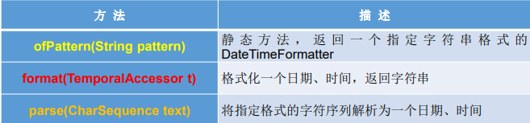

```java
/*
    * DateTimeFormatter：格式化或解析日期、时间
    * 类似于SimpleDateFormat
    *
    * */
    @Test
    public void test3(){
        //实例化的三种方式
//        方式一：预定义的标准格式。如：ISO_LOCAL_DATE_TIME;ISO_LOCAL_DATE;ISO_LOCAL_TIME
        DateTimeFormatter formatter = DateTimeFormatter.ISO_LOCAL_DATE_TIME;
        //格式化:日期 --》 字符串
        LocalDateTime localDateTime = LocalDateTime.now();
        String str1 = formatter.format(localDateTime);
        System.out.println(localDateTime);
        System.out.println(str1);
        //解析：字符串 --》 日期
        TemporalAccessor parse = formatter.parse("2021-10-18T18:47:02.7327543");
        System.out.println(parse);

//        方式二：本地化相关的格式。如：ofLocalizedDateTime(FormatStyle.LONG)
        DateTimeFormatter formatter1 = DateTimeFormatter.ofLocalizedDateTime(FormatStyle.SHORT);
        //格式化
        String str2 = formatter1.format(localDateTime);
        System.out.println(str2);

        DateTimeFormatter formatter2 = DateTimeFormatter.ofLocalizedDate(FormatStyle.FULL);
        //格式化
        String str3 = formatter2.format(LocalDate.now());
        System.out.println(str3);

//        方式三：自定义的格式。如：ofPattern(“yyyy-MM-dd hh:mm:ss”)
        DateTimeFormatter formatter3 = DateTimeFormatter.ofPattern("yyyy-MM-dd");
        //格式化
        String str4 = formatter3.format(LocalDate.now());
        System.out.println(str4);
        //解析
        TemporalAccessor parse1 = formatter3.parse("2021-10-18");
        System.out.println(parse1);


    }
```

#### 2.6其它API

1.  ZoneId：该类中包含了所有的时区信息，一个时区的ID，如 Europe/Paris 

2.  ZonedDateTime：一个在ISO-8601日历系统时区的日期时间，如 2007-12- 03T10:15:30+01:00 Europe/Paris。 

   其中每个时区都对应着ID，地区ID都为“{区域}/{城市}”的格式，例如： Asia/Shanghai等 

3. Clock：使用时区提供对当前即时、日期和时间的访问的时钟。 

   持续时间：Duration，用于计算两个“时间”间隔 

   日期间隔：Period，用于计算两个“日期”间隔

4.  TemporalAdjuster : 时间校正器。有时我们可能需要获取例如：将日期调整 到“下一个工作日”等操作。 

5. TemporalAdjusters : 该类通过静态方法 (firstDayOfXxx()/lastDayOfXxx()/nextXxx())提供了大量的常用 TemporalAdjuster 的实现。

#### 2.7与传统日期处理的转换


## （三）Java比较器

```java
**
 * 一、说明：Java中的对象，正常情况下，只能进行比较 == 或 ！= ，不能使用 > 或 < d的
 *          但是在开发的场景中，我们需要对多个对象进行排序。需要比较对象的大小。
 *          如何实现？使用两个接口中的任何一个：Comparable或Comparator
 *
 * 二、Comparable接口与Comparator的使用的对比：
 *      Comparable接口一旦指定可以保证，接口实现类的对象在任何位置都可以比较大小。
 *      Comparator接口属于临时性的比较。
 *
 *
 * @author taia
 * @creat 2021-10-18-19:24
 */
```


### 1.自然排序：java.lang.Comparable

- Comparable接口强行对实现它的每个类的对象进行整体排序。这种排序被称 为类的自然排序。 

- 实现 Comparable 的类必须实现 compareTo(Object obj) 方法，两个对象即 通过 compareTo(Object obj) 方法的返回值来比较大小。如果当前对象this大 于形参对象obj，则返回正整数，如果当前对象this小于形参对象obj，则返回 负整数，如果当前对象this等于形参对象obj，则返回零。 

- 实现Comparable接口的对象列表（和数组）可以通过 Collections.sort 或 Arrays.sort进行自动排序。实现此接口的对象可以用作有序映射中的键或有 序集合中的元素，无需指定比较器。

- 对于类 C 的每一个 e1 和 e2 来说，当且仅当 e1.compareTo(e2) == 0 与 e1.equals(e2) 具有相同的 boolean 值时，类 C 的自然排序才叫做与 equals 一致。建议（虽然不是必需的）最好使自然排序与 equals 一致。

- Comparable 的典型实现：(默认都是从小到大排列的)

  String：按照字符串中字符的Unicode值进行比较 

  Character：按照字符的Unicode值来进行比较 

  数值类型对应的包装类以及BigInteger、BigDecimal：按照它们对应的数值 大小进行比较 

  Boolean：true 对应的包装类实例大于 false 对应的包装类实例 

  Date、Time等：后面的日期时间比前面的日期时间大

```java
 /*
    * Comparable接口的使用举例：自然排序
    *   1.String类、包装类等实现了Comparable接口，重写了compareTo()方法，给出了比较两个对象大小的方式。
    *   2.String类、包装类等重写compareTo()方法以后，进行了从小到大的排列
    *   3.重写了compareTo(obj)方法的规则：如果当前对象this大于形参对象obj，则返回正整数，
    *   如果当前对象this小于形参对象obj，则返回负整数，如果当前对象this等于形参对象obj，则返回零。
    *   4.对于自定义类，如果需要排序，我们可以让日定义类实现Comparable接口，重写CompareTo方法，
    *   在compareTo方法中指明如何排序
    * */

    @Test
    public void test1(){
        String[] arr = new String[]{"FF","GG","CC","EE","DD","AA","BB"};
        Arrays.sort(arr);
        System.out.println(Arrays.toString(arr));
    }

    @Test
    public void test2(){
        Goods [] arr = new Goods[5];
        arr[0] = new Goods("lenovoMouse",34);
        arr[1] = new Goods("DellMouse",43);
        arr[2] = new Goods("MiMouse",3);
        arr[3] = new Goods("HuaWeiMouse",39);
        arr[4] = new Goods("AppleMouse",39);

        Arrays.sort(arr);

        System.out.println(Arrays.toString(arr));

    }
```


### 2.定制排序：java.util.Comparator

- 当元素的类型没有实现java.lang.Comparable接口而又不方便修改代码， 或者实现了java.lang.Comparable接口的排序规则不适合当前的操作，那 么可以考虑使用 Comparator 的对象来排序，强行对多个对象进行整体排 序的比较。

- 重写compare(Object o1,Object o2)方法，比较o1和o2的大小：如果方法返 回正整数，则表示o1大于o2；如果返回0，表示相等；返回负整数，表示 o1小于o2。 
- 可以将 Comparator 传递给 sort 方法（如 Collections.sort 或 Arrays.sort）， 从而允许在排序顺序上实现精确控制。 
- 还可以使用 Comparator 来控制某些数据结构（如有序 set或有序映射）的 顺序，或者为那些没有自然顺序的对象 collection 提供排序。

```java
 /*
    * Comparator接口的使用：定制排序
    * 1.背景：
    *       当元素的类型没有实现java.lang.Comparable接口而又不方便修改代码，
    *   或者实现了java.lang.Comparable接口的排序规则不适合当前的操作，
    *   那么可以考虑使用 Comparator 的对象来排序，强行对多个对象进行整体排序的比较。
    * 2.重写compare(Object o1,Object o2)方法，比较o1和o2的大小：
    *   如果方法返回正整数，则表示o1大于o2；如果返回0，表示相等；返回负整数，
    *   表示o1小于o2。
    *
    *
    * */

    @Test
    public void test3(){
        String[] arr = new String[]{"FF","GG","CC","EE","DD","AA","BB"};
        Arrays.sort(arr, new Comparator<String>() {
            //按照字符串从大到小的顺序排序
            @Override
            public int compare(String o1, String o2) {
                if (o1 instanceof String && o2 instanceof String){
                    String s1 = (String)o1;
                    String s2 = (String)o2;
                    return -s1.compareTo(s2);
                }
                throw new RuntimeException("输入数据类型不一致");
            }
        });

        System.out.println(Arrays.toString(arr));
    }


    @Test
    public void test4(){
        Goods [] arr = new Goods[5];
        arr[0] = new Goods("lenovoMouse",34);
        arr[1] = new Goods("DellMouse",43);
        arr[2] = new Goods("MiMouse",3);
        arr[3] = new Goods("HuaWeiMouse",39);
        arr[4] = new Goods("AppleMouse",39);

        Arrays.sort(arr, new Comparator() {
            //指明商品比较大小的方式:按照产品名称从高到低排序，再按价格从高到低
            @Override
            public int compare(Object o1, Object o2) {
                if (o1 instanceof Goods && o2 instanceof Goods){
                    Goods g1 = (Goods)o1;
                    Goods g2 = (Goods)o2;
                    if(g1.getName().equals(g2.getName())){
                        return -Double.compare(g1.getPrice(),g2.getPrice());
                    }else{
                        return -g1.getName().compareTo(g2.getName());
                    }
                }
                throw new RuntimeException("输入数据错误");
            }
        });

        System.out.println(Arrays.toString(arr));
    }

```

## （四）其他常用类

### 1.System类

System类代表系统，系统级的很多属性和控制方法都放置在该类的内部。 该类位于java.lang包。

由于该类的构造器是private的，所以无法创建该类的对象，也就是无法实 例化该类。其内部的成员变量和成员方法都是static的，所以也可以很方便 的进行调用。


```java
 @Test
    public void test1(){
        String javaVersion = System.getProperty("java.version");
        System.out.println("java的version:" + javaVersion);
        String javaHome = System.getProperty("java.home");
        System.out.println("java的home:" + javaHome);
        String osName = System.getProperty("os.name");
        System.out.println("os的name:" + osName);
        String osVersion = System.getProperty("os.version");
        System.out.println("os的version:" + osVersion);
        String userName = System.getProperty("user.name");
        System.out.println("user的name:" + userName);
        String userHome = System.getProperty("user.home");
        System.out.println("user的home:" + userHome);
        String userDir = System.getProperty("user.dir");
        System.out.println("user的dir:" + userDir);
    }
```


#### 1.1成员变量

System类内部包含in、out和err三个成员变量，分别代表标准输入流 (键盘输入)，标准输出流(显示器)和标准错误输出流(显示器)。

#### 1.2成员方法

- native long currentTimeMillis()： 该方法的作用是返回当前的计算机时间，时间的表达格式为当前计算机时 间和GMT时间(格林威治时间)1970年1月1号0时0分0秒所差的毫秒数。 

- void exit(int status)： 该方法的作用是退出程序。其中status的值为0代表正常退出，非零代表 异常退出。使用该方法可以在图形界面编程中实现程序的退出功能等。
- void gc()： 该方法的作用是请求系统进行垃圾回收。至于系统是否立刻回收，则 取决于系统中垃圾回收算法的实现以及系统执行时的情况。
- String getProperty(String key)： 该方法的作用是获得系统中属性名为key的属性对应的值。系统中常见 的属性名以及属性的作用如下表所示：

### 2.Math类

java.lang.Math提供了一系列静态方法用于科学计算。其方法的参数和返回 值类型一般为double型。

- abs 绝对值
- acos,asin,atan,cos,sin,tan 三角函数 
- sqrt 平方根
- pow(double a,doble b) a的b次幂 
- log 自然对数 
- exp e为底指数 
- max(double a,double b) 
- min(double a,double b) 
- random() 返回0.0到1.0的随机数
- long round(double a) double型数据a转换为long型（四舍五入） 
- toDegrees(double angrad) 弧度—>角度
- toRadians(double angdeg) 角度—>弧度

### 3.BigInteger与BigDecimal

```java
@Test
    public void test3(){
        BigInteger bi = new BigInteger("12433241123");
        BigDecimal bd = new BigDecimal("12435.351");
        BigDecimal bd2 = new BigDecimal("11");
        System.out.println(bi);
//        System.out.println(bd.divide(bd2));
        System.out.println(bd.divide(bd2, BigDecimal.ROUND_HALF_UP));
        System.out.println(bd.divide(bd2, 15, BigDecimal.ROUND_HALF_UP));
    }
```


#### 3.1BigInteger类

- Integer类作为int的包装类，能存储的最大整型值为2 ^31-1，Long类也是有限的， 最大为2 ^63-1。如果要表示再大的整数，不管是基本数据类型还是他们的包装类 都无能为力，更不用说进行运算了。

- java.math包的BigInteger可以表示不可变的任意精度的整数。BigInteger 提供 所有 Java 的基本整数操作符的对应物，并提供 java.lang.Math 的所有相关方法。 另外，BigInteger 还提供以下运算：模算术、GCD 计算、质数测试、素数生成、 位操作以及一些其他操作。

- 构造器: BigInteger(String val)：根据字符串构建BigInteger对象

常用方法

- public BigInteger abs()：返回此 BigInteger 的绝对值的 BigInteger。 
- BigInteger add(BigInteger val) ：返回其值为 (this + val) 的 BigInteger 
- BigInteger subtract(BigInteger val) ：返回其值为 (this - val) 的 BigInteger 
- BigInteger multiply(BigInteger val) ：返回其值为 (this * val) 的 BigInteger 
- BigInteger divide(BigInteger val) ：返回其值为 (this / val) 的 BigInteger。整数 相除只保留整数部分。 
- BigInteger remainder(BigInteger val) ：返回其值为 (this % val) 的 BigInteger。
- BigInteger[] divideAndRemainder(BigInteger val)：返回包含 (this / val) 后跟 (this % val) 的两个 BigInteger 的数组。
- BigInteger pow(int exponent) ：返回其值为 (thisexponent) 的 BigInteger。

#### 3.2BigDecimal类

1. 一般的Float类和Double类可以用来做科学计算或工程计算，但在商业计算中， 要求数字精度比较高，故用到java.math.BigDecimal类。
2. BigDecimal类支持不可变的、任意精度的有符号十进制定点数。

   3.构造器

-  public BigDecimal(double val)
-  public BigDecimal(String val)

   4.常用方法

- public BigDecimal add(BigDecimal augend) 
- public BigDecimal subtract(BigDecimal subtrahend) 
- public BigDecimal multiply(BigDecimal multiplicand) 
- public BigDecimal divide(BigDecimal divisor, int scale, int roundingMode)

# 三、枚举类与注解

## （一）枚举类

### 1.概述

#### 1.1枚举类的特点

- 类的对象只有有限个，确定的。
- 当需要定义一组常量时，强烈建议使用枚举类

#### 1.2枚举类的实现

- JDK1.5之前需要自定义枚举类 
- JDK 1.5 新增的 enum 关键字用于定义枚举类

#### 1.3单例模式

- 若枚举只有一个对象, 则可以作为一种单例模式的实现方 式。

#### 1.4枚举类的属性

- 枚举类对象的属性不应允许被改动, 所以应该使用 private final 修饰 
- 枚举类的使用 private final 修饰的属性应该在构造器中为其赋值 
- 若枚举类显式的定义了带参数的构造器, 则在列出枚举值时也必须对应的 传入参数

### 2.自定义枚举类

1. 私有化类的构造器，保证不能在类的外部创建其对象 
2. 在类的内部创建枚举类的实例。声明为：public static final 
3. 对象如果有实例变量，应该声明为private final，并在构造器中初始化

```java
/**
 * 一、枚举类的使用
 * 1.枚举类的理解：类的对象只有有限个，确定的。
 * 2.但需要定义一组常量时，强烈建议使用枚举类。
 * 3.如果枚举类中只有一个对象，可以作为单例模式的实现方式。
 *
 * 二、如何定义枚举类
 * 方式一：jdk5.0之前，自定义枚举类
 * 方式二：jdk5.0时，可以使用enum关键字定义枚举类
 */
public class SeasonTest {
    public static void main(String[] args) {
        Season spring = Season.AUTUMN;
        System.out.println(spring);
    }


}
//自定义枚举类
class Season{
    //1.声明Season对象的属性
    private final String seasonName;
    private final String seasonDesc;

    //2.私有化类的构造器，并给对象属性赋值
    private Season(String seasonName,String seasonDesc){
        this.seasonName = seasonName;
        this.seasonDesc = seasonDesc;
    }

    //3.提供当前枚举类的多个对象，声明为public static final的
    public static final Season SPRING = new Season("春天","春暖花开");
    public static final Season SUMMER = new Season("夏天","夏日炎炎");
    public static final Season AUTUMN = new Season("秋天","秋高气爽");
    public static final Season WINTER = new Season("冬天","白雪皑皑");

    //4.其他诉求1：获取枚举类对象的属性


    public String getSeasonName() {
        return seasonName;
    }

    public String getSeasonDesc() {
        return seasonDesc;
    }

    //5.其他诉求2：提供toString()

    @Override
    public String toString() {
        return "Season{" +
                "seasonName='" + seasonName + '\'' +
                ", seasonDesc='" + seasonDesc + '\'' +
                '}';
    }
}
```

### 3.使用enum定义枚举类

#### 3.1enum定义枚举类步骤

- 使用 enum 定义的枚举类默认继承了 java.lang.Enum类，因此不能再 继承其他类 
- 枚举类的构造器只能使用 private 权限修饰符 
- 枚举类的所有实例必须在枚举类中显式列出(, 分隔 ; 结尾)。列出的 实例系统会自动添加 public static final 修饰 
- 必须在枚举类的第一行声明枚举类对象
- JDK 1.5 中可以在 switch 表达式中使用Enum定义的枚举类的对象 作为表达式, case 子句可以直接使用枚举值的名字, 无需添加枚举 类作为限定。

```java
/*三、Enum类中的常用方法
 *   values()方法：返回枚举类型的对象数组。该方法可以很方便地遍历所有的枚举值。
 *   valueOf(String str)：可以把一个字符串转为对应的枚举类对象。要求字符串必须是枚举类对象的“名字”。
 *  如不是，会有运行时异常：IllegalArgumentException。
 *   toString()：返回当前枚举类对象常量的名称
 *
 *四、使用enum关键字定义的枚举类实现接口的情况
 *  情况一：实现接口，在enum类中实现抽象方法
 *  情况二：让枚举类的对象分别实现接口中的抽象方法
 *
 *
 * @author taia
 * @creat 2021-10-19-11:00
 */
 package com.taiacloud.java;

import java.util.Arrays;

/**
 * 使用enum关键字定义枚举类
 * 说明：定义的枚举类默认继承于java.lang.Enum类
 *
 * @author taia
 * @creat 2021-10-19-15:53
 */
public class SeasonTest1 {
    public static void main(String[] args) {
        Season1 summer = Season1.SUMMER;
        //toString():
        System.out.println(summer.toString());
//        System.out.println(Season1.class.getSuperclass());

        //values():
        Season1[] values = Season1.values();
        System.out.println(Arrays.toString(values));

        Thread.State[] states = Thread.State.values();//线程的状态枚举类
        System.out.println(Arrays.toString(states));

        //valueOf(string Obj):根据提供的objName，返回枚举类中对象名是objName的对象，若没有名为objName的对象则抛出异常
        Season1 winter = Season1.valueOf("WINTER");
        System.out.println(winter);


        //
        winter.show();


    }
}

interface  Info{
    void show();
}


//使用enum关键字定义枚举类
enum Season1 implements Info{
    //1.提供当前枚举类的多个对象,多个对象之间用逗号隔开，末尾对象分号结束
    SPRING ("春天","春暖花开"){
        @Override
        public void show() {
            System.out.println("这是一个春天");
        }
    },
    SUMMER ("夏天","夏日炎炎"){
        @Override
        public void show() {
            System.out.println("这是一个夏天");
        }
    },
    AUTUMN ("秋天","秋高气爽"){
        @Override
        public void show() {
            System.out.println("这是一个秋天");
        }
    },
    WINTER ("冬天","白雪皑皑"){
        @Override
        public void show() {
            System.out.println("这是一个冬天");
        }
    };


    //2.声明Season对象的属性
    private final String seasonName;
    private final String seasonDesc;

    //3.私有化类的构造器，并给对象属性赋值
    private Season1(String seasonName,String seasonDesc){
        this.seasonName = seasonName;
        this.seasonDesc = seasonDesc;
    }


    //4.其他诉求1：获取枚举类对象的属性


    public String getSeasonName() {
        return seasonName;
    }

    public String getSeasonDesc() {
        return seasonDesc;
    }

    @Override
    public void show() {
        System.out.println("这是一个季节");
    }

    //5.其他诉求2：如果不重写toString()，默认toString()输出常量名


}

```

#### 3.2 Enum类的主要方法


- values()方法：返回枚举类型的对象数组。该方法可以很方便地遍历所有的 枚举值。 
- valueOf(String str)：可以把一个字符串转为对应的枚举类对象。要求字符 串必须是枚举类对象的“名字”。如不是，会有运行时异常： IllegalArgumentException。 
- toString()：返回当前枚举类对象常量的名称

#### 3.3实现接口的枚举类

- 和普通 Java 类一样，枚举类可以实现一个或多个接口 
- 若每个枚举值在调用实现的接口方法呈现相同的行为方式，则只 要统一实现该方法即可。 
- 若需要每个枚举值在调用实现的接口方法呈现出不同的行为方式, 则可以让每个枚举值分别来实现该方法

## （二）注解

```java
package com.taiacloud.java1;

import java.util.Date;

/**
 * 注解的使用：
 * 1.理解Annotation：
 *     1.1 jdk 5.0 新增功能
 *     1.2 Annotation 其实就是代码里的特殊标记, 这些标记可以在编译, 类加载, 运行时被读取, 并执行相应的处理。
 *     通过使用 Annotation, 程序员可以在不改变原有逻辑的情况下, 在源文件中嵌入一些补充信息。
 *     代码分析工具、开发工具和部署工具可以通过这些补充信息进行验证或者进行部署。
 *     1.3 在JavaSE中，注解的使用目的比较简单，例如标记过时的功能，忽略警告等。
 *     在JavaEE/Android中注解占据了更重要的角色.
 * 2.Annotation示例
 * 示例一：生成文档相关的注解
 * 示例二：在编译时进行格式检查(JDK内置的三个基本注解)
 *      @Override: 限定重写父类方法, 该注解只能用于方法
 *      @Deprecated: 用于表示所修饰的元素(类, 方法等)已过时。通常是因为所修饰的结构危险或存在更好的选择
 *      @SuppressWarnings: 抑制编译器警告
 * 示例三：跟踪代码依赖性，实现替代配置文件功能
 *
 * 3.如何自定义注解：参照@SuppressWarnings去定义
 *  3.1注解声明为：@interface
 *  3.2内部定义成员，通常使用value表示
 *  3.3可以指定成员的默认值，使用default定义
 *  3.4如果自定义的注解没有成员，表明是一个标识作用
 *
 *
 *  如果注解有成员，那么在使用注解时，需要指明成员的值。
 *  自定义注解必须配上注解的信息处理流程（使用反射）才有意义。
 *  自定义注解通常都会指明两个元注解：Retention、Target
 *
 * 4.jdk5.0 提供的四种元注解：元 Annotation 用于修饰其他 Annotation 定义
 *  Retention：指定该 Annotation 的生命周期：SOURCE\CLASS（默认行为）\RUNTIME。
 *              只有声明为RUNTIME的注解才能通过反射获取。
 *  Target：用于修饰 Annotation 定义, 用于指定被修饰的 Annotation 能用于修饰哪些程序元素。
 *              @Target 也包含一个名为 value 的成员变量。
 *  **********************************出现频率较低**********************************
 *  Documented：用于指定被该元 Annotation 修饰的 Annotation 类将被javadoc 工具提取成文档。
 *              默认情况下，javadoc是不包括注解的。
 *  Inherited：: 被它修饰的 Annotation 将具有继承性。
 *              如果某个类使用了被@Inherited 修饰的 Annotation, 则其子类将自动具有该注解。
 *
 * 5.通过反射获取注解信息 -----到反射内容再系统讲解
 *
 * 6.jdk 8 注解新特性
 *  6.1可重复注解：
 *      6.1.1.再MyAnnotation上声明@Repeatable，成员值为MyAnnotations。class
 *      6.1.2.MyAnnotation的Target和Retention和MyAnnotations和Inherited保持相同
 *  6.2类型注解：JDK1.8之后，关于元注解@Target的参数类型ElementType枚举值多了两个：TYPE_PARAMETER,TYPE_USE。
 *          在Java 8之前，注解只能是在声明的地方所使用，Java8开始，注解可以应用在任何地方。
 *       ElementType.TYPE_PARAMETER 表示该注解能写在类型变量的声明语句中（如：泛型声明）。
 *       ElementType.TYPE_USE 表示该注解能写在使用类型的任何语句中。
 * @author taia
 * @creat 2021-10-19-17:11
 */
public class AnnotationTest {
    public static void main(String[] args) {

        Person p = new Student();
        p.walk();

        //@Deprecated:
        Date date = new Date(2021,10,11);
        System.out.println(date);

        //@SuppressWarnings:
        @SuppressWarnings("unused")
        int num = 10;

    }
}

//@MyAnnotation(value = "hi")
//@MyAnnotation("hi")
@MyAnnotation
class Person {
    private String name;
    private int age;

    public Person() {
    }

    public Person(String name, int age) {
        this.name = name;
        this.age = age;
    }

    public void walk(){
        System.out.println("walk");
    }

    public void eat(){
        System.out.println("eat");
    }
}

interface Info{
    void show();
}

//@Override:
class Student extends Person implements Info{

    @Override
    public void walk() {
        System.out.println("student walk");
    }


    @Override
    public void show() {
        System.out.println("show");
    }
}

```


### 1.注解(Annotation)概述 

- 从 JDK 5.0 开始, Java 增加了对元数据(MetaData) 的支持, 也就是 Annotation(注解) 
- Annotation 其实就是代码里的特殊标记, 这些标记可以在编译, 类加 载, 运行时被读取, 并执行相应的处理。通过使用 Annotation, 程序员 可以在不改变原有逻辑的情况下, 在源文件中嵌入一些补充信息。代 码分析工具、开发工具和部署工具可以通过这些补充信息进行验证 或者进行部署。 
- Annotation 可以像修饰符一样被使用, 可用于修饰包,类, 构造器, 方 法, 成员变量, 参数, 局部变量的声明, 这些信息被保存在 Annotation 的 “name=value” 对中。在JavaSE中，注解的使用目的比较简单，例如标记过时的功能， 忽略警告等。
- 在JavaEE/Android中注解占据了更重要的角色，例如 用来配置应用程序的任何切面，代替JavaEE旧版中所遗留的繁冗 代码和XML配置等。 
- 未来的开发模式都是基于注解的，JPA是基于注解的，Spring2.5以 上都是基于注解的，Hibernate3.x以后也是基于注解的，现在的 Struts2有一部分也是基于注解的了，注解是一种趋势，一定程度上 可以说：框架 = 注解 + 反射 + 设计模式

### 2.常见的Annotation示例 

使用 Annotation 时要在其前面增加 @ 符号, 并把该 Annotation 当成 一个修饰符使用。用于修饰它支持的程序元素。

- 示例一：生成文档相关的注解

  

- 示例二：在编译时进行格式检查(JDK内置的三个基本注解)

  @Override: 限定重写父类方法, 该注解只能用于方法 

  @Deprecated: 用于表示所修饰的元素(类, 方法等)已过时。通常是因为 所修饰的结构危险或存在更好的选择

   @SuppressWarnings: 抑制编译器警告

  

- 示例三：跟踪代码依赖性，实现替代配置文件功能

Servlet3.0提供了注解(annotation),使得不再需要在web.xml文件中进行Servlet的部署。


### 3.自定义Annotation 

- 定义新的 Annotation 类型使用 @interface 关键字 
- 自定义注解自动继承了java.lang.annotation.Annotation接口 
- Annotation 的成员变量在 Annotation 定义中以无参数方法的形式来声明。其 方法名和返回值定义了该成员的名字和类型。我们称为配置参数。类型只能 是八种基本数据类型、String类型、Class类型、enum类型、Annotation类型、 以上所有类型的数组。
- 可以在定义 Annotation 的成员变量时为其指定初始值, 指定成员变量的初始 值可使用 default 关键字 
- 如果只有一个参数成员，建议使用参数名为value 
- 如果定义的注解含有配置参数，那么使用时必须指定参数值，除非它有默认 值。格式是“参数名 = 参数值” ，如果只有一个参数成员，且名称为value， 可以省略“value=” 
- 没有成员定义的 Annotation 称为标记; 包含成员变量的 Annotation 称为元数 据 Annotation 注意：自定义注解必须配上注解的信息处理流程才有意义。

```java
package com.taiacloud.java1;

import java.lang.annotation.Retention;
import java.lang.annotation.RetentionPolicy;
import java.lang.annotation.Target;

import static java.lang.annotation.ElementType.*;

/**
 * @author taia
 * @creat 2021-10-19-17:35
 */
@Target({TYPE, FIELD, METHOD, PARAMETER, CONSTRUCTOR, LOCAL_VARIABLE, MODULE})

@Retention(RetentionPolicy.SOURCE)
public @interface MyAnnotation {

    String value() default "hello";
}

```


### 4.JDK中的元注解 

- JDK 的元 Annotation 用于修饰其他 Annotation 定义

- JDK5.0提供了4个标准的meta-annotation类型，分别是：

  ​	Retention 

  ​	Target 

  ​	Documented 

  ​	Inherited

#### 4.1@Retention

只能用于修饰一个 Annotation 定义, 用于指定该 Annotation 的生命 周期, @Rentention 包含一个 RetentionPolicy 类型的成员变量, 使用 @Rentention 时必须为该 value 成员变量指定值:

- RetentionPolicy.SOURCE:在源文件中有效（即源文件保留），编译器直接丢弃这种策略的 注释 
- RetentionPolicy.CLASS:在class文件中有效（即class保留） ， 当运行 Java 程序时, JVM 不会保留注解。 这是默认值 
- RetentionPolicy.RUNTIME:在运行时有效（即运行时保留），当运行 Java 程序时, JVM 会 保留注释。程序可以通过反射获取该注释。


#### 4.2@Target

用于修饰 Annotation 定义, 用于指定被修饰的 Annotation 能用于 修饰哪些程序元素。 @Target 也包含一个名为 value 的成员变量。


#### 4.3@Documented

 用于指定被该元 Annotation 修饰的 Annotation 类将被 javadoc 工具提取成文档。默认情况下，javadoc是不包括注解的。 

定义为Documented的注解必须设置Retention值为RUNTIME。

#### 4.4@Inherited

被它修饰的 Annotation 将具有继承性。如果某个类使用了被 @Inherited 修饰的 Annotation, 则其子类将自动具有该注解。

- 比如：如果把标有@Inherited注解的自定义的注解标注在类级别上，子类则可以 继承父类类级别的注解 
- 实际应用中，使用较少

### 5.利用反射获取注解信息（在反射部分涉及） 

- JDK 5.0 在 java.lang.reflect 包下新增了 AnnotatedElement 接口, 该接口代 表程序中可以接受注解的程序元素 
- 当一个 Annotation 类型被定义为运行时 Annotation 后, 该注解才是运行时 可见, 当 class 文件被载入时保存在 class 文件中的 Annotation 才会被虚拟 机读取 
- 程序可以调用 AnnotatedElement对象的如下方法来访问 Annotation 信息

### 6.JDK 8中注解的新特性

Java 8对注解处理提供了两点改进：可重复的注解及可用于类型的注解。此外， 反射也得到了加强，在Java8中能够得到方法参数的名称。这会简化标注在方法 参数上的注解。

#### 6.1可重复注解

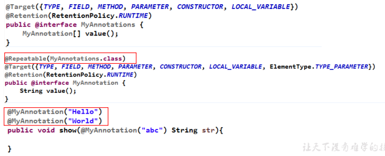

#### 6.2类型注解

- JDK1.8之后，关于元注解@Target的参数类型ElementType枚举值多了两个： TYPE_PARAMETER,TYPE_USE。
- 在Java 8之前，注解只能是在声明的地方所使用，Java8开始，注解可以应用 在任何地方。

##### 6.2.1ElementType.TYPE_PARAMETER

表示该注解能写在类型变量的声明语 句中（如：泛型声明）。

##### 6.2.2ElementType.TYPE_USE

表示该注解能写在使用类型的任何语句中。

```java
@MyAnnotation
public class AnnotationTest<U> {
@MyAnnotation
private String name;
public static void main(String[] args) {
	AnnotationTest<@MyAnnotation String> t = null;
	int a = (@MyAnnotation int) 2L;
	@MyAnnotation
	int b = 10;
}
public static <@MyAnnotation T> void method(T t) {
}
public static void test(@MyAnnotation String arg) throws @MyAnnotation 		Exception {
	}
}
@Target(ElementType.TYPE_USE)
@interface MyAnnotation {
}
```

# 四、集合

## （一）Java结合框架概述

```java
* 一、集合框架的概述
* 1.集合、数组都是对多个数据进行存储（内存层面，不涉及持久化的存储）操作的结构，简称Java容器。
* 2.数组在存储多个数据方面的特点：
*      2.1一旦初始化以后，其长度就确定了。
*      2.2数组一旦定义好，其元素的类型也就确定了，之后就只能操作指定类型的数据。
*          如：String [] arr;int [] arr1;Object [] arr2;
* 3.数组在存储多个数据方面的缺点：
*      3.1一旦初始化以后，其长度就不可修改了。
*      3.2数组中提供的方法非常有限，对于添加、删除、插入数据等操作非常不便，同时效率不高。
*      3.3获取数组中实际元素的个数，数组没有现成的属性或方法可用。
*      3.4数组存储数据的特点：有序、可重复。对于无序、不可重复的需求，数组无法满足。
*
* 二、集合框架
*      |---Collection接口：单列集合，用来存储一个一个的对象
*          |---List接口：存储有序的、可重复的数据。---》“动态数组”
*              |---ArrayList、LinkList、Vector
*
*          |---Set接口：存储无序的、不可重复的数据。---》高中讲的“集合”：无序性、确定性、互异性
*              |---HashSet、LinkHashSet、TreeSet
*
*      |---Map接口：双列集合，用来存储一对一对（key -- value）的数据。---》数学的函数：y = f(x)
*              |---HashMap、LinkHashMap、TreeMap、Hashtable、Properties
```

Java 集合可分为 Collection 和 Map 两种体系

**Collection接口：单列数据，定义了存取一组对象的方法的集合** 

- List：元素有序、可重复的集合 
- Set：元素无序、不可重复的集合 


**Map接口：双列数据，保存具有映射关系“key-value对”的集合**

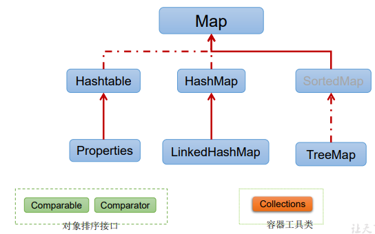

## （二）Collection

### 1.Collection接口方法

- Collection 接口是 List、Set 和 Queue 接口的父接口，该接口里定义的方法 既可用于操作 Set 集合，也可用于操作 List 和 Queue 集合。 
- JDK不提供此接口的任何直接实现，而是提供更具体的子接口(如：Set和List) 实现。 
- 在 Java5 之前，Java 集合会丢失容器中所有对象的数据类型，把所有对象都 当成 Object 类型处理；从 JDK 5.0 增加了泛型以后，Java 集合可以记住容 器中对象的数据类型。

1、添加 

- add(Object obj) 
- addAll(Collection coll) 

2、获取有效元素的个数 

- int size() 

3、清空集合 

- void clear() 

4、是否是空集合 

- boolean isEmpty() 

5、是否包含某个元素 

- boolean contains(Object obj)：是通过元素的equals方法来判断是否 是同一个对象 
- boolean containsAll(Collection c)：也是调用元素的equals方法来比 较的。拿两个集合的元素挨个比较。

6、删除 

- boolean remove(Object obj) ：通过元素的equals方法判断是否是 要删除的那个元素。只会删除找到的第一个元素 
- boolean removeAll(Collection coll)：取当前集合的差集 

7、取两个集合的交集 

- boolean retainAll(Collection c)：把交集的结果存在当前集合中，不 影响c 

8、集合是否相等 

- boolean equals(Object obj) 

9、转成对象数组 

- Object[] toArray() 

10、获取集合对象的哈希值 

- hashCode() 

11、遍历 

- iterator()：返回迭代器对象，用于集合遍历

```java
public class CollectionTest {
    @Test
    public void test1(){
        Collection coll = new ArrayList();

        //1.add(Object e):将元素e添加到集合coll中,只能添加对象
        coll.add("AA");
        coll.add("BB");
        coll.add(123);//自动装箱
        coll.add(new Date());

        //2.size():获取添加的元素的个数
        System.out.println(coll.size());

        //3.addAll(Collection coll1):将coll1集合中的元素添加到当前集合中
        Collection coll1 = new ArrayList();
        coll1.add(123);
        coll1.add(456);
        coll.addAll(coll1);
        System.out.println(coll.size());
        System.out.println(coll);

        //4.clear():清空集合元素
        coll1.clear();

        //5.isEmpty():判断当前集合是否为空
        System.out.println(coll1.isEmpty());
        System.out.println(coll.isEmpty());

    }

    @Test
    public void test2(){
        Collection coll = new ArrayList();
        coll.add(123);
        coll.add(456);
        coll.add(new String("Tom"));
        coll.add(false);
        Person p1 = new Person("Jerry", 20);
        coll.add(p1);

        //1.contains(Object obj):判断当前集合中是否包含obj,判断时调用obj对象所在类的equals()。
        System.out.println(coll.contains(123));//true
        System.out.println(coll.contains(new String("Tom")));//true,调用String重写的equals()方法
        System.out.println(coll.contains(p1));//true

        Person p2 = new Person("Jerry",20);
        System.out.println(coll.contains(p2));//false，Person类中没有重写equals()方法，则调用父类Object中的equals()，就是“==”
                                              //重写后返回true

        //2.containsAll(Collection coll1):判断形参中的所有元素是不是都存在于当前集合中
        Collection coll1 = new ArrayList();
        coll1.add(123);
        coll1.add(456);
        Collection coll2 = Arrays.asList(123,456);
        System.out.println(coll.containsAll(coll1));//true
        System.out.println(coll.containsAll(coll2));//true


    }

    @Test
    public void test3(){
        Collection coll = new ArrayList();
        coll.add(123);
        coll.add(456);
        coll.add(new String("Tom"));
        coll.add(false);
        Person p1 = new Person("Jerry", 20);
        coll.add(p1);

        //3.remove(Object obj):从当前集合中删除obj元素
        coll.remove(123);
        System.out.println(coll);

        coll.remove(new Person("Jerry",20));
        System.out.println(coll);

        //4.removeAll(Collection coll):从当前元素中移除coll中所有的元素，移除两个集合共有的元素;差集
        Collection coll1 = Arrays.asList(123,456);
        coll.removeAll(coll1);
        System.out.println(coll);


    }

    @Test
    public void test4(){
        Collection coll = new ArrayList();
        coll.add(123);
        coll.add(456);
        coll.add(new String("Tom"));
        coll.add(false);
        coll.add(new Person("Jerry", 20));

        //5.retainAll(Collection coll1):交集，获取当前集合与coll1集合的交集，并返回给当前集合
//        Collection coll1 = Arrays.asList(123,456,789);
//        System.out.println(coll);
//        coll.retainAll(coll1);
//        System.out.println(coll);

        //6.equals(Object obj):要想返回true，需要当前集合和形参集合元素都相同。
        Collection coll1 = new ArrayList();
        coll1.add(123);
        coll1.add(456);
        coll1.add(new String("Tom"));
        coll1.add(false);
        coll1.add(new Person("Jerry", 20));

        System.out.println(coll.equals(coll1));
    }

    @Test
    public void test5(){
        Collection coll = new ArrayList();
        coll.add(123);
        coll.add(456);
        coll.add(new String("Tom"));
        coll.add(false);
        coll.add(new Person("Jerry", 20));

        //7.hashCode():返回当前对象的哈希值
        System.out.println(coll.hashCode());

        //8.集合 ---> 数组：toArray()
        Object[] arr = coll.toArray();
        for (int i = 0; i < arr.length; i++) {
            System.out.println(arr[i]);

        }

        //拓展.数组 ---> 集合：asList():调用Arrays类的静态方法 asList()
        List list = Arrays.asList(new String[]{"AA", "BB", "CC"});
        System.out.println(list);
        List list1 = Arrays.asList(new int[]{123, 456});//asList认为基本数据类型的数组为一个元素，存储的是地址值
        System.out.println(list1);//I@5579bb86
        System.out.println(list1.size());//1
        List list2 = Arrays.asList(new Integer[]{123, 456});//asList认为包装类的数组为多个元素
        System.out.println(list2);//123, 456

        //iterator():返回Iterator接口的实例，用于遍历集合元素。放在IteratorTest.java中测试


    }

```

### 2.集合元素的遍历

#### 2.1Iterator迭代器接口

- Iterator对象称为迭代器(设计模式的一种)，主要用于遍历 Collection 集合中的元素。 
- GOF给迭代器模式的定义为：提供一种方法访问一个容器(container)对象中各个元 素，而又不需暴露该对象的内部细节。迭代器模式，就是为容器而生。类似于“公 交车上的售票员”、“火车上的乘务员”、“空姐”。
- Collection接口继承了java.lang.Iterable接口，该接口有一个iterator()方法，那么所 有实现了Collection接口的集合类都有一个iterator()方法，用以返回一个实现了 Iterator接口的对象。 
- Iterator 仅用于遍历集合，Iterator 本身并不提供承装对象的能力。如果需要创建 Iterator 对象，则必须有一个被迭代的集合。
- 集合对象每次调用iterator()方法都得到一个全新的迭代器对象，默认游标都在集合 的第一个元素之前。

##### 2.1.1迭代器的执行原理


##### 2.1.2Iterator接口remove()方法

- Iterator可以删除集合的元素，但是是遍历过程中通过迭代器对象的remove方 法，不是集合对象的remove方法。 
- 如果还未调用next()或在上一次调用 next 方法之后已经调用了 remove 方法， 再调用remove都会报IllegalStateException。


```java
package com.taiacloud.java;

import org.junit.Test;

import java.util.ArrayList;
import java.util.Collection;
import java.util.Iterator;

/**
 * 集合元素的遍历操作，使用迭代器Iterator接口
 *
 *  1.内部的方法：hashNext() 和 next()
 *  2.集合对象每次调用iterator()方法都得到一个全新的迭代器对象，默认游标都在集合的第一个元素之前。
 *  3.内部定义了一个remove()，可以在遍历的时候，删除集合中的元素。此方法不同于集合字节调用remove()。
 *      如果还未调用next()或在上一次调用 next 方法之后已经调用了 remove 方法，
 *      再调用remove都会报IllegalStateException。
 * @author taia
 * @creat 2021-10-21-16:32
 */
public class IteratorTest {
    @Test
    public void test1(){
        Collection coll = new ArrayList();
        coll.add(123);
        coll.add(456);
        coll.add(new String("Tom"));
        coll.add(false);
        coll.add(new Person("Jerry", 20));

        Iterator iterator = coll.iterator();

        //方式一：
//        System.out.println(iterator.next());
//        System.out.println(iterator.next());
//        System.out.println(iterator.next());
//        System.out.println(iterator.next());
//        System.out.println(iterator.next());
        //报异常：java.util.NoSuchElementException
//        System.out.println(iterator.next());

        //方式二：不推荐
//        for (int i = 0; i < coll.size(); i++) {
//            System.out.println(iterator.next());
//
//        }

        //方式三：推荐
        //hasNext():判断是否还有下一个元素
        while(iterator.hasNext()){
            //next():①指针下移 ②将下移以后集合位置上的元素返回
            System.out.println(iterator.next());
        }


    }

    @Test
    public void test2(){
        Collection coll = new ArrayList();
        coll.add(123);
        coll.add(456);
        coll.add(new String("Tom"));
        coll.add(false);
        coll.add(new Person("Jerry", 20));

        Iterator iterator = coll.iterator();

        //错误方式一：
//        while((iterator.next()) != null){
//            System.out.println(iterator.next());
//        }

        //错误方式二：
//        while(coll.iterator().hasNext()){
//            System.out.println(coll.iterator().next());
//        }
    }


    //测试Iterator中的remove()
    @Test
    public void test3(){
        Collection coll = new ArrayList();
        coll.add(123);
        coll.add(456);
        coll.add(new String("Tom"));
        coll.add(false);
        coll.add(new Person("Jerry", 20));

        Iterator iterator = coll.iterator();

        //删除集合中“Tom”
        while(iterator.hasNext()){
            Object obj = iterator.next();
            if("Tom".equals(obj)){
                iterator.remove();
            }
        }

        //重新遍历集合
        iterator = coll.iterator();
        while(iterator.hasNext()){
            System.out.println(iterator.next());
        }
    }


}

```

#### 2.2foreach 循环遍历

- Java 5.0 提供了 foreach 循环迭代访问 Collection和数组。 
- 遍历操作不需获取Collection或数组的长度，无需使用索引访问元素。 
- 遍历集合的底层调用Iterator完成操作。 
- foreach还可以用来遍历数组。


```java
package com.taiacloud.java;

import org.junit.Test;

import java.util.ArrayList;
import java.util.Collection;

/**
 * jdk 5.0 新增了foreach循环，用于遍历集合和数组
 *
 * @author taia
 * @creat 2021-10-21-17:04
 */
public class ForTest {

    @Test
    public void test1(){
        Collection coll = new ArrayList();
        coll.add(123);
        coll.add(456);
        coll.add(new String("Tom"));
        coll.add(false);
        coll.add(new Person("Jerry", 20));

        //for(集合中元素的类型 局部变量 ： 集合对象)
        //内部仍然调用的是迭代器
        for (Object obj : coll){
            System.out.println(obj);
        }
    }

    @Test
    public void test2(){
        int [] arr = new int [] {1,2,3,7,6,5,4};
        //for(数组中元素的类型 局部变量 ： 数组对象)
        for (int i: arr) {
            System.out.println(i);
        }
    }

    //笔试题
    @Test
    public void test3(){
        String [] arr = new String [] {"MM","MM","MM"};

        //方式一：普通for循环赋值
//        for(int i = 0;i < arr.length;i++){
//            arr[i] = "GG";
//        }
//
//        for(int i = 0;i < arr.length;i++){
//            System.out.println(arr[i]);
//        }//“GG”

        //方式二：foreach循环赋值
        for(String i : arr){
            i = "GG";//修改局部变量不会改变原有数组中的元素
        }

        for(String i : arr){
            System.out.println(i);
        }//"MM"
    }
}

```

### 3.Collection子接口之一： List接口

#### 3.1List接口概述

- 鉴于Java中数组用来存储数据的局限性，我们通常使用List替代数组 
- List集合类中元素有序、且可重复，集合中的每个元素都有其对应的顺序索引。 
- List容器中的元素都对应一个整数型的序号记载其在容器中的位置，可以根据 序号存取容器中的元素。
- JDK API中List接口的实现类常用的有：ArrayList、LinkedList和Vector。

#### 3.2List接口方法

List除了从Collection集合继承的方法外，List 集合里添加了一些根据索引来 操作集合元素的方法。

- void add(int index, Object ele):在index位置插入ele元素 
- boolean addAll(int index, Collection eles):从index位置开始将eles中 的所有元素添加进来 
- Object get(int index):获取指定index位置的元素 
- int indexOf(Object obj):返回obj在集合中首次出现的位置 
- int lastIndexOf(Object obj):返回obj在当前集合中末次出现的位置 
- Object remove(int index):移除指定index位置的元素，并返回此元素
- Object set(int index, Object ele):设置指定index位置的元素为ele
- List subList(int fromIndex, int toIndex):返回从fromIndex到toIndex 位置的子集合

```java
package com.taiacloud.java;

import org.junit.Test;

import java.util.ArrayList;
import java.util.Arrays;
import java.util.Iterator;
import java.util.List;

/**
 * 1.list接口框架
 *      |---Collection接口：单列集合，用来存储一个一个的对象
 *          |---List接口：存储有序的、可重复的数据。---》“动态数组”，替换原有的数组
 *              |---ArrayList
 *              |---LinkList
 *              |---Vector
 *
 * 2.list接口的三个实现类的异同
 * 面试题：ArrayList、LinkList、Vector三者的异同？
 *  相同：三个类都实现了List接口，存储数据的特点相同：有序的、可重复的数据。
 *  不同：|---ArrayList：作为List接口的主要实现类；线程不安全的，效率高；底层使用Object[] elementData 存储；
 *        |---LinkList：底层使用双向链表进行存储；对于频繁的插入和删除操作，使用此类效率比ArrayList高；
 *        |---Vector：作为List接口的古老实现类；线程安全的，效率低；底层使用Object[] elementData 存储；
 *
 *
 * 3.ArrayList的源码分析：
 *      3.1.jdk 7
 *          ArrayList list = new ArrayList();//底层创建了长度是10的Object[]数组 elementData
 *          list.add(123);//elementData[0] = new Integer(123);
 *          ......
 *          list.add(11);
 *          //如果此次添加导致底层elementData数组容量不够，则扩容，默认情况下，扩容为原来数组长度的1.5倍，同时需要将原数组中的数据复制到新的数组中
 *
 *          结论：建议开发中使用带参的构造器：ArrayList list = new ArrayList(int capacity);
 *      3.2.jdk 8
 *          ArrayList list = new ArrayList();//底层Object[] elementData初始化为{}，并没有创建长度为10的数组
 *          list.add(123);//第一次调用add()时，底层才创建了长度为10的数组，并将数据123添加到elementData的第一个位置
 *          ......
 *          //后续的添加和扩容与jdk7中一样
 *
 *      3.3.小结：jdk7中的ArrayList的对象的创建类似于单例的饿汉式，而jdk8中的ArrayList的对象的创建类似于单例的懒汉式。
 *          延迟了数组的创建，节省了内存。
 *
 * 4.LinkedList的源码分析：
 *      LinkedList list = new LinkList();//内部声明了Node类型的first和last属性，默认值为null
 *      list.add();//将123封装到Node中，创建了Node对象。
 *
 *      其中，Node定义为：体现了LinkList的双向链表的结构。
 *
 * 5.Vector的源码分析：
 *      jdk7和jdk8中通过Vector()构造器创建对象时，底层都创建了长度为10的数组；
 *      扩容的方式和ArrayList不同：默认扩容为原来的二倍；
 *      关于ArrayList线程不安全的问题，通常也不用Vector，而是使用Collections工具类中的工具将ArrayList转化为线程安全的。
 *
 *
 * 6.List接口中的常用方法
 *      增：add(Object obj)
 *      删：remove(int index)  (区别于remove(object obj)----Collection里的)
 *      改：set(int index,Object ele)
 *      查：get(index)
 *      插入：add(int index,Object ele)
 *      长度：size()
 *      遍历：1.Iterator迭代器方式  2.增强for循环  3.普通的循环
 *
 * @author taia
 * @creat 2021-10-21-17:32
 */
public class ListTest {

    /*
        void add(int index, Object ele):在index位置插入ele元素
        boolean addAll(int index, Collection eles):从index位置开始将eles中的所有元素添加进来
        Object get(int index):获取指定index位置的元素
        int indexOf(Object obj):返回obj在集合中首次出现的位置
        int lastIndexOf(Object obj):返回obj在当前集合中末次出现的位置
        Object remove(int index):移除指定index位置的元素，并返回此元素
        Object set(int index, Object ele):设置指定index位置的元素为ele
        List subList(int fromIndex, int toIndex):返回从fromIndex到toIndex位置的子集合
    */
    @Test
    public void test3(){
        ArrayList list = new ArrayList();
        list.add(123);
        list.add(456);
        list.add("AA");

        //方式一：Iterator迭代器
        Iterator iterator = list.iterator();
        while(iterator.hasNext()){
            System.out.println(iterator.next());
        }
        System.out.println("*****************");
        //方式二：增强for循环
        for (Object obj : list) {
            System.out.println(obj);
        }
        System.out.println("*****************");
        //方式三：普通循环
        for (int i = 0; i < list.size(); i++) {
            System.out.println(list.get(i));
        }
    }


    @Test
    public void test2(){
        ArrayList list = new ArrayList();
        list.add(123);
        list.add(456);
        list.add("AA");
        list.add(new Person("Tom",12));
        list.add(456);

        //int indexOf(Object obj):返回obj在集合中首次出现的位置,如果不存在则返回-1；
        System.out.println(list.indexOf(4567));

        //int lastIndexOf(Object obj):返回obj在当前集合中末次出现的位置,如果不存在则返回-1；
        System.out.println(list.lastIndexOf(456));

        //Object remove(int index):移除指定index位置的元素，并返回此元素
        Object obj = list.remove(0);
        System.out.println(obj);
        System.out.println(list);

        //Object set(int index, Object ele):设置指定index位置的元素为ele
        list.set(1,"CC");
        System.out.println(list);

        //List subList(int fromIndex, int toIndex):返回从fromIndex到toIndex位置的左闭右开的子集合,不会改变原来的集合
        List list1 = list.subList(2, 4);
        System.out.println(list1);
        System.out.println(list);

    }


    @Test
    public void test1(){
        ArrayList list = new ArrayList();
        list.add(123);
        list.add(456);
        list.add("AA");
        list.add(new Person("Tom",12));
        list.add(456);

        System.out.println(list);

        //void add(int index, Object ele):在index位置插入ele元素
        list.add(0,"BB");
        System.out.println(list);

        //boolean addAll(int index, Collection eles):从index位置开始将eles中的所有元素添加进来
        List list1 = Arrays.asList(1, 2, 3);
        list.addAll(list1);
        System.out.println(list.size());//9

        //Object get(int index):获取指定index位置的元素
        System.out.println(list.get(2));


    }
}
```

#### 3.3List实现类之一：ArrayList

- ArrayList 是 List 接口的典型实现类、主要实现类 

- 本质上，ArrayList是对象引用的一个”变长”数组 

- ArrayList的JDK1.8之前与之后的实现区别？ 

  ​	 JDK1.7：ArrayList像饿汉式，直接创建一个初始容量为10的数组 

  ​	 JDK1.8：ArrayList像懒汉式，一开始创建一个长度为0的数组，当添加第一个元 素时再创建一个始容量为10的数组

- Arrays.asList(…) 方法返回的 List 集合，既不是 ArrayList 实例，也不是 Vector 实例。 Arrays.asList(…) 返回值是一个固定长度的 List 集合

#### 3.4List实现类之二：LinkedList

对于频繁的插入或删除元素的操作，建议使用LinkedList类，效率较高.

LinkedList：双向链表，内部没有声明数组，而是定义了Node类型的first和last， 用于记录首末元素。同时，定义内部类Node，作为LinkedList中保存数据的基 本结构。Node除了保存数据，还定义了两个变量： 

- prev变量记录前一个元素的位置 
- next变量记录下一个元素的位置

新增方法：

- void addFirst(Object obj) 
- void addLast(Object obj) 
- Object getFirst() 
- Object getLast() 
- Object removeFirst() 
- Object removeLast()

#### 3.5List 实现类之三：Vector

Vector 是一个古老的集合，JDK1.0就有了。大多数操作与ArrayList 相同，区别之处在于Vector是线程安全的。 

在各种list中，最好把ArrayList作为缺省选择。当插入、删除频繁时， 使用LinkedList；Vector总是比ArrayList慢，所以尽量避免使用。

新增方法：

- void addElement(Object obj) 
- void insertElementAt(Object obj,int index) 
- void setElementAt(Object obj,int index) 
- void removeElement(Object obj) 
- void removeAllElements()

### 4.Collection子接口之二： Set接口

#### 4.1Set 接口概述

```java
/**
 * 1.Set接口的框架结构：
 * |---Set接口：存储无序的、不可重复的数据。--->高中讲的“集合”：无序性、确定性、互异性
 *          |---HashSet：作为Set接口的主要实现类；线程不安全的；可以存储null值；
 *          |---LinkedHashSet：作为HashSet的子类；遍历其内部数据时，可以按照添加的顺序去遍历；对于频繁的遍历操作，LinkedHashSet效率要高于HashSet；
 *          |---TreeSet：可以按照添加对象的指定属性进行排序；
 *
 * 2.Set接口中没有额外的定义新的方法，使用的都是Collection中声明过的方法。
 * 3.要求：向Set中添加的数据，其所在的类一定要重写hashCode()和equals()
 *         重写的hashCode()和equals()尽可能保持一致：相等的对象必须具有相等的散列码。
 *         重写两个方法时的小技巧：对象中用作 equals() 方法比较的 Field，都应该用来计算 hashCode 值。
 *
 * @author taia
 * @creat 2021-10-21-19:59
 */
```

- Set接口是Collection的子接口，set接口没有提供额外的方法 
- Set 集合不允许包含相同的元素，如果试把两个相同的元素加入同一个 Set 集合中，则添加操作失败。 
- Set 判断两个对象是否相同不是使用 == 运算符，而是根据 equals() 方法

#### 4.2Set实现类之一：HashSet

##### 4.2.1HashSet概述

HashSet 是 Set 接口的典型实现，大多数时候使用 Set 集合时都使用这个实现类。 

HashSet 按 Hash 算法来存储集合中的元素，因此具有很好的存取、查找、删除 性能。

HashSet 具有以下特点：

- 不能保证元素的排列顺序 
- HashSet 不是线程安全的 
- 集合元素可以是 null

HashSet 集合判断两个元素相等的标准：两个对象通过 hashCode() 方法比较相 等，并且两个对象的 equals() 方法返回值也相等。 

对于存放在Set容器中的对象，对应的类一定要重写equals()和hashCode(Object obj)方法，以实现对象相等规则。即：“相等的对象必须具有相等的散列码”。


```java
/*
    * 一、Set接口：存储无序的、不可重复的数据。
    *   以HashSet为例说明：
    *   1.无序性：不等于随机性。存储的数据在底层数组中并非按照数组索引的顺序添加，而是根据数据的哈希值决定的。
    *
    *   2.不可重复性：保证添加的元素按照equals()判断时，不能返回true，即：相同的元素只能添加一个。
    * 二、添加元素的过程：以HashSet为例：（以链地址法解决冲突的哈希表）
    *   我们向HashSet，中添加元素a，首先调用元素a所在类的hashCode()方法，计算元素a的哈希值，此哈希值接着
    * 通过某种算法计算出在HashSet底层数组中的存放位置（即：索引位置），判断数组此位置上是否已经有元素：
    *   若此位置没有元素，则元素a添加成功；
    *   若此位置有其他元素b（或存在以链表形式的多个元素），则比较元素a与元素b的hash值：
    *       如果hash值不相同，则元素a添加成功。--->情况1
    *       如果hash值相同，进而需要调用元素a所在类的equals方法：--->情况2
    *           equals返回true：添加失败
    *           equals返回false：添加成功 --->情况3
    *       对于添加成功的情况2和情况3而言：元素a与已存在指定索引位置上的数据以链表的方式存储。
    *           jdk7，元素a放到数组中，指向原来的元素。
    *           jdk8，原来的元素在数组中，指向元素a。
    *           总结：7上8下
    *
    *       HashSet底层：数组+链表的结构
    *
    * */
    @Test
    public void test1(){
        Set set = new HashSet();//创建一个长度为16的数组
        set.add(456);//添加元素时随机存放
        set.add(123);
//        set.add(123);
        set.add("AA");
        set.add("CC");
        set.add(new User("Tom",12));
        set.add(new User("Tom",12));
        set.add(129);

        Iterator iterator = set.iterator();
        while(iterator.hasNext()){
            System.out.println(iterator.next());
        }
    }
```


##### 4.2.2重写 hashCode() 方法的基本原则

- 在程序运行时，同一个对象多次调用 hashCode() 方法应该返回相同的值。
- 当两个对象的 equals() 方法比较返回 true 时，这两个对象的 hashCode() 方法的返回值也应相等。 
- 对象中用作 equals() 方法比较的 Field，都应该用来计算 hashCode 值。

##### 4.2.3重写 equals() 方法的基本原则

- 当一个类有自己特有的“逻辑相等”概念,当改写equals()的时候，总是 要改写hashCode()，根据一个类的equals方法（改写后），两个截然不 同的实例有可能在逻辑上是相等的，但是，根据Object.hashCode()方法， 它们仅仅是两个对象。 
- 因此，违反了“相等的对象必须具有相等的散列码”。 
- 结论：复写equals方法的时候一般都需要同时复写hashCode方法。通 常参与计算hashCode的对象的属性也应该参与到equals()中进行计算。

#### 4.3Set实现类之二：LinkedHashSet

- LinkedHashSet 是 HashSet 的子类 
- LinkedHashSet 根据元素的 hashCode 值来决定元素的存储位置， 但它同时使用双向链表维护元素的次序，这使得元素看起来是以插入 顺序保存的。 
- LinkedHashSet插入性能略低于 HashSet，但在迭代访问 Set 里的全 部元素时有很好的性能。 
- LinkedHashSet 不允许集合元素重复。


```java
/*
    * LinkedHashSet的使用：
    *   LinkedHashSet作为HashSet的子类，在添加数据的同时，每个数据还维护了两个指针，
    *   记录此数据前一个数据和后一个数据。
    *   优点：对于频繁的遍历操作，LinkedHashSet效率要高于HashSet
    *
    * */
    @Test
    public void test2(){
        Set set = new LinkedHashSet();
        set.add(456);
        set.add(123);
//        set.add(123);
        set.add("AA");
        set.add("CC");
        set.add(new User("Tom",12));
        set.add(new User("Tom",12));
        set.add(129);

        Iterator iterator = set.iterator();
        while(iterator.hasNext()){
            System.out.println(iterator.next());
        }
    }
```

#### 4.4Set实现类之三：TreeSet

TreeSet 是 SortedSet 接口的实现类，TreeSet 可以确保集合元素处于排序状态。 

TreeSet底层使用红黑树结构存储数据

新增的方法如下： (了解)

- Comparator comparator() 
- Object first() 
- Object last() 
- Object lower(Object e) 
- Object higher(Object e) 
- SortedSet subSet(fromElement, toElement) 
- SortedSet headSet(toElement) 
- SortedSet tailSet(fromElement)

TreeSet 两种排序方法：自然排序和定制排序。默认情况下，TreeSet 采用自然排序。


##### 4.4.1自然排序


##### 4.4.2定制排序


```java
package com.taiacloud.java1;

import org.junit.Test;

import java.util.Comparator;
import java.util.Iterator;
import java.util.TreeSet;

/**
 * TreeSet：可以按照添加对象的指定属性进行排序；(底层为二叉排序树---->红黑树)
 *  1.向TreeSet中添加的数据，要求是相同分类的对象。
 *  2.两种排序方式：自然排序(实现Comparable接口)和定制排序(Comparator接口)。
 *  3.自然排序中，比较两个对象是否相同的标准为：compareTo()返回0，不再是equals().
 *  4.定制排序中，比较两个对象是否相同的标准为：compare()返回0，不再是equals().
 *
 * @author taia
 * @creat 2021-10-22-15:47
 */
public class TreeSetTest {
    @Test
    public void test1(){
        TreeSet set = new TreeSet();
        //不能添加不同类的对象，执行失败
//        set.add(123);
//        set.add(456);
//        set.add("AA");
//        set.add(new User("Tom",12));


        //举例一：数字按照从小到大排序
//        set.add(34);
//        set.add(-34);
//        set.add(43);
//        set.add(11);
//        set.add(8);

        //举例二
        set.add(new User("Tom",12));
        set.add(new User("Jerry",32));
        set.add(new User("Jim",2));
        set.add(new User("Mike",65));
        set.add(new User("Jack",33));
        set.add(new User("Jack",56));

        Iterator iterator = set.iterator();
        while(iterator.hasNext()){

            System.out.println(iterator.next());
        }


    }

    @Test
    public void test2(){
        Comparator com = new Comparator() {
            //按照年龄从小到大排列，年龄一样不要了
            //年龄一样的要先执行的，舍弃后添加的，先来后到
            @Override
            public int compare(Object o1, Object o2) {
                if (o1 instanceof User && o2 instanceof User){
                    User u1 = (User) o1;
                    User u2 = (User) o2;

                    return Integer.compare(u1.getAge(),u2.getAge());
                }else{
                    throw new RuntimeException("输入的类型不匹配");
                }
            }
        };


        TreeSet set = new TreeSet(com);
        set.add(new User("Tom",12));
        set.add(new User("Jerry",32));
        set.add(new User("Jim",12));
        set.add(new User("Mike",65));
        set.add(new User("Jack",33));
        set.add(new User("Jack",56));

        Iterator iterator = set.iterator();
        while(iterator.hasNext()){

            System.out.println(iterator.next());
        }

    }
}

```

```java
package com.taiacloud.java1;

import java.util.Objects;

/**
 * @author taia
 * @creat 2021-10-21-20:31
 */
public class User implements Comparable{
    private String name;
    private int age;

    public User() {
    }

    public User(String name, int age) {
        this.name = name;
        this.age = age;
    }

    public String getName() {
        return name;
    }

    public void setName(String name) {
        this.name = name;
    }

    public int getAge() {
        return age;
    }

    public void setAge(int age) {
        this.age = age;
    }

    @Override
    public String toString() {
        return "User{" +
                "name='" + name + '\'' +
                ", age=" + age +
                '}';
    }

    @Override
    public boolean equals(Object o) {
        System.out.println("User equals()..");
        if (this == o) return true;
        if (o == null || getClass() != o.getClass()) return false;
        User user = (User) o;
        return age == user.age && Objects.equals(name, user.name);
    }

    @Override
    public int hashCode() {
        return Objects.hash(name, age);
    }

    //按照姓名从小到大排序
//    @Override
//    public int compareTo(Object o) {
//        if (o instanceof User){
//            User user = (User)o;
//            return this.name.compareTo(user.name);
//        }else{
//            throw new RuntimeException("输入类型不匹配");
//        }
//    }
    //按照姓名从大到小排序，年龄从小到大排列
    @Override
    public int compareTo(Object o) {
        if (o instanceof User){
            User user = (User)o;
//            return -this.name.compareTo(user.name);
            int compare = -this.name.compareTo(user.name);
            //二级排序
            if (compare != 0){
                return compare;
            }else{
                return Integer.compare(this.age,user.age);
            }
        }else{
            throw new RuntimeException("输入类型不匹配");
        }
    }
}

```

## （三）Map

### 1.Map接口概述

- Map与Collection并列存在。用于保存具有映射关系的数据:key-value 
- Map 中的 key 和 value 都可以是任何引用类型的数据 
- Map 中的 key 用Set来存放，不允许重复，即同一个 Map 对象所对应 的类，须重写hashCode()和equals()方法 
- 常用String类作为Map的“键” 
- key 和 value 之间存在单向一对一关系，即通过指定的 key 总能找到 唯一的、确定的 value 
- Map接口的常用实现类：HashMap、TreeMap、LinkedHashMap和 Properties。其中，HashMap是 Map 接口使用频率最高的实现类


### 2.Map接口：常用方法


```java
Map map = new HashMap();
//map.put(..,..)省略
System.out.println("map的所有key:");
Set keys = map.keySet();// HashSet
for (Object key : keys) {
System.out.println(key + "->" + map.get(key));
}
System.out.println("map的所有的value：");
Collection values = map.values();
Iterator iter = values.iterator();
while (iter.hasNext()) {
System.out.println(iter.next());
}
System.out.println("map所有的映射关系：");
// 映射关系的类型是Map.Entry类型，它是Map接口的内部接口
Set mappings = map.entrySet();
for (Object mapping : mappings) {
Map.Entry entry = (Map.Entry) mapping;
System.out.println("key是：" + entry.getKey() + "，value是：" + entry.getValue());
}

```

### 3.Map实现类之一：HashMap

- HashMap是 Map 接口使用频率最高的实现类。 
- 允许使用null键和null值，与HashSet一样，不保证映射的顺序。 
- 所有的key构成的集合是Set:无序的、不可重复的。所以，key所在的类要重写： equals()和hashCode() 
- 所有的value构成的集合是Collection:无序的、可以重复的。所以，value所在的类 要重写：equals() 
- 一个key-value构成一个entry 
- 所有的entry构成的集合是Set:无序的、不可重复的 
- HashMap 判断两个 key 相等的标准是：两个 key 通过 equals() 方法返回 true， hashCode 值也相等。 
- HashMap 判断两个 value相等的标准是：两个 value 通过 equals() 方法返回 true。

**HashMap存储结构**


```java
package com.taiacloud.java;

import org.junit.Test;

import java.util.*;

/**
 * 一、Map的实现类的结构：
 *      |---Map接口：双列集合，用来存储一对一对（key -- value）的数据。--->数学的函数：y = f(x)
 *              |---HashMap:作为Map的主要实现类；线程不安全的，效率高；存储null的key和value；若想变成线程安全的则可以用Collections工具类中的工具使HashMap变成安全的，而不选择用Hashtable；
 *                  |---LinkHashMap:保证在遍历map元素时，可以按照添加的顺序实现遍历；原因：在原有的HashMap基础上添加了一对指针，指向前一个和后一个元素；对于频繁的遍历操作，此类执行效率要高于HashMap；
 *              |---TreeMap:保证按照添加key—value对进行排序，实现排序遍历。此时考虑key的自然排序或定制排序。（底层：红黑树）
 *              |---Hashtable:作为古老实现类；线程安全，效率低；不能存储null的key和value；
 *                  |---Properties:常用来处理配置文件；key和value都是String类型；
 *
 *
 *     HashMap的底层：jdk7之前：数组+链表
 *                   jdk8：数组+链表+红黑树
 *
 *     面试题：
 *        1.HashMap的底层实现原理？
 *        2.HashMap 和 Hashtable的异同？
 *        3.CurrentHashMap 与 Hashtable的异同？（暂时不讲）
 *
 * 二、Map结构的理解：
 *      1.Map中的key：无序的、不可重复的，使用Set存储所有的key；--->key所在的类要重写equals()和hashCode()（以HashMap为例）；
 *      2.Map中的value：无序的、可重复的，使用Collection存储所有的value；--->value所在的类要重写equals()；
 *      3.一个键值对（key-value）构成一个Entry对象；
 *      4.Map中的entry：无序的，不可重复的，使用Set存储所有的entry；
 *
 *
 * 三、HashMap的底层实现原理？
 *      1.过程：以jdk7为例：
 *      HashMap map =  new HashMap();//在实例化以后，底层创建了一个长度是16的一维数组Entry[] table;
 *      ...可能已经执行过多次put...
 *      map.put(key1,value1);//首先，调用key1所在类的hashCode()计算key1的哈希值，此哈希值经过哈希函数计算之后，得到在Entry数组中的存放位置。
 *                              //如果此位置上的数据为空，此时的key1-value1添加成功。 -----情况一
 *                              //如果此位置上的数据不为空（意味着此位置存在一个或多个数据（以链表形式存在）），比较key1和已经存在数据的哈希值：
 *                                  //若key1的哈希值与已经存在的数据的哈希值都不相同，此时key1-value1添加成功；-----情况二
 *                                  //若key1的哈希值与已经存在的某一个数据（key2-value2）的哈希值相同，继续比较：调用key1所在类的equals(key2)方法比较：
 *                                      //如果equals()返回false：此时key1-value1添加成功；-----情况三
 *                                      //如果equals()返回true：使用value1替换相value2；
 *      2.补充：
 *          关于情况二和情况三，此时key1-value1和原来的数据以链表的方式存储。
 *          在不断的添加过程中，会涉及到扩容问题，当超出临界值时（且要存放的位置非空时），默认的扩容方式扩容为原来的2倍，并将原来的数据复制过来。
 *
 *      3.jdk8 相较于 jdk7 在底层实现方面的不同：
 *          3.1 new HashMap():底层没有实时的创建一个长度为16的数组；
 *          3.2 jdk8底层的数组是Node[],而不是Entry[]；
 *          3.3 首次调用put()方法时，底层首次创建长度为16的数组；
 *          3.4 jdk7底层结构只有：数组+链表。jdk8中底层结构：数组+链表+红黑树；
 *              当数组的某一个索引位置上的元素以链表形式存在的数据个数大于8且当前数组的长度超过64，此时此索引上的所有数据改为使用红黑树存储；
 *
 * 四、LinkHashMap的底层实现原理
 *      能够记录添加的元素的先后顺序。
 *
 * 五、Map中定义的方法；（以HashMap为例）
         *  添加、删除、修改操作：
             *  Object put(Object key,Object value)：将指定key-value添加到(或修改)当前map对象中
             *  void putAll(Map m):将m中的所有key-value对存放到当前map中
             *  Object remove(Object key)：移除指定key的key-value对，并返回value
             *  void clear()：清空当前map中的所有数据
         *  元素查询的操作：
             *  Object get(Object key)：获取指定key对应的value
             *  boolean containsKey(Object key)：是否包含指定的key
             *  boolean containsValue(Object value)：是否包含指定的value
             *  int size()：返回map中key-value对的个数
             *  boolean isEmpty()：判断当前map是否为空
             *  boolean equals(Object obj)：判断当前map和参数对象obj是否相等
         *  元视图操作的方法：
             *  Set keySet()：返回所有key构成的Set集合
             *  Collection values()：返回所有value构成的Collection集合
             *  Set entrySet()：返回所有key-value对构成的Set集合
 *
 * 总结：
 * 添加：Object put(Object key,Object value)
 * 删除：Object remove(Object key)
 * 修改：Object put(Object key,Object value)
 * 查询：Object get(Object key)
 * 长度：int size()
 * 遍历：keySet()/values()/entrySet()
 *
 * @author taia
 * @creat 2021-10-22-17:47
 */
public class MapTest {
    /*   元视图操作的方法：
             *  Set keySet()：返回所有key构成的Set集合
             *  Collection values()：返回所有value构成的Collection集合
             *  Set entrySet()：返回所有key-value对构成的Set集合
    */
    @Test
    public void test4(){
        Map map = new HashMap();
        map.put("AA",123);
        map.put(45,123);
        map.put("BB",56);
        map.put("AA",87);

        //遍历所有的key集：
        Set set = map.keySet();
        Iterator iterator = set.iterator();
        while(iterator.hasNext()){
            System.out.println(iterator.next());
        }
        //遍历所有的value集：
        Collection values = map.values();
        for(Object obj : values){
            System.out.println(obj);
        }
        //遍历entry数组：
        //方式一：
        Set set1 = map.entrySet();
        Iterator iterator1 = set1.iterator();
        while(iterator1.hasNext()){
            Object obj = iterator1.next();
            //entrySet集合中的元素都是entry
            Map.Entry entry = (Map.Entry)obj;

            System.out.println(entry.getKey() + "----->" + entry.getValue());

        }
        //方式二：
        Set keySet = map.keySet();
        Iterator iterator2 = keySet.iterator();
        while(iterator2.hasNext()){
            Object key = iterator2.next();
            Object value = map.get(key);
            System.out.println(key + "++++++>" + value);
        }
    }


    /*
     *  添加、删除、修改操作：
     *  Object put(Object key,Object value)：将指定key-value添加到(或修改)当前map对象中
     *  void putAll(Map m):将m中的所有key-value对存放到当前map中
     *  Object remove(Object key)：移除指定key的key-value对，并返回value
     *  void clear()：清空当前map中的所有数据
    * */
    @Test
    public void test3(){
        Map map = new HashMap();
        //添加
        map.put("AA",123);
        map.put(45,123);
        map.put("BB",56);
        //修改
        map.put("AA",87);

        System.out.println(map);

        Map map1 = new HashMap();
        map1.put("CC",123);
        map1.put("DD",123);

        map.putAll(map1);
        System.out.println(map);

        //remove(Object key)
        Object value = map.remove("CC");
        System.out.println(value);
        System.out.println(map);

        //clear()
        map.clear();//与 map = null; 不同
        System.out.println(map.size());

    }

    @Test
    public void test2(){
        Map map = new HashMap();
        map = new LinkedHashMap();

        map.put(123,"AA");
        map.put(345,"BB");
        map.put(12,"CC");

        System.out.println(map);
    }

    @Test
    public void test1(){
        Map map = new HashMap();
//        map = new Hashtable();//java.lang.NullPointerException
        map.put(null,null);
        System.out.println(map);


    }
}

```

### 4.Map实现类之二：LinkedHashMap

- LinkedHashMap 是 HashMap 的子类 
- 在HashMap存储结构的基础上，使用了一对双向链表来记录添加 元素的顺序 
- 与LinkedHashSet类似，LinkedHashMap 可以维护 Map 的迭代 顺序：迭代顺序与 Key-Value 对的插入顺序一致


### 5.Map实现类之三：TreeMap

- TreeMap存储 Key-Value 对时，需要根据 key-value 对进行排序。 TreeMap 可以保证所有的 Key-Value 对处于有序状态。 

- TreeSet底层使用红黑树结构存储数据 

- TreeMap 的 Key 的排序： 

  ​		自然排序：TreeMap 的所有的 Key 必须实现 Comparable 接口，而且所有 的 Key 应该是同一个类的对象，否则将会抛出 ClasssCastException 

  ​		定制排序：创建 TreeMap 时，传入一个 Comparator 对象，该对象负责对 TreeMap 中的所有 key 进行排序。此时不需要 Map 的 Key 实现 Comparable 接口 

- TreeMap判断两个key相等的标准：两个key通过compareTo()方法或 者compare()方法返回0。

```java
package com.taiacloud.java;

import org.junit.Test;

import java.util.*;

/**
 * @author taia
 * @creat 2021-10-22-20:39
 */
public class TreeMapTest {
    //向TreeMap中添加key-value，要求key必须是由同一个类创建的对象
    //因为要按照key进行排序：自然排序、定制排序
    @Test
    public void test1(){
        TreeMap map = new TreeMap();

        User u1 = new User("Tom",23);
        User u2 = new User("Jerry",32);
        User u3 = new User("Jack",20);
        User u4 = new User("Rose",18);
        map.put(u1,98);
        map.put(u2,89);
        map.put(u3,76);
        map.put(u4,100);
        //自然排序
        Set set1 = map.entrySet();
        Iterator iterator1 = set1.iterator();
        while(iterator1.hasNext()){
            Object obj = iterator1.next();
            Map.Entry entry = (Map.Entry)obj;
            System.out.println(entry.getKey() + "----->" + entry.getValue());

        }

    }

    @Test
    public void test2(){
        //定制排序
        TreeMap map = new TreeMap(new Comparator() {
            @Override
            public int compare(Object o1, Object o2) {
                if (o1 instanceof User && o2 instanceof User){
                    User u1 = (User)o1;
                    User u2 = (User)o2;
                    return Integer.compare(u1.getAge(), u2.getAge());
                }
                throw new RuntimeException("类型不一致");
            }

        });

        User u1 = new User("Tom",23);
        User u2 = new User("Jerry",32);
        User u3 = new User("Jack",20);
        User u4 = new User("Rose",18);
        map.put(u1,98);
        map.put(u2,89);
        map.put(u3,76);
        map.put(u4,100);

        Set set1 = map.entrySet();
        Iterator iterator1 = set1.iterator();
        while(iterator1.hasNext()){
            Object obj = iterator1.next();
            Map.Entry entry = (Map.Entry)obj;
            System.out.println(entry.getKey() + "----->" + entry.getValue());

        }
    }

}

```

```java
package com.taiacloud.java;

import java.util.Objects;

/**
 * @author taia
 * @creat 2021-10-21-20:31
 */
public class User implements Comparable{
    private String name;
    private int age;

    public User() {
    }

    public User(String name, int age) {
        this.name = name;
        this.age = age;
    }

    public String getName() {
        return name;
    }

    public void setName(String name) {
        this.name = name;
    }

    public int getAge() {
        return age;
    }

    public void setAge(int age) {
        this.age = age;
    }

    @Override
    public String toString() {
        return "User{" +
                "name='" + name + '\'' +
                ", age=" + age +
                '}';
    }

    @Override
    public boolean equals(Object o) {
        System.out.println("User equals()..");
        if (this == o) return true;
        if (o == null || getClass() != o.getClass()) return false;
        User user = (User) o;
        return age == user.age && Objects.equals(name, user.name);
    }

    @Override
    public int hashCode() {
        return Objects.hash(name, age);
    }

    //按照姓名从小到大排序
//    @Override
//    public int compareTo(Object o) {
//        if (o instanceof User){
//            User user = (User)o;
//            return this.name.compareTo(user.name);
//        }else{
//            throw new RuntimeException("输入类型不匹配");
//        }
//    }
    //按照姓名从大到小排序，年龄从小到大排列
    @Override
    public int compareTo(Object o) {
        if (o instanceof User){
            User user = (User)o;
//            return -this.name.compareTo(user.name);
            int compare = -this.name.compareTo(user.name);
            //二级排序
            if (compare != 0){
                return compare;
            }else{
                return Integer.compare(this.age,user.age);
            }
        }else{
            throw new RuntimeException("输入类型不匹配");
        }
    }
}

```

### 6.Map实现类之四：Hashtable

- Hashtable是个古老的 Map 实现类，JDK1.0就提供了。不同于HashMap， Hashtable是线程安全的。 
- Hashtable实现原理和HashMap相同，功能相同。底层都使用哈希表结构，查询 速度快，很多情况下可以互用。 
- 与HashMap不同，Hashtable 不允许使用 null 作为 key 和 value 
- 与HashMap一样，Hashtable 也不能保证其中 Key-Value 对的顺序 
- Hashtable判断两个key相等、两个value相等的标准，与HashMap一致。

### 7.Map实现类之五：Properties

- Properties 类是 Hashtable 的子类，该对象用于处理属性文件 
- 由于属性文件里的 key、value 都是字符串类型，所以 Properties 里的 key 和 value 都是字符串类型 
- 存取数据时，建议使用setProperty(String key,String value)方法和 getProperty(String key)方法

```java
Properties pros = new Properties();
pros.load(new FileInputStream("jdbc.properties"));
String user = pros.getProperty("user");
System.out.println(user);
```

## （四）Collections工具类

### 1.概述

Collections 是一个操作 Set、List 和 Map 等集合的工具类 

Collections 中提供了一系列静态的方法对集合元素进行排序、查询和修改等操作， 还提供了对集合对象设置不可变、对集合对象实现同步控制等方法

### 2.Collections常用方法


```java
package com.taiacloud.java;

import org.junit.Test;

import java.util.ArrayList;
import java.util.Arrays;
import java.util.Collections;
import java.util.List;

/**
 * Collections 是一个操作 Set、List 和 Map 等集合的工具类
 *
 *
 *
 * 面试题：Collection 和 Collections 的区别？
 *
 * @author taia
 * @creat 2021-10-23-10:15
 */
public class CollectionsTest {
    /*
    排序操作：（均为static方法）
        reverse(List)：反转 List 中元素的顺序
        shuffle(List)：对 List 集合元素进行随机排序
        sort(List)：根据元素的自然顺序对指定 List 集合元素按升序排序
        sort(List，Comparator)：根据指定的 Comparator 产生的顺序对 List 集合元素进行排序
        swap(List，int， int)：将指定 list 集合中的 i 处元素和 j 处元素进行交换
    * */
    @Test
    public void test1(){
        List list = new ArrayList();
        list.add(123);
        list.add(43);
        list.add(765);
        list.add(765);
        list.add(0);

        System.out.println(list);
        Collections.reverse(list);
        System.out.println(list);
        Collections.shuffle(list);
        System.out.println(list);
        Collections.sort(list);
        System.out.println(list);
        Collections.swap(list,1,2);
        System.out.println(list);
        System.out.println(Collections.frequency(list,765));

    }


    /*
    查找、替换
        Object max(Collection)：根据元素的自然顺序，返回给定集合中的最大元素
        Object max(Collection，Comparator)：根据 Comparator 指定的顺序，返回给定集合中的最大元素
        Object min(Collection)
        Object min(Collection，Comparator)
        int frequency(Collection，Object)：返回指定集合中指定元素的出现次数
        void copy(List dest,List src)：将src中的内容复制到dest中
        boolean replaceAll(List list，Object oldVal，Object newVal)：使用新值替换List 对象的所有旧值
    * */

    @Test
    public void test2(){
        List list = new ArrayList();
        list.add(123);
        list.add(43);
        list.add(765);
        list.add(-98);
        list.add(0);

        //报异常：java.lang.IndexOutOfBoundsException: Source does not fit in dest
//        List dest = new ArrayList();
//        Collections.copy(dest,list);


        //void copy(List dest,List src) 标准操作
        List dest = Arrays.asList(new Object[list.size()]);
        System.out.println(dest.size());
        Collections.copy(dest,list);
        System.out.println(dest);


        /*
        *   Collections 类中提供了多个 synchronizedXxx() 方法，该方法可使将指定集合包装成线程同步的集合，
        * 从而可以解决多线程并发访问集合时的线程安全问题
        *
        *
        * */

        //返回的list1即为线程安全的list
        List list1 = Collections.synchronizedList(list);


    }
}

```

# 五、泛型

## （一）泛型的概念

### 1.泛型的设计背景

泛型：标签

集合容器类在设计阶段/声明阶段不能确定这个容器到底实际存的是什么类型的 对象，所以在JDK1.5之前只能把元素类型设计为Object，JDK1.5之后使用泛型来 解决。因为这个时候除了元素的类型不确定，其他的部分是确定的，例如关于 这个元素如何保存，如何管理等是确定的，因此此时把元素的类型设计成一个 参数，这个类型参数叫做泛型。Collection<E>，List<E>，ArrayList <E>这个<E>就 是类型参数，即泛型。

### 2.泛型的概念

- 所谓泛型，就是允许在定义类、接口时通过一个标识表示类中某个属性的类 型或者是某个方法的返回值及参数类型。这个类型参数将在使用时（例如， 继承或实现这个接口，用这个类型声明变量、创建对象时）确定（即传入实 际的类型参数，也称为类型实参）。 
- 从JDK1.5以后，Java引入了“参数化类型（Parameterized type）”的概念， 允许我们在创建集合时再指定集合元素的类型，正如：List，这表明 该List只能保存字符串类型的对象。 
- JDK1.5改写了集合框架中的全部接口和类，为这些接口、类增加了泛型支持， 从而可以在声明集合变量、创建集合对象时传入类型实参。


Java泛型可以保证如果程序在编译时没有发出警告，运行时就不会产生 ClassCastException异常。同时，代码更加简洁、健壮。

## （二）在集合中使用泛型

```java
package com.taiacloud.java;

import org.junit.Test;

import java.util.*;

/**
 *
 * 泛型的使用：
 * 1.jdk 5.0 新增的特性
 * 2.在集合中使用泛型：
 *  总结：
 *      集合接口或集合类在jdk5.0的时候都修改为带泛型的结构；
 *      在实例化集合类时，可以指明具体的泛型类型
 *      指明之后，在集合类或接口中，凡是定义类或接口时，内部结构(比如：方法、构造器、属性等)使用到类的泛型的位置，都指定为实例化的泛型类型
 *          比如:add(E e) ---> 实例化以后：add(Integer e)
 *      注意：泛型的类型必须是一个类，不能是基本数据类型，需要用到基本数据类型的位置，用包装类替换
 *      如果，实例化时没有指明泛型的类型，默认类型为java.lang.Object类型
 *
 * 3.如何自定义泛型结构：泛型类、泛型接口；泛型方法；见GenericTest1.
 *      异常类，不能声明为泛型类。
 *
 *
 * @author taia
 * @creat 2021-10-23-12:35
 */
public class GenericTest {
    @Test
    public void test1(){
        ArrayList list = new ArrayList();

        //需求：存放学生成绩
        list.add(78);
        list.add(76);
        list.add(89);
        list.add(88);
        list.add(100);

        //问题一：类型不安全
//        list.add("Tom");

        for (Object score : list){
            //问题二：强转时，可能出现classCastException
            int stuScore = (Integer) score;
            System.out.println(stuScore);
        }
    }

    //在集合中使用泛型的情况:以ArrayList举例
    @Test
    public void test2(){
        //泛型的类型不能是基本数据类型
//        ArrayList<Integer> list = new ArrayList<Integer>();
        //jdk7新特性：类型推断
        ArrayList<Integer> list = new ArrayList<>();
        list.add(78);
        list.add(87);
        list.add(99);
        list.add(65);

        //编译时，会进行类型检查，保证类型安全
//        list.add("AA");

        //方式一：增强for循环
//        for (Integer score : list) {
//            //避免了强转操作
//            int stuScore = score;
//            System.out.println(stuScore);
//        }

        //方式二：迭代器
        Iterator<Integer> iterator = list.iterator();
        while(iterator.hasNext()){
            int stuScore = iterator.next();
            System.out.println(stuScore);
        }
    }

    //在集合中使用泛型的情况：以HashMap为例
    @Test
    public void test3(){
        Map<String,Integer> map = new HashMap<String,Integer>();

        map.put("AA",87);
        map.put("BB",100);
        map.put("CC",66);

//        map.put(123,123);

        //泛型的嵌套
        Set<Map.Entry<String, Integer>> entry = map.entrySet();
        Iterator<Map.Entry<String, Integer>> iterator = entry.iterator();

        while(iterator.hasNext()){
            Map.Entry<String, Integer> e = iterator.next();
            String key = e.getKey();
            Integer value = e.getValue();
            System.out.println(key + "======" + value);
        }
    }

}

```

## （三）自定义泛型结构


### 1.自定义泛型类、接口

1. 泛型类可能有多个参数，此时应将多个参数一起放在尖括号内。比如：<E1,E2,E3> 
2. 泛型类的构造器如下：public GenericClass(){}。 而下面是错误的：public GenericClass<E>(){} 
3. 实例化后，操作原来泛型位置的结构必须与指定的泛型类型一致。 
4. 泛型不同的引用不能相互赋值。 >尽管在编译时ArrayList<String>和ArrayList<Integer>是两种类型，但是，在运行时只有 一个ArrayList被加载到JVM中。
5. 泛型如果不指定，将被擦除，泛型对应的类型均按照Object处理，但不等价 于Object。经验：泛型要使用一路都用。要不用，一路都不要用。 
6. 如果泛型结构是一个接口或抽象类，则不可创建泛型类的对象。
7. jdk1.7，泛型的简化操作：ArrayList<Fruit> flist = new ArrayList<>(); 
8. 泛型的指定中不能使用基本数据类型，可以使用包装类替换。
9. 在类/接口上声明的泛型，在本类或本接口中即代表某种类型，可以作为非静态 属性的类型、非静态方法的参数类型、非静态方法的返回值类型。但在静态方法 中不能使用类的泛型。
10.  异常类不能是泛型的
11. 不能使用new E[]。但是可以：E[] elements = (E[])new Object[capacity]; 参考：ArrayList源码中声明：Object[] elementData，而非泛型参数类型数组。


**结论：子类必须是“富二代”，子类除了指定或保留父类的泛型，还可以增加自 己的泛型**

```java
package com.taiacloud.java;

import org.junit.Test;

import java.util.ArrayList;
import java.util.List;

/**
 * 如何自定义泛型结构：泛型类、泛型接口；泛型方法；
 *
 * 1.关于自定义泛型类、泛型接口
 *
 *
 * @author taia
 * @creat 2021-10-23-14:28
 */
public class GenericTest1 {
    @Test
    public void test1(){
        //如果定义了泛型类，实例化时没有指明类的泛型，则认为此泛型类型为Object类型
        //要求：如果定义了带泛型的类，建议在实例化时要指明类的泛型
        Order order = new Order();
        order.setOrderT(123);
        order.setOrderT("ABC");

        //实例化时指明类的泛型
        Order<String> order1 = new Order<String>("orderAA",1001,"order:AA");

        order1.setOrderT("AA:Hello");
    }

    @Test
    public void test2(){
        SubOrder sub1 = new SubOrder();
        //由于子类在继承带泛型的父类时，指明了泛型类型，则实例化子类对象时，不再需要指明泛型
        sub1.setOrderT(123);

        SubOrder1<String> sub2 = new SubOrder1<String>();
        sub2.setOrderT("ooo");
    }

    @Test
    public void test3(){
        //. 泛型不同的引用不能相互赋值。

        ArrayList<String> list1 = null;
        ArrayList<Integer> list2 = null;

        //不能相互赋值
//        list1 = list2;
    }

    //测试泛型方法
    @Test
    public void test4(){
        Order<String> order1 = new Order<String>();
        Integer arr[] = new Integer[]{1,2,3,4};
        //泛型方法在调用时，指明泛型参数的类型。
        List<Integer> list = order1.copyFromArrayToList(arr);

        System.out.println(list);
    }

}

```


### 2.自定义泛型方法

- 方法，也可以被泛型化，不管此时定义在其中的类是不是泛型类。在泛型 方法中可以定义泛型参数，此时，参数的类型就是传入数据的类型。 
- 泛型方法的格式： [访问权限] <泛型> 返回类型 方法名([泛型标识 参数名称]) 抛出的异常 
- 泛型方法声明泛型时也可以指定上限


```java
package com.taiacloud.java;

import java.util.ArrayList;
import java.util.List;

/**
 *
 * 自定义泛型类
 * @author taia
 * @creat 2021-10-23-14:23
 */
public class Order<T> {//T\E\K\V
    String orderName;
    int orderId;

    //类的内部就可以使用泛型

    T orderT;

    public Order(){

    }

    public Order(String orderName,int orderId,T orderT){
        this.orderName = orderName;
        this.orderId = orderId;
        this.orderT = orderT;
    }
    //如下的三个方法都不是泛型方法
    public T getOrderT(){
        return orderT;
    }
    public void setOrderT(T orderT){
        this.orderT = orderT;
    }

    @Override
    public String toString() {
        return "Order{" +
                "orderName='" + orderName + '\'' +
                ", orderId=" + orderId +
                ", orderT=" + orderT +
                '}';
    }
    /*
    *   在类/接口上声明的泛型，在本类或本接口中即代表某种类型，
    * 可以作为非静态属性的类型、非静态方法的参数类型、非静态方法的返回值类型。
    * 但在静态方法中不能使用类的泛型。
    *
    *
    * */
//    public static void show(T orderT){
//        System.out.println(orderT);
//    }

    //泛型方法：在方法中出现了泛型的结构，泛型的参数与类的泛型没有任何关系
    //泛型方法所属的类是不是泛型类都没关系
    //泛型方法可以声明为静态的，原因：泛型参数是在调用方法时确定的，并非是在实例化时确定的。
    public <E>List<E> copyFromArrayToList(E[] arr){
        ArrayList<E> list = new ArrayList<>();
        for (E e:arr){
            list.add(e);
        }
        return list;
    }
}

```

## （四）泛型在继承上的体现

如果B是A的一个子类型（子类或者子接口），而G是具有泛型声明的 类或接口，G<B>并不是G<A>的子类型！

 比如：String是Object的子类，但是List<String>并不是List <Object>的子类。


```java
/**
     * 泛型在继承方面的体现
     *      虽然类A是类B的父类，G<A> 和 G<B> 二者不具备子父类关系，二者是并列关系。
     *      补充：类A是类B的父类，A<G> 是 B<G> 的父类。
     */
    @Test
    public void test1(){
        Object obj = null;
        String str = null;
        obj = str;

        Object[] arr1 = null;
        String[] arr2 = null;
        arr1 = arr2;

        List<Object> list1 = null;
        List<String> list2 = null;
        //此时的list1和list2类型不具有子父类关系
        //编译不通过
//        list1 = list2;

        /*
        * 反证法：
        *   假设list2可以赋给list1
        *   list1.add(123);导致混入非String的数据，出错
        *
        * */

        show(list1);
        //编译不通过
        show1(list2);

    }

    public void show(List<Object> list){

    }
    public void show1(List<String> list){

    }
	@Test
    public void test2(){
        List<String> list1 = null;
        ArrayList<String> list2 = null;

        list1 = list2;
    }
```

## （五）通配符的使用

### 1.通配符


```java
/**
     * 通配符的使用
     *  通配符：?
     *  类A是类B的父类，G<A> 和 G<B> 二者是没有关系的并列的类，二者共同的父类是：G<?>
     */
    @Test
    public void test3(){
        List<Object> list1 = null;
        List<String> list2 = null;

        //list为list1和list2的通用父类
        List<?> list = null;
        list = list1;
        list = list2;

//        print(list1);
//        print(list2);

        //
        List<String> list3 = new ArrayList<String>();
        list3.add("AA");
        list3.add("BB");
        list3.add("CC");
        list = list3;
        //添加:对于List<?>就不能向其内部添加元素
        //除了添加null
//        list.add("DD");
        list.add(null);

        //获取：允许读取数据，读取的数据类型为Object
        Object o = list.get(0);
        System.out.println(o);

    }

    public void print(List<?> list) {
        Iterator<?> iterator = list.iterator();
        while(iterator.hasNext()) {
            Object next = iterator.next();
            System.out.println(next);
        }
    }

```


### 2.有限制的通配符


```java
 /**
     * 有限制条件的通配符
     *  ? extends A;
     *      G<? extends A> 可以作为G（A）和G（B）的父类，其中B是A的子类
     *  ? super A;
     *      G<? super A> 可以作为G（A）和G（B）的父类，其中B是A的父类
     */

    @Test
    public void test4(){
        List<? extends Person> list1 = null;
        List<? super Person> list2 = null;

        List<Student> list3 = null;
        List<Person> list4 = null;
        List<Object> list5 = null;
        //extends ----> "<="
        list1 = list3;
        list1 = list4;
//        list1 = list5;

        //super ----> ">="
//        list2 = list3;
        list2 = list4;
        list2 = list5;

        //读取数据没有问题
        //写入数据：extends不行，super可以。
    }
```

# 六、IO流

## （一）File类

### 1.File类概述

- java.io.File类：文件和文件目录路径的抽象表示形式，与平台无关 
- File 能新建、删除、重命名文件和目录，但 File 不能访问文件内容本身。 如果需要访问文件内容本身，则需要使用输入/输出流。 
- 想要在Java程序中表示一个真实存在的文件或目录，那么必须有一个File对 象，但是Java程序中的一个File对象，可能没有一个真实存在的文件或目录。 
- File对象可以作为参数传递给流的构造器。

```java
/**
 * File类的使用
 * 1.File类的一个对象，代表一个文件或一个文件目录（文件夹）
 * 2.File类声明在java.io包下
 * 3.File类中关于文件或文件目录的创建、删除、重命名、修改时间、文件大小等方法，并未涉及到修改文件内容的操作，
 * 如果需要操作文件内容，则必须使用IO流。
 * 4.File类的对象常会作为参数传入流的构造器中，指明读取或者写入的“终点”。
 *
 *
 * @author taia
 * @creat 2021-10-23-20:36
 */
```


### 2.常用构造器

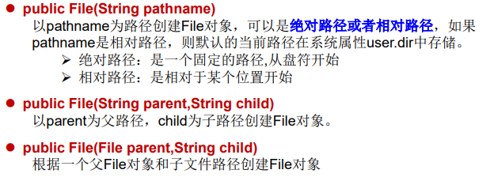

```java
 /**
     * 1.如何创建File类的实例
     *      File(String filePath)
     *      File(String parentPath,String childPath)
     *      File(File parent,String child)
     * 2.路径：
     *      相对路径：相较于某个路径下，指明的路径。
     *      绝对路径：包含盘符在内的文件或文件目录路径。
     * 3.路径分隔符：
     *      windows：\\
     *      unix：/
     *
     *
     */
    @Test
    public void test1(){
        //构造器一：
        File file1 = new File("hello.txt");//相对于当前module
        File file2 = new File("D:\\IdeaProjects\\JavaSenior\\day09\\he.txt");

        System.out.println(file1);
        System.out.println(file2);

        //构造器二：
        File file3 = new File("D:\\IdeaProjects\\JavaSenior\\day09\\he.txt","Java");
        System.out.println(file3);

        //构造器三：
        File file4 = new File(file3,"hi.txt");
        System.out.println(file4);
    }
```

### 3.路径分隔符

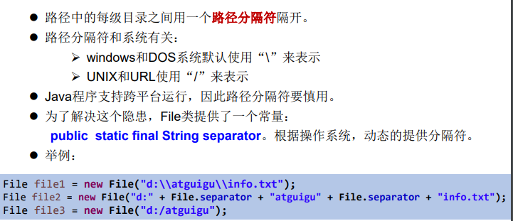

### 4.常用方法

#### 4.1 File类的获取功能

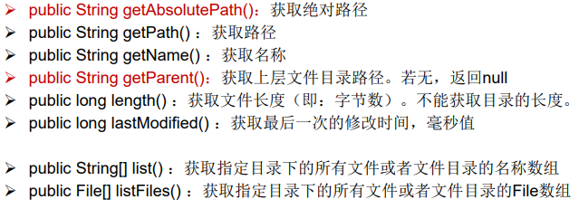

```java
/**
     * File类的获取功能
     *  public String getAbsolutePath()：获取绝对路径
     *  public String getPath() ：获取路径
     *  public String getName() ：获取名称
     *  public String getParent()：获取上层文件目录路径。若无，返回null
     *  public long length() ：获取文件长度（即：字节数）。不能获取目录的长度。
     *  public long lastModified() ：获取最后一次的修改时间，毫秒值
     *  如下的两个方法适用于文件目录
     *  public String[] list() ：获取指定目录下的所有文件或者文件目录的名称数组
     *  public File[] listFiles() ：获取指定目录下的所有文件或者文件目录的File数组
     */
    @Test
    public void test2(){
        File file1 = new File("hello.txt");
        File file2 = new File("D:\\IdeaProjects\\JavaSenior\\day09\\he.txt");

        System.out.println(file1.getAbsolutePath());
        System.out.println(file1.getPath());
        System.out.println(file1.getName());
        System.out.println(file1.getParent());
        System.out.println(file1.length());
        System.out.println(new Date(file1.lastModified()));

        System.out.println();

        System.out.println(file2.getAbsolutePath());
        System.out.println(file2.getPath());
        System.out.println(file2.getName());
        System.out.println(file2.getParent());
        System.out.println(file2.length());
        System.out.println(new Date(file2.lastModified()));


    }

    @Test
    public void test3(){
        File file = new File("D:\\IdeaProjects\\JavaSenior\\day09");

        String[] list = file.list();
        for(String s:list){
            System.out.println(s);
        }

        System.out.println();
        File[] files = file.listFiles();
        for(File f:files){
            System.out.println(f);
        }
    }
```


#### 4.2File类的重命名功能


```java
/**
     * File类的重命名功能
     *  public boolean renameTo(File dest):把文件重命名为指定的文件路径
     *  比如：file1.renameTo(file2)
     *  要想保证是成功的，需要file1在硬盘中是存在的，且file2不能存在
     */
    @Test
    public void test4(){
        File file1 = new File("hello.txt");//file1必须存在
        File file2 = new File("D:\\IdeaProjects\\JavaSenior\\day09\\hi.txt");//file2不能存在，存在的话重命名失败

        boolean renameTo = file1.renameTo(file2);
        System.out.println(renameTo);
    }
```


#### 4.3File类的判断功能

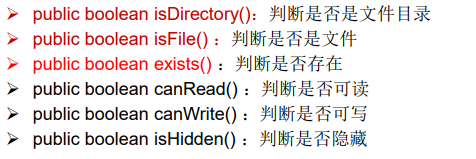

```java
/**
     * File类的判断功能
     *  public boolean isDirectory()：判断是否是文件目录
     *  public boolean isFile() ：判断是否是文件
     *  public boolean exists() ：判断是否存在
     *  public boolean canRead() ：判断是否可读
     *  public boolean canWrite() ：判断是否可写
     *  public boolean isHidden() ：判断是否隐藏
     */
    @Test
    public void test5(){
        //文件
//        File file1 = new File("he.txt");
        //文件目录
        File file1 = new File("D:\\IdeaProjects\\JavaSenior\\day09");
        System.out.println(file1.isDirectory());
        System.out.println(file1.isFile());
        System.out.println(file1.exists());
        System.out.println(file1.canRead());
        System.out.println(file1.canWrite());
        System.out.println(file1.isHidden());


    }
```


#### 4.4File类的创建功能

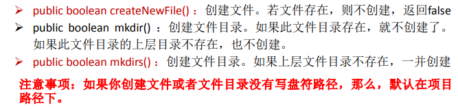

#### 4.5File类的删除功能

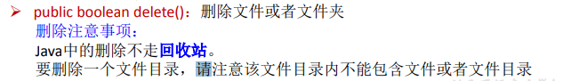

```java
/**
     * File类的创建功能
     *  public boolean createNewFile() ：创建文件。若文件存在，则不创建，返回false
     *  public boolean mkdir() ：创建文件目录。如果此文件目录存在，就不创建了。如果此文件目录的上层目录不存在，也不创建。
     *  public boolean mkdirs() ：创建文件目录。如果上层文件目录不存在，一并创建
     *  注意事项：如果你创建文件或者文件目录没有写盘符路径，那么，默认在项目路径下。
     * File类的删除功能
     *  public boolean delete()：删除文件或者文件夹
     *  注意事项：
     *  Java中的删除不走回收站。要删除一个文件目录，请注意该文件目录内不能包含文件或者文件目录。
     */

    @Test
    public void test6() throws IOException {
        //文件的创建
        File file1 = new File("hello.txt");
        if (!file1.exists()){
            file1.createNewFile();
            System.out.println("创建成功");
        }else{
            file1.delete();
            System.out.println("删除成功");
        }
    }
    @Test
    public void test7(){
        //文件目录的创建
        File file1 = new File("D:\\IdeaProjects\\JavaSenior\\day09\\IO\\io3");
        boolean mkdir = file1.mkdir();
        if (mkdir){
            System.out.println("创建成功1");
        }
        File file2 = new File("D:\\IdeaProjects\\JavaSenior\\day09\\IO2\\io4");
        boolean mkdir1 = file1.mkdirs();
        if (mkdir1){
            System.out.println("创建成功2");
        }

    }
```

## （二）IO流原理及流的分类

### 1.Java IO原理

- I/O是Input/Output的缩写， I/O技术是非常实用的技术，用于 处理设备之间的数据传输。如读/写文件，网络通讯等。 
- Java程序中，对于数据的输入/输出操作以“流(stream)” 的 方式进行。 
- java.io包下提供了各种“流”类和接口，用以获取不同种类的 数据，并通过标准的方法输入或输出数据。
- 输入input：读取外部数据（磁 盘、光盘等存储设备的数据）到 程序（内存）中。 
- 输出output：将程序（内存） 数据输出到磁盘、光盘等存储设 备中。

### 2.流的分类

- 按操作数据单位不同分为：字节流(8 bit)，字符流(16 bit) 
- 按数据流的流向不同分为：输入流，输出流 
- 按流的角色的不同分为：节点流，处理流


1. Java的IO流共涉及40多个类，实际上非常规则，都是从如下4个 抽象基类派生的。 
2. 由这四个类派生出来的子类名称都是以其父类名作为子类名后缀。

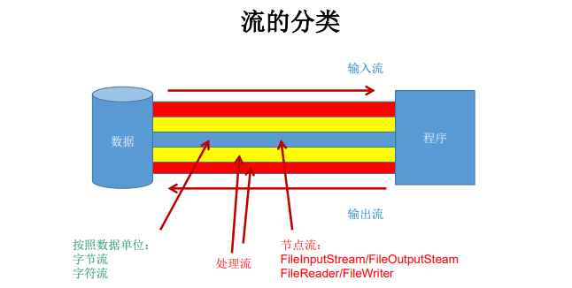

```java
/**
 * 一、流的分类：
 *  1.操作数据单位：字节流、字符流；
 *  2.数据的流向：输入流、输出流；
 *  3.流的角色：节点流、处理流；
 *
 * 二、流的体系结构
 *      抽象基类            节点流（或文件流）                                   缓冲流（处理流的一种）
 *      InputStream         FileInputStream (read(byte[] buffer))               BufferedInputStream (read(byte[] buffer))
 *      OutputStream        FileOutputStream  (write(byte[] buffer,0,len))      BufferedOutputStream (write(byte[] buffer,0,len)/flush())
 *      Reader              FileReader (read(char[] cbuf))                      BufferedReader (read(char[] cbuf)/readLine())
 *      Writer              FileWriter (write(char[] cbuf,0,len))               BufferedWriter (write(char[] cbuf,0,len)/flush())
 *
 *
 *
 *
 * @author taia
 * @creat 2021-10-25-16:03
 */
```


### 3.IO 流体系

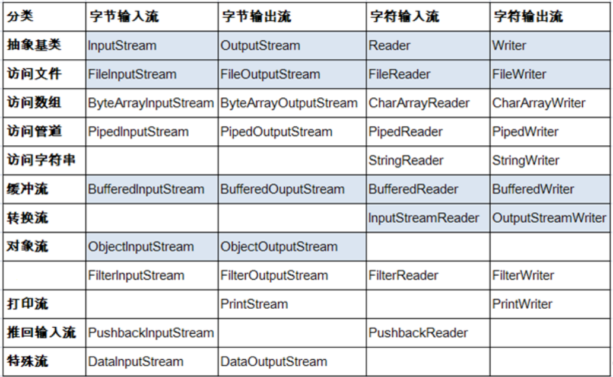

#### 3.1节点流和处理流

节点流：直接从数据源或目的地读写数据


处理流：不直接连接到数据源或目的地，而是“连接”在已存 在的流（节点流或处理流）之上，通过对数据的处理为程序提 供更为强大的读写功能。


#### 3.2InputStream & Reader

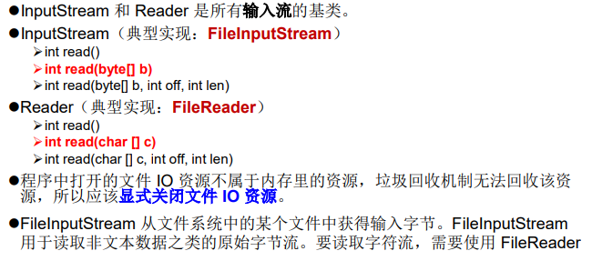

##### 3.2.1InputStream

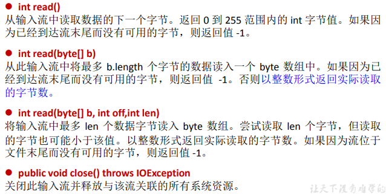

##### 3.2.2Reader

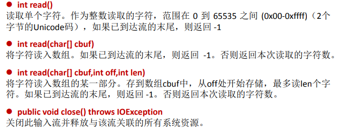

#### 3.3OutputStream & Writer

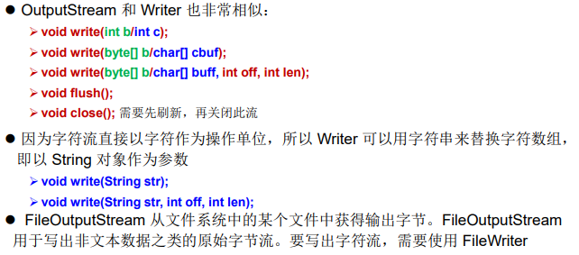

##### 3.3.1OutputStream

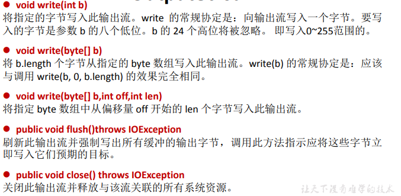

##### 3.3.2Writer

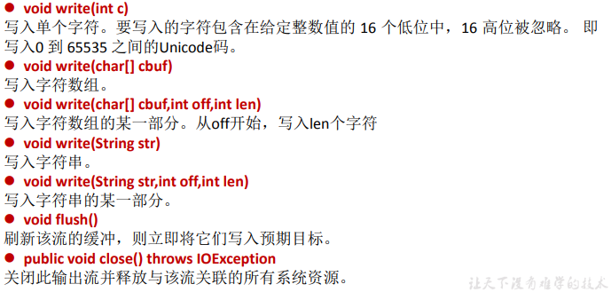

## （二）节点流(或文件流)

### 1.字符流

#### 1.1读取文件

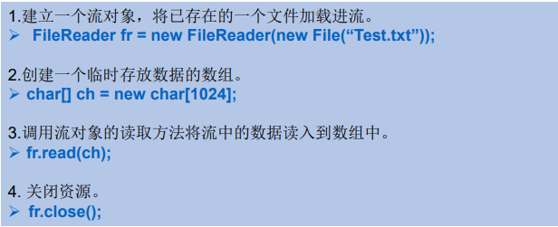

```java
    /**
     * 将day09下的hi.txt文件读入程序中，并输出到控制台
     *
     * 说明：
     *  1.read()的理解：返回读入的一个字符，如果到达文件末尾返回-1。
     *  2.异常的处理：为了保证流资源一定可以执行关闭操作，需要使用try-catch-finally处理。
     *  3.读入的文件一定要存在，否则就会报FileNotFoundException。
     */
    @Test
    public void testFileReader(){
        FileReader fr = null;
        try {
            //1.实例化File类对象，指明要操作的文件
            File file = new File("hi.txt");//相对路径，相对当前Module
            //2.提供具体的流
            fr = new FileReader(file);
            //3.数据的读入:
            //  read():返回读入的一个字符，如果到达文件末尾返回-1.
            //方式一
//        int data = fr.read();
//        while(data != -1){
//            System.out.print((char)data);
//            data = fr.read();
//        }
            //方式二:语法上针对方式一的修改
            int data;
            while ((data = fr.read()) != -1){
                System.out.print((char)data);
            }
        } catch (IOException e) {
            e.printStackTrace();
        } finally {
            //4.流的关闭操作
            try {
                if (fr != null)//避免在造对象之前出现异常，从而出现空指针
                    fr.close();
            } catch (IOException e) {
                e.printStackTrace();
            }
        }

    }

    /**
     * 对read()操作升级：使用read的重载方法
     */
    @Test
    public void testFileReader1(){
        FileReader fr = null;
        try {
            //1.File类的实例化
            File file = new File("hi.txt");
            //2.流的实例化
            fr = new FileReader(file);
            //3.具体操作
            //read(char[] cbuf):返回每次读入cbuf数组中的字符的个数。如果到大文件末尾返回-1.
            char[] cbuf = new char[5];
            int len;
            while ((len = fr.read(cbuf)) != -1){
                //方式一：
                //错误的写法
//                for (int i = 0;i < cbuf.length;i++){
//                    System.out.print(cbuf[i]);
//                }
                //正确的
//                for (int i = 0;i < len;i++){
//                    System.out.print(cbuf[i]);
//                }

                //方式二：
                //错误的写法
//                String str = new String(cbuf);
//                System.out.print(str);
                //正确的
                String str = new String(cbuf,0,len);//把数组转化为字符串，从0到len。
                System.out.print(str);
            }
        } catch (IOException e) {
            e.printStackTrace();
        } finally {
            try {
                if(fr != null)
                //4.资源的关闭
                fr.close();
            } catch (IOException e) {
                e.printStackTrace();
            }
        }

    }
```

#### 1.2写入文件

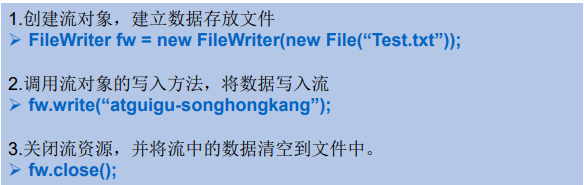

```java
 /**
     * 从内存中写出数据到硬盘的文件里。
     * 说明：
     *  1.输出操作，对应的File是可以不存在的，并不会报异常。
     *  2.File对应的硬盘中的文件：
     *      如果不存在：在输出的过程中会自动创建此文件。
     *      如果存在：
     *          构造器FileWriter（文件对象，true）：不会对原有文件覆盖，而是在原有文件基础上追加。
     *          构造器FileWriter（文件对象，false）/（文件对象）：对原有文件的一个覆盖。
     *
     */
    @Test
    public void FileReaderWriter(){
        FileWriter fw = null;
        try {
            //1.提供File类的对象，指明写出到硬盘的文件
            File file = new File("hello.txt");
            //2.提供FileWriter的对象，用于数据的写出
            fw = new FileWriter(file,true);
            //3.写出的具体操作
            fw.write("I have a dream\n");
            fw.write("you need to have a dream!");
        } catch (IOException e) {
            e.printStackTrace();
        } finally {
            //4.流资源的关闭
            try {
                fw.close();
            } catch (IOException e) {
                e.printStackTrace();
            }
        }

    }
```

### 2.字节流

```java
package com.taiacloud.java2;

import org.junit.Test;

import java.io.File;
import java.io.FileInputStream;
import java.io.FileOutputStream;
import java.io.IOException;

/**
 * 测试FileInputStream和FileOutputStream的使用
 *
 * 结论：
 *  1.对于文本文件（.txt\.java\.c\.cpp...），使用字符流处理；
 *  2.对于非文本文件(.jpg\.mp3\.mp4\.avi\.ppt\.doc...)，使用字节流处理；
 *
 * @author taia
 * @creat 2021-10-25-19:29
 */
public class FileInputOutputStreamTest {
    /**
     * 使用FileInputStream处理文本文件，是可能出现乱码的。
     * 字节流可以用来处理英文字符，和字符流相同，因为在 utf-8 编码中，一个英文字母就占用一个字节
     * 中文以及其他字符不可以这么操作，文本文件还是用字符流处理
     */
    @Test
    public void testFileInputStream(){
        FileInputStream fis = null;
        try {
            //1.造文件
            File file = new File("hello.txt");
            //2.造流
            fis = new FileInputStream(file);
            //3.读数据
            byte[] buffer = new byte[5];
            int len;//记录每次读取的字节的个数
            while((len = fis.read(buffer)) != -1){
                String str = new String(buffer, 0, len);
                System.out.print(str);
            }
        } catch (IOException e) {
            e.printStackTrace();
        } finally {
            try {
                //4.关闭流
                if(fis != null)
                fis.close();
            } catch (IOException e) {
                e.printStackTrace();
            }
        }

    }

    /**
     * 实现对图片的复制操作
     * @throws IOException
     */
    @Test
    public void testFileInputOutputStream(){
        FileInputStream fis = null;
        FileOutputStream fos = null;
        try {
            File srcFile = new File("WeChat_pic.jpg");
            File destFile = new File("WeChat_pic_copy.jpg");

            fis = new FileInputStream(srcFile);
            fos = new FileOutputStream(destFile);

            //复制过程
            byte[] buffer = new byte[5];
            int len;
            while ((len = fis.read(buffer)) != -1) {
                fos.write(buffer, 0, len);
            }
        } catch (IOException e) {
            e.printStackTrace();
        } finally {
            try {
                if (fos != null)
                fos.close();
            } catch (IOException e) {
                e.printStackTrace();
            }
            try {
                if (fis != null)
                fis.close();
            } catch (IOException e) {
                e.printStackTrace();
            }
        }


    }


    //使用字节流进行指定路径下文件的复制
    public void copyFile(String srcPath, String destPath){
        FileInputStream fis = null;
        FileOutputStream fos = null;
        try {
            File srcFile = new File(srcPath);
            File destFile = new File(destPath);

            fis = new FileInputStream(srcFile);
            fos = new FileOutputStream(destFile);

            //复制过程
//            byte[] buffer = new byte[5];//57940ms
            byte[] buffer = new byte[1024];//510ms
            int len;
            while ((len = fis.read(buffer)) != -1) {
                fos.write(buffer, 0, len);
            }
        } catch (IOException e) {
            e.printStackTrace();
        } finally {
            try {
                if (fos != null)
                    fos.close();
            } catch (IOException e) {
                e.printStackTrace();
            }
            try {
                if (fis != null)
                    fis.close();
            } catch (IOException e) {
                e.printStackTrace();
            }
        }
    }

    @Test
    public void testCopyFile(){
        long start = System.currentTimeMillis();

        String srcPath = "C:\\Users\\TAIA\\Desktop\\尚硅谷Java零基础入门教程（含百道Java真题，2万多行Java代码实战）\\652.650.尚硅谷_反射-获取运行时类的方法的内部结构(Av48144058,P652).mp4";
        String destPath = "C:\\Users\\TAIA\\Desktop\\1.mp4";

        copyFile(srcPath, destPath);

        long end = System.currentTimeMillis();

        System.out.println("复制操作花费的时间为：" + (end - start) + "ms");
    }


}

```


### 3.注意

- 定义文件路径时，注意：可以用“/”或者“\\”。 
- 在写入一个文件时，如果使用构造器FileOutputStream(file)，则目录下有同名文 件将被覆盖。 
- 如果使用构造器FileOutputStream(file,true)，则目录下的同名文件不会被覆盖， 在文件内容末尾追加内容。 
- 在读取文件时，必须保证该文件已存在，否则报异常。 
- 字节流操作字节，比如：.mp3，.avi，.rmvb，mp4，.jpg，.doc，.ppt 
- 字符流操作字符，只能操作普通文本文件。最常见的文本文 件：.txt，.java，.c，.cpp 等语言的源代码。尤其注意.doc,excel,ppt这些不是文 本文件。

## （三）缓冲流

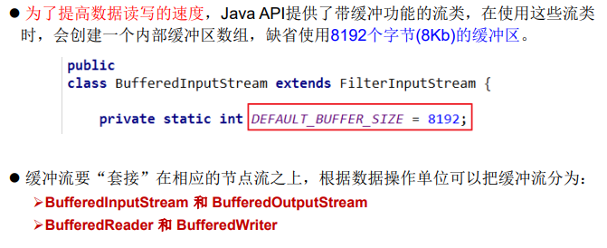

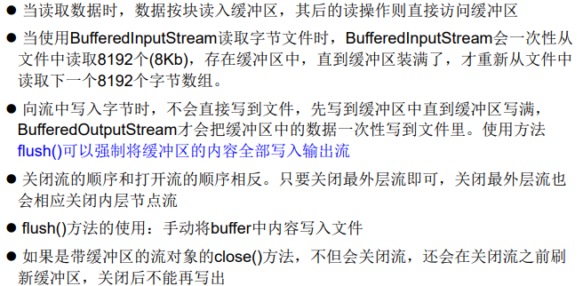

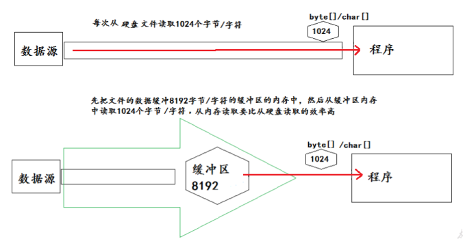

```java
package com.taiacloud.java2;

import org.junit.Test;

import java.io.*;

/**
 * 处理流之一：缓冲流的使用
 *  1.缓冲流：
 *      BufferedInputStream
 *      BufferedOutputStream
 *      BufferedReader
 *      BufferedWriter
 *
 *  2.作用：提高流的读取、写入的速度
 *    能够提高流的速度的原因：内部有一个缓冲区
 *
 *  3.处理流，就是“套接”在已有的流的基础上。
 * @author taia
 * @creat 2021-10-25-20:46
 */
public class BufferedTest {
    /**
     * 实现非文本文件的复制
     */
    @Test
    public void BufferedStreamTest(){
        BufferedInputStream bis = null;
        BufferedOutputStream bos = null;
        try {
            //1.造文件
            File srcFile = new File("WeChat_pic.jpg");
            File destFile = new File("WeChat_pic_copy2.jpg");
            //2.造流
            //2.1造节点流
            FileInputStream fis = new FileInputStream(srcFile);
            FileOutputStream fos = new FileOutputStream(srcFile);
            //2.2造缓冲流
            bis = new BufferedInputStream(fis);
            bos = new BufferedOutputStream(fos);
            //3.复制细节：读取、写入
            byte[] buffer = new byte[5];
            int len;
            while ((len = bis.read(buffer)) != -1){
                bos.write(buffer, 0, len);
            }
        } catch (IOException e) {
            e.printStackTrace();
        } finally {
            //4.关闭流
            //要求：先关闭外层流，再关闭内层流
            try {
                if (bos != null)
                    bos.close();
            } catch (IOException e) {
                e.printStackTrace();
            }
            try {
                if(bis != null)
                    bis.close();
            } catch (IOException e) {
                e.printStackTrace();
            }
            //说明：关闭外层流的同时，内层流也会自动关闭，关于内层流的关闭可省略
//        fos.close();
//        fis.close();
        }
    }

    //实现文件复制的方法
    public void copyFileWithBuffered(String srcPath, String destPath){
        BufferedInputStream bis = null;
        BufferedOutputStream bos = null;
        try {
            //1.造文件
            File srcFile = new File(srcPath);
            File destFile = new File(destPath);
            //2.造流
            //2.1造节点流
            FileInputStream fis = new FileInputStream(srcFile);
            FileOutputStream fos = new FileOutputStream(srcFile);
            //2.2造缓冲流
            bis = new BufferedInputStream(fis);
            bos = new BufferedOutputStream(fos);
            //3.复制细节：读取、写入
            byte[] buffer = new byte[5];//15ms
            int len;
            while ((len = bis.read(buffer)) != -1){
                bos.write(buffer, 0, len);
//                bos.flush();//刷新缓冲区
            }
        } catch (IOException e) {
            e.printStackTrace();
        } finally {
            //4.关闭流
            //要求：先关闭外层流，再关闭内层流
            try {
                if (bos != null)
                    bos.close();
            } catch (IOException e) {
                e.printStackTrace();
            }
            try {
                if(bis != null)
                    bis.close();
            } catch (IOException e) {
                e.printStackTrace();
            }
            //说明：关闭外层流的同时，内层流也会自动关闭，关于内层流的关闭可省略
//        fos.close();
//        fis.close();
        }
    }

    @Test
    public void testCopyFileWithBuffer(){
        long start = System.currentTimeMillis();

        String srcPath = "C:\\Users\\TAIA\\Desktop\\尚硅谷Java零基础入门教程（含百道Java真题，2万多行Java代码实战）\\652.650.尚硅谷_反射-获取运行时类的方法的内部结构(Av48144058,P652).mp4";
        String destPath = "C:\\Users\\TAIA\\Desktop\\2.mp4";

        copyFileWithBuffered(srcPath, destPath);

        long end = System.currentTimeMillis();

        System.out.println("复制操作花费的时间为：" + (end - start) + "ms");
    }

    /*
    使用BufferedReader和BufferedWriter实现文本文件的复制

     */
    @Test
    public void testBufferedReaderBufferedWriter(){
        BufferedReader br = null;
        BufferedWriter bw = null;
        try {
            //创建文件和相应的流
            br = new BufferedReader(new FileReader(new File("dbcp.txt")));
            bw = new BufferedWriter(new FileWriter(new File("dbcp1.txt")));

            //读写操作
            //方式一：使用char[]数组
//            char[] cbuf = new char[1024];
//            int len;
//            while((len = br.read(cbuf)) != -1){
//                bw.write(cbuf,0,len);
//    //            bw.flush();
//            }

            //方式二：使用String
            String data;
            while((data = br.readLine()) != null){//readLine:一次读一行
                //方法一：
//                bw.write(data + "\n");//data中不包含换行符
                //方法二：
                bw.write(data);//data中不包含换行符
                bw.newLine();//提供换行的操作

            }


        } catch (IOException e) {
            e.printStackTrace();
        } finally {
            //关闭资源
            if(bw != null){

                try {
                    bw.close();
                } catch (IOException e) {
                    e.printStackTrace();
                }
            }
            if(br != null){
                try {
                    br.close();
                } catch (IOException e) {
                    e.printStackTrace();
                }

            }
        }

    }

}

```

## （四）转换流

- 转换流提供了在字节流和字符流之间的转换

- Java API提供了两个转换流：

  ​	 InputStreamReader：将InputStream转换为Reader 

  ​	 OutputStreamWriter：将Writer转换为OutputStream

- 字节流中的数据都是字符时，转成字符流操作更高效。

- 很多时候我们使用转换流来处理文件乱码问题。实现编码和 解码的功能。

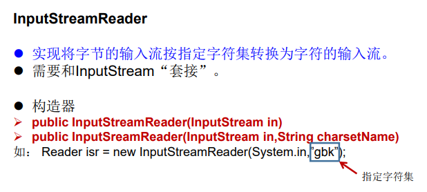

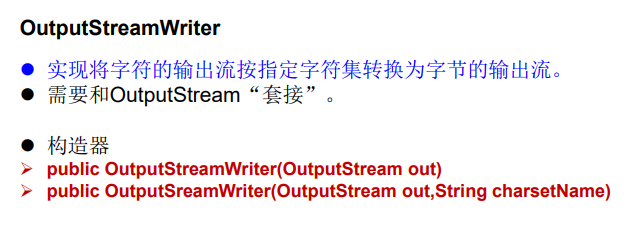

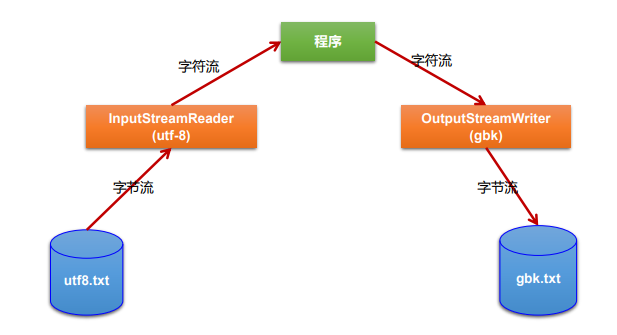

```java
package com.taiacloud.java2;

import org.junit.Test;

import java.io.*;

/**
 * 处理流之二：转换流的使用
 * 1.转换流：属于字符流
 *   InputStreamReader：将一个字节的输入流转换为字符的输入流
 *   OutputStreamWriter：将一个字符的输出流转换为字节的输出流
 *
 * 2.作用：提供字节流与字符流之间的转换
 *
 * 3. 解码：字节、字节数组  --->字符数组、字符串
 *    编码：字符数组、字符串 ---> 字节、字节数组
 *
 *
 * 4.字符集
 ASCII：美国标准信息交换码。
    用一个字节的7位可以表示。
 ISO8859-1：拉丁码表。欧洲码表
    用一个字节的8位表示。
 GB2312：中国的中文编码表。最多两个字节编码所有字符
 GBK：中国的中文编码表升级，融合了更多的中文文字符号。最多两个字节编码
 Unicode：国际标准码，融合了目前人类使用的所有字符。为每个字符分配唯一的字符码。所有的文字都用两个字节来表示。
 UTF-8：变长的编码方式，可用1-4个字节来表示一个字符。

 *
 *
 * @author taia
 * @create
 */
public class InputStreamReaderTest {

    /*
    此时处理异常的话，仍然应该使用try-catch-finally
    InputStreamReader的使用，实现字节的输入流到字符的输入流的转换
     */
    @Test
    public void test1() throws IOException {

        FileInputStream fis = new FileInputStream("dbcp.txt");
//        InputStreamReader isr = new InputStreamReader(fis);//使用系统默认的字符集
        //参数2指明了字符集，具体使用哪个字符集，取决于文件dbcp.txt保存时使用的字符集
        InputStreamReader isr = new InputStreamReader(fis,"UTF-8");//不加第二个参数使用系统默认的字符集

        char[] cbuf = new char[20];
        int len;
        while((len = isr.read(cbuf)) != -1){
            String str = new String(cbuf,0,len);
            System.out.print(str);
        }

        isr.close();

    }

    /*
    此时处理异常的话，仍然应该使用try-catch-finally

    综合使用InputStreamReader和OutputStreamWriter
     */
    @Test
    public void test2() throws Exception {
        //1.造文件、造流
        File file1 = new File("dbcp.txt");
        File file2 = new File("dbcp_gbk.txt");

        FileInputStream fis = new FileInputStream(file1);
        FileOutputStream fos = new FileOutputStream(file2);

        InputStreamReader isr = new InputStreamReader(fis,"utf-8");
        OutputStreamWriter osw = new OutputStreamWriter(fos,"gbk");

        //2.读写过程
        char[] cbuf = new char[20];
        int len;
        while((len = isr.read(cbuf)) != -1){
            osw.write(cbuf,0,len);
        }

        //3.关闭资源
        isr.close();
        osw.close();


    }


}

```

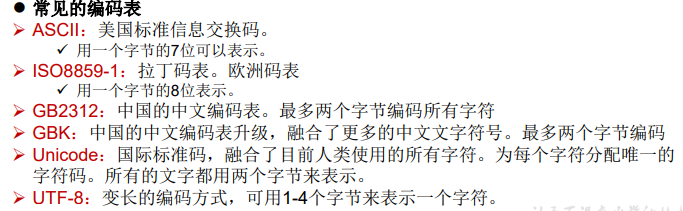

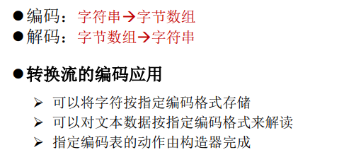

## （五）其他流

### 1.标准输入、输出流

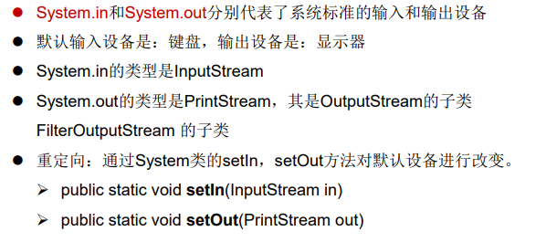

```java
/*
    1.标准的输入、输出流
    1.1
    System.in:标准的输入流，默认从键盘输入
    System.out:标准的输出流，默认从控制台输出
    1.2
    System类的setIn(InputStream is) / setOut(PrintStream ps)方式重新指定输入和输出的流。

    1.3练习：
    从键盘输入字符串，要求将读取到的整行字符串转成大写输出。然后继续进行输入操作，
    直至当输入“e”或者“exit”时，退出程序。

    方法一：使用Scanner实现，调用next()返回一个字符串
    方法二：使用System.in实现。System.in  --->  转换流 ---> BufferedReader的readLine()

     */
    public static void main(String[] args) {
        BufferedReader br = null;
        try {
            InputStreamReader isr = new InputStreamReader(System.in);
            br = new BufferedReader(isr);

            while (true) {
                System.out.println("请输入字符串：");
                String data = br.readLine();
                if ("e".equalsIgnoreCase(data) || "exit".equalsIgnoreCase(data)) {
                    System.out.println("程序结束");
                    break;
                }

                String upperCase = data.toUpperCase();
                System.out.println(upperCase);

            }
        } catch (IOException e) {
            e.printStackTrace();
        } finally {
            if (br != null) {
                try {
                    br.close();
                } catch (IOException e) {
                    e.printStackTrace();
                }

            }
        }
    }
```

### 2.打印流

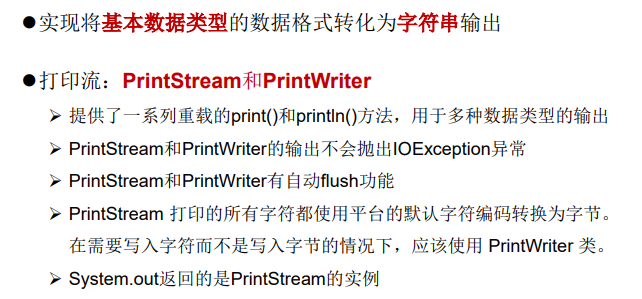

```java
/*
    2. 打印流：PrintStream 和PrintWriter

    2.1 提供了一系列重载的print() 和 println()
    2.2 练习：


     */

    @Test
    public void test2() {
        PrintStream ps = null;
        try {
            FileOutputStream fos = new FileOutputStream(new File("D:\\IO\\text.txt"));
            // 创建打印输出流,设置为自动刷新模式(写入换行符或字节 '\n' 时都会刷新输出缓冲区)
            ps = new PrintStream(fos, true);
            if (ps != null) {// 把标准输出流(控制台输出)改成文件
                System.setOut(ps);
            }


            for (int i = 0; i <= 255; i++) { // 输出ASCII字符
                System.out.print((char) i);
                if (i % 50 == 0) { // 每50个数据一行
                    System.out.println(); // 换行
                }
            }


        } catch (FileNotFoundException e) {
            e.printStackTrace();
        } finally {
            if (ps != null) {
                ps.close();
            }
        }

    }
```

### 3.数据流

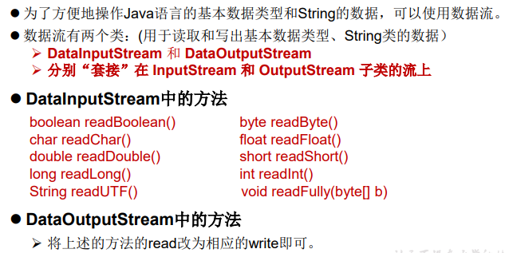

```java
/*
    3. 数据流
    3.1 DataInputStream 和 DataOutputStream
    3.2 作用：用于读取或写出基本数据类型的变量或字符串

    练习：将内存中的字符串、基本数据类型的变量写出到文件中。

    注意：处理异常的话，仍然应该使用try-catch-finally.
     */
    @Test
    public void test3() throws IOException {
        //1.
        DataOutputStream dos = new DataOutputStream(new FileOutputStream("data.txt"));
        //2.
        dos.writeUTF("王泰雅");
        dos.flush();//刷新操作，将内存中的数据写入文件
        dos.writeInt(23);
        dos.flush();
        dos.writeBoolean(true);
        dos.flush();
        //3.
        dos.close();


    }
    /*
    将文件中存储的基本数据类型变量和字符串读取到内存中，保存在变量中。

    注意点：读取不同类型的数据的顺序要与当初写入文件时，保存的数据的顺序一致！

     */
    @Test
    public void test4() throws IOException {
        //1.
        DataInputStream dis = new DataInputStream(new FileInputStream("data.txt"));
        //2.
        String name = dis.readUTF();
        int age = dis.readInt();
        boolean isMale = dis.readBoolean();

        System.out.println("name = " + name);
        System.out.println("age = " + age);
        System.out.println("isMale = " + isMale);

        //3.
        dis.close();

    }
```

## （六）对象流

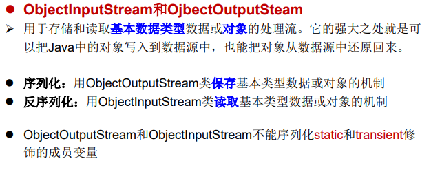

### 1.对象的序列化

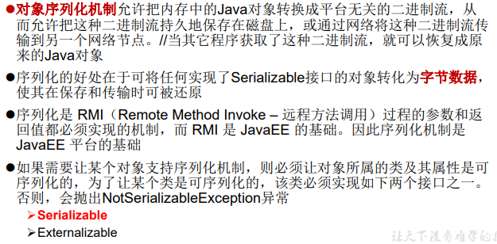

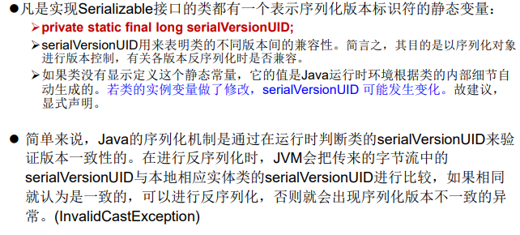

### 2.使用对象流序列化对象

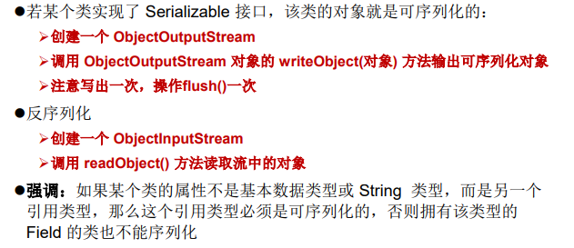

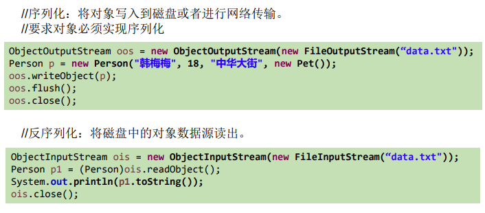

```java
package com.taiacloud.java3;

import org.junit.Test;

import java.io.*;

/**
 * 对象流的使用
 * 1.ObjectInputStream 和 ObjectOutputStream
 * 2.作用：用于存储和读取基本数据类型数据或对象的处理流。它的强大之处就是可以把Java中的对象写入到数据源中，也能把对象从数据源中还原回来。
 *
 * 3.要想让一个java对象是可序列化的，需要满足相应的要求。见Person.java
 *
 * 4.序列化机制：对象序列化机制允许把内存中的Java对象转换成平台无关的二进制流，
 * 从而允许把这种二进制流持久地保存在磁盘上，或通过网络将这种二进制流传输到另一个网络节点。
 * 当其它程序获取了这种二进制流，就可以恢复成原来的Java对象
 *
 * @author taia
 * @creat 2021-10-26-18:44
 */
public class ObjectInputOutputStreamTest {
    /**
     * 序列化过程：将内存中的java对象保存到磁盘中或通过网络传输出去
     * 使用ObjectOutPutStream实现
     */
    @Test
    public void testObjectOutputStream(){
        ObjectOutputStream oos = null;
        try {
            //1.
            oos = new ObjectOutputStream(new FileOutputStream("object.dat"));
            //2.
            oos.writeObject(new String("我爱北京天安门"));
            oos.flush();//刷新操作

            oos.writeObject(new Person("王泰雅",23));
            oos.flush();

            oos.writeObject(new Person("王泰雅2",25,new Account(5000)));
            oos.flush();

        } catch (IOException e) {
            e.printStackTrace();
        } finally {

            //3.
            if(oos != null)
                try {
                    oos.close();
                } catch (IOException e) {
                    e.printStackTrace();
                }
        }

    }

    /**
     * 反序列化过程：将磁盘文件中的对象还原为内存中的一个java对象
     * 使用ObjectInputStream来实现
     */
    @Test
    public void testObjectInputStream(){
        ObjectInputStream ois = null;
        try {
            ois = new ObjectInputStream(new FileInputStream("object.dat"));

            Object obj = ois.readObject();
            String str = (String) obj;

            Person p = (Person) ois.readObject();
            Person p1 = (Person) ois.readObject();


            System.out.println(str);
            System.out.println(p);
            System.out.println(p1);
        } catch (IOException e) {
            e.printStackTrace();
        } catch (ClassNotFoundException e) {
            e.printStackTrace();
        } finally {
            if(ois != null)
                try {
                    ois.close();
                } catch (IOException e) {
                    e.printStackTrace();
                }
        }


    }


}

```

## （七）随机存取文件流-RandomAccessFile 类

我们可以用RandomAccessFile这个类，来实现一个多线程断点下载的功能， 用过下载工具的朋友们都知道，下载前都会建立两个临时文件，一个是与 被下载文件大小相同的空文件，另一个是记录文件指针的位置文件，每次 暂停的时候，都会保存上一次的指针，然后断点下载的时候，会继续从上 一次的地方下载，从而实现断点下载或上传的功能，有兴趣的朋友们可以 自己实现下。

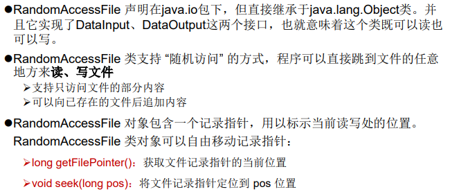

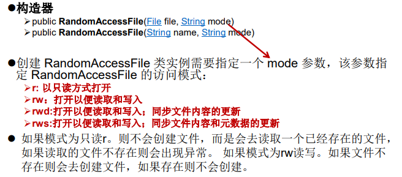

### 1.读取文件内容

```java
RandomAccessFile raf = new RandomAccessFile(“test.txt”, “rw”）;
raf.seek(5);
byte [] b = new byte[1024];
int off = 0;
int len = 5;
raf.read(b, off, len);
String str = new String(b, 0, len);
System.out.println(str);
raf.close();
```

### 2.写入文件内容

```java
RandomAccessFile raf = new RandomAccessFile("test.txt", "rw");
raf.seek(5);
//先读出来
String temp = raf.readLine();
raf.seek(5);
raf.write("xyz".getBytes());
raf.write(temp.getBytes());
raf.close();
```

### 3.小结

```java
package com.taiacloud.java3;

import org.junit.Test;

import java.io.File;
import java.io.IOException;
import java.io.RandomAccessFile;

/**
 * RandomAccessFile的使用
 * 1.RandomAccessFile直接继承于java.lang.Object类，实现了DataInput和DataOutput接口
 * 2.RandomAccessFile既可以作为一个输入流，又可以作为一个输出流
 *
 * 3.如果RandomAccessFile作为输出流时，写出到的文件如果不存在，则在执行过程中自动创建。
 *   如果写出到的文件存在，则会对原有文件内容进行覆盖。（默认情况下，从头覆盖）
 *
 * 4. 可以通过相关的操作，实现RandomAccessFile“插入”数据的效果
 *
 * @author shkstart
 * @create 2019 上午 11:18
 */
public class RandomAccessFileTest {

    @Test
    public void test1() {

        RandomAccessFile raf1 = null;
        RandomAccessFile raf2 = null;
        try {
            //1.
            raf1 = new RandomAccessFile(new File("WeChat_pic_copy.jpg"),"r");//r只能读入
            raf2 = new RandomAccessFile(new File("WeChat_pic_copy5.jpg.jpg"),"rw");//rw可以读入、输出
            //2.
            byte[] buffer = new byte[1024];
            int len;
            while((len = raf1.read(buffer)) != -1){
                raf2.write(buffer,0,len);
            }
        } catch (IOException e) {
            e.printStackTrace();
        } finally {
            //3.
            if(raf1 != null){
                try {
                    raf1.close();
                } catch (IOException e) {
                    e.printStackTrace();
                }

            }
            if(raf2 != null){
                try {
                    raf2.close();
                } catch (IOException e) {
                    e.printStackTrace();
                }

            }
        }
    }

    @Test
    public void test2() throws IOException {

        RandomAccessFile raf1 = new RandomAccessFile("hello.txt","rw");

        raf1.seek(3);//将指针调到角标为3的位置
        raf1.write("xyz".getBytes());//覆盖，默认为0

        raf1.close();

    }
    /*
    使用RandomAccessFile实现数据的插入效果
     */
    @Test
    public void test3() throws IOException {

        RandomAccessFile raf1 = new RandomAccessFile("hello.txt","rw");

        raf1.seek(3);//将指针调到角标为3的位置

        //保存指针3后面的所有数据到StringBuilder中
        StringBuilder builder = new StringBuilder((int) new File("hello.txt").length());
        byte[] buffer = new byte[20];
        int len;
        while((len = raf1.read(buffer)) != -1){
            builder.append(new String(buffer,0,len)) ;
        }

        //调回指针，写入“xyz”
        raf1.seek(3);
        raf1.write("xyz".getBytes());

        //将StringBuilder中的数据写入到文件中
        raf1.write(builder.toString().getBytes());

        raf1.close();

        //思考：将StringBuilder替换为ByteArrayOutputStream
    }
}

```

## （八）NIO.2中Path、 Paths、Files类的使用

### 1.Java NIO 概述

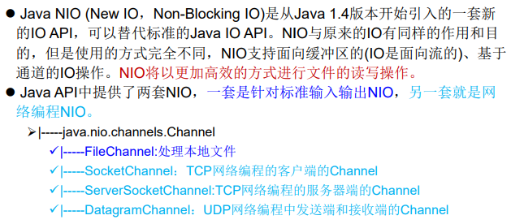

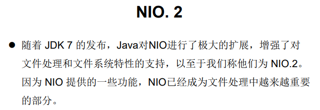

### 2.Path、Paths和Files核心API

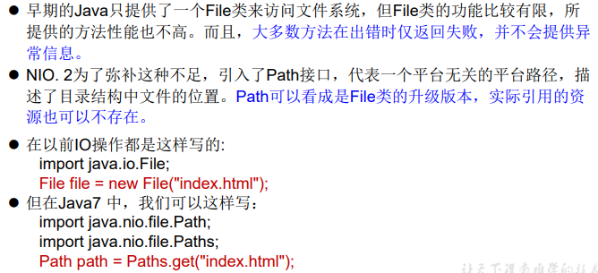

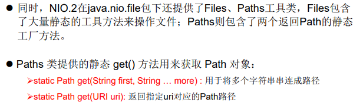

#### 2.1Path接口

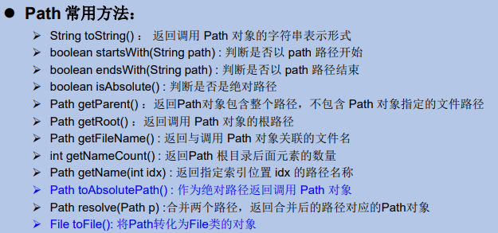

```java
package com.taiacloud.java3;

import org.junit.Test;

import java.io.File;
import java.nio.file.Path;
import java.nio.file.Paths;

/**
 * 1. jdk 7.0 时，引入了 Path、Paths、Files三个类。
 * 2.此三个类声明在：java.nio.file包下。
 * 3.Path可以看做是java.io.File类的升级版本。也可以表示文件或文件目录，与平台无关
 * <p>
 * 4.如何实例化Path:使用Paths.
 * static Path get(String first, String … more) : 用于将多个字符串串连成路径
 * static Path get(URI uri): 返回指定uri对应的Path路径
 *
 * @author shkstart
 * @create 2019 下午 2:44
 */
public class PathTest {

    //如何使用Paths实例化Path
    @Test
    public void test1() {
        Path path1 = Paths.get("d:\\nio\\hello.txt");//new File(String filepath)

        Path path2 = Paths.get("d:\\", "nio\\hello.txt");//new File(String parent,String filename);

        System.out.println(path1);
        System.out.println(path2);

        Path path3 = Paths.get("d:\\", "nio");
        System.out.println(path3);
    }

    //Path中的常用方法
    @Test
    public void test2() {
        Path path1 = Paths.get("d:\\", "nio\\nio1\\nio2\\hello.txt");
        Path path2 = Paths.get("hello.txt");

//		String toString() ： 返回调用 Path 对象的字符串表示形式
        System.out.println(path1);

//		boolean startsWith(String path) : 判断是否以 path 路径开始
        System.out.println(path1.startsWith("d:\\nio"));
//		boolean endsWith(String path) : 判断是否以 path 路径结束
        System.out.println(path1.endsWith("hello.txt"));
//		boolean isAbsolute() : 判断是否是绝对路径
        System.out.println(path1.isAbsolute() + "~");
        System.out.println(path2.isAbsolute() + "~");
//		Path getParent() ：返回Path对象包含整个路径，不包含 Path 对象指定的文件路径
        System.out.println(path1.getParent());
        System.out.println(path2.getParent());
//		Path getRoot() ：返回调用 Path 对象的根路径
        System.out.println(path1.getRoot());
        System.out.println(path2.getRoot());
//		Path getFileName() : 返回与调用 Path 对象关联的文件名
        System.out.println(path1.getFileName() + "~");
        System.out.println(path2.getFileName() + "~");
//		int getNameCount() : 返回Path 根目录后面元素的数量
//		Path getName(int idx) : 返回指定索引位置 idx 的路径名称
        for (int i = 0; i < path1.getNameCount(); i++) {
            System.out.println(path1.getName(i) + "*****");
        }

//		Path toAbsolutePath() : 作为绝对路径返回调用 Path 对象
        System.out.println(path1.toAbsolutePath());
        System.out.println(path2.toAbsolutePath());
//		Path resolve(Path p) :合并两个路径，返回合并后的路径对应的Path对象
        Path path3 = Paths.get("d:\\", "nio");
        Path path4 = Paths.get("nioo\\hi.txt");
        path3 = path3.resolve(path4);
        System.out.println(path3);

//		File toFile(): 将Path转化为File类的对象
        File file = path1.toFile();//Path--->File的转换

        Path newPath = file.toPath();//File--->Path的转换

    }


}

```


#### 2.2Files 类

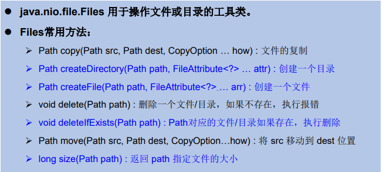

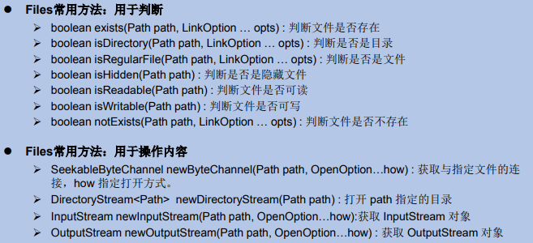

```java
package com.taiacloud.java3;

import org.junit.Test;

import java.io.IOException;
import java.io.InputStream;
import java.io.OutputStream;
import java.nio.channels.SeekableByteChannel;
import java.nio.file.*;
import java.util.Iterator;

/**
 * Files工具类的使用：操作文件或目录的工具类
 * @author shkstart
 * @create 2019 下午 2:44
 */
public class FilesTest {

	@Test
	public void test1() throws IOException{
		Path path1 = Paths.get("d:\\nio", "hello.txt");
		Path path2 = Paths.get("atguigu.txt");
		
//		Path copy(Path src, Path dest, CopyOption … how) : 文件的复制
		//要想复制成功，要求path1对应的物理上的文件存在。path1对应的文件没有要求。
//		Files.copy(path1, path2, StandardCopyOption.REPLACE_EXISTING);
		
//		Path createDirectory(Path path, FileAttribute<?> … attr) : 创建一个目录
		//要想执行成功，要求path对应的物理上的文件目录不存在。一旦存在，抛出异常。
		Path path3 = Paths.get("d:\\nio\\nio1");
//		Files.createDirectory(path3);
		
//		Path createFile(Path path, FileAttribute<?> … arr) : 创建一个文件
		//要想执行成功，要求path对应的物理上的文件不存在。一旦存在，抛出异常。
		Path path4 = Paths.get("d:\\nio\\hi.txt");
//		Files.createFile(path4);
		
//		void delete(Path path) : 删除一个文件/目录，如果不存在，执行报错
//		Files.delete(path4);
		
//		void deleteIfExists(Path path) : Path对应的文件/目录如果存在，执行删除.如果不存在，正常执行结束
		Files.deleteIfExists(path3);
		
//		Path move(Path src, Path dest, CopyOption…how) : 将 src 移动到 dest 位置
		//要想执行成功，src对应的物理上的文件需要存在，dest对应的文件没有要求。
//		Files.move(path1, path2, StandardCopyOption.ATOMIC_MOVE);
		
//		long size(Path path) : 返回 path 指定文件的大小
		long size = Files.size(path2);
		System.out.println(size);

	}

	@Test
	public void test2() throws IOException{
		Path path1 = Paths.get("d:\\nio", "hello.txt");
		Path path2 = Paths.get("atguigu.txt");
//		boolean exists(Path path, LinkOption … opts) : 判断文件是否存在
		System.out.println(Files.exists(path2, LinkOption.NOFOLLOW_LINKS));

//		boolean isDirectory(Path path, LinkOption … opts) : 判断是否是目录
		//不要求此path对应的物理文件存在。
		System.out.println(Files.isDirectory(path1, LinkOption.NOFOLLOW_LINKS));

//		boolean isRegularFile(Path path, LinkOption … opts) : 判断是否是文件

//		boolean isHidden(Path path) : 判断是否是隐藏文件
		//要求此path对应的物理上的文件需要存在。才可判断是否隐藏。否则，抛异常。
//		System.out.println(Files.isHidden(path1));

//		boolean isReadable(Path path) : 判断文件是否可读
		System.out.println(Files.isReadable(path1));
//		boolean isWritable(Path path) : 判断文件是否可写
		System.out.println(Files.isWritable(path1));
//		boolean notExists(Path path, LinkOption … opts) : 判断文件是否不存在
		System.out.println(Files.notExists(path1, LinkOption.NOFOLLOW_LINKS));
	}

	/**
	 * StandardOpenOption.READ:表示对应的Channel是可读的。
	 * StandardOpenOption.WRITE：表示对应的Channel是可写的。
	 * StandardOpenOption.CREATE：如果要写出的文件不存在，则创建。如果存在，忽略
	 * StandardOpenOption.CREATE_NEW：如果要写出的文件不存在，则创建。如果存在，抛异常
	 *
	 * @author shkstart 邮箱：shkstart@126.com
	 * @throws IOException
	 */
	@Test
	public void test3() throws IOException{
		Path path1 = Paths.get("d:\\nio", "hello.txt");

//		InputStream newInputStream(Path path, OpenOption…how):获取 InputStream 对象
		InputStream inputStream = Files.newInputStream(path1, StandardOpenOption.READ);

//		OutputStream newOutputStream(Path path, OpenOption…how) : 获取 OutputStream 对象
		OutputStream outputStream = Files.newOutputStream(path1, StandardOpenOption.WRITE,StandardOpenOption.CREATE);


//		SeekableByteChannel newByteChannel(Path path, OpenOption…how) : 获取与指定文件的连接，how 指定打开方式。
		SeekableByteChannel channel = Files.newByteChannel(path1, StandardOpenOption.READ,StandardOpenOption.WRITE,StandardOpenOption.CREATE);

//		DirectoryStream<Path>  newDirectoryStream(Path path) : 打开 path 指定的目录
		Path path2 = Paths.get("e:\\teach");
		DirectoryStream<Path> directoryStream = Files.newDirectoryStream(path2);
		Iterator<Path> iterator = directoryStream.iterator();
		while(iterator.hasNext()){
			System.out.println(iterator.next());
		}


	}
}

```

# 七、网络编程

## （一）网络编程概述

- Java是 Internet 上的语言，它从语言级上提供了对网络应用程 序的支持，程序员能够很容易开发常见的网络应用程序。 
- Java提供的网络类库，可以实现无痛的网络连接，联网的底层 细节被隐藏在 Java 的本机安装系统里，由 JVM 进行控制。并 且 Java 实现了一个跨平台的网络库，程序员面对的是一个统一 的网络编程环境。

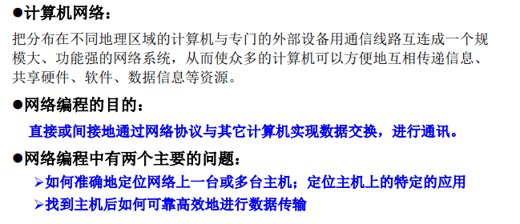

## （二）网络通信要素

### 1.概述

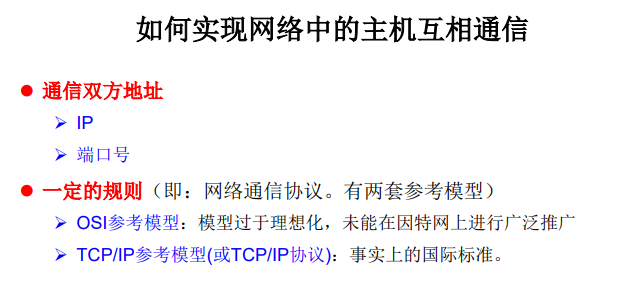

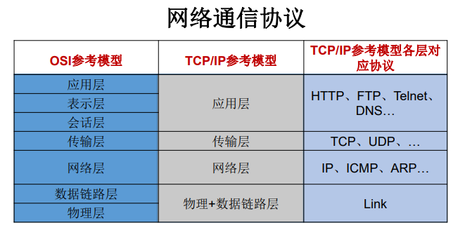

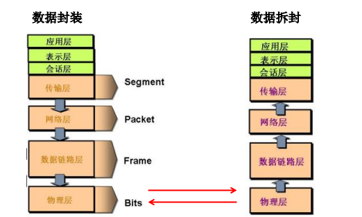

### 2.通信要素1： IP和端口号

#### 2.1IP 地址

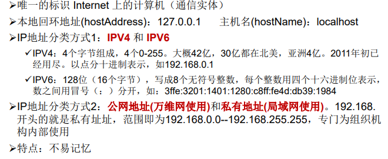

#### 2.2端口号

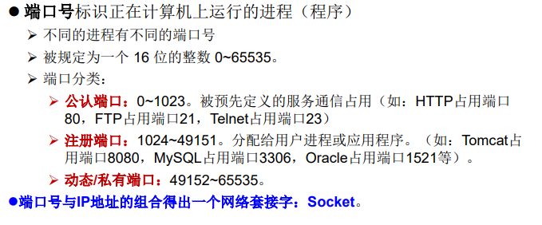

#### 2.3InetAddress类


```java
package com.taiacloud.java;

import java.net.InetAddress;
import java.net.UnknownHostException;

/**
 * 一、网络编程中有两个主要的问题：
 * 1.如何准确地定位网络上一台或多台主机；定位主机上的特定的应用
 * 2.找到主机后如何可靠高效地进行数据传输
 *
 * 二、网络编程中的两个要素：
 * 1.对应问题一：IP和端口号
 * 2.对应问题二：提供网络通信协议：TCP/IP参考模型（应用层、传输层、网络层、物理+数据链路层）
 *
 *
 * 三、通信要素一：IP和端口号
 *
 * 1. IP:唯一的标识 Internet 上的计算机（通信实体）
 * 2. 在Java中使用InetAddress类代表IP
 * 3. IP分类：IPv4 和 IPv6 ; 万维网 和 局域网
 * 4. 域名:   www.baidu.com   www.mi.com  www.sina.com  www.jd.com
 *            www.vip.com
 * 5. 本地回路地址：127.0.0.1 对应着：localhost
 *
 * 6. 如何实例化InetAddress:两个方法：getByName(String host) 、 getLocalHost()
 *        两个常用方法：getHostName() / getHostAddress()
 *
 * 7. 端口号：正在计算机上运行的进程。
 * 要求：不同的进程有不同的端口号
 * 范围：被规定为一个 16 位的整数 0~65535。
 *
 * 8. 端口号与IP地址的组合得出一个网络套接字：Socket
 * @author taia
 * @create 2021 下午 19:21
 */
public class InetAddressTest {

    public static void main(String[] args) {

        try {
            //File file = new File("hello.txt");
            InetAddress inet1 = InetAddress.getByName("192.168.10.14");

            System.out.println(inet1);

            InetAddress inet2 = InetAddress.getByName("www.atguigu.com");
            System.out.println(inet2);

            InetAddress inet3 = InetAddress.getByName("127.0.0.1");
            System.out.println(inet3);

            //获取本地ip
            InetAddress inet4 = InetAddress.getLocalHost();
            System.out.println(inet4);

            //getHostName()
            System.out.println(inet2.getHostName());
            //getHostAddress()
            System.out.println(inet2.getHostAddress());

        } catch (UnknownHostException e) {
            e.printStackTrace();
        }


    }


}

```

### 3.通信要素2：网络协议

#### 3.1概述


#### 3.2TCP三次握手四次挥手


#### 3.3Socket


## （三）TCP网络编程


### 1.客户端Socket

#### 1.1客户端Socket的工作过程


#### 1.2客户端创建Socket对象


### 2.服务器ServerSocket

#### 2.1服务器程序的工作过程


#### 2.2服务器建立 ServerSocket 对象


### 3.例题

3.1客户端发送内容给服务端，服务端将内容打印到控制台上。

```java
package com.taiacloud.java;

import org.junit.Test;

import java.io.ByteArrayOutputStream;
import java.io.IOException;
import java.io.InputStream;
import java.io.OutputStream;
import java.net.InetAddress;
import java.net.ServerSocket;
import java.net.Socket;

/**
 * 实现TCP的网络编程
 * 例子1：客户端发送信息给服务端，服务端将数据显示在控制台上
 *
 * @author taia
 * @create 2021 下午 19:21
 */
public class TCPTest1 {

    //客户端
    @Test
    public void client()  {
        Socket socket = null;
        OutputStream os = null;
        try {
            //1.创建Socket对象，指明服务器端的ip和端口号
            InetAddress inet = InetAddress.getByName("127.0.0.1");
            socket = new Socket(inet,8899);
            //2.获取一个输出流，用于输出数据
            os = socket.getOutputStream();
            //3.写出数据的操作
            os.write("你好，我是客户端mm".getBytes());
        } catch (IOException e) {
            e.printStackTrace();
        } finally {
            //4.资源的关闭
            if(os != null){
                try {
                    os.close();
                } catch (IOException e) {
                    e.printStackTrace();
                }

            }
            if(socket != null){
                try {
                    socket.close();
                } catch (IOException e) {
                    e.printStackTrace();
                }

            }
        }


    }
    //服务端
    @Test
    public void server()  {

        ServerSocket ss = null;
        Socket socket = null;
        InputStream is = null;
        ByteArrayOutputStream baos = null;
        try {
            //1.创建服务器端的ServerSocket，指明自己的端口号
            ss = new ServerSocket(8899);
            //2.调用accept()表示接收来自于客户端的socket
            socket = ss.accept();
            //3.获取输入流
            is = socket.getInputStream();

            //不建议这样写，可能会有乱码
//        byte[] buffer = new byte[1024];
//        int len;
//        while((len = is.read(buffer)) != -1){
//            String str = new String(buffer,0,len);
//            System.out.print(str);
//        }
            //4.读取输入流中的数据
            baos = new ByteArrayOutputStream();
            byte[] buffer = new byte[5];
            int len;
            while((len = is.read(buffer)) != -1){
                baos.write(buffer,0,len);
            }

            System.out.println(baos.toString());

            System.out.println("收到了来自于：" + socket.getInetAddress().getHostAddress() + "的数据");

        } catch (IOException e) {
            e.printStackTrace();
        } finally {
            if(baos != null){
                //5.关闭资源
                try {
                    baos.close();
                } catch (IOException e) {
                    e.printStackTrace();
                }
            }
            if(is != null){
                try {
                    is.close();
                } catch (IOException e) {
                    e.printStackTrace();
                }
            }
            if(socket != null){
                try {
                    socket.close();
                } catch (IOException e) {
                    e.printStackTrace();
                }
            }
            if(ss != null){
                try {
                    ss.close();
                } catch (IOException e) {
                    e.printStackTrace();
                }
            }

        }

    }

}

```

3.2客户端发送文件给服务端，服务端将文件保存在本地。

```java
package com.taiacloud.java;

import org.junit.Test;

import java.io.*;
import java.net.InetAddress;
import java.net.ServerSocket;
import java.net.Socket;

/**
 *
 * 实现TCP的网络编程
 * 例题2：客户端发送文件给服务端，服务端将文件保存在本地。
 *
 * @author taia
 * @create 2021 下午 19:21
 */
public class TCPTest2 {

    /*
    这里涉及到的异常，应该使用try-catch-finally处理
     */
    @Test
    public void client() throws IOException {
        //1.
        Socket socket = new Socket(InetAddress.getByName("127.0.0.1"),9090);
        //2.
        OutputStream os = socket.getOutputStream();
        //3.
        FileInputStream fis = new FileInputStream(new File("beauty.jpg"));
        //4.
        byte[] buffer = new byte[1024];
        int len;
        while((len = fis.read(buffer)) != -1){
            os.write(buffer,0,len);
        }
        //5.
        fis.close();
        os.close();
        socket.close();
    }

    /*
    这里涉及到的异常，应该使用try-catch-finally处理
     */
    @Test
    public void server() throws IOException {
        //1.
        ServerSocket ss = new ServerSocket(9090);
        //2.
        Socket socket = ss.accept();
        //3.
        InputStream is = socket.getInputStream();
        //4.
        FileOutputStream fos = new FileOutputStream(new File("beauty1.jpg"));
        //5.
        byte[] buffer = new byte[1024];
        int len;
        while((len = is.read(buffer)) != -1){
            fos.write(buffer,0,len);
        }
        //6.
        fos.close();
        is.close();
        socket.close();
        ss.close();

    }
}

```

3.3从客户端发送文件给服务端

```java
package com.taiacloud.java;

import org.junit.Test;

import java.io.*;
import java.net.InetAddress;
import java.net.ServerSocket;
import java.net.Socket;

/**
 * 实现TCP的网络编程
 * 例题3：从客户端发送文件给服务端，服务端保存到本地。并返回“发送成功”给客户端。
 * 并关闭相应的连接。
 * @author shkstart
 * @create 2019 下午 4:13
 */
public class TCPTest3 {

    /*
        这里涉及到的异常，应该使用try-catch-finally处理
         */
    @Test
    public void client() throws IOException {
        //1.
        Socket socket = new Socket(InetAddress.getByName("127.0.0.1"),9090);
        //2.
        OutputStream os = socket.getOutputStream();
        //3.
        FileInputStream fis = new FileInputStream(new File("beauty.jpg"));
        //4.
        byte[] buffer = new byte[1024];
        int len;
        while((len = fis.read(buffer)) != -1){
            os.write(buffer,0,len);
        }
        //关闭数据的输出
        socket.shutdownOutput();

        //5.接收来自于服务器端的数据，并显示到控制台上
        InputStream is = socket.getInputStream();
        ByteArrayOutputStream baos = new ByteArrayOutputStream();
        byte[] bufferr = new byte[20];
        int len1;
        while((len1 = is.read(buffer)) != -1){
            baos.write(buffer,0,len1);
        }

        System.out.println(baos.toString());

        //6.
        fis.close();
        os.close();
        socket.close();
        baos.close();
    }

    /*
    这里涉及到的异常，应该使用try-catch-finally处理
     */
    @Test
    public void server() throws IOException {
        //1.
        ServerSocket ss = new ServerSocket(9090);
        //2.
        Socket socket = ss.accept();
        //3.
        InputStream is = socket.getInputStream();
        //4.
        FileOutputStream fos = new FileOutputStream(new File("beauty2.jpg"));
        //5.
        byte[] buffer = new byte[1024];
        int len;
        while((len = is.read(buffer)) != -1){
            fos.write(buffer,0,len);
        }

        System.out.println("图片传输完成");

        //6.服务器端给予客户端反馈
        OutputStream os = socket.getOutputStream();
        os.write("你好，美女，照片我已收到，非常漂亮！".getBytes());

        //7.
        fos.close();
        is.close();
        socket.close();
        ss.close();
        os.close();

    }
}

```

## （四）UDP网络编程

### 1.UDP网络通信概述

- 类 DatagramSocket 和 DatagramPacket 实现了基于 UDP 协议网络程序。 
- UDP数据报通过数据报套接字 DatagramSocket 发送和接收，系统不保证 UDP数据报一定能够安全送到目的地，也不能确定什么时候可以抵达。 
- DatagramPacket 对象封装了UDP数据报，在数据报中包含了发送端的IP 地址和端口号以及接收端的IP地址和端口号。 
- UDP协议中每个数据报都给出了完整的地址信息，因此无须建立发送方和 接收方的连接。如同发快递包裹一样。

### 2.DatagramSocket 类的常用方法


### 3.UDP网络通信流程


### 4.发送端

```java
//发送端
    @Test
    public void sender() throws IOException {

        DatagramSocket socket = new DatagramSocket();
        String str = "我是UDP方式发送的导弹";
        byte[] data = str.getBytes();
        InetAddress inet = InetAddress.getLocalHost();
        DatagramPacket packet = new DatagramPacket(data,0,data.length,inet,9090);

        socket.send(packet);

        socket.close();

    }
```


### 5.接收端

```java
 //接收端
    @Test
    public void receiver() throws IOException {

        DatagramSocket socket = new DatagramSocket(9090);

        byte[] buffer = new byte[100];
        DatagramPacket packet = new DatagramPacket(buffer,0,buffer.length);

        socket.receive(packet);

        System.out.println(new String(packet.getData(),0,packet.getLength()));

        socket.close();
    }
```

## （五）URL编程

### 1.URL类

#### 1.1概述


#### 1.2构造器


#### 1.3常用方法

```java
package com.taiacloud.java;

import java.net.MalformedURLException;
import java.net.URL;

/**
 * URL网络编程
 * 1.URL:统一资源定位符，对应着互联网的某一资源地址
 * 2.格式：
 *  http://localhost:8080/examples/beauty.jpg?username=Tom
 *  协议   主机名    端口号  资源地址           参数列表
 *
 * @author taia
 * @create 2021 下午 4:47
 */
public class URLTest {

    public static void main(String[] args) {

        try {

            URL url = new URL("http://localhost:8080/examples/beauty.jpg?username=Tom");

//            public String getProtocol(  )     获取该URL的协议名
            System.out.println(url.getProtocol());
//            public String getHost(  )           获取该URL的主机名
            System.out.println(url.getHost());
//            public String getPort(  )            获取该URL的端口号
            System.out.println(url.getPort());
//            public String getPath(  )           获取该URL的文件路径
            System.out.println(url.getPath());
//            public String getFile(  )             获取该URL的文件名
            System.out.println(url.getFile());
//            public String getQuery(   )        获取该URL的查询名
            System.out.println(url.getQuery());
        } catch (MalformedURLException e) {
            e.printStackTrace();
        }
    }
}

```

### 2.URLConnection类


```java
package com.taiacloud.java;

import java.io.FileOutputStream;
import java.io.IOException;
import java.io.InputStream;
import java.net.HttpURLConnection;
import java.net.URL;

/**
 * @author taia
 * @create 2021 下午 4:54
 */
public class URLTest1 {

    public static void main(String[] args) {

        HttpURLConnection urlConnection = null;
        InputStream is = null;
        FileOutputStream fos = null;
        try {
            URL url = new URL("https://www.bilibili.com/video/BV1Kb411W75N?p=630&spm_id_from=pageDriver");

            urlConnection = (HttpURLConnection) url.openConnection();

            urlConnection.connect();

            is = urlConnection.getInputStream();
            fos = new FileOutputStream("day10\\beauty3.mp4");

            byte[] buffer = new byte[1024];
            int len;
            while((len = is.read(buffer)) != -1){
                fos.write(buffer,0,len);
            }

            System.out.println("下载完成");
        } catch (IOException e) {
            e.printStackTrace();
        } finally {
            //关闭资源
            if(is != null){
                try {
                    is.close();
                } catch (IOException e) {
                    e.printStackTrace();
                }
            }
            if(fos != null){
                try {
                    fos.close();
                } catch (IOException e) {
                    e.printStackTrace();
                }
            }
            if(urlConnection != null){
                urlConnection.disconnect();
            }
        }
    }
}

```

# 八、反射

