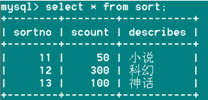
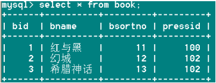
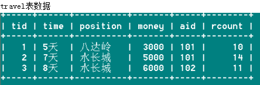

# MySQL数据库章节练习

讲师：宋红康

微博：尚硅谷-宋红康

***


## 第1节 选择与过滤

```mysql
【题目】
# 1.查询员工12个月的工资总和，并起别名为ANNUAL SALARY

# 2.查询employees表中去除重复的job_id以后的数据

# 3.查询工资大于12000的员工姓名和工资

# 4.查询员工号为176的员工的姓名和部门号

# 5.选择工资不在5000到12000的员工的姓名和工资

# 6.选择在20或50号部门工作的员工姓名和部门号

# 7.选择公司中没有管理者的员工姓名及job_id

# 8.选择公司中有奖金的员工姓名，工资和奖金级别

# 9.选择员工姓名的第三个字母是a的员工姓名

# 10.选择姓名中有字母a和e的员工姓名
```

### 1.查询员工12个月的工资总和，并起别名为ANNUAL SALARY

```mysql
SELECT employee_id , last_name,
salary * 12  "ANNUAL  SALARY"
FROM employees;
```

### 2.查询employees表中去除重复的job_id以后的数据

```mysql
SELECT DISTINCT job_id
FROM employees;
```

### 3.查询工资大于12000的员工姓名和工资
```sql
SELECT last_name, salary
FROM employees
WHERE salary > 12000;
```

### 4.查询员工号为176的员工的姓名和部门号
```sql
SELECT last_name, department_id
FROM employees
WHERE employee_id = 176;
```

### 5.选择工资不在5000到12000的员工的姓名和工资
```sql
SELECT last_name, salary
FROM employees
WHERE salary < 5000 OR salary > 12000;
```

```sql
SELECT last_name, salary
FROM employees
WHERE salary NOT BETWEEN 5000 AND 12000;
```

### 6.选择在20或50号部门工作的员工姓名和部门号

```sql
SELECT last_name, department_id
FROM employees
WHERE department_id = 20 OR department_id = 50;
```

```sql
SELECT last_name, department_id
FROM employees
WHERE department_id IN(20, 50);
```

### 7.选择公司中没有管理者的员工姓名及job_id
```sql
SELECT last_name, job_id
FROM employees
WHERE manager_id IS NULL;
```

### 8.选择公司中有奖金的员工姓名，工资和奖金级别

```sql
SELECT last_name, salary, commission_pct
FROM employees
WHERE commission_pct IS NOT NULL;
```


### 9.选员工姓名的第三个字母是a的员工姓名
```sql
SELECT last_name
FROM employees
WHERE last_name LIKE '__a%';
```

### 10.选择姓名中有字母a和e的员工姓名
```sql
SELECT last_name
FROM employees
WHERE last_name LIKE '%a%e%' OR last_name LIKE '%e%a%';
```

## 第2节 多表查询-1

```mysql
【题目】
# 1.显示所有员工的姓名，部门号和部门名称。

# 2.查询90号部门员工的job_id和90号部门的location_id

# 3.选择所有有奖金的员工的 last_name , department_name , location_id , city

# 4.选择city在Toronto工作的员工的 last_name , job_id , department_id , department_name 

# 5.选择指定员工的姓名，员工号，以及他的管理者的姓名和员工号，结果类似于下面的格式
employees	Emp#	manager	Mgr#
kochhar		101	king	100
```

### 1.显示所有员工的姓名，部门号和部门名称。
```sql
SELECT last_name, e.department_id, department_name
FROM employees e
LEFT OUTER JOIN departments d
ON e.`department_id` = d.`department_id`;
```


### 2.查询90号部门员工的job_id和90号部门的location_id
```sql
SELECT job_id, location_id
FROM employees e, departments d
WHERE e.`department_id` = d.`department_id`
AND e.`department_id` = 90;
```

或

```sql
SELECT job_id, location_id
FROM employees e
JOIN departments d
ON e.`department_id` = d.`department_id`
WHERE e.`department_id` = 90;
```

### 3.选择所有有奖金的员工的 last_name , department_name , location_id , city

```sql
SELECT last_name , department_name , d.location_id , city
FROM employees e
LEFT OUTER JOIN departments d
ON e.`department_id` = d.`department_id`
LEFT OUTER JOIN locations l
ON d.`location_id` = l.`location_id`
WHERE commission_pct IS NOT NULL;
```


### 4.选择city在Toronto工作的员工的 last_name , job_id , department_id , department_name 
```sql
SELECT last_name , job_id , e.department_id , department_name
FROM employees e, departments d, locations l
WHERE e.`department_id` = d.`department_id`
AND d.`location_id` = l.`location_id`
AND city = 'Toronto';
```

或

```sql
SELECT last_name , job_id , e.department_id , department_name
FROM employees e
JOIN departments d
ON e.`department_id` = d.`department_id`
JOIN locations l
ON l.`location_id` = d.`location_id`
WHERE l.`city` = 'Toronto';
```

### 5.选择指定员工的姓名，员工号，以及他的管理者的姓名和员工号，结果类似于下面的格式
employees	Emp#	manager	Mgr#
kochhar		101	king	100

```sql
SELECT emp.last_name employees, emp.employee_id "Emp#", mgr.last_name manager, mgr.employee_id "Mgr#"
FROM employees emp 
LEFT OUTER JOIN employees mgr
ON emp.manager_id = mgr.employee_id;
```


## 第2节 多表查询-2

```mysql
储备：建表操作：
CREATE TABLE `t_dept` (
 `id` INT(11) NOT NULL AUTO_INCREMENT,
 `deptName` VARCHAR(30) DEFAULT NULL,
 `address` VARCHAR(40) DEFAULT NULL,
 PRIMARY KEY (`id`)
) ENGINE=INNODB AUTO_INCREMENT=1 DEFAULT CHARSET=utf8;
 
CREATE TABLE `t_emp` (
 `id` INT(11) NOT NULL AUTO_INCREMENT,
 `name` VARCHAR(20) DEFAULT NULL,
  `age` INT(3) DEFAULT NULL,
 `deptId` INT(11) DEFAULT NULL,
empno int  not null,
 PRIMARY KEY (`id`),
 KEY `idx_dept_id` (`deptId`)
 #CONSTRAINT `fk_dept_id` FOREIGN KEY (`deptId`) REFERENCES `t_dept` (`id`)
) ENGINE=INNODB AUTO_INCREMENT=1 DEFAULT CHARSET=utf8;
 
 
INSERT INTO t_dept(deptName,address) VALUES('华山','华山');
INSERT INTO t_dept(deptName,address) VALUES('丐帮','洛阳');
INSERT INTO t_dept(deptName,address) VALUES('峨眉','峨眉山');
INSERT INTO t_dept(deptName,address) VALUES('武当','武当山');
INSERT INTO t_dept(deptName,address) VALUES('明教','光明顶');
INSERT INTO t_dept(deptName,address) VALUES('少林','少林寺');
INSERT INTO t_emp(NAME,age,deptId,empno) VALUES('风清扬',90,1,100001);
INSERT INTO t_emp(NAME,age,deptId,empno) VALUES('岳不群',50,1,100002);
INSERT INTO t_emp(NAME,age,deptId,empno) VALUES('令狐冲',24,1,100003);
INSERT INTO t_emp(NAME,age,deptId,empno) VALUES('洪七公',70,2,100004);
INSERT INTO t_emp(NAME,age,deptId,empno) VALUES('乔峰',35,2,100005);
INSERT INTO t_emp(NAME,age,deptId,empno) VALUES('灭绝师太',70,3,100006);
INSERT INTO t_emp(NAME,age,deptId,empno) VALUES('周芷若',20,3,100007);
INSERT INTO t_emp(NAME,age,deptId,empno) VALUES('张三丰',100,4,100008);
INSERT INTO t_emp(NAME,age,deptId,empno) VALUES('张无忌',25,5,100009);
INSERT INTO t_emp(NAME,age,deptId,empno) VALUES('韦小宝',18,null,100010);
 
【题目】
#1.所有有门派的人员信息 
（ A、B两表共有）

#2.列出所有用户，并显示其机构信息 
 （A的全集）

#3.列出所有门派 
（B的全集）

#4.所有不入门派的人员 
（A的独有）

#5.所有没人入的门派 
（B的独有）

#6.列出所有人员和机构的对照关系
(AB全有)
#MySQL Full Join的实现 因为MySQL不支持FULL JOIN,下面是替代方法 
#left join + union(可去除重复数据)+ right join
 
#7.列出所有没入派的人员和没人入的门派
（A的独有+B的独有）

```

### 1. 所有有门派的人员信息 

（ A、B两表共有）

```sql
 select * 
 from t_emp a inner join t_dept b 
 on a.deptId = b.id; 
```

### 2. 列出所有用户，并显示其机构信息 

 （A的全集）

```sql
 select * 
 from t_emp a left join t_dept b 
 on a.deptId = b.id; 
```

### 3. 列出所有门派 

（B的全集）

```sql
 select * 
 from  t_dept  b;
```

### 4. 所有不入门派的人员 

（A的独有）

```sql
select * 
from t_emp a left join t_dept b 
on a.deptId = b.id 
where b.id is null; 
```

### 5. 所有没人入的门派 

（B的独有）

```sql
 select * 
 from t_dept b left join  t_emp a 
 on a.deptId = b.id 
 where a.deptId is null; 
```

### 6. 列出所有人员和机构的对照关系

(AB全有)

```mysql
#MySQL Full Join的实现 因为MySQL不支持FULL JOIN,下面是替代方法
#left join + union(可去除重复数据)+ right join

SELECT * 
FROM t_emp A LEFT JOIN t_dept B 
ON A.deptId = B.id
UNION
SELECT * 
FROM t_emp A RIGHT JOIN t_dept B 
ON A.deptId = B.id
```

### 7. 列出所有没入派的人员和没人入的门派

（A的独有+B的独有）

```sql
SELECT * 
FROM t_emp A LEFT JOIN t_dept B 
ON A.deptId = B.id 
WHERE B.`id` IS NULL
UNION
SELECT * 
FROM t_emp A RIGHT JOIN t_dept B 
ON A.deptId = B.id 
WHERE A.`deptId` IS NULL;
```


## 第3节 单行函数

```mysql
【题目】
# 1.显示系统时间(注：日期+时间)

# 2.查询员工号，姓名，工资，以及工资提高百分之20%后的结果（new salary）

# 3.将员工的姓名按首字母排序，并写出姓名的长度（length）

# 4.查询员工id,last_name,salary，并作为一个列输出，别名为OUT_PUT

# 5.做一个查询，产生下面的结果
<last_name> earns <salary> monthly but wants <salary*3> Dream Salary
 King earns 24000 monthly but wants 72000

# 6.使用case-when，按照下面的条件：
job                  grade
AD_PRES              A
ST_MAN               B
IT_PROG              C
SA_REP               D
ST_CLERK             E

产生下面的结果
Last_name	Job_id	Grade
king	    AD_PRES	A

```

### 1.显示系统时间(注：日期+时间)
```sql
SELECT NOW() 
FROM DUAL;
```

### 2.查询员工号，姓名，工资，以及工资提高百分之20%后的结果（new salary）
```sql
SELECT employee_id, last_name, salary, salary * 1.2 "new salary"
FROM employees;
```

### 3.将员工的姓名按首字母排序，并写出姓名的长度（length）
```sql
SELECT last_name, LENGTH(last_name)
FROM employees
ORDER BY last_name DESC;
```

### 4.查询员工id,last_name,salary，并作为一个列输出，别名为OUT_PUT

```sql
SELECT CONCAT(employee_id, ',' , last_name , ',', salary) OUT_PUT
FROM employees;
```

### 5.做一个查询，产生下面的结果

-- <last_name> earns `<salary>` monthly but wants <salary*3>
-- Dream Salary
-- King earns 24000 monthly but wants 72000

```sql
SELECT CONCAT(last_name, ' earns ', TRUNCATE(salary, 0) , ' monthly but wants ', TRUNCATE(salary * 3, 0)) "Dream Salary"
FROM employees;
```

### 6.使用case-when，按照下面的条件：

-- job                  grade
-- AD_PRES              A
-- ST_MAN               B
-- IT_PROG              C
-- SA_REP               D
-- ST_CLERK             E

-- 产生下面的结果
-- Last_name	Job_id	Grade
-- king	       AD_PRES	A

```sql
SELECT last_name Last_name, job_id Job_id, CASE job_id WHEN 'AD_PRES' THEN 'A'
						       						   WHEN 'ST_MAN' THEN 'B'
						       						   WHEN 'IT_PROG' THEN 'C'
						       						   WHEN 'SA_REP' THEN 'D'
						      						   WHEN 'ST_CLERK' THEN 'E'
						       						   ELSE 'F'
						       						   END "grade"
FROM employees;
```


## 第4节 分组函数

```mysql
【题目】
#1.where子句可否使用组函数进行过滤? 

#2.查询公司员工工资的最大值，最小值，平均值，总和

#3.查询各job_id的员工工资的最大值，最小值，平均值，总和

#4.选择具有各个job_id的员工人数

# 5.查询员工最高工资和最低工资的差距（DIFFERENCE）

# 6.查询各个管理者手下员工的最低工资，其中最低工资不能低于6000，没有管理者的员工不计算在内

# 7.查询所有部门的名字，location_id，员工数量和工资平均值

```

### #1.where子句可否使用组函数进行过滤?  

```
No!
```

### #2.查询公司员工工资的最大值，最小值，平均值，总和

```sql
SELECT MAX(salary), MIN(salary), AVG(salary), SUM(salary)
FROM employees;
```

### #3.查询各job_id的员工工资的最大值，最小值，平均值，总和

```sql
SELECT job_id, MAX(salary), MIN(salary), AVG(salary), SUM(salary)
FROM employees
GROUP BY job_id;
```

### #4.选择具有各个job_id的员工人数

```sql
SELECT job_id, COUNT(*)
FROM employees
GROUP BY job_id;
```

### 5.查询员工最高工资和最低工资的差距（DIFFERENCE）
```sql
SELECT MAX(salary), MIN(salary), MAX(salary) - MIN(salary) DIFFERENCE
FROM employees;
```

### 6.查询各个管理者手下员工的最低工资，其中最低工资不能低于6000，没有管理者的员工不计算在内

```sql
#select min(salary)
#from employees
#group by manager_id
#having min(salary) > 6000
#and manager_id is not null;

SELECT manager_id, MIN(salary)
FROM employees
WHERE manager_id IS NOT NULL
GROUP BY manager_id
HAVING MIN(salary) > 6000;
```


### 7.查询所有部门的名字，location_id，员工数量和工资平均值
```sql
SELECT department_name, location_id, COUNT(employee_id), AVG(salary)
FROM employees e RIGHT JOIN departments d
ON e.`department_id` = d.`department_id`
GROUP BY department_name, location_id;
```


## 第5节 子查询

```mysql
【题目】
#1.查询和Zlotkey相同部门的员工姓名和工资

#2.查询工资比公司平均工资高的员工的员工号，姓名和工资。

#3.查询各部门中工资比本部门平均工资高的员工的员工号, 姓名和工资（难）

#4.查询和姓名中包含字母u的员工在相同部门的员工的员工号和姓名

#5.查询在部门的location_id为1700的部门工作的员工的员工号

#6.查询管理者是King的员工姓名和工资

#7.查询工资最低的员工信息: last_name, salary

#8.查询平均工资最低的部门信息
		
#9.查询平均工资最低的部门信息和该部门的平均工资（难）

#10.查询平均工资最高的 job 信息

#11.查询平均工资高于公司平均工资的部门有哪些?

#12.查询出公司中所有 manager 的详细信息.
	
#13.各个部门中 最高工资中最低的那个部门的 最低工资是多少?

#14.查询平均工资最高的部门的 manager 的详细信息: last_name, department_id, email, salary

```

### 1.查询和Zlotkey相同部门的员工姓名和工资
```sql
SELECT last_name, salary
FROM employees
WHERE department_id = (
	SELECT department_id
	FROM employees
	WHERE last_name = 'Zlotkey'
)
```

### 2.查询工资比公司平均工资高的员工的员工号，姓名和工资
```sql
SELECT employee_id, last_name, salary
FROM employees
WHERE salary > (
	SELECT AVG(salary)
	FROM employees
)
```

### 3.查询各部门中工资比本部门平均工资高的员工的员工号, 姓名和工资(难)

方式一：相关子查询

```sql
SELECT employee_id,last_name,salary
FROM employees e1
WHERE salary > (
		# 查询某员工所在部门的平均
		SELECT AVG(salary)
		FROM employees e2
		WHERE e2.department_id = e1.`department_id`
		);
```

方式二：

```sql
SELECT employee_id,last_name,salary
FROM employees e1,
(SELECT department_id,AVG(salary) avg_sal
FROM employees e2 GROUP BY department_id
) dept_avg_sal
WHERE e1.`department_id` = dept_avg_sal.department_id
AND e1.`salary` > dept_avg_sal.avg_sal;
```

### 4.查询和姓名中包含字母u的员工在相同部门的员工的员工号和姓名

```sql
SELECT employee_id, last_name
FROM employees
WHERE department_id = ANY(
	SELECT DISTINCT department_id
	FROM employees
	WHERE last_name LIKE '%u%'
)
```


### 5.查询在部门的location_id为1700的部门工作的员工的员工号
```sql
SELECT employee_id
FROM employees
WHERE department_id IN (
	SELECT department_id
	FROM departments
	WHERE location_id = 1700
)
```

### 6.查询管理者是King的员工姓名和工资
```sql
SELECT last_name, salary
FROM employees
WHERE manager_id IN (
	SELECT employee_id
	FROM employees
	WHERE last_name = 'King'
)
```


### 7. 查询工资最低的员工信息: last_name, salary	
```sql
SELECT last_name,salary
FROM employees
WHERE salary = (
		SELECT MIN(salary)
		FROM employees
	       );
```


### 8. 查询平均工资最低的部门信息
#方式一：

```sql
SELECT *
FROM departments
WHERE department_id = (
			SELECT department_id
			FROM employees
			GROUP BY department_id
			HAVING AVG(salary) = (
						SELECT MIN(dept_avgsal)
						FROM (
							SELECT AVG(salary) dept_avgsal
							FROM employees
							GROUP BY department_id
							) avg_sal
						)
			);
```

#方式二：

```sql
SELECT *
FROM departments
WHERE department_id = (
			SELECT department_id
			FROM employees
			GROUP BY department_id
			HAVING AVG(salary) <= ALL(
						SELECT AVG(salary) avg_sal
						FROM employees
						GROUP BY department_id
						)
			);	
```

#方式三：

```sql
SELECT *
FROM departments 
WHERE department_id = (
			SELECT department_id
			FROM employees
			GROUP BY department_id
			HAVING AVG(salary) = (
					     SELECT AVG(salary) avg_sal
					     FROM employees
					     GROUP BY department_id
					     ORDER BY avg_sal
					     LIMIT 0,1
						)			
			)
```

#方式四：

```sql
SELECT d.*
FROM departments d,(
	SELECT department_id,AVG(salary) avg_sal
	FROM employees
	GROUP BY department_id
	ORDER BY avg_sal
	LIMIT 0,1) dept_avg_sal
WHERE d.department_id = dept_avg_sal.department_id
```


### 9.查询平均工资最低的部门信息和该部门的平均工资（难）

#方式一：

```sql
SELECT d.*,(SELECT AVG(salary) FROM employees WHERE department_id = d.department_id) avg_sal
FROM departments d
WHERE department_id = (
			SELECT department_id
			FROM employees
			GROUP BY department_id
			HAVING AVG(salary) = (
						SELECT MIN(dept_avgsal)
						FROM (
							SELECT AVG(salary) dept_avgsal
							FROM employees
							GROUP BY department_id
							) avg_sal
						)
			);
```

#方式二：

```sql
SELECT d.*,(SELECT AVG(salary) FROM employees WHERE department_id = d.`department_id`) avg_sal
FROM departments d
WHERE department_id = (
			SELECT department_id
			FROM employees
			GROUP BY department_id
			HAVING AVG(salary) <= ALL(
						SELECT AVG(salary) avg_sal
						FROM employees
						GROUP BY department_id
						)
			);
```

#方式三：

```sql
SELECT d.*,(SELECT AVG(salary) FROM employees WHERE department_id = d.department_id) avg_sal
FROM departments d
WHERE department_id = (
			SELECT department_id
			FROM employees
			GROUP BY department_id
			HAVING AVG(salary) = (
					     SELECT AVG(salary) avg_sal
					     FROM employees
					     GROUP BY department_id
					     ORDER BY avg_sal
					     LIMIT 0,1
						)			
			)
```

#方式四：

```sql
SELECT d.*,dept_avg_sal.avg_sal
FROM departments d,(
	SELECT department_id,AVG(salary) avg_sal
	FROM employees
	GROUP BY department_id
	ORDER BY avg_sal
	LIMIT 0,1) dept_avg_sal
WHERE d.department_id = dept_avg_sal.department_id
```


### 10. 查询平均工资最高的 job 信息

#方式一：

```sql
SELECT *
FROM jobs
WHERE job_id = (
		SELECT job_id
		FROM employees
		GROUP BY job_id 
		HAVING AVG(salary) = (
					SELECT MAX(avg_sal)
					FROM(
						SELECT AVG(salary) avg_sal
						FROM employees
						GROUP BY job_id
					    ) job_avgsal
					)
		);
```

#方式二：

```sql
SELECT *
FROM jobs
WHERE job_id = (
		SELECT job_id
		FROM employees
		GROUP BY job_id
		HAVING AVG(salary) >= ALL(
					SELECT AVG(salary) 
					FROM employees
					GROUP BY job_id
					)
		);
```

#方式三：

```sql
SELECT *
FROM jobs
WHERE job_id = (
		SELECT job_id
		FROM employees
		GROUP BY job_id
		HAVING AVG(salary) = (
					SELECT AVG(salary) avg_sal
					FROM employees
					GROUP BY job_id
					ORDER BY avg_sal DESC
					LIMIT 0,1
		                      )
		 );
```

#方式四：

```sql
SELECT j.*
FROM jobs j,(
		SELECT job_id,AVG(salary) avg_sal
		FROM employees
		GROUP BY job_id
		ORDER BY avg_sal DESC
		LIMIT 0,1 ) job_avg_sal
WHERE j.job_id = job_avg_sal.job_id
```


### 11. 查询平均工资高于公司平均工资的部门有哪些?

```sql
SELECT department_id
FROM employees
WHERE department_id IS NOT NULL
GROUP BY department_id
HAVING AVG(salary) > (
		      SELECT AVG(salary)
		      FROM employees
			);
```

### 12. 查询出公司中所有 manager 的详细信息.

#方式1：

```sql
SELECT employee_id,last_name,salary
FROM employees
WHERE employee_id IN (
		      SELECT DISTINCT manager_id
		      FROM employees
		    );
```

#方式2：

```sql
SELECT DISTINCT e1.employee_id, e1.last_name, e1.salary
FROM   employees e1 JOIN employees e2
WHERE e1.employee_id = e2.manager_id;
```

#方式3：

```sql
SELECT employee_id, last_name, salary
FROM   employees e1
WHERE  EXISTS ( SELECT 'X'
                 FROM   employees e2
                 WHERE  e2.manager_id = e1.employee_id);
```


### 13. 各个部门中 最高工资中最低的那个部门的 最低工资是多少?

#方式一

```sql
SELECT MIN(salary)
FROM employees
WHERE department_id = (
			SELECT department_id
			FROM employees
			GROUP BY department_id
			HAVING MAX(salary) = (
						SELECT MIN(max_sal)
						FROM (
						SELECT MAX(salary) max_sal
						FROM employees
						GROUP BY department_id) dept_max_sal
						)
			);

SELECT *
FROM employees
WHERE department_id = 10;
```

#方式二

```sql
SELECT MIN(salary)
FROM employees
WHERE department_id = (
			SELECT department_id
			FROM employees
			GROUP BY department_id
			HAVING MAX(salary) <= ALL(						
						SELECT MAX(salary) max_sal
						FROM employees
						GROUP BY department_id
						)
			);
```

#方式三：

```sql
SELECT MIN(salary)
FROM employees
WHERE department_id = (
			SELECT department_id
			FROM employees
			GROUP BY department_id
			HAVING MAX(salary) = (
						SELECT MAX(salary) max_sal
						FROM employees
						GROUP BY department_id
						ORDER BY max_sal
						LIMIT 0,1
					     )
			)
```

#方式四：

```sql
SELECT employee_id,MIN(salary)
FROM employees e,
(SELECT department_id,MAX(salary) max_sal
FROM employees
GROUP BY department_id
ORDER BY max_sal
LIMIT 0,1) dept_max_sal
WHERE e.department_id = dept_max_sal.department_id
```


### 14. 查询平均工资最高的部门的 manager 的详细信息: last_name, department_id, email, salary

方式一：

```sql
SELECT employee_id,last_name, department_id, email, salary
FROM employees
WHERE employee_id IN (
			SELECT DISTINCT manager_id
			FROM employees
			WHERE department_id = (
						SELECT department_id
						FROM employees
						GROUP BY department_id
						HAVING AVG(salary) = (
									SELECT MAX(avg_sal)
									FROM(
										SELECT AVG(salary) avg_sal
										FROM employees
										GROUP BY department_id
										) dept_sal
						)
			)

);
```

方式二：

```sql
SELECT employee_id,last_name, department_id, email, salary
FROM employees
WHERE employee_id IN (
					SELECT DISTINCT manager_id
					FROM employees
					WHERE department_id = (
										SELECT department_id
										FROM employees e
										GROUP BY department_id
										HAVING AVG(salary)>=ALL(
															SELECT AVG(salary)
															FROM employees
															GROUP BY department_id
																)
											)
						);
```

#方式三：

```sql
SELECT *
FROM employees
WHERE employee_id IN (
			SELECT DISTINCT manager_id
			FROM employees e,(
					SELECT department_id,AVG(salary) avg_sal
					FROM employees
					GROUP BY department_id
					ORDER BY avg_sal DESC
					LIMIT 0,1) dept_avg_sal
			WHERE e.department_id = dept_avg_sal.department_id
			)
```

#总结：

```mysql
分类：相关子查询 （第3题） vs  非相关子查询

格式上：子查询比较灵活。可以出现在where、from、select、order by ...

书写技巧上： ①从外向里写  ②从里向外写
```

## 第6节 创建和管理表

### 1. books表相关操作

案例：

1、创建数据库test01_library

2、创建表格books

| 字段名  | 字段说明 | 数据类型      | 允许为空 | 唯一 |
| ------- | -------- | ------------- | -------- | ---- |
| b_id    | 书编号   | int(11)       | 否       | 是   |
| b_name  | 书名     | varchar（50） | 否       | 否   |
| authors | 作者     | varchar(100)  | 否       | 否   |
| price   | 价格     | float         | 否       | 否   |
| pubdate | 出版日期 | year          | 否       | 否   |
| note    | 说明     | varchar(100)  | 是       | 否   |
| num     | 库存     | int(11)       | 否       | 否   |

3、向books表中插入记录

1） 指定所有字段名称插入第一条记录

2）不指定字段名称插入第二记录

3）同时插入多条记录（剩下的所有记录）

| b_id | b_name        | authors         | price | pubdate | note     | num  |
| ---- | ------------- | --------------- | ----- | ------- | -------- | ---- |
| 1    | Tal of AAA    | Dickes          | 23    | 1995    | novel    | 11   |
| 2    | EmmaT         | Jane lura       | 35    | 1993    | joke     | 22   |
| 3    | Story of Jane | Jane Tim        | 40    | 2001    | novel    | 0    |
| 4    | Lovey Day     | George Byron    | 20    | 2005    | novel    | 30   |
| 5    | Old land      | Honore Blade    | 30    | 2010    | law      | 0    |
| 6    | The Battle    | Upton Sara      | 30    | 1999    | medicine | 40   |
| 7    | Rose Hood     | Richard haggard | 28    | 2008    | cartoon  | 28   |

4、将小说类型(novel)的书的价格都增加5。

5、将名称为EmmaT的书的价格改为40。

6、删除库存为0的记录

```sql
#创建数据库test01_library
CREATE DATABASE test01_library;

#指定使用哪个数据库
USE test01_library;

#创建表格books
CREATE TABLE books(
	b_id INT,
	b_name VARCHAR(50),
	`authors` VARCHAR(100),
	price FLOAT,
	pubdate YEAR,
	note VARCHAR(100),
	num INT
);

#指定所有字段名称插入第一条记录
INSERT INTO books (b_id,b_name,`authors`,price,pubdate,note,num)
VALUES(1,'Tal of AAA','Dickes',23,1995,'novel',11);

#不指定字段名称插入第二记录
INSERT INTO books 
VALUE(2,'EmmaT','Jane lura',35,1993,'Joke',22);

#同时插入多条记录（剩下的所有记录）。
INSERT INTO books VALUES
(3,'Story of Jane','Jane Tim',40,2001,'novel',0),
(4,'Lovey Day','George Byron',20,2005,'novel',30),
(5,'Old land','Honore Blade',30,2010,'Law',0),
(6,'The Battle','Upton Sara',30,1999,'medicine',40),
(7,'Rose Hood','Richard haggard',28,2008,'cartoon',28);

#将小说类型(novel)的书的价格都增加5。
UPDATE books SET price=price+5 WHERE note = 'novel';

#将名称为EmmaT的书的价格改为40。
UPDATE books SET price=40 WHERE b_name='EmmaT';

#删除库存为0的记录
DELETE FROM books WHERE num=0;
```


### 2. customers表相关操作

1、创建数据库test02_market

2、创建表格customers

| 字段名    | 数据类型    |
| --------- | ----------- |
| c_num     | int（11）   |
| c_name    | varchar(50) |
| c_contact | varchar(50) |
| c_city    | varchar(50) |
| c_birth   | date        |

**要求3：**将c_contact字段移动到c_birth字段后面

**要求4：**将c_name字段数据类型改为 varchar(70)

**要求5：**将c_contact字段改名为c_phone

**要求6：**增加c_gender字段到c_name后面，数据类型为char(1)

**要求7：**将表名改为customers_info

**要求8：**删除字段c_city

```mysql
#1、创建数据库Market，进入进行操作
CREATE DATABASE test02_market;

#指定对哪个数据库进行操作
USE test02_market;

#2、创建数据表 customers，
CREATE TABLE customers(
	c_num INT ,
	c_name VARCHAR(50),
	c_contact VARCHAR(50),
	c_city VARCHAR(50),
	c_birth DATE
);

#3、将c_contact字段插入到c_birth字段后面
ALTER TABLE customers MODIFY c_contact VARCHAR(50) AFTER c_birth;


#4、将c_name字段数据类型改为 varchar(70).
ALTER TABLE customers MODIFY c_name VARCHAR(70);

#5、将c_contact字段改名为c_phone.
ALTER TABLE customers CHANGE c_contact c_phone VARCHAR(50);


#6、增加c_gender字段，数据类型为char(1)
ALTER TABLE customers ADD c_gender CHAR(1) AFTER c_name;
#默认在最后一列
#加first,加在第一列
#如果要指定在哪列后面,加after 那列的名称


#7、将表名改为customers_info
ALTER TABLE customers RENAME customers_info;


#8、删除字段c_city
ALTER TABLE customers_info DROP c_city ;
```


### 3. offices表相关操作

1、创建数据库company

2、创建表格offices

| 字段名     | 数据类型    |
| ---------- | ----------- |
| officeCode | int         |
| city       | varchar(30) |
| address    | varchar(50) |
| country    | varchar(50) |
| postalCode | varchar(25) |

3、创建表格employees

| 字段名    | 数据类型      |
| --------- | ------------- |
| empNum    | int(11)       |
| lastName  | varchar（50） |
| firstName | varchar(50)   |
| mobile    | varchar(25)   |
| code      | int           |
| jobTitle  | varchar(50)   |
| birth     | date          |
| Note      | varchar(255） |
| Sex       | varchar（5）  |

**要求4：**将表employees的mobile字段修改到code字段后面。

**要求5：**将表employees的birth字段改名为birthday;

**要求6：**修改sex字段，数据类型为char（1）。

**要求7：**删除字段note；

**要求8：**增加字段名favoriate_activity，数据类型为varchar（100）；

**要求9：**将表employees的名称修改为 employees_info

```mysql
#创建数据库test03_company
CREATE DATABASE test03_company;

#指定使用哪个数据库，即下面的sql语句是针对哪个数据库的
USE test03_company;

CREATE TABLE offices(
	officeCode INT,
	city VARCHAR(30),
	address VARCHAR(50),
	country VARCHAR(50) ,
	postalcode VARCHAR(25) 
);
CREATE TABLE employees(
	empNum INT(11),
	lastName VARCHAR(50),
	firstName VARCHAR(50),
	mobile VARCHAR(25),
	`code` INT ,
	jobtitle VARCHAR(50),
	birth DATE,
	note VARCHAR(255),
	sex VARCHAR(5)
);

#4、将表employees的mobile字段修改到code字段后面。
ALTER TABLE employees MODIFY mobile VARCHAR(25)AFTER CODE;


#5、将表employees的birth字段改名为birthday;
ALTER TABLE employees CHANGE birth birthday DATE NOT NULL;

#6、修改sex字段，数据类型为char（1）
ALTER TABLE employees MODIFY sex CHAR(1) ;

#7、删除字段note；
ALTER TABLE employees DROP note;


#8、增加字段名favoriate_activity,数据类型为varchar（100）；
ALTER TABLE employees ADD COLUMN favoriate_activity VARCHAR(100);


#9、将表employees的名称修改为 employees_info
ALTER TABLE employees RENAME employees_info;
```

## 第7节 数据处理之增删改

### 1. employee表相关操作

1、创建数据库test01db

2、创建表格employee，并添加记录

| **id** | **name** | **sex** | **tel**      | **addr** | **salary** |
| ------ | -------- | ------- | ------------ | -------- | ---------- |
| 10001  | 张一一   | 男      | 13456789000  | 广东韶关 | 1001.58    |
| 10002  | 刘小红   | 女      | 13454319000  | 广东江门 | 1201.21    |
| 10003  | 李四     | 男      | 0751-1234567 | 广东佛山 | 1004.11    |
| 10004  | 刘小强   | 男      | 0755-5555555 | 广东深圳 | 1501.23    |
| 10005  | 王艳     | 女      | 020-1232133  | 广东广州 | 1405.16    |

**要求3：**查询出薪资在1200~1300之间的员工信息。

**要求4：**查询出姓“刘”的员工的工号，姓名，家庭住址。

**要求5：**将“李四”的家庭住址改为“广东韶关”

**要求6：**查询出名字中带“小”的员工

```mysql
-- 创建数据库test01db
CREATE DATABASE test01db;

-- 使用test01db数据库
USE test01db;

#创建employee表
CREATE TABLE employee(
	id INT,
	`name` VARCHAR(20),
	sex VARCHAR(20),
	tel VARCHAR(20),
	addr VARCHAR(50),
	salary FLOAT
);

#添加信息
INSERT INTO employee(id,`name`,sex,tel,addr,salary)VALUES
(10001,'张一一','男','13456789000','广东韶关',1001.58),
(10002,'刘小红','女','13454319000','广东江门',1201.21),
(10003,'李四','男','0751-1234567','广东佛山',1004.11),
(10004,'刘小强','男','0755-5555555','广东深圳',1501.23),
(10005,'王艳','男','020-1232133','广东广州',1405.16);


#要求3：查询出薪资在1200~1300之间信息。
SELECT * FROM employee WHERE salary BETWEEN 1200 AND 1300;

#要求4：查询出姓“刘”的员工的工号，姓名，家庭住址。
SELECT id,addr FROM employee WHERE `name` LIKE '刘%';

#要求5：将“李四”的家庭住址改为“广东韶关”
UPDATE employee SET addr='广东韶关' WHERE `name`='李四';

#要求6：查询出名字中带“小”的员工。
SELECT * FROM employee WHERE `name` LIKE '%小%';
```


### 2.pet表相关操作

1、创建数据库test02db

2、创建表格pet

| 字段名  | 字段说明 | 数据类型    |
| ------- | -------- | ----------- |
| name    | 宠物名称 | varchar(20) |
| owner   | 宠物主人 | varchar(20) |
| species | 种类     | varchar(20) |
| sex     | 性别     | char(1)     |
| birth   | 出生日期 | year        |
| death   | 死亡日期 | year        |

3、添加记录

| name   | owner  | species | sex  | birth | death |
| ------ | ------ | ------- | ---- | ----- | ----- |
| Fluffy | harold | Cat     | f    | 2003  | 2010  |
| Claws  | gwen   | Cat     | m    | 2004  |       |
| Buffy  |        | Dog     | f    | 2009  |       |
| Fang   | benny  | Dog     | m    | 2000  |       |
| bowser | diane  | Dog     | m    | 2003  | 2009  |
| Chirpy |        | Bird    | f    | 2008  |       |

4、 添加字段主人的生日owner_birth。

5、 将名称为Claws的猫的主人改为kevin

6、 将没有死的狗的主人改为duck

7、 查询没有主人的宠物的名字；

8、 查询已经死了的cat的姓名，主人，以及去世时间；

9、 删除已经死亡的狗

10、查询所有宠物信息

```mysql
-- 创建数据库test02db
CREATE DATABASE test02db;

-- 指定使用哪个数据库
USE test02db;

-- 在market中创建数据表customers，
CREATE TABLE pet(
	`name` VARCHAR(20),
	`owner` VARCHAR(20),
	species VARCHAR(20),
	sex CHAR(1),
	birth	YEAR,
	death YEAR
);
-- 3、添加数据
INSERT INTO pet VALUES('Fluffy','harold','Cat','f','2013','2010'); 				
INSERT INTO pet(`name`,`owner`,species,sex,Birth) VALUES('Claws','gwen','Cat','m','2014'); 
INSERT INTO pet(`name`,species,sex,Birth) VALUES('Buffy','Dog','f','2009');
INSERT INTO pet(`name`,`owner`,species,sex,Birth) VALUES('Fang','benny','Dog','m','2000');
INSERT INTO pet VALUES('bowser','diane','Dog','m','2003','2009');
INSERT INTO pet(`name`,species,sex,birth) VALUES('Chirpy','Bird','f','2008');

#4、添加字段主人的生日owner_birth。
ALTER TABLE pet ADD COLUMN owner_birth DATE;

#5、将名称为Claws的猫的主人改为kevin
UPDATE pet SET `owner`='kevin' WHERE `name`='Claws' AND species='Cat';

#6、将没有死的狗的主人改为duck
UPDATE pet SET `owner`='duck' WHERE species='Dog' AND death IS NULL;

#7、查询没有主人的宠物的名字；
SELECT `name` FROM pet WHERE `owner` IS NULL;

#8、查询已经死了的cat的姓名，主人，以及去世时间；
SELECT `name`,`owner`,death FROM pet WHERE death IS NOT NULL;

#9、删除已经死亡的狗
DELETE FROM pet WHERE death IS NOT NULL;

#10、查询所有宠物信息
SELECT * FROM pet;

```

## 第8节 约束

### 1. books表相关操作

案例：

1、创建数据库test_library

2、创建表格books

| 字段名  | 字段说明 | 数据类型      |
| ------- | -------- | ------------- |
| b_id    | 书编号   | int(11)       |
| b_name  | 书名     | varchar（50） |
| authors | 作者     | varchar(100)  |
| price   | 价格     | float         |
| pubdate | 出版日期 | year          |
| note    | 说明     | varchar(100)  |
| num     | 库存     | int(11)       |

3、使用alter语句给books按如下要求增加相应的约束

| 字段名  | 字段说明 | 数据类型      | 主键 | 外键 | 非空 | 唯一 | 自增 |
| ------- | -------- | ------------- | ---- | ---- | ---- | ---- | ---- |
| b_id    | 书编号   | int(11)       | 是   | 否   | 是   | 是   | 是   |
| b_name  | 书名     | varchar（50） | 否   | 否   | 是   | 否   | 否   |
| authors | 作者     | varchar(100)  | 否   | 否   | 是   | 否   | 否   |
| price   | 价格     | float         | 否   | 否   | 是   | 否   | 否   |
| pubdate | 出版日期 | year          | 否   | 否   | 是   | 否   | 否   |
| note    | 说明     | varchar(100)  | 否   | 否   | 否   | 否   | 否   |
| num     | 库存     | int(11)       | 否   | 否   | 是   | 否   | 否   |

4、向books表中插入记录

1） 指定所有字段名称插入第一条记录

2）不指定字段名称插入第二记录

3）同时插入多条记录（剩下的所有记录）

| b_id | b_name        | authors         | price | pubdate | note     | num  |
| ---- | ------------- | --------------- | ----- | ------- | -------- | ---- |
| 1    | Tal of AAA    | Dickes          | 23    | 1995    | novel    | 11   |
| 2    | EmmaT         | Jane lura       | 35    | 1993    | joke     | 22   |
| 3    | Story of Jane | Jane Tim        | 40    | 2001    | novel    | 0    |
| 4    | Lovey Day     | George Byron    | 20    | 2005    | novel    | 30   |
| 5    | Old land      | Honore Blade    | 30    | 2010    | law      | 0    |
| 6    | The Battle    | Upton Sara      | 30    | 1999    | medicine | 40   |
| 7    | Rose Hood     | Richard haggard | 28    | 2008    | cartoon  | 28   |

5、统计书名中包含a字母的书

6、统计书名中包含a字母的书的数量和库存总量

7、找出“novel”类型的书，按照价格降序排列

8、查询图书信息，按照库存量降序排列，如果库存量相同的按照note升序排列

9、按照note分类统计书的数量

10、按照note分类统计书的库存量，显示库存量超过30本的

11、查询所有图书，每页显示5本，显示第二页

12、按照note分类统计书的库存量，现在库存量最多的

13、查询书名达到10个字符的书，不包括里面的空格

14、查询书名和类型，其中

​	note值为novel显示小说，law显示法律，medicine显示医药，cartoon显示卡通，joke显示笑话

15、查询书名、库存，其中

​	num值超过30本的，显示滞销，大于0并低于10的，显示畅销，为0的显示需要无货

16、统计每一种note的库存量，并合计总量

17、统计每一种note的数量，并合计总量

18、统计库存量前三名的图书

19、找出最早出版的一本书

20、找出novel中最高的一本书

21、找出书名中字数最多的一本书，不含空格

```mysql
#创建数据库test_library
CREATE DATABASE test_library;

#使用test_library
USE test_library;

#创建表格books
CREATE TABLE books(
	b_id INT,
	b_name VARCHAR(50),
	`authors` VARCHAR(100),
	price FLOAT,
	pubdate YEAR,
	note VARCHAR(100),
	num INT
);

#给b_id增加主键约束
ALTER TABLE books ADD PRIMARY KEY(b_id);

#给b_id字段增加自增约束
ALTER TABLE books MODIFY b_id INT AUTO_INCREMENT;

#给b_name等字段增加非空约束
ALTER TABLE books b_name VARCHAR(50) NOT NULL;
ALTER TABLE books `authors` VARCHAR(100) NOT NULL;
ALTER TABLE books price FLOAT NOT NULL;
ALTER TABLE books pubdate DATE NOT NULL;
ALTER TABLE books num INT NOT NULL;

#指定所有字段名称插入第一条记录
INSERT INTO books (b_id,b_name,`authors`,price,pubdate,note,num)
VALUES(1,'Tal of AAA','Dickes',23,1995,'novel',11);

#不指定字段名称插入第二记录
INSERT INTO books 
VALUE(2,'EmmaT','Jane lura',35,1993,'Joke',22);

#同时插入多条记录（剩下的所有记录）。
INSERT INTO books VALUES
(3,'Story of Jane','Jane Tim',40,2001,'novel',0),
(4,'Lovey Day','George Byron',20,2005,'novel',30),
(5,'Old land','Honore Blade',30,2010,'Law',0),
(6,'The Battle','Upton Sara',30,1999,'medicine',40),
(7,'Rose Hood','Richard haggard',28,2008,'cartoon',28);

#查询书名中包含a字母的书
SELECT * FROM books WHERE b_name LIKE '%a%';

#统计书名中包含a字母的书的数量和库存总量
SELECT COUNT(*),SUM(num) FROM books WHERE b_name LIKE '%a%';

#找出“novel”类型的书，按照价格降序排列
SELECT * FROM books WHERE note = 'novel' ORDER BY price DESC;

#查询图书信息，按照库存量降序排列，如果库存量相同的按照note升序排列
SELECT * FROM books ORDER BY num DESC,note ASC;

#按照note分类统计书的数量
SELECT note,COUNT(*) FROM books GROUP BY note;

#按照note分类统计书的库存量，显示库存量超过30本的
SELECT note,SUM(num) FROM books GROUP BY note HAVING SUM(num)>30;

#查询所有图书，每页显示5本，显示第二页
SELECT * FROM books LIMIT 5,5;

#按照note分类统计书的库存量，现在库存量最多的
SELECT note,SUM(num) FROM books GROUP BY note ORDER BY SUM(num) DESC LIMIT 0,1;

#查询书名达到10个字符的书，不包括里面的空格
SELECT * FROM books WHERE CHAR_LENGTH(REPLACE(b_name,' ',''))>=10;

/*
查询书名和类型，其中
​note值为novel显示小说，law显示法律，medicine显示医药，cartoon显示卡通，joke显示笑话
*/
SELECT b_name AS "书名" ,note, CASE note 
 WHEN 'novel' THEN '小说'
 WHEN 'law' THEN '法律'
 WHEN 'medicine' THEN '医药'
 WHEN 'cartoon' THEN '卡通'
 WHEN 'joke' THEN '笑话'
 END AS "类型"
FROM books;

/*
查询书名、库存，其中
num值超过30本的，显示滞销，大于0并低于10的，显示畅销，为0的显示需要无货，其他的显示正常
*/
SELECT b_name,num,CASE 
  WHEN num>30 THEN '滞销'
  WHEN num>0 AND num<10 THEN '畅销'
  WHEN num=0 THEN '无货'
  ELSE '正常'
  END AS "库存状态"
FROM books;

#统计每一种note的库存量，并合计总量
SELECT IFNULL(note,'合计总库存量') AS note,SUM(num) FROM books GROUP BY note WITH ROLLUP;

#统计每一种note的数量，并合计总量
SELECT IFNULL(note,'合计总数') AS note,COUNT(*) FROM books GROUP BY note WITH ROLLUP;

#统计库存量前三名的图书
SELECT * FROM books ORDER BY num DESC LIMIT 0,3;

#找出最早出版的一本书
SELECT * FROM books ORDER BY pubdate ASC LIMIT 0,1;

#找出novel中最高的一本书
SELECT * FROM books WHERE note = 'novel' ORDER BY price DESC LIMIT 0,1;

#找出书名中字数最多的一本书
SELECT * FROM books ORDER BY CHAR_LENGTH(REPLACE(b_name,' ','')) DESC LIMIT 0,1;
```


### 2. department等表的相关操作

1、创建数据库：test_company

2、在此数据库下创建如下3表，数据类型，宽度，是否为空根据实际情况自己定义。

A． 部门表（department）：部门编号（depid），部门名称（depname），部门简介（deinfo）；其中部门编号为主键。

B． 雇员表（emoloyee）：雇员编号（empid），姓名（name），性别（sex），职称（title），出生日期（birthday），所在部门编号（depid）；其中

- ​	雇员编号为主键；
- ​	部门编号为外键，外键约束等级为（on update cascade 和on delete set null）；
- ​	性别默认为男；

C． 工资表（salary）：雇员编号（empid），基本工资（basesalary），职务工资（titlesalary），扣除（deduction）。其中雇员编号为主键。

3、给工资表（salary）的雇员编号（empid）增加外键约束，外键约束等级为（on update cascade 和on delete cascade）

4、添加数据如下：

部门表：

| 部门编号 | 部门名称 | 部门简介     |
| -------- | -------- | ------------ |
| 111      | 生产部   | Null         |
| 222      | 销售部   | Null         |
| 333      | 人事部   | 人力资源管理 |

 雇员表：

| 雇员编号 | 姓名 | 性别 | 职称       | 出生日期   | 所在部门编号 |
| -------- | ---- | ---- | ---------- | ---------- | ------------ |
| 1001     | 张三 | 男   | 高级工程师 | 1975-1-1   | 111          |
| 1002     | 李四 | 女   | 助工       | 1985-1-1   | 111          |
| 1003     | 王五 | 男   | 工程师     | 1978-11-11 | 222          |
| 1004     | 张六 | 男   | 工程师     | 1999-1-1   | 222          |

 工资表：

| 雇员编号 | 基本工资 | 职务工资 | 扣除 |
| -------- | -------- | -------- | ---- |
| 1001     | 2200     | 1100     | 200  |
| 1002     | 1200     | 200      | NULL |
| 1003     | 2900     | 700      | 200  |
| 1004     | 1950     | 700      | 150  |

5、查询出每个雇员的雇员编号，姓名，职称，所在部门名称，应发工资（基本工资+职务工资），实发工资（基本工资+职务工资-扣除）。

6、查询销售部门的雇员姓名及其基本工资

7、查询姓“张”且年龄小于40的员工的全部信息和年龄

8、查询所有男员工的基本工资和职务工资

9、查询基本工资低于2000的员工姓名和职称、所在部门名称

10、查询员工总数

11、查询部门总数

12、查询应发工资的平均工资和最高工资、最低工资

13、按照部门统计应发工资的平均工资

14、找出部门基本工资的平均工资低于2000的

15、按照员工编号、姓名、基本工资、职务工资、扣除，并按照职务升序排列，如果职务工资相同，再按照基本工资升序排列

16、查询员工编号、姓名，出生日期，及年龄段，其中

​	如果80年之前出生的，定为”老年“；80后定为”中年“，90后定为”青壮年“

17、查询所有的员工信息，和他所在的部门名称

18、查询所有部门信息，和该部门的员工信息

19、查询所有职位中含“工程师”的男员工的人数

20、查询每个部门的男生和女生的人数和平均基本工资

```mysql
#创建数据库：test_company
CREATE DATABASE test_company;

#使用数据库test_company
USE test_company;

#创建部门表（department）
CREATE TABLE department(
	depid INT PRIMARY KEY,
	depname VARCHAR(20) NOT NULL,
	deinfo VARCHAR(50)
);

#创建雇员表（emoloyee）
CREATE TABLE employee(
	empid INT PRIMARY KEY,
	`name` VARCHAR(20) NOT NULL,
	sex CHAR NOT NULL DEFAULT '男',
	title VARCHAR(20) NOT NULL,
	birthday DATE,
	depid INT,
	FOREIGN KEY(depid) REFERENCES department(depid) ON UPDATE CASCADE ON DELETE SET NULL
);

#创建工资表（salary）
CREATE TABLE salary(
	empid INT PRIMARY KEY,
	basesalary DOUBLE,
	titlesalary DOUBLE,
	deduction DOUBLE
);

#给工资表（salary）的雇员编号（empid）增加外键约束，外键约束等级为（on update cascade 和on delete cascade）
ALTER TABLE salary ADD FOREIGN KEY empid REFERENCES employee(empid) ON UPDATE CASCADE ON DELETE CASCADE;

#添加部门表数据
INSERT INTO department VALUES
(111,'生产部',NULL),
(222,'销售部',NULL),
(333,'人事部','人力资源管理');

#添加雇员表
INSERT INTO employee VALUES
(1001,'张三',DEFAULT,'高级工程师','1975-1-1',111),
(1002,'李四','女','助工','1985-1-1',111),
(1003,'王五','男','工程师','1978-11-11',222),
(1004,'张六',DEFAULT,'工程师','1999-1-1',222);

#添加工资表
INSERT INTO salary VALUES
(1001,2200,1100,200),
(1002,1200,200,NULL),
(1003,2900,700,200),
(1004,1950,700,150);


/*
查询出每个雇员的雇员编号，姓名，职称，所在部门名称，
应发工资（基本工资+职务工资），
实发工资（基本工资+职务工资-扣除）。
*/
SELECT employee.empid,`name`,title,depname,
basesalary+titlesalary AS "应发工资",
basesalary+titlesalary-IFNULL(deduction,0) AS "实发工资"
FROM department INNER JOIN employee INNER JOIN salary
ON department.depid = employee.depid AND employee.empid = salary.empid;

#查询销售部门的雇员姓名及其基本工资
SELECT `name`,basesalary
FROM department INNER JOIN employee INNER JOIN salary
ON department.depid = employee.depid AND employee.empid = salary.empid
WHERE department.depname = '销售部';

#查询姓“张”且年龄小于40的员工的全部信息和年龄
SELECT *,YEAR(CURRENT_DATE())-YEAR(birthday) AS "年龄" 
FROM employee 
WHERE `name` LIKE '张%' AND YEAR(CURRENT_DATE())-YEAR(birthday)<40;

#查询所有男员工的基本工资和职务工资
SELECT basesalary,titlesalary 
FROM employee INNER JOIN salary
ON employee.empid = salary.empid
WHERE employee.sex = '男';

#查询基本工资低于2000的员工姓名和职称、所在部门名称
SELECT `name`,title,depname
FROM department INNER JOIN employee INNER JOIN salary
ON department.depid = employee.depid AND employee.empid = salary.empid
WHERE basesalary < 2000;

#查询员工总数
SELECT COUNT(*) FROM employee;

#查询部门总数
SELECT COUNT(*) FROM department;

#查询应发工资的平均工资和最高应发工资、最低应发工资
SELECT AVG(basesalary+titlesalary) AS "平均应发工资",
	MAX(basesalary+titlesalary) AS "最高应发工资",
	MIN(basesalary+titlesalary) AS "最低应发工资"
FROM salary;

#按照部门统计应发工资的平均工资
SELECT depid,AVG(basesalary+titlesalary)
FROM employee INNER JOIN salary
ON employee.`empid` = salary.`empid`
GROUP BY employee.`depid`;

#找出部门基本工资的平均工资低于2000的
SELECT depid,AVG(basesalary)
FROM employee INNER JOIN salary
ON employee.`empid` = salary.`empid`
GROUP BY employee.`depid`
HAVING AVG(basesalary)<2000;


#按照员工编号、姓名、基本工资、职务工资、扣除，
#并按照职务升序排列，如果职务工资相同，再按照基本工资升序排列
SELECT emp.empid,`name`,basesalary,titlesalary,deduction
FROM employee emp INNER JOIN salary
ON emp.`empid` = salary.`empid`
ORDER BY emp.`title` ASC , basesalary ASC;

#查询员工编号、姓名，出生日期，及年龄段，其中
​#如果80年之前出生的，定为”老年“；80后定为”中年“，90后定为”青壮年“
SELECT empid,`name`,birthday,
 CASE WHEN YEAR(birthday)<1980 THEN '老年'
      WHEN YEAR(birthday)<1990 THEN '中年'
 ELSE '青壮年' END "年龄段"
FROM employee;
 
#查询所有的员工信息，和他所在的部门名称
SELECT emp.*,depname
FROM employee emp LEFT JOIN department dep
ON emp.`depid` = dep.`depid`;

#查询所有部门信息，和该部门的员工信息
SELECT dep.*,emp.*
FROM employee emp RIGHT JOIN department dep
ON emp.`depid` = dep.`depid`;


#查询所有职位中含“工程师”的男员工的人数
SELECT COUNT(*) FROM employee WHERE sex='男' AND title LIKE '%工程师%';

#查询每个部门的男生和女生的人数和平均基本工资
SELECT dep.depid,sex,COUNT(*),AVG(basesalary)
FROM department dep INNER JOIN employee INNER JOIN salary
ON dep.depid = employee.depid AND employee.empid = salary.empid
GROUP BY dep.depid,sex;
```

### 3. department表相关操作

1、创建一个数据库：test_school

2、创建如下表格

表1  Department表的定义

| **字段名** | **字段描述** | **数据类型** | **主键** | **外键** | **非空** | **唯一** |
| ---------- | ------------ | ------------ | -------- | -------- | -------- | -------- |
| DepNo      | 部门号       | int(10)      | 是       | 否       | 是       | 是       |
| DepName    | 部门名称     | varchar(20)  | 否       | 否       | 是       | 否       |
| DepNote    | 部门备注     | Varchar(50)  | 否       | 否       | 否       | 否       |

表2  Teacher表的定义

| **字段名** | **字段描述** | **数据类型** | **主键** | **外键** | **非空** | **唯一** |
| ---------- | ------------ | ------------ | -------- | -------- | -------- | -------- |
| Number     | 教工号       | int          | 是       | 否       | 是       | 是       |
| Name       | 姓名         | varchar(30)  | 否       | 否       | 是       | 否       |
| Sex        | 性别         | varchar(4)   | 否       | 否       | 否       | 否       |
| Birth      | 出生日期     | date         | 否       | 否       | 否       | 否       |
| DepNo      | 部门号       | int          | 否       | 是       | 否       | 否       |
| Salary     | 工资         | float        | 否       | 否       | 否       | 否       |
| Address    | 家庭住址     | varchar(100) | 否       | 否       | 否       | 否       |

3、添加记录

| **DepNo** | **DepName** | **DepNote**        |
| --------- | ----------- | ------------------ |
| 601       | 软件技术系  | 软件技术等专业     |
| 602       | 网络技术系  | 多媒体技术等专业   |
| 603       | 艺术设计系  | 广告艺术设计等专业 |
| 604       | 管理工程系  | 连锁经营管理等专业 |

| **Number** | **Name** | **Sex** | **Birth**  | **DepNo** | **Salary** | **Address**  |
| ---------- | -------- | ------- | ---------- | --------- | ---------- | ------------ |
| 2001       | Tom      | 女      | 1970-01-10 | 602       | 4500       | 四川省绵阳市 |
| 2002       | Lucy     | 男      | 1983-12-18 | 601       | 2500       | 北京市昌平区 |
| 2003       | Mike     | 男      | 1990-06-01 | 604       | 1500       | 重庆市渝中区 |
| 2004       | James    | 女      | 1980-10-20 | 602       | 3500       | 四川省成都市 |
| 2005       | Jack     | 男      | 1975-05-30 | 603       | 1200       | 重庆市南岸区 |

4、用SELECT语句查询Teacher表的所有记录。

5、找出所有其家庭地址中含有“北京”的教师的教工号及部门名称，要求显示结果中各列标题用中文别名表示。

6、获得Teacher表中工资最高的教工号和姓名。

7、找出所有收入在2500～4000之间的教工号。

8、查找在网络技术系工作的教师的姓名、性别和工资。

```mysql
#创建一个数据库：test_school
CREATE DATABASE test_school;

#使用数据库
USE test_school;

#创建表格
-- 部门信息表Department
CREATE TABLE Department(
	DepNo INT(10) PRIMARY KEY,
	DepName VARCHAR(20) NOT NULL,
	DepNote VARCHAR(50)
);
-- 创建数据表Teacher
CREATE TABLE Teacher(
	Number INT PRIMARY KEY,
	`Name` VARCHAR(30) UNIQUE,
	Sex VARCHAR(4),
	Birth DATE,
	DepNo INT,
	Salary FLOAT,
	Address VARCHAR(100),
	FOREIGN KEY (DepNo) REFERENCES Department(DepNo)
);
-- 将表4的内容插入Department表中
INSERT INTO Department VALUES (601,'软件技术系','软件技术等专业');
INSERT INTO Department VALUES (602,'网络技术系','多媒体技术等专业');
INSERT INTO Department VALUES (603,'艺术设计系','广告艺术设计等专业');
INSERT INTO Department VALUES (604,'管理工程系','连锁经营管理等专业');
-- 将表3的内容插入Teacher表中。
INSERT INTO Teacher VALUES(2001,'Tom','女','1970-01-10',602,4500,'四川省绵阳市');
INSERT INTO Teacher VALUES(2002,'Lucy','男','1983-12-18',601,2500,'北京市昌平区');
INSERT INTO Teacher VALUES(2003,'Mike','男','1990-06-01',604,1500,'重庆市渝中区');
INSERT INTO Teacher VALUES(2004,'James','女','1980-10-20',602,3500,'四川省成都市');
INSERT INTO Teacher VALUES(2005,'Jack','男','1975-05-30',603,1200,'重庆市南岸区');

#用SELECT语句查询Teacher表的所有记录。
SELECT * FROM teacher;

#找出所有其家庭地址中含有“北京”的教师的教工号及部门名称，要求显示结果中各列标题用中文表示。
SELECT number AS 教工号,Teacher.depno AS 部门名称
FROM Teacher INNER JOIN Department
ON Teacher.DepNo = Department.DepNo
WHERE address LIKE '%北京%';

#获得Teacher表中工资最高的教工号和姓名。
SELECT number,`name` FROM teacher WHERE salary = (SELECT MAX(salary) FROM teacher);
SELECT number,`name` FROM teacher ORDER BY salary DESC LIMIT 0,1;

#找出所有收入在2500～4000之间的教工号。
SELECT number FROM teacher WHERE salary BETWEEN 2500 AND 4000;

#查找在网络技术系工作的教师的姓名、性别和工资。
SELECT `name`,sex,salary FROM teacher 
WHERE depno=(SELECT depno FROM department WHERE depname='网络技术系');

SELECT `name`,sex,salary 
FROM teacher INNER JOIN department
ON teacher.depno = department.depno
WHERE depname ='网络技术系';
```


### 4. student表相关操作

案例：

1、建立数据库test_student

2、建立以下三张表，并插入记录

Table:Classes

| **专业**   | **班级** | **姓名** | **姓别** | **座位** |
| ---------- | -------- | -------- | -------- | -------- |
| 计算机网络 | 1班      | 张三     | 男       | 8        |
| 软件工程   | 2班      | 李四     | 男       | 12       |
| 计算机维护 | 1班      | 王五     | 男       | 9        |
| 计算机网络 | 2班      | LILY     | 女       | 15       |
| 软件工程   | 1班      | 小强     | 男       | 20       |
| 计算机维护 | 1班      | CoCo     | 女       | 18       |

 Table:Score

| **姓名** | **英语** | **数学** | **语文** |
| -------- | -------- | -------- | -------- |
| 张三     | 65       | 75       | 98       |
| 李四     | 87       | 45       | 86       |
| 王五     | 98       | 85       | 65       |
| LILY     | 75       | 86       | 87       |
| 小强     | 85       | 60       | 58       |
| CoCo     | 96       | 87       | 70       |

  Table: Records

| **姓名** | **记录** |
| -------- | -------- |
| 小强     | 迟到     |
| 小强     | 事假     |
| 李四     | 旷课     |
| 李四     | 旷课     |
| 李四     | 迟到     |
| CoCo     | 病假     |
| LILY     | 事假     |

要求3：写出将张三的语文成绩修改为88的SQL语句。

要求4：搜索出计算机维护1班各门课程的平均成绩。

要求5：搜索科目有不及格的人的名单。

要求6：查询记录2次以上的学生的姓名和各科成绩。

```mysql
#建立数据库test_student
CREATE DATABASE test_student;

#使用数据库
USE test_student;

#创建表格并添加记录
CREATE TABLE Classes(
	Pro_name VARCHAR(20) NOT NULL,
	Grade VARCHAR(10) NOT NULL,
	`name` VARCHAR(10) NOT NULL,
	sex VARCHAR(4) NOT NULL,
	seat INT(10) NOT NULL UNIQUE
);
CREATE TABLE Score(
	`name` VARCHAR(10) NOT NULL,
	En_score INT(10) NOT NULL,
	Ma_score INT(10) NOT NULL,
	Ch_score INT(10) NOT NULL
);
CREATE TABLE Records(
	`name` VARCHAR(10) NOT NULL,
	record VARCHAR(10)
);

-- 向classes中添加数据
INSERT INTO classes VALUES('计算机网络','1班','张三','男',8);
INSERT INTO classes VALUES('软件工程','2班','李四','男',12);
INSERT INTO classes VALUES('计算机维护','1班','王五','男',9);
INSERT INTO classes VALUES('计算机网络','2班','LILY','女',15);
INSERT INTO classes VALUES('软件工程','1班','小强','男',20);
INSERT INTO classes VALUES('计算机维护','1班','CoCo','女',18);

-- 向score中添加数据
INSERT INTO Score VALUES('张三',65,75,98);
INSERT INTO Score VALUES('李四',87,45,86);
INSERT INTO Score VALUES('王五',98,85,65);
INSERT INTO Score VALUES('LILY',75,86,87);
INSERT INTO Score VALUES('小强',85,60,58);
INSERT INTO Score VALUES('CoCo',96,87,70);

-- 向records中添加数据
INSERT INTO records VALUES('小强','迟到');
INSERT INTO records VALUES('小强','事假');
INSERT INTO records VALUES('李四','旷课');
INSERT INTO records VALUES('李四','旷课');
INSERT INTO records VALUES('李四','迟到');
INSERT INTO records VALUES('CoCo','病假');
INSERT INTO records VALUES('LILY','事假');

#要求3：写出将张三的语文成绩修改为88的SQL语句。
UPDATE score SET ch_score=88 WHERE `name`='张三';

#要求4：搜索出计算机维护1班各门课程的平均成绩。
SELECT AVG(en_score),AVG(ma_score),AVG(ch_score) FROM score 
WHERE `name` IN (SELECT `name` FROM classes WHERE Pro_name='计算机维护' AND grade='1班');

#要求5：搜索科目有不及格的人的名单。
SELECT `name` FROM score WHERE en_score<60 OR ma_score<60 OR ch_score<60;

#要求6：查询记录2次以上的学生的姓名和各科成绩。
SELECT * 
FROM score INNER JOIN 
(SELECT `name`,COUNT(*) FROM Records GROUP BY `name` HAVING COUNT(*)>2) temp
ON score.name = temp.name;
```


### 5. student等表的相关操作

1、建立数据库：test_xuankedb

2、建立如下三张表：

学生表Student由学号(Sno)、姓名(Sname)、性别(Ssex)、年龄(Sage)、所在系(Sdept)五个字段，Sno 为关键字。

课程表Course由课程号(Cno)、课程名(Cname)、选修课号(Cpno)、学分(Ccredit)四个字段，Cno为关键字。 

成绩表SG由学号(Sno)、课程号(Cno)、成绩(Grade)三个字段，(SNO, CNO)为关键字。

3、向Student表增加“入学时间(Scome)”列，其数据类型为日期型。

4、查询选修了3号课程的学生的学号及其成绩，查询结果按分数的降序排列。

5、查询学习1号课程的学生最高分数、平均成绩。

6、查询与“李洋”在同一个系学习的学生。

7、将计算机系全体学生的成绩置零。

8、删除学生表中学号为05019的学生记录。

9、删除计算机系所有学生的成绩记录。

```mysql
-- 创建一个数据库：test_xuankedb
CREATE DATABASE test_xuankedb;

-- 使用数据库
USE test_xuankedb;

-- 创建学生表
CREATE TABLE student(
	sno INT(10) PRIMARY KEY,
	sname VARCHAR(10),
	ssex VARCHAR(10),
	sage INT(10),
	sdept VARCHAR(40)
);

-- 创建课程表
CREATE TABLE course(
	cno INT(10) PRIMARY KEY,
	cname VARCHAR(20),
	cpno VARCHAR(40),
	ccredit INT(20)
);

-- 创建成绩表
CREATE TABLE sg(
	sno INT(10),
	cno INT(10),
	grade INT(3),
	PRIMARY KEY(sno,cno),
	CONSTRAINT stu_s_sno_fk FOREIGN KEY (sno) REFERENCES student(sno),
	CONSTRAINT cou_s_sno_fk FOREIGN KEY (cno) REFERENCES course(cno)
);

#3.向Student表增加“入学时间(Scome)”列，其数据类型为日期型。
ALTER TABLE student ADD COLUMN scome DATE;

#4.查询选修了3号课程的学生的学号及其成绩，查询结果按分数的降序排列。
SELECT sno,grade FROM sg WHERE cno=3 ORDER BY grade DESC;

#5.查询学习1号课程的学生最高分数、平均成绩。
SELECT MAX(grade),AVG(grade) FROM sg WHERE cno=1;

#6.查询与“李洋”在同一个系学习的学生。
SELECT * FROM student WHERE sdept=(SELECT sdept FROM student WHERE sname='李洋');

#7.将计算机系全体学生的成绩置零。
UPDATE sg SET grade=0 WHERE sno IN (SELECT sno FROM student WHERE sdept='计算机系')

#8.删除学生表中学号为05019的学生记录。
DELETE FROM student WHERE sno=05019;

#9.删除计算机系所有学生的成绩记录。
DELETE FROM sg WHERE sno IN (SELECT sno FROM student WHERE sdept='计算机系');
```


### 6. press等表的相关操作

1、建立数据库：test_library

2、建立如下三个表：
表一：press 出版社 
属性：编号pressid(int)、名称pressname(varchar)、地址address(varchar)

表二：sort 种类 
属性：编号sortno(int)、数量scount(int) 

表二：book图书
属性：编号bid(int)、名称 bname(varchar)、种类bsortno(int)、出版社编号pressid(int)

3、给sort表中添加一列属性：描述describes(varchar)

4、向三个表中各插入几条数据

 

 

 

5、查询出版社id为100的书的全部信息

6、查询出版社为外研社的书的全部信息

7、查询图书数量（scount）大于100的种类

8、查询图书种类最多的出版社信息

```mysql
-- 建立数据库：test_library
CREATE DATABASE test_library;

-- 使用数据库
USE test_library;

-- 创建出版社表
CREATE TABLE press(
	pressid INT(10) PRIMARY KEY,
	pressname VARCHAR(30),
	address VARCHAR(50)
);

-- 创建一个种类表
CREATE TABLE sort(
	sortno INT(10) PRIMARY KEY,
	scount INT(10)
);

-- 创建图书表
CREATE TABLE book(
	bid INT(10) PRIMARY KEY,
	bname VARCHAR(40),
	bsortno INT(10),
	pressid INT(10),
	CONSTRAINT p_b_pid_fk FOREIGN KEY (pressid) REFERENCES press(pressid),
	CONSTRAINT s_b_sno_fk FOREIGN KEY (bsortno) REFERENCES sort(sortno)
);

-- 添加一列属性
ALTER TABLE sort ADD COLUMN describes VARCHAR(30);

-- 添加数据
INSERT INTO press VALUES(100,'外研社','上海');
INSERT INTO press VALUES(101,'北大出版社','北京');
INSERT INTO press VALUES(102,'教育出版社','北京');

-- 添加数据
INSERT INTO sort(sortno,scount,describes)VALUES(11,50,'小说');
INSERT INTO sort(sortno,scount,describes)VALUES(12,300,'科幻');
INSERT INTO sort(sortno,scount,describes)VALUES(13,100,'神话');

-- 添加数据
INSERT INTO book VALUES(1,'红与黑',11,100);
INSERT INTO book VALUES(2,'幻城',12,102);
INSERT INTO book VALUES(3,'希腊神话',13,102);
INSERT INTO book VALUES(4,'一千零一夜',13,102);

#5.查询出版社id为100的书的全部信息
SELECT * FROM book WHERE pressid=100;

#6.查询出版社为外研社的书的全部信息
SELECT * FROM book WHERE pressid=(SELECT pressid FROM press WHERE pressname='外研社');

#7.查询图书数量（scount）大于100的种类
SELECT * FROM sort WHERE scount>100;

#8.查询图书种类最多的出版社信息
SELECT * FROM press WHERE pressid=(
	SELECT temp.pressid FROM 
 (SELECT pressid,MAX(t.c) FROM (SELECT pressid,COUNT(*) AS c FROM book GROUP BY pressid ORDER BY c DESC ) AS t) AS temp);


SELECT * FROM press WHERE pressid=(
SELECT pressid
FROM (SELECT pressid,bsortno FROM book GROUP BY pressid,bsortno) temp
GROUP BY pressid
ORDER BY COUNT(*) DESC
LIMIT 0,1)
```


### 7. agency等表的相关操作

1、建立数据库：test_tour

2、建立如下两个表：

agency旅行社表： 

| 列名（英文名） | 列名（中文名） | 数据类型 | 允许空值 | 说明 |
| -------------- | -------------- | -------- | -------- | ---- |
| Id             | 旅行社编号     | int      | no       | 主键 |
| Name           | 旅行社名       | varchar  | no       |      |
| Address        | 旅行社地址     | varchar  | no       |      |
| Areaid         | 所属区域Id     | Int      | yes      |      |

 travel旅行线路表：

| 列名（英文名） | 列名（中文名） | 数据类型 | 允许空值 | 说明 |
| -------------- | -------------- | -------- | -------- | ---- |
| Tid            | 旅行线路编号   | int      | no       | 主键 |
| Time           | 所需时间       | varchar  | no       |      |
| Position       | 目的地         | varchar  | no       |      |
| Money          | 花费           | Float    | yes      |      |
| Aid            | 所属旅行社id   | Int      | no       | 外键 |
| Count          | 报名人数       | Int      | yes      |      |

3、添加记录

 

 

 4、查出旅行线路最多的旅社

5、查出最热门的旅行线路(也就是查询出报名人数最多的线路)

6、查询花费少于5000的旅行线路

7、找到一次旅行花费最昂贵的旅行社名

8、查出青年旅社所有的旅行线路都玩一遍需要多少时间。

```mysql
#建立数据库：test_tour
CREATE DATABASE test_tour;

#使用数据库
USE test_tour;

CREATE TABLE agency(
	id INT PRIMARY KEY NOT NULL,
	NAME VARCHAR(20) NOT NULL,
	address VARCHAR(100) NOT NULL,
	areaid INT 
);

CREATE TABLE trval(
	tid INT PRIMARY KEY NOT NULL,
	TIME VARCHAR(50) NOT NULL,
	POSITION VARCHAR(100) NOT NULL,
	money FLOAT,
	aid INT NOT NULL,
	rcount INT,
	CONSTRAINT bk_aid FOREIGN KEY trval(aid) REFERENCES agency(id)
);

INSERT INTO agency(id,NAME,address) VALUES (101,'青年旅行社','北京海淀');
INSERT INTO agency(id,NAME,address) VALUES (102,'天天旅行社','天津海院');

INSERT INTO trval(tid,TIME,POSITION,money,aid,rcount) VALUES (1,'5天','八达岭',3000,101,10);
INSERT INTO trval(tid,TIME,POSITION,money,aid,rcount) VALUES (2,'7天','水长城',5000,101,14);
INSERT INTO trval(tid,TIME,POSITION,money,aid,rcount) VALUES (3,'8天','水长城',6000,102,11);

SELECT * FROM agency;
SELECT * FROM trval;

#4.查出旅行线路最多的旅社
SELECT * 
FROM agency INNER JOIN 
(SELECT t.aid,MAX(t.c) FROM (SELECT aid,COUNT(*) AS c FROM trval GROUP BY aid)  AS t)temp
ON agency.id = temp.aid

#5.查出最热门的旅行线路(也就是查询出报名人数最多的线路)
SELECT * FROM trval WHERE rcount=(SELECT MAX(rcount) FROM trval);

#6.查询花费少于5000的旅行线路
SELECT * FROM trval WHERE money<5000;


#7.找到一次旅行花费最昂贵的旅行社名
SELECT NAME FROM agency WHERE id =
(SELECT aid FROM trval WHERE money =(SELECT MAX(money) FROM trval ));

#8.查出青年旅社所有的旅行线路都玩一遍需要多少时间。
SELECT SUM(TIME) FROM trval WHERE aid=(SELECT id FROM agency WHERE NAME='青年旅行社');
```

